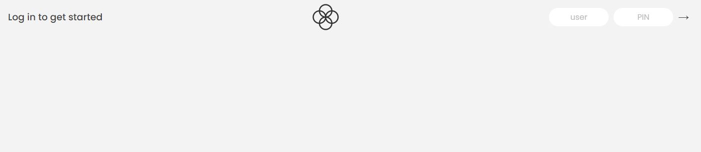
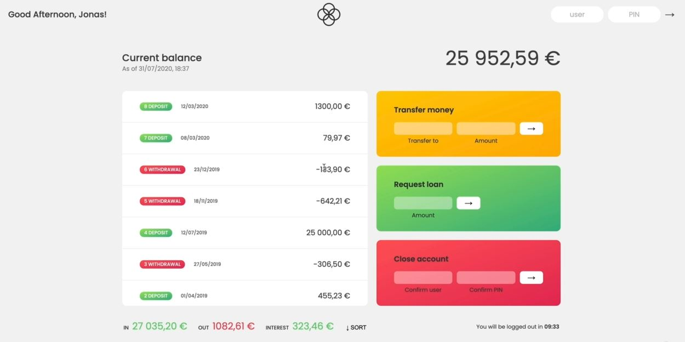
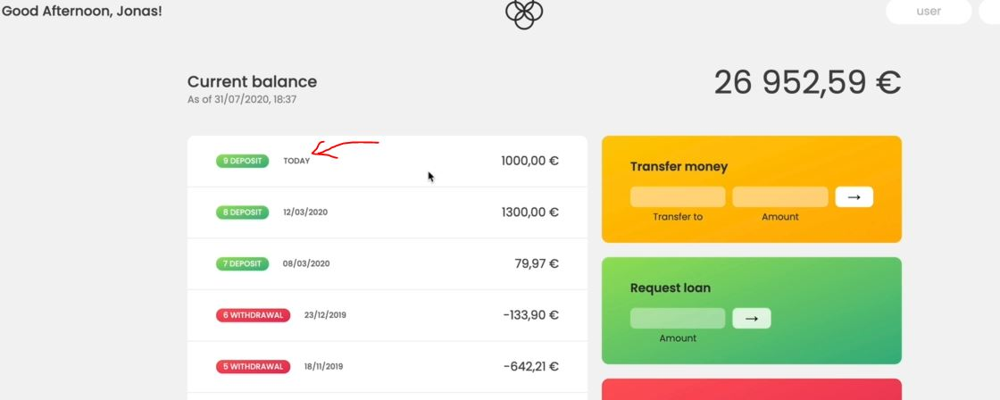
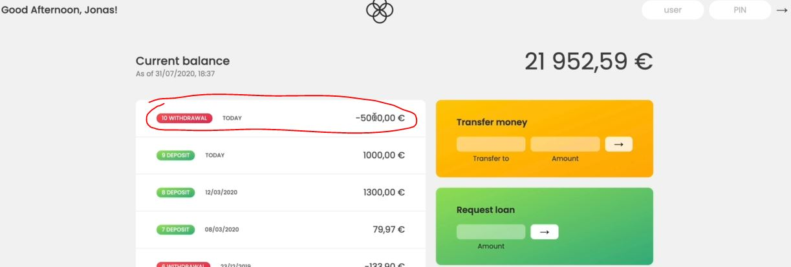
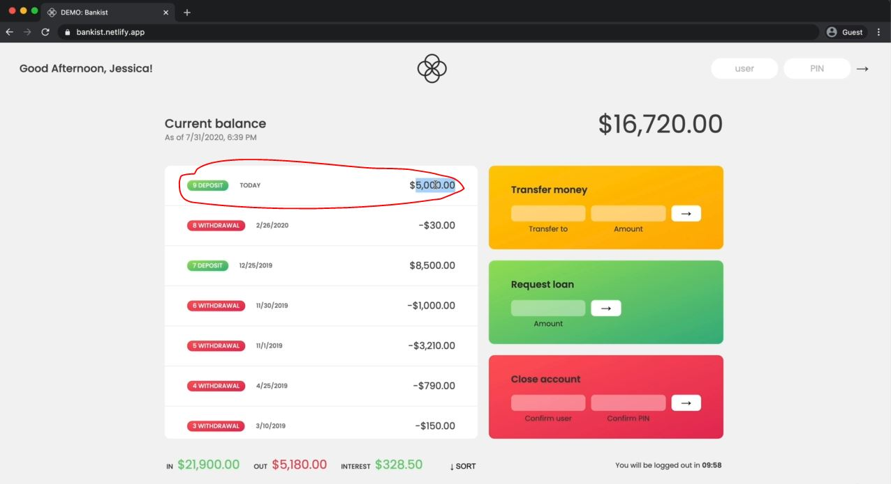

# PROJECT - Bankist app

- here we'll build the bankist app & this is the application that we'll build through out this module
- & this is great project for practicing arrays because we'll be doing a lot of stuff by using arrays

## Demo Version - Bankist app


- user is `js` & pin is `1111` , so after this then click on `->` or press Enter then we'll get this output
    

- `about Account interface`
    - on right side , we have three options i.e `Transfer money` , `Request loan` & `close account`
    - `interacting with Account interface of js user` : 
        - `Request loan` option
            - let's say we want loan then inside input of Request loan write `1000` & press `->` or press `Enter` key <br>
            - then after some time it's approved & it appears inside on left side as a deposit like this 
            
        - `Transfer money` option
            - write `jd` inside transfer to input & let's say amount is `5000` & then press enter or `->` button
            - then we'll get this output 
            
        - `sort` button 
            - at the bottom there's a `sort` button which we can sort deposit , withdrawal amounts 
    - `interacting with Account interface of jd user` : 
        - now let's check in `jd` account whether she got transfer/deposit amount of 5000 or not
        - in login section , write `jd` as user & `2222` as pin then we'll get this output 
            
            - so we got deposit amount & that amount is in US dollar but other one was euros <br>
                so we need to take care of currency changing 

- https://bankist.netlify.app : go to this URL & understand how the application will work

## what we'll do in this lecture

- displaying all of those movements
- making these operations which are on right side 
- calculating the statics as well as the current balance

## flow chart for this application ✅

this flow chart made based on flow/interaction of the application


- `initial workflow of flow chart` : 
    - all yellow boxes means action , so when the login action is performed <br>
        then we check for the correct credentials & if they're correct then we'll display the UI <br>
        & then we'll also update the UI (which means calculate balance , summary , etc)
    - & later on , we'll also start & display a logout timer , so all these happen when the user login <br>
        so first thing , we'll deal with update UI & then we'll work on fake login <br>
        & then we'll take care of those other operations

- in next big project , we'll actually plan the entire application & we'll see all the steps <br>
    that we have to go through in order to come up with a flow chart like this

- flow chart is like a complete overview or roadmap to build an application

## Starter Code

- inside script.js file 
    ```js
    const account1 = {
      owner: 'Jonas Schmedtmann',
      movements: [200, 450, -400, 3000, -650, -130, 70, 1300],
      interestRate: 1.2, // %
      pin: 1111,
    };

    const account2 = {
      owner: 'Jessica Davis',
      movements: [5000, 3400, -150, -790, -3210, -1000, 8500, -30],
      interestRate: 1.5,
      pin: 2222,
    };

    const account3 = {
      owner: 'Steven Thomas Williams',
      movements: [200, -200, 340, -300, -20, 50, 400, -460],
      interestRate: 0.7,
      pin: 3333,
    };

    const account4 = {
      owner: 'Sarah Smith',
      movements: [430, 1000, 700, 50, 90],
      interestRate: 1,
      pin: 4444,
    };

    const accounts = [account1, account2, account3, account4];
    ```
    - & we have 4 accounts , so we used `Jonas Schmedtmann` as `js` user <br>
        & `movements` array & we have `pin` & later on we also use `interest rate` <br>
    - now in real world , we need more data for each movements not just the values <br>
        like date of each movement , but here we just want to work with arrays
    - `Note` : here why we didn't use Map() class instead of objects 
        - because we're gonna pretend that all these data is coming from an Web API
        - so whenever we get data from an API then data usually comes in the form of objects <br> 
            that's why we used objects here ✔️✔️✔️
    - & then we're containing all those accounts objects inside an array <br>
        `Imp Note` : array is one of the most common ways for organizing data in JS applications 💡💡💡

- & inside this script.js file , we already selected the elements which we need for this application <br>
    to make development faster
