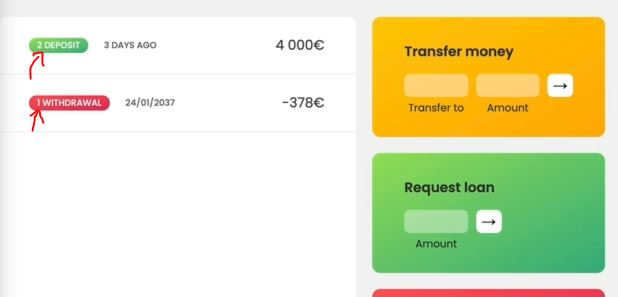
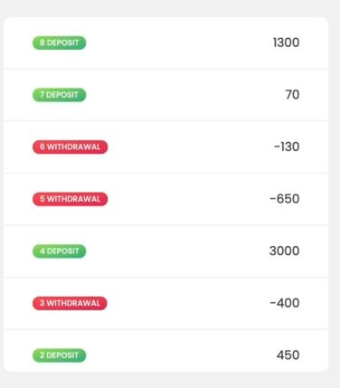
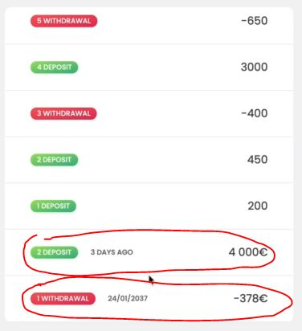

# Creating DOM Elements

- here we'll learn a couple of DOM manipulation techniques & we'll use them with forEach() array method ✔️✔️✔️
- inside starter file , inside index.html , `main` element is invisible

## what we need to do 

- inside starter file , inside script.js file , each account objects , we have `movements` key 
    - we want to display those each movements inside left side box in our application
    - `Best Practice ✅` : we could start writing our code directly in the global context
        - however that's not a good practice , 
        - so whenever we do something like this above problem , then always best to create a function 💡💡💡

## Steps 

- `STEP 1` : inside script.js file 
    ```js
    const account1 = {
      owner: 'Jonas Schmedtmann',
      movements: [200, 450, -400, 3000, -650, -130, 70, 1300],
      interestRate: 1.2, // %
      pin: 1111,
    };

    const account2 = {
      owner: 'Jessica Davis',
      movements: [5000, 3400, -150, -790, -3210, -1000, 8500, -30],
      interestRate: 1.5,
      pin: 2222,
    };

    const account3 = {
      owner: 'Steven Thomas Williams',
      movements: [200, -200, 340, -300, -20, 50, 400, -460],
      interestRate: 0.7,
      pin: 3333,
    };

    const account4 = {
      owner: 'Sarah Smith',
      movements: [430, 1000, 700, 50, 90],
      interestRate: 1,
      pin: 4444,
    };

    const accounts = [account1, account2, account3, account4];

    // Elements
    const labelWelcome = document.querySelector('.welcome');
    const labelDate = document.querySelector('.date');
    const labelBalance = document.querySelector('.balance__value');
    const labelSumIn = document.querySelector('.summary__value--in');
    const labelSumOut = document.querySelector('.summary__value--out');
    const labelSumInterest = document.querySelector('.summary__value--interest');
    const labelTimer = document.querySelector('.timer');

    const containerApp = document.querySelector('.app');
    const containerMovements = document.querySelector('.movements');

    const btnLogin = document.querySelector('.login__btn');
    const btnTransfer = document.querySelector('.form__btn--transfer');
    const btnLoan = document.querySelector('.form__btn--loan');
    const btnClose = document.querySelector('.form__btn--close');
    const btnSort = document.querySelector('.btn--sort');

    const inputLoginUsername = document.querySelector('.login__input--user');
    const inputLoginPin = document.querySelector('.login__input--pin');
    const inputTransferTo = document.querySelector('.form__input--to');
    const inputTransferAmount = document.querySelector('.form__input--amount');
    const inputLoanAmount = document.querySelector('.form__input--loan-amount');
    const inputCloseUsername = document.querySelector('.form__input--user');
    const inputClosePin = document.querySelector('.form__input--pin');

    // Best Practice : it's a good practice to pass the data directly into a function 
        // instead of doing in global context 💡💡💡
    const displayMovements = function(movements) {
        movements.forEach(function(mov, i) => {

        })
    }

    displayMovements(account1.movements)
    ```
    - so basically we have movements like this 
        
        - that's why we need current movement & index of it 
        - so that starting movement will go down & then adding the new ones on top 💡💡💡

- `STEP 2` : now we need to create an HTML which looks like this 
    
    - so inside `movements` class div contains our each of the movements
    - `Best Practice ✅` : template literal is great for creating html templates 💡💡💡
    ```js
    // put above code of all the selected elements

    const displayMovements = function(movements) {
        movements.forEach(function(mov, i) => {

            const html = `
                <div class="movements__row">
                  <div class="movements__type movements__type--deposit">2 deposit</div>
                  <div class="movements__date">3 days ago</div>
                  <div class="movements__value">4 000€</div>
                </div>
            `
        })
    }

    displayMovements(account1.movements)
    ```
    - `STEP 2.1` : replace the hard coded data from this html template by our actual movements data ✅
        - we don't need `<div class="movements__date">3 days ago</div>` so we removed it
        ```js
        // put above code of all the selected elements

        const displayMovements = function(movements) {
            movements.forEach(function(mov, i) => {

                const html = `
                    <div class="movements__row">
                      <div class="movements__type movements__type--deposit">${i + 1}</div>
                      <div class="movements__value">${mov}</div>
                    </div>
                `
            })
        }

        displayMovements(account1.movements)
        ```
    - `STEP 2.2` : now we need to know whether if it's a deposit or a withdrawal
        - so we'll use ternary operator & we're not using ternary operator inside html template <br>
            because we need that twice i.e as a value & for `movements__type--deposit` class <br>
            & we have `movements__type--deposit` & `movements__type--withdrawal` classes inside index.html file  
        ```js
        // put above code of all the selected elements

        const displayMovements = function(movements) {
            movements.forEach(function(mov, i) => {
                const type = mov > 0 ? 'deposit' : 'withdrawal'

                const html = `
                    <div class="movements__row">
                      <div class="movements__type movements__type--${type}">${i + 1} ${type}</div>
                      <div class="movements__value">${mov}</div>
                    </div>
                `
            })
        }

        displayMovements(account1.movements)
        ```
    
- `STEP 3` : now we need to add that html template inside that UI i.e `movements` class div ✅
    - so to add html template/code inside `movements` class div , we'll use `insertAdjacentHTML()` method 💡💡💡 <br>
    - `Note ✅` : this method is better than `innerHTML` property 
        - because it gives more options that how we want to add html template/code 
        - but it depends on situation when to use `innerHTML` property & when `insertAdjacentHTML()` method 💡💡💡   
    - `insertAdjacentHTML()` method takes two argument in string form 💡💡💡
        - first : position in which we want to attach the HTML
        - second : string which contain the HTML template/code that we want to insert 
    ```js
    // put above code of all the selected elements
   const containerMovements = document.querySelector('.movements');

    const displayMovements = function(movements) {
        movements.forEach(function(mov, i) => {
            const type = mov > 0 ? 'deposit' : 'withdrawal'

            const html = `
                <div class="movements__row">
                  <div class="movements__type movements__type--${type}">${i + 1} ${type}</div>
                  <div class="movements__value">${mov}</div>
                </div>
            `

            containerMovements.insertAdjacentHTML('afterbegin', html)
        })
    }

    displayMovements(account1.movements)
    ```
    - output : like this <br>
        
        - so `movements` key of `account1` object , here `1300` is a last number 
        - & all deposits are in green & `withdrawal` are in red & each of them are with index number <br>
            so inside `movements` key of `account1` object , <br>
            negative numbers will be withdrawal & positive number are deposit ✔️✔️✔️

- `STEP 4` : when we scroll down then we'll see two old ones like this <br>
    
    - so we'll getting old ones because those two already exist before when we're adding new elements <br>
        so we're adding new html elements inside that container but we're not overriding anything
    - `STEP 4.1` : first thing , make the contains empty & then start adding new elements ✅
        - so here we're using `innerHTML` property only to make that container empty
        ```js
        // put above code of all the selected elements
        const containerMovements = document.querySelector('.movements');

        const displayMovements = function(movements) {
            containerMovements.innerHTML = ""

            movements.forEach(function(mov, i) => {
                const type = mov > 0 ? 'deposit' : 'withdrawal'

                const html = `
                    <div class="movements__row">
                      <div class="movements__type movements__type--${type}">${i + 1} ${type}</div>
                      <div class="movements__value">${mov}</div>
                    </div>
                `

                containerMovements.insertAdjacentHTML('afterbegin', html)
            })
        }

        displayMovements(account1.movements)
        ```
    - `Note of innerHTML & innerText & textContent properties ✅`
        - `innerText or textContent` : only returns the text itself , But
        - `innerHTML` : returns everything , including the HTML tags 💡💡💡
        - Eg : we did in pig game like this `whatever.textContent = 0` 
            - we can also use `innerHTML` property to read the data because it's also important 💡💡💡 <br>
                like this `containersMovements.innerHTML` , so we can see the output in console <br>
                i.e all the html template/code of containerMovements in `string` form 💡💡💡
    - `why we used "afterbegin" as first argument of insertAdjacentHTML() method ✅` : 
        - if we use "beforeend" as a first argument of insertAdjacentHTML() method <br>
            then the order of values (of movements key of account1 object) would be inverted 
        - so each new element would simply be added after the previous one <br> 
            but we want to show the each new element before the previous one that's why we used `afterbegin` as first argument 💡💡💡

- we'll learn more ways to insert the elements but this is the easiest & dirty ways to do 
