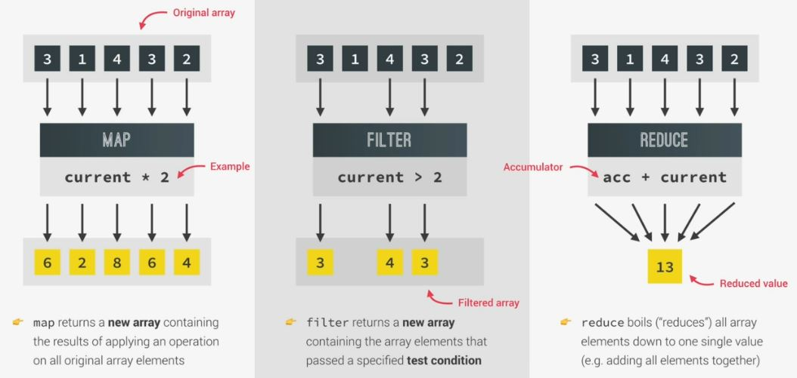

# Data Transformations map() , filter() & reduce() array methods

- there are 3 big & important array methods which we use all the time to perform data transformations
    - these methods are used to create new arrays based on transforming data from other arrays
    - in modern JS , these 3 array methods used all the time 💡💡💡 

## map() array method

- `About map() array method` 
    - is similar like forEach() array method but map() return/creates a brand new array based on the original array 💡💡💡
    - map() array method used to do only manipulation/changes with each element (of that original array)  
        & insert those changes inside an new array & that new array will be return as output through `return` keyword 💡💡💡 
        but forEach() method don't understand `return` keyword 
- `Note ✅` : it's most useful then forEach() array method
    - because forEach() array method just allows us to do some work with each element of the original array
    - but map() array method , build a brand new array which contain the results of  
        applying operation/changes/modification of the original array 💡💡💡

## filter() array method

- `about filter() array method` : 
    - it used to filter the elements of the original array based on a condition 
        - means those elements (of the original array) which are true based on a condition will be filtered  
            from the original array & come inside the new array & that new array will be return as a output 💡💡💡
        - but it doesn't change the original array , it returns the brand new array
    - it understand the `return` keyword 

## reduce() array method 

- `about reduce() array method` : 
    - it used to boils/reduce each elements of the original array into one single value/number
        - means it's a modern way to do sum of each elements of an array & return the total sum as a output 💡💡💡  
            means that original array converted into one single value (which is the sum of all the elements)  
            & then that single value will be return as a output 
        - `analogy` : we can imagine that `accumulator` parameter as a snowball , it keeps getting bigger & bigger  
            as it rolls down a hill which is known as the snowball effect & reduce() array method is pretty like this 💡💡💡 
        - but it doesn't change the original array , it returns the brand new array
    - it understand the `return` keyword 

