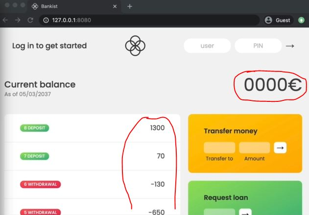
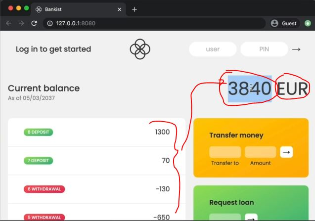

# reduce() array method

- this is third array method i.e reduce() which is used for `data transformation` 💡💡💡
- `reduce() array method` 
    - used to boil down all the elements in an array to one single value
    - it doesn't change the original array 

- `arguments of reduce() array method ✅` : 
    - `first argument` : the callback function argument 
        - further arguments that callback function argument takes 
            - `first argument` : accumulator 
            - `second argument` : current element of that array (on which we called reduce() array method)
            - `third argument` :    
    - `second argument` : initial value of accumulator argument 
        - most of the time we define initial value of it as `0`

- `Note for array methods` : inside callback function argument of forEach() , map() , filter() , reduce() 
    - whatever arguments we define inside callback function , <br>
        those arguments should be in sequence/order because there's no reason , this is a rule or their syntax way 
    - like inside callback function argument of reduce() array method , <br> 
        first argument always be `accumulator` & then current index & so on...

## Examples - of reduce() array method

- Eg 1 : of reduce() array method
    - now let's create a value for balance
    ```js
    const movements = [200, 450, -400, 3000, -650, -130, 70, 1300];

    // accumulator -> snowball 💡💡💡
    const balance = movements.reduce(function(acc, cur , i , arr) {
        return acc + cur
    }, 0)
    console.log(balance) // output : 3840
    ```
    - Eg 1.2 : doing dry run for more clear understanding of it 
        ```js
        const movements = [200, 450, -400, 3000, -650, -130, 70, 1300];

        const balance = movements.reduce(function(acc, cur , i , arr) {
            console.log(`Iteration ${i}: ${acc}`)
            return acc + cur
        }, 0)
        console.log(balance) 
        /* output : Iteration 0: 0 
                    Iteration 1: 200 
                    Iteration 2: 650 
                    Iteration 3: 250 
                    Iteration 4: 3250 
                    Iteration 5: 2600 
                    Iteration 6: 2470 
                    Iteration 7: 2540 

                    3840
        */
        ```
    - Eg 1.3 : checking by chaining the initial value of accumulator 
        ```js
        const movements = [200, 450, -400, 3000, -650, -130, 70, 1300];

        const balance = movements.reduce(function(acc, cur , i , arr) {
            console.log(`Iteration ${i}: ${acc}`)
            return acc + cur
        }, 100)
        console.log(balance) 
        /* output : Iteration 0: 100 
                    Iteration 1: 300 
                    Iteration 2: 750 
                    Iteration 3: 350 
                    Iteration 4: 3350 
                    Iteration 5: 2700 
                    Iteration 6: 2570 
                    Iteration 7: 2640 

                    3940
        */
        ```
        - so here initially value of accumulator is 100 , so from `100` will start adding with elements of an array 

- Eg 2 : doing same problem manually through "for of" loop
    ```js
    const movements = [200, 450, -400, 3000, -650, -130, 70, 1300];

    const balance = 0
    for (const mov of movements) balance += mov
    console.log(balance) 
    
    // traditional way 
        // const sum = 0
        // for (const mov of movements) sum += mov
        // console.log(sum) 
    ```
    - `Note` : here we can see that we used an external variable whenever we want to use one `for` loop 
        - & this is fine when we need only one loop but things become cumbersome & unpractical when we use many loops <br>
            for doing many operations
        - these array methods like reduce() , etc they completely avoid the extra global variable because <br> 
            reduce() array method , take variable as argument as a value of accumulator instead of a global variable 💡💡💡
        - so reduce() array method is a modern way to do that same thing 

- Eg 3 : using arrow function as callback function argument in reduce() array method to clean the code
    ```js
    const movements = [200, 450, -400, 3000, -650, -130, 70, 1300];

    const balance = movements.reduce((acc, cur ) => {
        console.log(`Iteration ${i}: ${acc}`)
        return acc + cur
    }, 100)
    console.log(balance
    ```

- now let's work on our application

## working in bankist application


- `what we need to do` :
    - now let's calculate the balance of those movements (which are on left side of bankist app)
    - & put that total current balance in `current balance` section of UI of that user account

- previous code till what we did
    ```js
    const account1 = {
      owner: 'Jonas Schmedtmann',
      movements: [200, 450, -400, 3000, -650, -130, 70, 1300],
      interestRate: 1.2, // %
      pin: 1111,
    };

    const account2 = {
      owner: 'Jessica Davis',
      movements: [5000, 3400, -150, -790, -3210, -1000, 8500, -30],
      interestRate: 1.5,
      pin: 2222,
    };

    const account3 = {
      owner: 'Steven Thomas Williams',
      movements: [200, -200, 340, -300, -20, 50, 400, -460],
      interestRate: 0.7,
      pin: 3333,
    };

    const account4 = {
      owner: 'Sarah Smith',
      movements: [430, 1000, 700, 50, 90],
      interestRate: 1,
      pin: 4444,
    };

    const accounts = [account1, account2, account3, account4];

    // Elements
    const labelWelcome = document.querySelector('.welcome');
    const labelDate = document.querySelector('.date');
    const labelBalance = document.querySelector('.balance__value');
    const labelSumIn = document.querySelector('.summary__value--in');
    const labelSumOut = document.querySelector('.summary__value--out');
    const labelSumInterest = document.querySelector('.summary__value--interest');
    const labelTimer = document.querySelector('.timer');

    const containerApp = document.querySelector('.app');
    const containerMovements = document.querySelector('.movements');

    const btnLogin = document.querySelector('.login__btn');
    const btnTransfer = document.querySelector('.form__btn--transfer');
    const btnLoan = document.querySelector('.form__btn--loan');
    const btnClose = document.querySelector('.form__btn--close');
    const btnSort = document.querySelector('.btn--sort');

    const inputLoginUsername = document.querySelector('.login__input--user');
    const inputLoginPin = document.querySelector('.login__input--pin');
    const inputTransferTo = document.querySelector('.form__input--to');
    const inputTransferAmount = document.querySelector('.form__input--amount');
    const inputLoanAmount = document.querySelector('.form__input--loan-amount');
    const inputCloseUsername = document.querySelector('.form__input--user');
    const inputClosePin = document.querySelector('.form__input--pin');
    
    const currencies = new Map([
      ['USD', 'United States dollar'],
      ['EUR', 'Euro'],
      ['GBP', 'Pound sterling'],
    ]);

    const displayMovements = function(movements) {
        containerMovements.innerHTML = ""

        movements.forEach(function(mov, i) => {
            const type = mov > 0 ? 'deposit' : 'withdrawal'

            const html = `
                <div class="movements__row">
                  <div class="movements__type movements__type--${type}">${i + 1} ${type}</div>
                  <div class="movements__value">${mov}</div>
                </div>
            `

            containerMovements.insertAdjacentHTML('afterbegin', html)
        })
    }

    displayMovements(account1.movements)

    const createUsernames = function(accs) {
        accs.forEach(function(acc) {
            acc.username = acc.owner.toLowerCase().split(" ").map(name => name[0]).join('')
        })
    }

    createUsernames(accounts)

    // this movement array is for only practice purpose
    const movements = [200, 450, -400, 3000, -650, -130, 70, 1300];
    ```

- `STEP 1` : inside particular user account , calculating the current balance & showing it on UI  
    ```js
    // put code before this 
    displayMovements(account1.movements)

    // Note ✅ : here we putted the calcPrintBalance() function before createUsernames() function 
        // due to more understanding & making sense 
        // because it kind-of belongs to that displayMovements() function 💡💡💡
        // & we changed the name of calcPrintBalance() into calcDisplayBalance() for more understanding 
    const calcDisplayBalance = function(movements) {
        const balance = movements.reduce((acc , mov) => acc + mov, 0)
        // const balance = movements.reduce((acc , mov) => {
        //     return acc + mov
        // }, 0)
        labelBalance.textContent = `${balance} EUR`
    }

    // here only movements passed of account1
    calcDisplayBalance(account1.movements)

    const createUsernames = function(accs) {
        accs.forEach(function(acc) {
            acc.username = acc.owner.toLowerCase().split(" ").map(name => name[0]).join('')
        })
    }

    createUsernames(accounts)
    ```
    - `calcDisplayBalance(account1.movements)`
        - here we just created the balance display for only account1 <br>
            but later on , as we keep developing this application then the `movements` will be <br>
            from the account that we login into the application
        - means if `jonas` user login into the application , then only jonas's `movements` & jonas balance will be shown <br>
            & so on.. with other accounts

    - output : right now jonas login his account <br>
        
        
- now let's see which we already completed the some part from our flow chart of this application , so inside the flow chart
    - [x] we did calculate balance & display balance
    - [x] display movements

## Challenge time ✅

- `Note of reduce() array method ✅` : 
    - we can use reduce() array method because it is used for boiling down the array <br>
        into just one single value as a output but that single value can be whatever we want 💡💡💡 
    - so reduce() array method not only used for to do sum , we can use it for multiplication <br>
        even something completely different like a string or an object 💡💡💡

- `Ques` : let's calculating the maximum value of movements by using reduce() array method
    - we want result i.e 3000
    ```js
    const movements = [200, 450, -400, 3000, -650, -130, 70, 1300];
    ```

- let's understand the problem first 
    - `STEP 1` : we start with `200` , now tell me `200` is max number but we don't know yet because we just started
        - now let's save that `200` as current max number
    - `STEP 2` : then we move on to the next value i.e `450` , 
        - now check 450 is greater than our current maximum i.e 200
        - so yes , it's greater , so 450 is now our current max number
    - `STEP 3` : then we move on to the next value i.e `-400` , 
        - now -400 is less than our current max number
        - so 450 will remain max number
    - `STEP 4` : now then move to further i.e `3000`
        - now is 3000 is greater than our current max number , so Yes it is
        - so 3000 will become our current max number & so we store 3000
    - `STEP 5` : & so on.. till the last element of an array
        - then no value is found who is greater than current max number i.e 3000

- `Ans` : finding max number from an array 
    - `STEP 1` : using reduce() array method 
        ```js
        const movements = [200, 450, -400, 3000, -650, -130, 70, 1300];
        
        const max = movements.reduce((acc, mov) => {

        })
        ```
    - `Note of reduce() array method ✅` :
        - whenever we're using reduce() array method then we should always ask the big question <br>
            that what should be the purpose of that value of `accumulator` 
        - so when we wanted to add all the numbers together , the purpose of the accumulator <br>
            was to keep track of the current sum 💡💡💡
        - so in this problem accumulator will keep the track of the current maximum value
    - `STEP 2` : defining condition inside callback function argument of reduce()
        ```js
        const movements = [200, 450, -400, 3000, -650, -130, 70, 1300];
        
        const max = movements.reduce((acc, mov) => {
            if (acc > mov) {
                // Imp Note 🔥 : here we're returning the accumulator itself 
                    // because in the reduce() array method, we always have to use return keyword 
                    // to return the accumulator for the next iteration 💡💡💡
                // Note ✅ : here we just want to keep the accumulator at the value that it already is  
                    // & not change it 
                    // we'll change it in the other scenario 
                return acc
            } else {
                // we want to return the current movement
                return mov
            }

        } , movements[0])
        ```
        - `Note for initial value of accumulator ✅` : 
            - there don't put directly -> 0(zero) as initial value for accumulator because we'll not get the correct output     
                because imagine that the first value is like a negative then we'll not get correct answer <br>
            - maybe putting directly -> 0(zero) as initial value for accumulator then might work for max number <br>
                but not with a minimum value so don't put directly -> 0(zero) as initial value for accumulator 
            - when we're trying to find a maximum or a minimum value always just go with the first value of the array 💡💡💡
        - this code means 
            ```js
            if (acc > mov) return acc
            else return mov             
            ```
            - that if current `acc` is greater than current `mov` then return `acc` for next iteration 
            - but if not then return `mov` is as next accumulator value for next iteration 💡💡💡

- `said by jonas` :
    - we can do tons of stuff with reduce() array method
    - so before using reduce() array method , what we want & we should know how accumulator <br>
        & current element of an array interact with each other 💡💡💡
