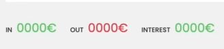
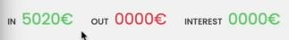
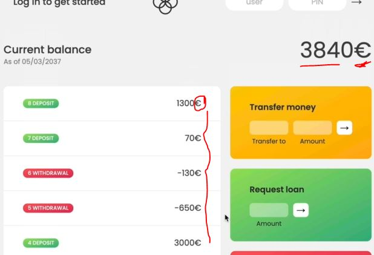
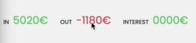
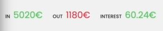
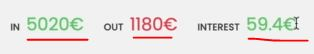

# Chaining methods together

- before we were using array methods individually . However, we can use those methods by chaining one after another

- Eg : let's say that we wanted to take all the movements deposits <br>
    then convert them from euros to dollars & finally add them all up <br>
    so that we know exactly how much was deposited into the account in US dollars
    - now we could of course do each of these operations individually & store each result in a new variable <br>
        however , we can also do it all in one go through chaining concept ✔️✔️✔️

## Examples - of chaining methods

- Eg 1 : of chaining methods
    ```js
    const movements = [200, 450, -400, 3000, -650, -130, 70, 1300];

    movements.filter(mov => mov > 0) 
    // now we'll get the result inside a new array 
    // & that new array will be return by filter() array method 
    // that's why we're able to do chaining methods 💡💡💡
    ```
    - `STEP 1` : now we can do chaining on filter() array method with other methods
        - now we're converting euro to USD currency
        ```js
        const movements = [200, 450, -400, 3000, -650, -130, 70, 1300];

        const eurToUsd = 1.1

        // now we can use further chaining with map() or filter() 
            // but we need reduce() array method as per our need ✔️✔️✔️
        movements.filter(mov => mov > 0).map(mov => mov * eurToUsd).reduce((acc, mov) => acc + mov , 0)
        ```
    - `STEP 2` : now store output of reduce() array method in a variable 
        ```js
        const movements = [200, 450, -400, 3000, -650, -130, 70, 1300];

        const eurToUsd = 1.1
        const totalDepositsUSD = movements.filter(mov => {
            return mov > 0
        }).map(mov => mov * eurToUsd).reduce((acc, mov) => acc + mov , 0)
        // here we can see that we did three data transformation in one go 
        console.log(totalDepositsUSD) // output : 5522.0000
        ```
        - `Note of chaining concept in terms of array ✅` : 
            - like in this example , we can chain many other methods as long as they return new arrays
            - so here filter() returns a new array , so we can do something else after it & same goes with map()
            - but reduce() will return a value & due to this we can do further chaining related to array <br> 
                means we do calculation based on that one single value
            - that's why we didn't chain filter() or map() after that reduce() . so we can only chain a method <br>
                after another one , if the first one returns an array 💡💡💡

    - `what is chaining methods` 
        - means imagine it as a sort of pipeline that processes our data 💡💡💡 
        - so in above example , we put the data in at the beginning <br>
            & that data goes through all those steps i.e chaining 
        - after those 3 steps completed then at the end our input data comes <br>
            out processed on the other side of the pipeline 💡💡💡

## how to debug when we're dealing with chaining array methods only ✅

- now when we do chaining methods then that becomes difficult to debug if one of the results is not what we expect <br>
    from which step of a pipeline that bug output is coming from
- to solve this , just go & check out the array in each of the chaining steps 💡💡💡
    - Eg : of debugging that above chaining array methods code
        - let's say we did this `return mov < 0` instead of this `return mov > 0` 
        ```js
        const movements = [200, 450, -400, 3000, -650, -130, 70, 1300];

        const eurToUsd = 1.1
        const totalDepositsUSD = movements.filter(mov => {
            return mov < 0
        }).map(mov => mov * eurToUsd).reduce((acc, mov) => acc + mov , 0)

        console.log(totalDepositsUSD) // output : 5522.0000
        ```
        - then we can use array argument (to get current array) inside the callback function argument <br>
            of that second chaining array methods because first array method will return array & that array will be <br>
            store in second array method that's why we need to start checking/debugging from second array method 💡💡💡
        ```js
        const movements = [200, 450, -400, 3000, -650, -130, 70, 1300];

        const eurToUsd = 1.1
        const totalDepositsUSD = movements.filter(mov => {
            return mov < 0
        }).map((mov, i, arr) => {
            console.log(arr) // output : [-400, -650, -130]
            return mov * eurToUsd
        }).reduce((acc, mov) => acc + mov , 0)

        console.log(totalDepositsUSD) // output : -1298.0000000000002
        ```
        - so we're getting this output `[-400, -650, -130]` which is the result of that above array method i.e filter()
        - `use case of chaining array methods ✅` :        
            - so if we want to check the updated returning array of that previous array method <br>
                then inside next chaining array method , we can pass array as third argument inside callback function argument 
            - because Eg : we're watching the array result (of the previous array method) <br>
                inside that next chaining array method instead of that initial `movements` array <br>
                because Eg of above code : map() called on the result of filter()  

## working on bankist application

- now let's calculate these statistics i.e <br>
    
    - these are all of the deposits i.e `in` means income , <br>
        `out` means outcome/withdrawals , `interest` means bank might pay us

- `what we need to do` : we need to calculate & show income , withdrawals , interest as summary of that user account

- `previous code till what we did` :
    ```js 
    const account1 = {
      owner: 'Jonas Schmedtmann',
      movements: [200, 450, -400, 3000, -650, -130, 70, 1300],
      interestRate: 1.2, // %
      pin: 1111,
    };

    const account2 = {
      owner: 'Jessica Davis',
      movements: [5000, 3400, -150, -790, -3210, -1000, 8500, -30],
      interestRate: 1.5,
      pin: 2222,
    };

    const account3 = {
      owner: 'Steven Thomas Williams',
      movements: [200, -200, 340, -300, -20, 50, 400, -460],
      interestRate: 0.7,
      pin: 3333,
    };

    const account4 = {
      owner: 'Sarah Smith',
      movements: [430, 1000, 700, 50, 90],
      interestRate: 1,
      pin: 4444,
    };

    const accounts = [account1, account2, account3, account4];

    // Elements
    const labelWelcome = document.querySelector('.welcome');
    const labelDate = document.querySelector('.date');
    const labelBalance = document.querySelector('.balance__value');
    const labelSumIn = document.querySelector('.summary__value--in');
    const labelSumOut = document.querySelector('.summary__value--out');
    const labelSumInterest = document.querySelector('.summary__value--interest');
    const labelTimer = document.querySelector('.timer');

    const containerApp = document.querySelector('.app');
    const containerMovements = document.querySelector('.movements');

    const btnLogin = document.querySelector('.login__btn');
    const btnTransfer = document.querySelector('.form__btn--transfer');
    const btnLoan = document.querySelector('.form__btn--loan');
    const btnClose = document.querySelector('.form__btn--close');
    const btnSort = document.querySelector('.btn--sort');

    const inputLoginUsername = document.querySelector('.login__input--user');
    const inputLoginPin = document.querySelector('.login__input--pin');
    const inputTransferTo = document.querySelector('.form__input--to');
    const inputTransferAmount = document.querySelector('.form__input--amount');
    const inputLoanAmount = document.querySelector('.form__input--loan-amount');
    const inputCloseUsername = document.querySelector('.form__input--user');
    const inputClosePin = document.querySelector('.form__input--pin');
    
    const currencies = new Map([
      ['USD', 'United States dollar'],
      ['EUR', 'Euro'],
      ['GBP', 'Pound sterling'],
    ]);

    const displayMovements = function(movements) {
        containerMovements.innerHTML = ""

        movements.forEach(function(mov, i) => {
            const type = mov > 0 ? 'deposit' : 'withdrawal'

            const html = `
                <div class="movements__row">
                  <div class="movements__type movements__type--${type}">${i + 1} ${type}</div>
                  <div class="movements__value">${mov}</div>
                </div>
            `

            containerMovements.insertAdjacentHTML('afterbegin', html)
        })
    }

    displayMovements(account1.movements)

    const calcDisplayBalance = function(movements) {
        const balance = movements.reduce((acc , mov) => acc + mov, 0)
        labelBalance.textContent = `${balance} EUR`
    }

    calcDisplayBalance(account1.movements)

    const createUsernames = function(accs) {
        accs.forEach(function(acc) {
            acc.username = acc.owner.toLowerCase().split(" ").map(name => name[0]).join('')
        })
    }

    createUsernames(accounts)
    ```

- `STEP 1` : working on calculate & show income , withdrawals , interest as summary of that user account
    ```js
    // put code from above after this 
    calcDisplayBalance(account1.movements)

    const calcDisplaySummary = function(movements) {
        // for incomes , we're getting only positive values i.e only deposits not withdrawals 
        const incomes = movements.filter(mov => mov > 0).reduce((acc, mov) => {
            return acc + mov
        }, 0)
        labelSumIn.textContent = `${incomes}€`
    }

    // later on , we'll change the particular account 
        // from any account based on which user login into the application 
        // but right now assume that account1 user login in our application
    calcDisplaySummary(account1.movements)

    const createUsernames = function(accs) {
        accs.forEach(function(acc) {
            acc.username = acc.owner.toLowerCase().split(" ").map(name => name[0]).join('')
        })
    }
    createUsernames(accounts)
    ```
    - also put `€` sign inside displayMovements() , calcDisplayBalance() functions like this
        ```js
        const displayMovements = function(movements) {
            containerMovements.innerHTML = ""

            movements.forEach(function(mov, i) => {
                const type = mov > 0 ? 'deposit' : 'withdrawal'

                const html = `
                    <div class="movements__row">
                      <div class="movements__type movements__type--${type}">${i + 1} ${type}</div>
                      <div class="movements__value">${mov}€</div>
                    </div>
                `

                containerMovements.insertAdjacentHTML('afterbegin', html)
            })
        }

        displayMovements(account1.movements)

        const calcDisplayBalance = function(movements) {
            const balance = movements.reduce((acc , mov) => acc + mov, 0)
            labelBalance.textContent = `${balance}€`
        }

        calcDisplayBalance(account1.movements)

        const calcDisplaySummary = function(movements) {
            const incomes = movements.filter(mov => mov > 0).reduce((acc, mov) => {
                return acc + mov
            }, 0)
            labelSumIn.textContent = `${incomes}€`
        }

        calcDisplaySummary(account1.movements)

        const createUsernames = function(accs) {
            accs.forEach(function(acc) {
                acc.username = acc.owner.toLowerCase().split(" ").map(name => name[0]).join('')
            })
        }
        createUsernames(accounts)
        ```
    - output : after putting `€` sign <br>
        
        
        
- `STEP 2` : now let's calculate the summary of outgoing money i.e withdrawal of the user account
    ```js
    // put code before it 
    calcDisplayBalance(account1.movements)

    const calcDisplaySummary = function(movements) {
        const incomes = movements.filter(mov => mov > 0).reduce((acc, mov) => {
            return acc + mov
        }, 0)
        labelSumIn.textContent = `${incomes}€`

        const out = movements.filter(mov => mov < 0).reduce((acc , mov) => acc + mov, 0)
        labelSumOut.textContent = `${out}€`
    }

    calcDisplaySummary(account1.movements)

    const createUsernames = function(accs) {
        accs.forEach(function(acc) {
            acc.username = acc.owner.toLowerCase().split(" ").map(name => name[0]).join('')
        })
    }
    createUsernames(accounts)
    ```
    - output : of calculating the total withdrawals of a particular user account <br>
        
    - but we don't want `-` minus sign because we already know that money is going out <br>
        then there's no sense to show `-` minus sign , so we'll use `Math.abs()` property for absolute value without any sign
    - `STEP 2.1` : showing absolute value of outgoing money 
        ```js
        // put code before it 
        calcDisplayBalance(account1.movements)

        const calcDisplaySummary = function(movements) {
            const incomes = movements.filter(mov => mov > 0).reduce((acc, mov) => {
                return acc + mov
            }, 0)
            labelSumIn.textContent = `${incomes}€`

            const out = movements.filter(mov => mov < 0).reduce((acc , mov) => acc + mov, 0)
            labelSumOut.textContent = `${Math.abs(out)}€`
        }

        calcDisplaySummary(account1.movements)

        const createUsernames = function(accs) {
            accs.forEach(function(acc) {
                acc.username = acc.owner.toLowerCase().split(" ").map(name => name[0]).join('')
            })
        }
        createUsernames(accounts)
        ```
        - output : now that `-` minus sign is removed

- `STEP 3` : now let's calculate the summary of interest i.e bank gave interest to us
    - now let's say a bank pays out an interest each time that there's a deposit to the bank account <br>
        & that interest is 1.2% of the deposited amount
    - unfortunately in the real world , it's nothing like that
    ```js
    // put code before it 
    calcDisplayBalance(account1.movements)

    const calcDisplaySummary = function(movements) {
        const incomes = movements.filter(mov => mov > 0).reduce((acc, mov) => {
            return acc + mov
        }, 0)
        labelSumIn.textContent = `${incomes}€`

        const out = movements.filter(mov => mov < 0).reduce((acc , mov) => acc + mov, 0)
        labelSumOut.textContent = `${Math.abs(out)}€`

        // so as we know that on each deposit interest will be add as 1.2%
            // so first Step : we need to take take out each deposits 
            // second Step : create a new array which contains all of those interests
            // third Step : we can just add them together
        const interest = movements.filter(mov => mov > 0).map(deposit => {
            // 1.2/100 - this is how we calculate percentage
            return (deposit * 1.2)/100 

            // here int - means interest
        }).reduce((acc, int) => acc + int, 0)
        labelSumInterest.textContent = `${interest}€`
    }

    calcDisplaySummary(account1.movements)

    const createUsernames = function(accs) {
        accs.forEach(function(acc) {
            acc.username = acc.owner.toLowerCase().split(" ").map(name => name[0]).join('')
        })
    }
    createUsernames(accounts)
    ```
    - complete output : of all the three summary of user account1 <br>
        
    - `STEP 3.1` : but now let's say that the bank introduces a new rule
        - so now the bank only pays an interest if that interest is at least `1` Euro or whatever other currency
        - now think about where this calculation we'll do inside calcDisplaySummary() function <br>
            i.e after map() array chaining method inside calcDisplaySummary() function
        ```js
        // put code before it 
        calcDisplayBalance(account1.movements)

        const calcDisplaySummary = function(movements) {
            const incomes = movements.filter(mov => mov > 0).reduce((acc, mov) => {
                return acc + mov
            }, 0)
            labelSumIn.textContent = `${incomes}€`

            const out = movements.filter(mov => mov < 0).reduce((acc , mov) => acc + mov, 0)
            labelSumOut.textContent = `${Math.abs(out)}€`

            // here int means interest
            const interest = movements.filter(mov => mov > 0).map(deposit => (deposit * 1.2)/100).filter((int, i, arr) => {
                // we're calculating interest which are greater than "1" interest
                console.log(arr) 
                return int >= 1

            }).reduce((acc, int) => acc + int, 0)
            labelSumInterest.textContent = `${interest}€`
        }

        calcDisplaySummary(account1.movements)

        const createUsernames = function(accs) {
            accs.forEach(function(acc) {
                acc.username = acc.owner.toLowerCase().split(" ").map(name => name[0]).join('')
            })
        }
        createUsernames(accounts)
        ```
        - output : inside calcDisplaySummary() , inside interest , we print the current array 
            ```js
            /* output : [2.4, 5.4, 36, 0.84, 15.6]
                        [2.4, 5.4, 36, 0.84, 15.6]
                        [2.4, 5.4, 36, 0.84, 15.6]
                        [2.4, 5.4, 36, 0.84, 15.6]
                        [2.4, 5.4, 36, 0.84, 15.6]
                    
                - here 0.84 interest will be excluded from an array because it's less than 1
            */
            ```
            
            - but here we can see that we got output 5 times because inside this array , we have 5 values <br>
                & that's why that callback function argument (of that filter() chaining array method) runs each 5 times

## Important + Best Practices - of chaining concept 🔥

- `1` : we should not overuse chaining 
    - means we should try to optimize it 
    - because chaining the tons of methods one after the other can cause a real performance issues <br>
        if we have really huge arrays 💡💡💡
    - so when we have huge chain of array methods then we should try to compress all the functionality/work <br>
        that they do into a little methods as possible 💡💡💡
    - for eg : sometimes we create way more map() methods than we actually need 
        - where we could just do that all work inside just one map() array method call
    - so before chaining methods , see different ways or keep looking for opportunities of keeping <br> 
        up your codes performance 💡💡💡

- `2` : chaining is a bad practice in JS to chain methods that mutate the original array
    - for eg : don't use splice() & reverse() methods in array because these methods mutate the original array
    - but we can use these methods for small application but for large scale application <br>
        for good practice , always avoid mutating the original arrays 💡💡💡
