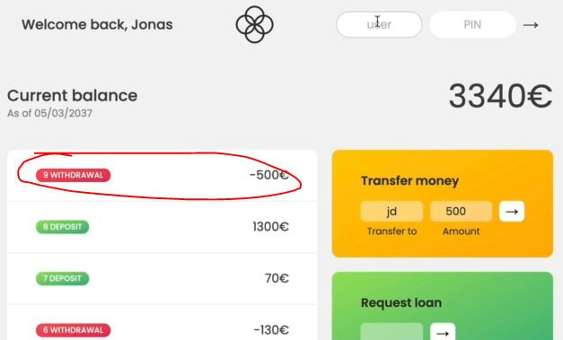
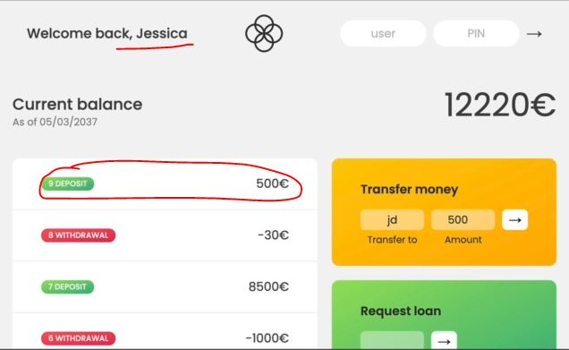

# Implementing Transfers

- we're dealing with transaction/transfer of money from one user account to another

## working of transfers money 

- let's say we login as Jonas & inside `transfer money` section 
    - `transfer to` input : means which username we want to transfer
    - `amount` input : means how much amount we want to transfer

## Starter code to implement transfer money

- `html code for implementing transfers` :
    ```html
    <!-- OPERATION: TRANSFERS -->
    <div class="operation operation--transfer">
      <h2>Transfer money</h2>
      <form class="form form--transfer">
        <input type="text" class="form__input form__input--to" />
        <input type="number" class="form__input form__input--amount" />
        <button class="form__btn form__btn--transfer">&rarr;</button>
        <label class="form__label">Transfer to</label>
        <label class="form__label">Amount</label>
      </form>
    </div>
    ```

- code till yet
    ```js
    const account1 = {
      owner: 'Jonas Schmedtmann',
      movements: [200, 450, -400, 3000, -650, -130, 70, 1300],
      interestRate: 1.2, // %
      pin: 1111,
    };

    const account2 = {
      owner: 'Jessica Davis',
      movements: [5000, 3400, -150, -790, -3210, -1000, 8500, -30],
      interestRate: 1.5,
      pin: 2222,
    };

    const account3 = {
      owner: 'Steven Thomas Williams',
      movements: [200, -200, 340, -300, -20, 50, 400, -460],
      interestRate: 0.7,
      pin: 3333,
    };

    const account4 = {
      owner: 'Sarah Smith',
      movements: [430, 1000, 700, 50, 90],
      interestRate: 1,
      pin: 4444,
    };

    const accounts = [account1, account2, account3, account4];

    // Elements
    const labelWelcome = document.querySelector('.welcome');
    const labelDate = document.querySelector('.date');
    const labelBalance = document.querySelector('.balance__value');
    const labelSumIn = document.querySelector('.summary__value--in');
    const labelSumOut = document.querySelector('.summary__value--out');
    const labelSumInterest = document.querySelector('.summary__value--interest');
    const labelTimer = document.querySelector('.timer');

    const containerApp = document.querySelector('.app');
    const containerMovements = document.querySelector('.movements');

    const btnLogin = document.querySelector('.login__btn');
    const btnTransfer = document.querySelector('.form__btn--transfer');
    const btnLoan = document.querySelector('.form__btn--loan');
    const btnClose = document.querySelector('.form__btn--close');
    const btnSort = document.querySelector('.btn--sort');

    const inputLoginUsername = document.querySelector('.login__input--user');
    const inputLoginPin = document.querySelector('.login__input--pin');
    const inputTransferTo = document.querySelector('.form__input--to');
    const inputTransferAmount = document.querySelector('.form__input--amount');
    const inputLoanAmount = document.querySelector('.form__input--loan-amount');
    const inputCloseUsername = document.querySelector('.form__input--user');
    const inputClosePin = document.querySelector('.form__input--pin');
    
    const currencies = new Map([
      ['USD', 'United States dollar'],
      ['EUR', 'Euro'],
      ['GBP', 'Pound sterling'],
    ]);

    const displayMovements = function(movements) {
        containerMovements.innerHTML = ""

        movements.forEach(function(mov, i) => {
            const type = mov > 0 ? 'deposit' : 'withdrawal'

            const html = `
                <div class="movements__row">
                  <div class="movements__type movements__type--${type}">${i + 1} ${type}</div>
                  <div class="movements__value">${mov}€</div>
                </div>
            `

            containerMovements.insertAdjacentHTML('afterbegin', html)
        })
    }

    const calcDisplayBalance = function(movements) {
        const balance = movements.reduce((acc , mov) => acc + mov, 0)
        labelBalance.textContent = `${balance}€`
    }

    const calcDisplaySummary = function(acc) {
        const incomes = acc.movements.filter(mov => mov > 0).reduce((acc, mov) => acc + mov, 0)
        labelSumIn.textContent = `${incomes}€`

        const out = acc.movements.filter(mov => mov < 0).reduce((acc , mov) => acc + mov, 0)
        labelSumOut.textContent = `${Math.abs(out)}€`

        const interest = acc.movements.filter(mov => mov > 0).map(deposit => {
            return (deposit * acc.interestRate)/100
          }).filter((int, i, arr) => {
              return int >= 1
          }).reduce((acc, int) => acc + int, 0)

        labelSumInterest.textContent = `${interest}€`
    }

    const createUsernames = function(accs) {
        accs.forEach(function(acc) {
            acc.username = acc.owner.toLowerCase().split(" ").map(name => name[0]).join('')
        })
    }
    createUsernames(accounts)

    let currentAccount ;

    btnLogin.addEventListener('click', e => {
        e.preventDefault() 

        currentAccount = accounts.find(acc => acc.username === inputLoginUsername.value)
        console.log(currentAccount)

        if (currentAccount?.pin === Number(inputLoginPin.value)) {
            labelWelcome.textContent = `Welcome back, ${currentAccount.owner.split(" ")[0]}`
            containerApp.style.opacity = 100

            inputLoginUsername.value = inputLoginPin.value = "" 
            inputLoginPin.blur()

            // display movements
            displayMovements(currentAccount.movements)
            // display balance
            calcDisplayBalance(currentAccount.movements)
            // display summary
            calcDisplaySummary(currentAccount)
        }
    })
    ```

## Steps - of Implementing Transfers

- `STEP 1` : adding event listener on `btnTransfer` button of transaction form
    ```js
    btnTransfer.addEventListener('submit', function(e) {
        e.preventDefault()
        const amount = Number(inputTransferAmount.value) 
    })
    ```
    - `STEP 1.1` : now we need to figure out to which account we want to transfer
        ```js
        btnTransfer.addEventListener('submit', function(e) {
            e.preventDefault()
            const amount = Number(inputTransferAmount.value) 
            // identifying to which account we want to transfer
            const receiverAcc = inputTransferTo.value
        })
        ```
        - now just getting the value of a username from `inputTransferTo` input field <br>
            will not help to identify the actual user account
        - that's why we'll use find() array method to identify the username 

- `STEP 2` : finding the username 
    ```js
    btnTransfer.addEventListener('submit', function(e) {
        e.preventDefault()
        const amount = Number(inputTransferAmount.value) 
        const receiverAcc = accounts.find(acc => acc.username === inputTransferTo.value)

        // checking whether code is working or not 
        console.log(amount, receiverAcc)
    })
    ```
    - checking output : when we login as jonas & then inside `transfer money` section
        - we write `jd` transfer to & `100` as amount & press either Enter key or `->` button
        - we'll get the amount as 100 & the complete object of that user owner

- now go inside flow chart & see what next we need to do
    - [ ] inside `User transfer money` , we need to add a negative movement to current user <br>
        & add a positive movement to recipient
    - Eg : if i transfer `100` to someone then i should lose that 100 & the other person should receive that 100 <br> 
        otherwise we would just be creating new money 
    - [ ] & then we need to update the UI again of that already logged in user
    - [ ] & in this flow chart something missing that we need to check stuff like a positive number <br>
        & check if that logged in user has enough money to transfer means if i have 3000 then you can send 5000

- `STEP 3` : checking amount of logged in user
    ```js
    btnTransfer.addEventListener('submit', function(e) {
        e.preventDefault()
        const amount = Number(inputTransferAmount.value) 
        const receiverAcc = accounts.find(acc => acc.username === inputTransferTo.value)

        // amount needs to be greater than 0 otherwise we could do a negative transfer
            // & negative transfer means transferring money to ourselves in our account 💡💡💡
        if (amount > 0 && )
    })
    ```
    - now the balance of the current account needs to be greater or equal the amount that we're trying to transfer <br>
        but inside `calcDisplayBalance()` function , that `balance` variable is actually not stored anywhere 
    - means inside `calcDisplayBalance()` function , we get the balance & immediately show the balance in UI <br>
        but we didn't save the value of `balance` variable in anywhere 
    - so we need to save the balance in that user account who is currently logged in
    - `STEP 3.1` : saving the value of balance of the current logged in user account  
        ```js
        // put code before these 

        // STEP 1 : here we need to pass the complete account as argument inside calcDisplayBalance() function
            // & then we'll add the balance property inside that user account object
        const calcDisplayBalance = function(acc) {
            // STEP 3 : here we're immediately saving the balance 💡💡💡
            acc.balance = acc.reduce((acc , mov) => acc + mov, 0) 
            // OR - we can do this to save the balance
                // const balance = acc.reduce((acc , mov) => acc + mov, 0)
                // acc.balance = balance

            // STEP 4 : & then printing balance of that user account who is currently logged in 
            labelBalance.textContent = `${acc.balance}€`
        }

        const calcDisplaySummary = function(acc) {
            const incomes = acc.movements.filter(mov => mov > 0).reduce((acc, mov) => acc + mov, 0)
            labelSumIn.textContent = `${incomes}€`

            const out = acc.movements.filter(mov => mov < 0).reduce((acc , mov) => acc + mov, 0)
            labelSumOut.textContent = `${Math.abs(out)}€`

            const interest = acc.movements.filter(mov => mov > 0).map(deposit => {
                return (deposit * acc.interestRate)/100
              }).filter((int, i, arr) => {
                  return int >= 1
              }).reduce((acc, int) => acc + int, 0)

            labelSumInterest.textContent = `${interest}€`
        }

        const createUsernames = function(accs) {
            accs.forEach(function(acc) {
                acc.username = acc.owner.toLowerCase().split(" ").map(name => name[0]).join('')
            })
        }
        createUsernames(accounts)

        let currentAccount ;

        btnLogin.addEventListener('click', e => {
            e.preventDefault() 

            currentAccount = accounts.find(acc => acc.username === inputLoginUsername.value)
            console.log(currentAccount)

            if (currentAccount?.pin === Number(inputLoginPin.value)) {
                labelWelcome.textContent = `Welcome back, ${currentAccount.owner.split(" ")[0]}`
                containerApp.style.opacity = 100

                inputLoginUsername.value = inputLoginPin.value = "" 
                inputLoginPin.blur()

                // display movements
                displayMovements(currentAccount.movements)
                // display balance
                    // // STEP 2 : here we passed the current account instead of movements array
                calcDisplayBalance(currentAccount) 
                // display summary
                calcDisplaySummary(currentAccount)
            }
        })

        btnTransfer.addEventListener('submit', function(e) {
            e.preventDefault()
            const amount = Number(inputTransferAmount.value) 
            const receiverAcc = accounts.find(acc => acc.username === inputTransferTo.value)

            if (amount > 0 && )
        })
        ```
        - why our code of `btnLogin` is working because inside `btnLogin` , 
            - `currentAccount` is a variable which is point to the same memory heap of the original object
            - so `currentAccount` variable is one of the objects that we have account1 or account2 , etc
        - so array & objects or other dataTypes works based on memory , not hard coded value

- `STEP 4` : inside `btnTransfer` button , checking amount > 0 & that user must have enough money to transfer
    ```js
    // put above of STEP 3.1 before this 

    btnTransfer.addEventListener('submit', function(e) {
        e.preventDefault()
        const amount = Number(inputTransferAmount.value) 
        const receiverAcc = accounts.find(acc => acc.username === inputTransferTo.value)

        // here we're checking 4 things for that current account
            // 1 - amount > 0
            // 2 - there should be enough money to transfer -> currentAmount.balance >= amount
            // 3 - we don't want to transfer amount to ourselves -> receiverAcc?.username !=== currentAccount.username
                // 4 - we need to check that receiver account exists or not for transferring money 
                // so that's why we used optional chaining instead of making another condition 💡💡💡 
        if (amount > 0 && currentAmount.balance >= amount && receiverAcc?.username !=== currentAccount.username) {
            console.log("Transfer valid") // checking all the condition
        }
    })
    ```
    - checking output : let's say we logged in as jonas & we're transferring to `jd` & amount as `0`
        - so here `amount > 0` this condition is working 
        - so let's transfer more than amount like `5000` to `jd` then we'll not get anything <br>
            so `currentAmount.balance >= amount` working fine
        - let's say we transfer 500 to `ueu` which doesn't exist then we'll get "Transfer valid" <br>
            so `receiverAcc?.username !=== currentAccount.username` is not working 
    - so we need to check that receiver account should exists
    - `STEP 4.1` : adding one more condition that receiver account should exists
        ```js
        // put above of STEP 3.1 before this 

        btnTransfer.addEventListener('submit', function(e) {
            e.preventDefault()
            const amount = Number(inputTransferAmount.value) 
            const receiverAcc = accounts.find(acc => acc.username === inputTransferTo.value)

            // here we're checking 4 things for that current account
                // 1 - amount > 0
                // 2 - explicitly checking that receiver account object exists or not 
                // 3 - there should be enough money to transfer -> currentAmount.balance >= amount
                // 4 - we don't want to transfer amount to ourselves -> receiverAcc?.username !=== currentAccount.username
                    // 4 - we need to check that receiver account exists or not for transferring money 
                    // so that's why we used optional chaining instead of making another condition 💡💡💡 
            if (amount > 0 && 
                receiverAcc && 
                currentAmount.balance >= amount && 
                receiverAcc?.username !=== currentAccount.username) {
                console.log("Transfer valid") // checking all the condition
            }
        })
        ```
        - checking output : now if we try to transfer 500 to `ueu` which doesn't exist then we'll not get any output
            - & now if we try to transfer ourselves as `js` then with `500` account then no message come 
            - but if we transfer jd & 500 amount then we'll get "Transfer valid" message
    - `STEP 4.2` : working inside these condition , 
        - pushing movements of decrease amount of current account & movements that amount to receiver account
        ```js
        // put above of STEP 3.1 before this 

        btnTransfer.addEventListener('submit', function(e) {
            e.preventDefault()
            const amount = Number(inputTransferAmount.value) 
            const receiverAcc = accounts.find(acc => acc.username === inputTransferTo.value)

            if (amount > 0 && 
                receiverAcc && 
                currentAmount.balance >= amount && 
                receiverAcc?.username !=== currentAccount.username) {
                // doing the transfer
                    // pushing movements of decrease amount of current account
                    currentAccount.movements.push(-amount)
                    // movements that amount to receiver account
                    receiverAcc.movements.push(amount)
            }
        })
        ```
    - `STEP 4.3` : now update the UI
        - so we can copy these line of code from `btnLogin` button i.e
            ```js
            // display movements
            displayMovements(currentAccount.movements)
            // display balance
                // // STEP 2 : here we passed the current account instead of movements array
            calcDisplayBalance(currentAccount) 
            // display summary
            calcDisplaySummary(currentAccount)
            ```
        - & paste it but that's not a good practice , so we need to refactor this code all into one function 💡💡💡
        ```js
        // before code from STEP 3.1 before it 
        createUsernames(accounts)

        const updateUI = function(acc) {
            // now here we need current account otherwise we'll not able to call these three functions
                // display movements
                displayMovements(acc.movements)
                // display balance
                calcDisplayBalance(acc) 
                // display summary
                calcDisplaySummary(acc)
        }

        let currentAccount ;

        btnLogin.addEventListener('click', e => {
            e.preventDefault() 

            currentAccount = accounts.find(acc => acc.username === inputLoginUsername.value)
            console.log(currentAccount)

            if (currentAccount?.pin === Number(inputLoginPin.value)) {
                labelWelcome.textContent = `Welcome back, ${currentAccount.owner.split(" ")[0]}`
                containerApp.style.opacity = 100

                inputLoginUsername.value = inputLoginPin.value = "" 
                inputLoginPin.blur()

                // update UI 
                updateUI(currentAccount) // refactoring code here 
            }
        })

        btnTransfer.addEventListener('submit', function(e) {
            e.preventDefault()
            const amount = Number(inputTransferAmount.value) 
            const receiverAcc = accounts.find(acc => acc.username === inputTransferTo.value)

            if (amount > 0 && 
                receiverAcc && 
                currentAmount.balance >= amount && 
                receiverAcc?.username !=== currentAccount.username) {
                    // doing the transfer
                    currentAccount.movements.push(-amount)
                    receiverAcc.movements.push(amount)

                    // updateUI
                    updateUI(currentAccount)
            }
        })
        ```
        - output : now we logged in as jonas & we transfer money to `jd` with `500` then we'll get this movement 
            
        - now we logged in as jessica then we'll get deposited money
            
    - `STEP 4.4` : clean both input fields of "transfer money" section
        - so we'll clean both input fields no matter whether transfer money was successful or not
        ```js
        // put code from STEP 4.3 before it 

        btnTransfer.addEventListener('submit', function(e) {
            e.preventDefault()
            const amount = Number(inputTransferAmount.value) 
            const receiverAcc = accounts.find(acc => acc.username === inputTransferTo.value)

            inputTransferAmount.value =  inputTransferTo.value = ""

            if (amount > 0 && 
                receiverAcc && 
                currentAmount.balance >= amount && 
                receiverAcc?.username !=== currentAccount.username) {
                    // doing the transfer
                    currentAccount.movements.push(-amount)
                    receiverAcc.movements.push(amount)

                    // updateUI
                    updateUI(currentAccount)
            }
        })
        ```
        - now when page loads then we lost the latest transfer money <br>
            because those static data overwrite the updated data 💡💡💡

        - output : everything related to transferring money is working fine 
            - & current balance also gets updated of current user logged-in account  
