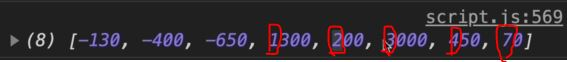

# Sorting Arrays

- one feature is missing in our application is the ability to sort our movements
- sorting is a important topic in computer science & there's a countless algorithms & methods of sorting values

## Examples - of sort() array method 

- Eg 1 : of sort() array method with string 
    ```js
    const owners = ['Jonas', 'Zach', 'Adam', 'Martha']

    console.log(owners.sort()) // output : ["Adam", "Jonas", "Martha", "Zach"]
    console.log(owners) // output : ["Adam", "Jonas", "Martha", "Zach"]
    ```
    - so we got alphabetically sorted from A to Z
    - sort() array method mutates the original array , so very careful before using it +💡💡💡
    - 
- Eg 1 : of sort() array method with number 
    ```js
    const movements = [200, 450, -400, 3000, -650, -130, 70, 1300];

    console.log(movements) // output : [200, 450, -400, 3000, -650, -130, 70, 1300]
    console.log(movements.sort()) // output : [-130, -400, -650, 1300, 200, 3000, 450, 70]
    ```
    - here sort() array method didn't mutate the original array <br>
        because by-default , sort() array method works for string element , not for numbers 💡💡💡
    - so using sort() array method with number , then behind the scene , <br>
        it'll convert all those number elements into string & it does the sorting itself 💡💡💡
    - let's understand the result of `console.log(movements.sort())` 
        - output is : [-130, -400, -650, 1300, 200, 3000, 450, 70]
        - so here `-` minus always comes first means alphabetically first string occurs i.e `-` minus sign<br>
            & numbers are stored in this way i.e based on first number of every number will be stored like this 
            
    - but here numbers are not string , so we need to fix by passing a compare callback function inside the `sort()` method 

- Eg 2 : fixing problem by passing a compare callback function inside `sort()` method
    ```js
    const movements = [200, 450, -400, 3000, -650, -130, 70, 1300];

    // here a is current value & b is next value
    movements.sort((a, b) => {

    })
    ```
    - `working of this compare callback function argument inside sort() array method` :
        - let's take 450 & -400 element of an array 
        - so in our callback function , if we return less than 0 then the value `a` will be sorted before value `b`
        - & the opposite , if we return a positive value then `a` will be put before `b` in the sorted output array 💡💡💡
    - Eg 2.1 : let's sort the movements array in ascending order ✅
        ```js
        const movements = [200, 450, -400, 3000, -650, -130, 70, 1300];

        // return < 0 , then A will be before B 💡💡💡
        // return > 0 , then B will be before A 💡💡💡
        movements.sort((a, b) => {
            if (a > b) 
                return 1; // 1 means don't switch , keep the order as it is 💡💡💡
            if (a < b) 
                return -1; // -1 means switch the order 💡💡💡
        })

        console.log(movements) // output : [-650, -400, -130, 70, 200, 450, 1300, 3000]
        ```
        - so we sorted the array in ascending order means small to large
        - so the sort() array method keeps looping over the array & applying that callback function argument <br>
            until everything is in an ascending order according to the rules that we made
    - Eg 2.2 : sorting the movements array in descending order ✅
        ```js
        const movements = [200, 450, -400, 3000, -650, -130, 70, 1300];

        movements.sort((a, b) => {
            if (a > b) 
                return -1; // 1 means switch the order 💡💡💡
            if (a < b) 
                return 1; // -1 means don't switch , keep the order as it is 💡💡💡
        })

        console.log(movements) // output : [3000, 1300, 450, 200, 70, -130, -400, -650]
        ```
    - & these ascending order & descending order we can do with string also 
    - Eg 2.3 : simplifying the code of ascending & descending order ✅
        ```js
        const movements = [200, 450, -400, 3000, -650, -130, 70, 1300];

        // ascending order
        // a - b means 
            // we know that if a > b then obvious that we'll get a positive number means return 1
            // & if a < b then we'll get a negative number means return -1
            // but if a & b is 0 then position/switching will not happen & those numbers remain as it is 💡💡💡 
        movements.sort((a, b) => a - b)
        console.log(movements) // output : [-650, -400, -130, 70, 200, 450, 1300, 3000]

        // descending order
        movements.sort((a, b) => b - a)
        console.log(movements) // output : [3000, 1300, 450, 200, 70, -130, -400, -650]
        ```
        - `said by jonas` : if we have mixed array like number & string elements then this solution will not work 
            - & don't use the sort() array method in these cases anyway 💡💡💡

## Starter code to implement sort to sort movements

- `html code for implementing sort` :
    ```html
    <!-- SUMMARY -->
    <div class="summary">
        <p class="summary__label">In</p>
        <p class="summary__value summary__value--in">0000€</p>
        <p class="summary__label">Out</p>
        <p class="summary__value summary__value--out">0000€</p>
        <p class="summary__label">Interest</p>
        <p class="summary__value summary__value--interest">0000€</p>
        <button class="btn--sort">&downarrow; SORT</button>
    </div>
    ```

- code till yet
    ```js
    const account1 = {
      owner: 'Jonas Schmedtmann',
      movements: [200, 450, -400, 3000, -650, -130, 70, 1300],
      interestRate: 1.2, // %
      pin: 1111,
    };

    const account2 = {
      owner: 'Jessica Davis',
      movements: [5000, 3400, -150, -790, -3210, -1000, 8500, -30],
      interestRate: 1.5,
      pin: 2222,
    };

    const account3 = {
      owner: 'Steven Thomas Williams',
      movements: [200, -200, 340, -300, -20, 50, 400, -460],
      interestRate: 0.7,
      pin: 3333,
    };

    const account4 = {
      owner: 'Sarah Smith',
      movements: [430, 1000, 700, 50, 90],
      interestRate: 1,
      pin: 4444,
    };

    const accounts = [account1, account2, account3, account4];

    // Elements
    const labelWelcome = document.querySelector('.welcome');
    const labelDate = document.querySelector('.date');
    const labelBalance = document.querySelector('.balance__value');
    const labelSumIn = document.querySelector('.summary__value--in');
    const labelSumOut = document.querySelector('.summary__value--out');
    const labelSumInterest = document.querySelector('.summary__value--interest');
    const labelTimer = document.querySelector('.timer');

    const containerApp = document.querySelector('.app');
    const containerMovements = document.querySelector('.movements');

    const btnLogin = document.querySelector('.login__btn');
    const btnTransfer = document.querySelector('.form__btn--transfer');
    const btnLoan = document.querySelector('.form__btn--loan');
    const btnClose = document.querySelector('.form__btn--close');
    const btnSort = document.querySelector('.btn--sort');

    const inputLoginUsername = document.querySelector('.login__input--user');
    const inputLoginPin = document.querySelector('.login__input--pin');
    const inputTransferTo = document.querySelector('.form__input--to');
    const inputTransferAmount = document.querySelector('.form__input--amount');
    const inputLoanAmount = document.querySelector('.form__input--loan-amount');
    const inputCloseUsername = document.querySelector('.form__input--user');
    const inputClosePin = document.querySelector('.form__input--pin');
    
    const currencies = new Map([
      ['USD', 'United States dollar'],
      ['EUR', 'Euro'],
      ['GBP', 'Pound sterling'],
    ]);

    const displayMovements = function(movements) {
        containerMovements.innerHTML = ""

        movements.forEach(function(mov, i) => {
            const type = mov > 0 ? 'deposit' : 'withdrawal'

            const html = `
                <div class="movements__row">
                  <div class="movements__type movements__type--${type}">${i + 1} ${type}</div>
                  <div class="movements__value">${mov}€</div>
                </div>
            `

            containerMovements.insertAdjacentHTML('afterbegin', html)
        })
    }

    const calcDisplayBalance = function(acc) {
            acc.balance = acc.reduce((acc , mov) => acc + mov, 0) 
            labelBalance.textContent = `${acc.balance}€`
    }

    const calcDisplaySummary = function(acc) {
        const incomes = acc.movements.filter(mov => mov > 0).reduce((acc, mov) => acc + mov, 0)
        labelSumIn.textContent = `${incomes}€`

        const out = acc.movements.filter(mov => mov < 0).reduce((acc , mov) => acc + mov, 0)
        labelSumOut.textContent = `${Math.abs(out)}€`

        const interest = acc.movements.filter(mov => mov > 0).map(deposit => {
            return (deposit * acc.interestRate)/100
          }).filter((int, i, arr) => {
              return int >= 1
          }).reduce((acc, int) => acc + int, 0)

        labelSumInterest.textContent = `${interest}€`
    }

    const createUsernames = function(accs) {
        accs.forEach(function(acc) {
            acc.username = acc.owner.toLowerCase().split(" ").map(name => name[0]).join('')
        })
    }
    createUsernames(accounts)

    const updateUI = function(acc) {
        // display movements
        displayMovements(acc.movements)
        // display balance
        calcDisplayBalance(acc) 
        // display summary
        calcDisplaySummary(acc)
    }

    let currentAccount ;

    btnLogin.addEventListener('click', e => {
        e.preventDefault() 

        currentAccount = accounts.find(acc => acc.username === inputLoginUsername.value)
        console.log(currentAccount)

        if (currentAccount?.pin === Number(inputLoginPin.value)) {
            labelWelcome.textContent = `Welcome back, ${currentAccount.owner.split(" ")[0]}`
            containerApp.style.opacity = 100

            inputLoginUsername.value = inputLoginPin.value = "" 
            inputLoginPin.blur()

            // update UI 
            updateUI(currentAccount) 
        }
    })

    btnTransfer.addEventListener('submit', function(e) {
        e.preventDefault()
        const amount = Number(inputTransferAmount.value) 
        const receiverAcc = accounts.find(acc => acc.username === inputTransferTo.value)

        if (amount > 0 && 
            receiverAcc && 
            currentAmount.balance >= amount && 
            receiverAcc?.username !=== currentAccount.username) {
                // doing the transfer
                currentAccount.movements.push(-amount)
                receiverAcc.movements.push(amount)

                // updateUI
                updateUI(currentAccount)
        }
    })

    btnLoan.addEventListener('submit', function(e) => {
        e.preventDefault()

        const amount = Number(inputLoanAmount.value)

        if (amount > 0 && currentAccount.movements.some(mov => mov >= amount * 0.1)) {
            // add movement
            currentAccount.movements.push(amount)

            // update UI
            updateUI(currentAccount)
        }

        inputLoanAmount.value = ""
    })

    btnClose.addEventListener('submit', function(e) => {
        e.preventDefault()

        if(inputCloseUsername.value === currentAccount.username && 
            Number(inputClosePin.value) === currentAccount.pin) {
            const index = accounts.findIndex(acc => acc.username === currentAccount.username)

            // Delete account
            accounts.splice(index, 1) 

            // Hide UI
            containerApp.style.opacity = 0
        }

        inputCloseUsername.value = inputClosePin.value = ''
    })
    ```

## Steps - of sort from bankist application 

- at below , we have `sort` button which is to sort those movements , so when we click on it then order will change <br>
    & actually we sorted in ascending order because we started to display those movements from the bottom to top <br>
    so by-default those movements will be in ascending order means bottom top

- `STEP 1` : adding feature of sorting inside displayMovements() function
    ```js
    // put the code before it 
        // by-default sort will be false means we want to know show the default order of movements array
        // so here "sort" will act as toggle from false to true & vice versa 💡💡💡
    const displayMovements = function(movements, sort = false) {
        containerMovements.innerHTML = ""

        movements.forEach(function(mov, i) => {
            const type = mov > 0 ? 'deposit' : 'withdrawal'

            const html = `
                <div class="movements__row">
                  <div class="movements__type movements__type--${type}">${i + 1} ${type}</div>
                  <div class="movements__value">${mov}€</div>
                </div>
            `

            containerMovements.insertAdjacentHTML('afterbegin', html)
        })
    }

    // put code after this above one 
    ```

- `STEP 2` : defining condition for sort
    ```js
    // put the code before it 
    const displayMovements = function(movements, sort = false) {
        containerMovements.innerHTML = ""

        // we can't do this because that the sort() array method will order/mutate the original array
            // & we don't want to change or sort the original array
            // we just want to show the sorted movements array 💡💡💡
        const movs = sort ? movements.sort() 

        movements.forEach(function(mov, i) => {
            const type = mov > 0 ? 'deposit' : 'withdrawal'

            const html = `
                <div class="movements__row">
                  <div class="movements__type movements__type--${type}">${i + 1} ${type}</div>
                  <div class="movements__value">${mov}€</div>
                </div>
            `

            containerMovements.insertAdjacentHTML('afterbegin', html)
        })
    }

    // put code after this above one 
    ```
    - `STEP 2.1` : making a copy of the original array through slice() array method for sorting 
        ```js
        // put the code before it 
        const displayMovements = function(movements, sort = false) {
            containerMovements.innerHTML = ""

            // so this is the situation where we want to make a copy of the original array 
                // by using slice() array method instead of spread operator 
                // because here we're in the middle of chaining 💡💡💡
            const movs = sort ? movements.slice().sort() 

            movements.forEach(function(mov, i) => {
                const type = mov > 0 ? 'deposit' : 'withdrawal'

                const html = `
                    <div class="movements__row">
                      <div class="movements__type movements__type--${type}">${i + 1} ${type}</div>
                      <div class="movements__value">${mov}€</div>
                    </div>
                `

                containerMovements.insertAdjacentHTML('afterbegin', html)
            })
        }

        // put code after this above one 
        ```
    - `STEP 2.2` : defining callback condition function argument to sort inside sort() array method
        ```js
        // put the code before it 
        const displayMovements = function(movements, sort = false) {
            containerMovements.innerHTML = ""

            // now we display those movements from bottom to up
                // so by-default we need to sort in an ascending order
            const movs = sort ? movements.slice().sort((a, b) => a - b) : movements

            movements.forEach(function(mov, i) => {
                const type = mov > 0 ? 'deposit' : 'withdrawal'

                const html = `
                    <div class="movements__row">
                      <div class="movements__type movements__type--${type}">${i + 1} ${type}</div>
                      <div class="movements__value">${mov}€</div>
                    </div>
                `

                containerMovements.insertAdjacentHTML('afterbegin', html)
            })
        }

        // put code after this above one 
        ```
    - `STEP 2.3` : using sorted `movs` variable instead of movements 
        ```js
        // put the code before it 
        const displayMovements = function(movements, sort = false) {
            containerMovements.innerHTML = ""

            // now we display those movements from bottom to up
                // so by-default we need to sort in an ascending order
            const movs = sort ? movements.slice().sort((a, b) => a - b) : movements

            movs.forEach(function(mov, i) => {
                const type = mov > 0 ? 'deposit' : 'withdrawal'

                const html = `
                    <div class="movements__row">
                      <div class="movements__type movements__type--${type}">${i + 1} ${type}</div>
                      <div class="movements__value">${mov}€</div>
                    </div>
                `

                containerMovements.insertAdjacentHTML('afterbegin', html)
            })
        }
        // put code after this above one 


        // put code before this 
        btnClose.addEventListener('submit', function(e) => {
            e.preventDefault()

            if(inputCloseUsername.value === currentAccount.username && 
                Number(inputClosePin.value) === currentAccount.pin) {
                const index = accounts.findIndex(acc => acc.username === currentAccount.username)

                // Delete account
                accounts.splice(index, 1) 

                // Hide UI
                containerApp.style.opacity = 0
            }

            inputCloseUsername.value = inputClosePin.value = ''
        })

        btnSort.addEventListener('click', function(e) {
            e.preventDefault()
            displayMovements(currentAccount.movements, true)
        })
        ```
        - checking output : when we click on `sort` button 
            - then those movements will get sorted in ascending order from bottom to top <br>
                but when we click on button then it'll not get back to normal
            - to solve this by using a state variable which handle/monitor if we're currently sorting the array or not

- `STEP 3` : creating a state variable which will handle/monitor if we're currently sorting the array or not
    - `Note` : we'll create that state variable outside the `btnSort.addEventListener()` 
        - so that it's value can be preserved after clicking on that sort button <br>
            because `btnSort.addEventListener()` is executed each time that we click the `sort` button 
        - so we want to preserve that sorted state 💡💡💡
    ```js
    // put code from STEP 2.3 before it 


    let sorted = false
    btnSort.addEventListener('click', function(e) {
        e.preventDefault()
        displayMovements(currentAccount.movements, !sorted) // so if sorted is false then we want to sort it 💡💡💡

        // but if the movements are already sorted then we again want the opposite 💡💡💡
        sorted = !sorted
    })
    ```
    - checking output : after login as jonas , now when we try to sort then we an back to normal also
