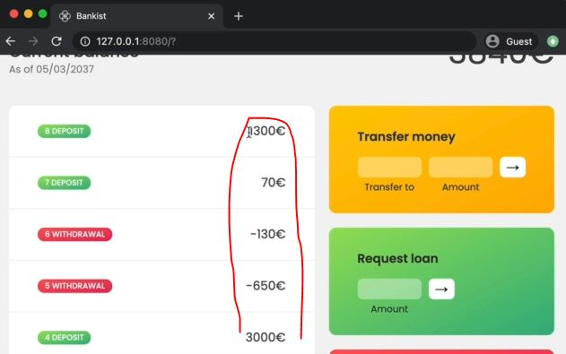

# More Ways of Creating and Filling Arrays

- previously we have created an array through square bracket notation & by using `new Array()` like this <br>
    `console.log([1,2,3,4,5,6])` or `console.log(new Array(1,2,3,4,5,6))` <br>
- so here we created elements/items of array manually but we can also generate arrays programmatically <br>
    - & there are many situations in which this is necessary & there are also multiple ways of defining arrays programmatically 

## Ways of defining arrays programmatically 

- `Ways 1` : using the Array() constructor function
    ```js
    const x = new Array(7)
    console.log(x) // output : (7) [empty x 7]
    ```
    - so `new Array(7)` creates a new array with 7 empty elements & it doesn't contains anything 
    - `weird bahavior of new Array() constructor function or class` : 
        - whenever we only pass one argument then it creates a new empty argument with that length <br>
            & if we don't know this of `Array()` constructor function then in future it can create weird errors
        - also we can't use that `x` array for anything , Eg : we can't call the map() method on it <br>
            there's is only one method that we can call on this empty array i.e `fill()` method 💡💡💡

- `ways 2` : using fill() array method ✅
    - `fill()` array method mutate the original array 💡💡💡
    - it's like slice() array method in terms of arguments 
    - takes 3 arguments 
        - `first` : value
        - `second` : from where we want to start (default starting index is 0)
        - `third` : till where we want to stop (default starting index is array length) 💡💡💡
    ```js
    const x = new Array(7)
    x.fill(1) // output : [1, 1, 1, 1, 1, 1, 1]
    ```
    - so fill() array method will fill that number (which is passed as argument inside fill()) <br>
        till the length of an array i.e 7 
    - Eg 1 : using second argument of fill() array method 
        ```js
        const x = new Array(7)
        x.fill(1, 3) 

        console.log(x);
        // output : (7) [empty × 3, 1, 1, 1, 1] or [undefined, undefined, undefined, 1, 1, 1, 1]
        ```
        - so starting three elements will be empty
    - Eg 2 : using third argument of fill() array method  
        ```js
        const x = new Array(7)
        x.fill(1, 3, 5) 

        console.log(x);
        // output : (7) [empty × 3, 1, 1, empty × 2] or [undefined, undefined, undefined, 1, 1, undefined, undefined]
        ```
        - so starting three elements will be empty
    - Eg 3 : using fill() array method on normal array ✅
        ```js
        const arr = [1, 2, 3, 4, 5, 6, 7]

        arr.fill(23, 4, 6)
        console.log(arr) // output : [1, 2, 3, 4, 23, 23, 7]
        ```
        - so here from 5 index to 6 index , we fill the 23 
    - so here created an element inside an array programmatically instead of doing manually
    - so fill() array method sometimes useful

- `ways 3` : using `Array.from()` array method 
    - `Array.from()` , we're using from() method on `Array` constructor that's why Array.from() , for more we'll see in OOPS
    - it's used to recreate an array like this `[1, 2, 3, 4, 5, 6, 7]` 💡💡💡
    - takes 3 arguments :
        - `first` : an object (which is for length to convert to an array) (required)
        - `second` : map function which is callback function argument same as map() array method (optional argument)
        - `third` : this --> keyword as value (optional argument) 💡💡💡
    - Eg 1 : using Array.from() array method to recreate an array
        ```js
        const y = Array.from({ length : 7 }, () => 1)
        console.log(y) // output : [1, 1, 1, 1, 1, 1, 1]
        ```
        - now `Array.from({ length : 7 }, () => 1)` this is way cleaner <br>
            than together `new Array(7)` with fill() array method ✔️✔️✔️
    - Eg 2 : using Array.from() array method 
        ```js
        // we can consider this second argument i.e callback function as map() array method ✔️✔️✔️
            // because this second argument also takes same argument as map() array method take
        const z = Array.from({ length: 7 }, (cur, i) => i + 1)
        console.log(z) // output : [1, 2, 3, 4, 5, 6, 7]
        ```
        - in earlier lecture , we used `_` underscore as throwaway variable which means we're not using that argument 💡💡💡
    - Eg 3 : another use case of Array.from() method with throwaway variable
        ```js
        const z = Array.from({ length: 7 }, (_, i) => i + 1)
        console.log(z) // output : [1, 2, 3, 4, 5, 6, 7]
        ```
        - here we used `_` underscore as throwaway variable which means <br>
            we don't want that current element as argument because we're not using it in our code 💡💡💡
        - so that other programmers can understand this convention that we didn't use that parameter

- `Question for practice` : generate an array with 100 random dice rolls by using Array.from() array method 
    
## Examples of iterables & use case of Array.from() array method 🔥

- `Array.from()` array method was introduced into JS in order to create arrays from array like structures 
    - so earlier we talked about so-called iterables like strings , Map() or Set() , so they're all iterables in JS 
    - & so they can be converted to real arrays using Array.from() 
    - that's why it's called from() because we can create arrays from other things 💡💡💡
- & another great example i.e querySelectorAll() which returns a NodeList 
    - & NodeList is like an array which contains all the selected elements but it's not a real array 
    - so NodeList does't have most of the array methods like map() , etc except forEach() array method 💡💡💡
    - so if we wanted to use all array methods on that NodeList <br> 
        then first we need to convert the NodeList to an actually array we use Array.from() array method 💡💡💡
        
        - here movements are stored only in UI but we don't have them in our code 

- Eg 1 : storing those movements (which are only on UI) inside the code
    ```js
    const movementsUI = Array.from(document.querySelectorAll('.movements__value'))
    console.log(movementsUI) // output : (2) [div.movements__value, div.movements__value]
    ```
    - here we just got only 2 elements because before logging we only have two movements <br>
        but after login as jonas , then we want those movements , so we need do based on event handler
    - & we don't need a button to attach event handler
    - `STEP 1` : adding event handler/listener on current balance to get all the movements of that user account
        ```js
        labelBalance.addEventListener('click', function() {
            const movementsUI = Array.from(document.querySelectorAll('.movements__value'))
            console.log(movementsUI)  
        })
        ```
        - checking output : after login as jonas , now click on current balance 
            - then we'll get all the movements of that user account
        - now we can't use map() array method directly on `movementsUI` variable because we need to remove euro sign
    - `STEP 2` : using map() array method on "movementsUI" variable
        ```js
        labelBalance.addEventListener('click', function() {
            const movementsUI = Array.from(document.querySelectorAll('.movements__value'))
            // access that element through map() array method & then taking out text & replacing the Euro sign
            console.log(movementsUI.map(el => el.textContent.replace('€', '')))  
            // output : (8) ["1300", "70", "-130", "-650", "3000", "-400", "450", "200"]
        })
        ```
    - `STEP 3` : converting these movements from string to number type
        ```js
        labelBalance.addEventListener('click', function() {
            const movementsUI = Array.from(document.querySelectorAll('.movements__value'))
            console.log(movementsUI.map(el => Number(el.textContent.replace('€', ''))))  
            // output : (8) [1300, 70, -130, -650, 3000, -400, 450, 200]
        })
        ```
        - `STEP 3.1` : we can `el => Number(el.textContent.replace('€', ''))` put this as a second argument <br>
            inside Array.from() array method instead of using map() array method separately 💡💡💡
            ```js
            labelBalance.addEventListener('click', function() {
                const movementsUI = Array.from(
                    document.querySelectorAll('.movements__value') , 
                    el => Number(el.textContent.replace('€', '')))
                console.log(movementsUI)  
                // output : (8) [1300, 70, -130, -650, 3000, -400, 450, 200]
            })
            ```
    - we can use spread operator to convert that NodeList of querySelectorAll() method into actual array 💡💡💡 like this 
        ```js
        labelBalance.addEventListener('click', function() {
            const movementsUI = [...document.querySelectorAll('.movements__value')]
            console.log(movementsUI)  
        })
        ```
        - but it's a personal preference & depends on situation also <br>
            & `Array.from()` is most readable than spread operator 💡💡💡  
