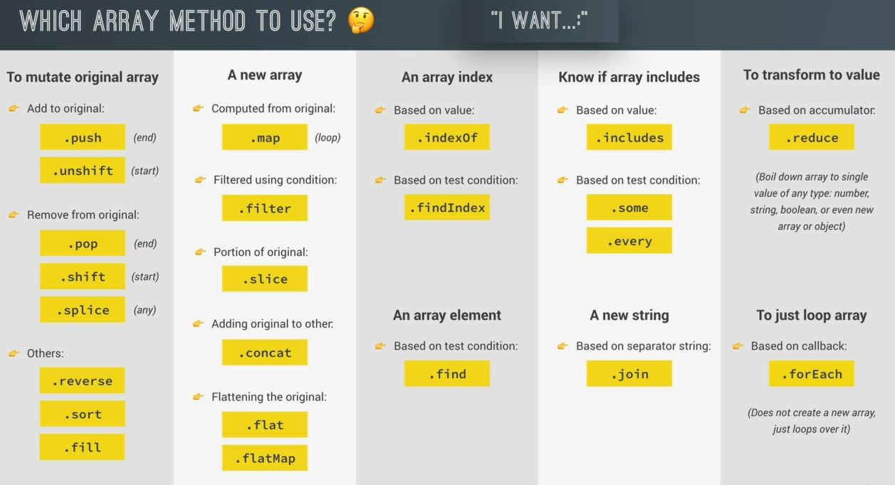

#  Summary : Which Array Method to Use

- we have studied , 23 different array methods. so we'll see which array methods we need to use in which situation 

- using different array methods based on different situation
    

- `points to keep in mind` : 
    - use those array methods which mutate the original array  
        because most of the time , we don't want to mutate the original array 💡💡💡
    - map() array method used most of the time to loop over the original array & return a brand new array
    - most of the time , we use includes() , some() , every() array methods for checking condition  
        & these three returns boolean values which is very helpful in a condition like if else condition
    - sometimes we want to transform an array into a string , so we use join() array method
    - forEach() array method only used for looping on the array , it doesn't return any thing 
