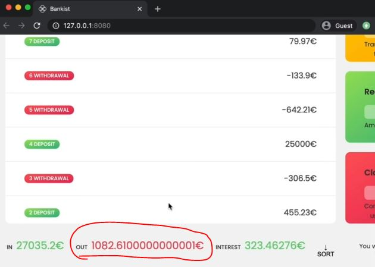
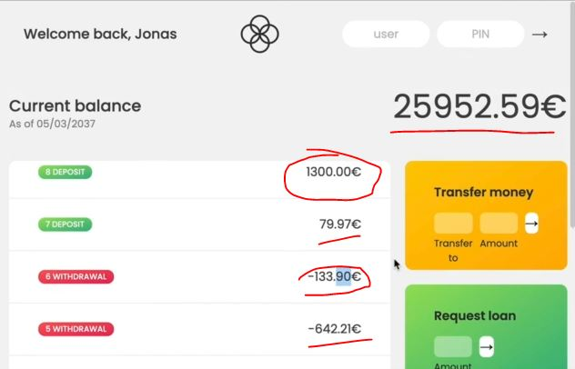
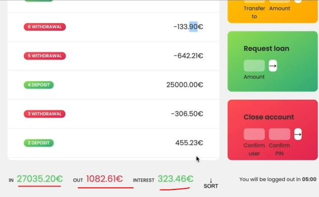

# Math and Rounding

- we'll see methods of `Math` constructor

## Examples - of methods of Math constructor

- Eg 1 : Math.sqrt() method
    - `Math.sqrt()` method used to find the square root of 
    - square root means finding the square of that number by multiplying two times 💡💡💡 
    ```js
    console.log(Math.sqrt(25)) // output : 5
    // OR another way 
    console.log(25 ** (1/2)) // output : 5
    // Note : (1/2) should be inside parenthesis 💡💡💡
    ```

- Eg 2 : Math.cbrt() method 
    - `Math.cbrt()` method used to find the cube root
    - cube root means finding the cube of that number by multiplying three times 💡💡💡 
    ```js
    console.log(Math.cbrt(64)) // output : 4
    console.log(8 ** (1/3)) // output : 5
    ```

- Eg 3 : Math.max() & Math.min() method
    - `Math.max()` method used to fine the maximum number out from multiple numbers
    - `Math.min()` method used to fine the minimum number out from multiple numbers
    - both takes multiple number as arguments & each number separated by `,` comma
    ````js
    console.log(Math.max(5, 18, 23, 11, 2)) // output : 23
    console.log(Math.max(5, 18, '23', 11, 2)) // output : NaN -> because parsing is not happening 
    console.log(Math.min(5, 18, 23, 11, 2)) // output : 2 
    ```

- Eg 4 : Math.PI property
    - `Math.PI` property used to get the PI value 
    - Note : `PI` should be in capital
    ```js
    // calculating the radius of a circle with 10px
    console.log(Math.PI * Number.parseFloat('10px') ** 2) // output : 314.159
    ```

- Eg 5 : Math.random() method
    - `Math.random()` method used to generate random number
    ```js
    console.log(Math.random()) // output : we'll get random number b/w 0 & 1

    console.log(Math.random() * 6) // output : here consider 6 as a length , so we'll get random number b/w 1 & 5

    // Math.trunc() used to remove the numbers which are after the decimal number 💡💡💡
    console.log(Math.trunc(Math.random() * 6)) // output : we'll get random number b/w 1 & 5 without decimal number 
    
    // when we add 1 then we'll get random number exactly b/w 1 to 6 without decimal number 
    console.log(Math.trunc(Math.random() * 6) + 1)  
    ```
    - Eg : creating a function to generate random number b/w from any number to any
        ```js
        const randomInt = (min, max) => Math.trunc(Math.random() * (max - min) + 1) + min
        console.log(randomInt(10, 20))
        ```

- Eg 6 : rounding integers
    - `Math.trunc()` method used to remove those numbers which are after the decimal part     
    - `Math.round()` methods 
        - it will see the number before the decimal & round it on the basis of decimal part <br> 
            means in which range that number is close
        - Eg : `23.5` here decimal part is 5 , so 23 is close to 24 , so 23 rounded as 24
        - Eg : `23.4` here decimal part is 4 , so 23 is close to 23 itself , so 23 will be rounded as 23
    - `Math.ceil()` method doesn't work like Math.round() method 
        - it will round that number (which is before the decimal part) into next number 
    - `Math.floor()` method doesn't work like Math.round() & Math.ceil() method 
        - it will round that number (which is before the decimal part) into previous number  
    ```js
    console.log(Math.trunc(23.3)) // output : 23

    // first 23 comes b/w 23 & 24
        // & then 23.9 will be rounded 24 because 23.9 is close to 24 
    console.log(Math.round(23.9)) // output : 24

    console.log(Math.ceil(23.3)) // output : 24
    console.log(Math.ceil(23.9)) // output : 24

    console.log(Math.floor(23.3)) // output : 23
    console.log(Math.floor(23.9)) // output : 23
    ```
    - both Math.ceil() & Math.floor() method can do type coercion 💡💡💡 
        ```js
        console.log(Math.ceil('23.9')) // output : 24 
        console.log(Math.floor('23.9')) // output : 23
        ```
    - Math.floor() VS Math.trunc() methods 💡💡💡
        ```js
        // when both method deals with positive number then both will cut the decimal part 
            // but here comes difference that when both deals with negative number 
            // then both works different each other 💡💡💡
        
        console.log(Math.trunc(-23.3)) // output : -23
        console.log(Math.floor(-23.3)) // output : -24 ---> because when we go to negative then -23 is bigger than -24
        ```
        - so `Math.floor()` method is better than Math.trunc() because Math.floor() method works in all situations <br>
            no matter whether we're dealing with positive or negative numbers
        - that's why whenever we generate random number then we always use `Math.floor()` 💡💡💡 like this 
            ```js
            // always use `Math.floor()` instead of Math.trunc()
            const randomInt = (min, max) => Math.floor(Math.random() * (max - min) + 1) + min
            console.log(randomInt(10, 20))
            ```

- Eg 7 : Rounding Decimals
    - `toFixed()` method 
        - used to define fixed decimal numbers after decimal point 
        - it returns output number in string 
    ```js
    console.log((2.7).toFixed(0)) // output : 3
    console.log((2.7).toFixed(3)) // output : 2.700 --> here we get 3 numbers after decimal point 💡💡💡
    console.log((2.345).toFixed(2)) // output : 2.35 --> here we get the 2 numbers after decimal point 💡💡💡

    // converting output of toFixed() method from string datatype to number 
    console.log(+(2.345).toFixed(2)) // output : 2.34 --> we'll get in number type
    ```
    - `Note of boxing process for primitive datatype ✅` : 
        - here `console.log((2.7).toFixed(0))` , `2.7` is a number which is primitive  
        - & primitive datatype don't have methods, so behind the scenes , JS will do boxing
        - & boxing is responsible to transform `2.7` number to a number object & then call the method on that object
        - & then once the operation is finished then it'll convert it back to a primitive datatype 💡💡💡

## Starter code to implement rounded the requested loan amount

```js
const account1 = {
  owner: 'Jonas Schmedtmann',
  movements: [200, 450, -400, 3000, -650, -130, 70, 1300],
  interestRate: 1.2, // %
  pin: 1111,
};

const account2 = {
  owner: 'Jessica Davis',
  movements: [5000, 3400, -150, -790, -3210, -1000, 8500, -30],
  interestRate: 1.5,
  pin: 2222,
};

const account3 = {
  owner: 'Steven Thomas Williams',
  movements: [200, -200, 340, -300, -20, 50, 400, -460],
  interestRate: 0.7,
  pin: 3333,
};

const account4 = {
  owner: 'Sarah Smith',
  movements: [430, 1000, 700, 50, 90],
  interestRate: 1,
  pin: 4444,
};

const accounts = [account1, account2, account3, account4];

// Elements
const labelWelcome = document.querySelector('.welcome');
const labelDate = document.querySelector('.date');
const labelBalance = document.querySelector('.balance__value');
const labelSumIn = document.querySelector('.summary__value--in');
const labelSumOut = document.querySelector('.summary__value--out');
const labelSumInterest = document.querySelector('.summary__value--interest');
const labelTimer = document.querySelector('.timer');

const containerApp = document.querySelector('.app');
const containerMovements = document.querySelector('.movements');

const btnLogin = document.querySelector('.login__btn');
const btnTransfer = document.querySelector('.form__btn--transfer');
const btnLoan = document.querySelector('.form__btn--loan');
const btnClose = document.querySelector('.form__btn--close');
const btnSort = document.querySelector('.btn--sort');

const inputLoginUsername = document.querySelector('.login__input--user');
const inputLoginPin = document.querySelector('.login__input--pin');
const inputTransferTo = document.querySelector('.form__input--to');
const inputTransferAmount = document.querySelector('.form__input--amount');
const inputLoanAmount = document.querySelector('.form__input--loan-amount');
const inputCloseUsername = document.querySelector('.form__input--user');
const inputClosePin = document.querySelector('.form__input--pin');

const currencies = new Map([
  ['USD', 'United States dollar'],
  ['EUR', 'Euro'],
  ['GBP', 'Pound sterling'],
]);

const displayMovements = function(movements, sort = false) {
    containerMovements.innerHTML = ""

    const movs = sort ? movements.slice().sort((a, b) => a - b) : movements

    movs.forEach(function(mov, i) => {
        const type = mov > 0 ? 'deposit' : 'withdrawal'

        const html = `
            <div class="movements__row">
              <div class="movements__type movements__type--${type}">${i + 1} ${type}</div>
              <div class="movements__value">${mov}€</div>
            </div>
        `

        containerMovements.insertAdjacentHTML('afterbegin', html)
    })
}

const calcDisplayBalance = function(acc) {
    acc.balance = acc.reduce((acc , mov) => acc + mov, 0) 
    labelBalance.textContent = `${acc.balance}€`
}

const calcDisplaySummary = function(acc) {
    const incomes = acc.movements.filter(mov => mov > 0).reduce((acc, mov) => acc + mov, 0)
    labelSumIn.textContent = `${incomes}€`

    const out = acc.movements.filter(mov => mov < 0).reduce((acc , mov) => acc + mov, 0)
    labelSumOut.textContent = `${Math.abs(out)}€`

    const interest = acc.movements.filter(mov => mov > 0).map(deposit => {
        return (deposit * acc.interestRate)/100
      }).filter((int, i, arr) => {
          return int >= 1
      }).reduce((acc, int) => acc + int, 0)

    labelSumInterest.textContent = `${interest}€`
}

const createUsernames = function(accs) {
    accs.forEach(function(acc) {
        acc.username = acc.owner.toLowerCase().split(" ").map(name => name[0]).join('')
    })
}

createUsernames(accounts)

const updateUI = function(acc) {
    // display movements
    displayMovements(acc.movements)
    // display balance
    calcDisplayBalance(acc) 
    // display summary
    calcDisplaySummary(acc)
}

let currentAccount ;

btnLogin.addEventListener('click', e => {
    e.preventDefault() 

    currentAccount = accounts.find(acc => acc.username === inputLoginUsername.value)
    console.log(currentAccount)

    if (currentAccount?.pin === +inputLoginPin.value) {
        labelWelcome.textContent = `Welcome back, ${currentAccount.owner.split(" ")[0]}`
        containerApp.style.opacity = 100

        inputLoginUsername.value = inputLoginPin.value = "" 
        inputLoginPin.blur()
        // update UI 
        updateUI(currentAccount) 
    }
})

btnTransfer.addEventListener('submit', function(e) {
    e.preventDefault()
    const amount = +inputTransferAmount.value 
    const receiverAcc = accounts.find(acc => acc.username === inputTransferTo.value)

    if (amount > 0 && 
        receiverAcc && 
        currentAmount.balance >= amount && 
        receiverAcc?.username !=== currentAccount.username) {
            // doing the transfer
            currentAccount.movements.push(-amount)
            receiverAcc.movements.push(amount)
            // updateUI
            updateUI(currentAccount)
    }
})

btnLoan.addEventListener('submit', function(e) => {
    e.preventDefault()

    const amount = +inputLoanAmount.value

    if (amount > 0 && currentAccount.movements.some(mov => mov >= amount * 0.1)) {
        // add movement
        currentAccount.movements.push(amount)
        // update UI
        updateUI(currentAccount)
    }

    inputLoanAmount.value = ""
})

btnClose.addEventListener('submit', function(e) => {
    e.preventDefault()

    if(inputCloseUsername.value === currentAccount.username && +inputClosePin.value === currentAccount.pin) {
        const index = accounts.findIndex(acc => acc.username === currentAccount.username)

        // Delete account
        accounts.splice(index, 1) 

        // Hide UI
        containerApp.style.opacity = 0
    }

    inputCloseUsername.value = inputClosePin.value = ''
})

let sorted = false
btnSort.addEventListener('click', function(e) {
    e.preventDefault()
    displayMovements(currentAccount.movements, !sorted) 
    sorted = !sorted
})
```

## Steps - of round the requested loan amount 

- let's say we login as jonas & at the bottom we can see requested loan not in proper manner like this
    
    
- `STEP 1` : let's say we requested Loan as `150.53` & inside movements it'll added as 150.53€
    - now the loan which we requested we want to round it down
    ```js
    // put code before it 
    btnLoan.addEventListener('submit', function(e) => {
        e.preventDefault()

        const amount = +inputLoanAmount.value

        if (amount > 0 && currentAccount.movements.some(mov => mov >= amount * 0.1)) {
            // add movement
            currentAccount.movements.push(amount)
            // update UI
            updateUI(currentAccount)
        }

        inputLoanAmount.value = ""
    })
    // put code after it 
    ```
    - now we don't need to convert input loan as number `const amount = +inputLoanAmount.value` <br>
        because Math.floor() method will do type coercion itself
    - `STEP 1.1` : using Math.floor() method
        ```js
        // put code before it 
        btnLoan.addEventListener('submit', function(e) => {
            e.preventDefault()

            const amount = Math.floor(inputLoanAmount.value)

            if (amount > 0 && currentAccount.movements.some(mov => mov >= amount * 0.1)) {
                // add movement
                currentAccount.movements.push(amount)
                // update UI
                updateUI(currentAccount)
            }

            inputLoanAmount.value = ""
        })
        // put code after it 
        ```
        - checking output : now login as jonas <br>
            & then we requested the loan as `150.56` & press enter , we'll get `1300€` inside movements instead of as 150.53€ 

- `STEP 2` : using toFixed() method to make our numbers look little bit nicer
    ```js
    // put code before it 
    const displayMovements = function(movements, sort = false) {
        containerMovements.innerHTML = ""

        const movs = sort ? movements.slice().sort((a, b) => a - b) : movements

        movs.forEach(function(mov, i) => {
            const type = mov > 0 ? 'deposit' : 'withdrawal'

            const html = `
                <div class="movements__row">
                  <div class="movements__type movements__type--${type}">${i + 1} ${type}</div>
                  <div class="movements__value">${mov.toFixed(2)}€</div>
                </div>
            `

            containerMovements.insertAdjacentHTML('afterbegin', html)
        })
    }

    const calcDisplayBalance = function(acc) {
        acc.balance = acc.reduce((acc , mov) => acc + mov, 0) 
        labelBalance.textContent = `${acc.balance.toFixed(2)}€`
    }

    const calcDisplaySummary = function(acc) {
        const incomes = acc.movements.filter(mov => mov > 0).reduce((acc, mov) => acc + mov, 0)
        labelSumIn.textContent = `${incomes.toFixed(2)}€`

        const out = acc.movements.filter(mov => mov < 0).reduce((acc , mov) => acc + mov, 0)
        labelSumOut.textContent = `${Math.abs(out).toFixed(2)}€`

        const interest = acc.movements.filter(mov => mov > 0).map(deposit => {
            return (deposit * acc.interestRate)/100
          }).filter((int, i, arr) => {
              return int >= 1
          }).reduce((acc, int) => acc + int, 0)

        labelSumInterest.textContent = `${interest.toFixed(2)}€`
    }
    // put code after it 
    
    // put code before it 
    btnLoan.addEventListener('submit', function(e) => {
        e.preventDefault()

        const amount = Math.floor(inputLoanAmount.value)

        if (amount > 0 && currentAccount.movements.some(mov => mov >= amount * 0.1)) {
            // add movement
            currentAccount.movements.push(amount)
            // update UI
            updateUI(currentAccount)
        }

        inputLoanAmount.value = ""
    })
    // put code after it 
    ```
    - checking output : we'll get number properly <br>
        
        
