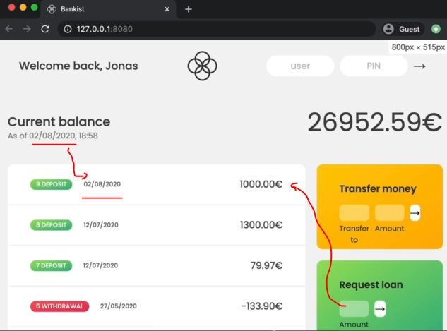

# Adding Dates to Bankist Application

- let's now implement dates in our application
- checking where we need to apply dates in our application
    

## Starter code 

```js
const account1 = {
    owner: 'Jonas Schmedtmann',
    movements: [200, 450, -400, 3000, -650, -130, 70, 1300],
    interestRate: 1.2, // %
    pin: 1111,

    movementsDates: [
      '2019-11-18T21:31:17.178Z',
      '2019-12-23T07:42:02.383Z',
      '2020-01-28T09:15:04.904Z',
      '2020-04-01T10:17:24.185Z',
      '2020-05-08T14:11:59.604Z',
      '2020-05-27T17:01:17.194Z',
      '2020-07-11T23:36:17.929Z',
      '2020-07-12T10:51:36.790Z',
    ],
    currency: 'EUR',
    locale: 'pt-PT', // de-DE
};

const account2 = {
    owner: 'Jessica Davis',
    movements: [5000, 3400, -150, -790, -3210, -1000, 8500, -30],
    interestRate: 1.5,
    pin: 2222,

    movementsDates: [
      '2019-11-01T13:15:33.035Z',
      '2019-11-30T09:48:16.867Z',
      '2019-12-25T06:04:23.907Z',
      '2020-01-25T14:18:46.235Z',
      '2020-02-05T16:33:06.386Z',
      '2020-04-10T14:43:26.374Z',
      '2020-06-25T18:49:59.371Z',
      '2020-07-26T12:01:20.894Z',
    ],
    currency: 'USD',
    locale: 'en-US',
};

const account3 = {
    owner: 'Steven Thomas Williams',
    movements: [200, -200, 340, -300, -20, 50, 400, -460],
    interestRate: 0.7,
    pin: 3333,
};

const account4 = {
    owner: 'Sarah Smith',
    movements: [430, 1000, 700, 50, 90],
    interestRate: 1,
    pin: 4444,
};

const accounts = [account1, account2, account3, account4];

// Elements
const labelWelcome = document.querySelector('.welcome');
const labelDate = document.querySelector('.date');
const labelBalance = document.querySelector('.balance__value');
const labelSumIn = document.querySelector('.summary__value--in');
const labelSumOut = document.querySelector('.summary__value--out');
const labelSumInterest = document.querySelector('.summary__value--interest');
const labelTimer = document.querySelector('.timer');

const containerApp = document.querySelector('.app');
const containerMovements = document.querySelector('.movements');

const btnLogin = document.querySelector('.login__btn');
const btnTransfer = document.querySelector('.form__btn--transfer');
const btnLoan = document.querySelector('.form__btn--loan');
const btnClose = document.querySelector('.form__btn--close');
const btnSort = document.querySelector('.btn--sort');

const inputLoginUsername = document.querySelector('.login__input--user');
const inputLoginPin = document.querySelector('.login__input--pin');
const inputTransferTo = document.querySelector('.form__input--to');
const inputTransferAmount = document.querySelector('.form__input--amount');
const inputLoanAmount = document.querySelector('.form__input--loan-amount');
const inputCloseUsername = document.querySelector('.form__input--user');
const inputClosePin = document.querySelector('.form__input--pin');

const currencies = new Map([
  ['USD', 'United States dollar'],
  ['EUR', 'Euro'],
  ['GBP', 'Pound sterling'],
]);

const displayMovements = function(movements, sort = false) {
    containerMovements.innerHTML = ""

    const movs = sort ? movements.slice().sort((a, b) => a - b) : movements

    movs.forEach(function(mov, i) => {
        const type = mov > 0 ? 'deposit' : 'withdrawal'

        const html = `
            <div class="movements__row">
              <div class="movements__type movements__type--${type}">${i + 1} ${type}</div>
              <div class="movements__value">${mov}€</div>
            </div>
        `

        containerMovements.insertAdjacentHTML('afterbegin', html)
    })
}

const calcDisplayBalance = function(acc) {
        acc.balance = acc.reduce((acc , mov) => acc + mov, 0) 
        labelBalance.textContent = `${acc.balance}€`
}

const calcDisplaySummary = function(acc) {
    const incomes = acc.movements.filter(mov => mov > 0).reduce((acc, mov) => acc + mov, 0)
    labelSumIn.textContent = `${incomes}€`

    const out = acc.movements.filter(mov => mov < 0).reduce((acc , mov) => acc + mov, 0)
    labelSumOut.textContent = `${Math.abs(out)}€`

    const interest = acc.movements.filter(mov => mov > 0).map(deposit => {
        return (deposit * acc.interestRate)/100
      }).filter((int, i, arr) => {
          return int >= 1
      }).reduce((acc, int) => acc + int, 0)

    labelSumInterest.textContent = `${interest}€`
}

const createUsernames = function(accs) {
    accs.forEach(function(acc) {
        acc.username = acc.owner.toLowerCase().split(" ").map(name => name[0]).join('')
    })
}
createUsernames(accounts)

const updateUI = function(acc) {
    // display movements
    displayMovements(acc.movements)
    // display balance
    calcDisplayBalance(acc) 
    // display summary
    calcDisplaySummary(acc)
}

let currentAccount ;

btnLogin.addEventListener('click', e => {
    e.preventDefault() 

    currentAccount = accounts.find(acc => acc.username === inputLoginUsername.value)
    console.log(currentAccount)

    if (currentAccount?.pin === +inputLoginPin.value) {
        labelWelcome.textContent = `Welcome back, ${currentAccount.owner.split(" ")[0]}`
        containerApp.style.opacity = 100

        inputLoginUsername.value = inputLoginPin.value = "" 
        inputLoginPin.blur()
        // update UI 
        updateUI(currentAccount) 
    }
})

btnTransfer.addEventListener('submit', function(e) {
    e.preventDefault()
    const amount = +inputTransferAmount.value 
    const receiverAcc = accounts.find(acc => acc.username === inputTransferTo.value)

    if (amount > 0 && 
        receiverAcc && 
        currentAmount.balance >= amount && 
        receiverAcc?.username !=== currentAccount.username) {
            // doing the transfer
            currentAccount.movements.push(-amount)
            receiverAcc.movements.push(amount)
            // updateUI
            updateUI(currentAccount)
    }
})

btnLoan.addEventListener('submit', function(e) => {
    e.preventDefault()

    const amount = +inputLoanAmount.value

    if (amount > 0 && currentAccount.movements.some(mov => mov >= amount * 0.1)) {
        // add movement
        currentAccount.movements.push(amount)
        // update UI
        updateUI(currentAccount)
    }

    inputLoanAmount.value = ""
})

btnClose.addEventListener('submit', function(e) => {
    e.preventDefault()

    if(inputCloseUsername.value === currentAccount.username && +inputClosePin.value === currentAccount.pin) {
        const index = accounts.findIndex(acc => acc.username === currentAccount.username)
        // Delete account
        accounts.splice(index, 1) 
        // Hide UI
        containerApp.style.opacity = 0
    }

    inputCloseUsername.value = inputClosePin.value = ''
})


let sorted = false
btnSort.addEventListener('click', function(e) {
    e.preventDefault()
    displayMovements(currentAccount.movements, !sorted) 
    sorted = !sorted
})
```

## Steps - implementing dates in our application 

- `STEP 1` : let's add the code so that we don't have to login again & again to see changes
    ```js
    // put code before it 
    let currentAccount ;

    // Fake always logged in
    currentAccount = account1 
        // by-default we logged in as jonas but after logged in we don't see above that logged in as jonas
        // but it doesn't matter right now 
    updateUI(currentAccount)
    containerApp.style.opacity = 100

    btnLogin.addEventListener('click', e => {
        e.preventDefault() 

        currentAccount = accounts.find(acc => acc.username === inputLoginUsername.value)
        console.log(currentAccount)

        if (currentAccount?.pin === +inputLoginPin.value) {
            labelWelcome.textContent = `Welcome back, ${currentAccount.owner.split(" ")[0]}`
            containerApp.style.opacity = 100

            inputLoginUsername.value = inputLoginPin.value = "" 
            inputLoginPin.blur()
            // update UI 
            updateUI(currentAccount) 
        }
    })
    // put code after it 
    ```

- `STEP 2` : first implementing date of current balance & then dates of each movements
    ```js
    // put code before it 
    let currentAccount ;

    // Fake always logged in
    currentAccount = account1 
    updateUI(currentAccount)
    containerApp.style.opacity = 100

    const now = new Date() // right now we wrote this code outside the even handler for just checking 
    labelDate.textContent = now 

    btnLogin.addEventListener('click', e => {
        e.preventDefault() 

        currentAccount = accounts.find(acc => acc.username === inputLoginUsername.value)
        console.log(currentAccount)

        if (currentAccount?.pin === +inputLoginPin.value) {
            labelWelcome.textContent = `Welcome back, ${currentAccount.owner.split(" ")[0]}`
            containerApp.style.opacity = 100

            inputLoginUsername.value = inputLoginPin.value = "" 
            inputLoginPin.blur()
            // update UI 
            updateUI(currentAccount) 
        }
    })
    // put code after it 
    ```
    - checking output : we'll get date information like this 
        
        - so this is we don't want 
    - so we want date in this format i.e first day then month & then year <br>
        but we can format the date based on our country also
    - later on , we'll see internationalization which is used to form <br>
        a date & time automatically according to the user's location 💡💡💡

- `STEP 2` : formatting the date we got 
    ```js
    // put code before it 
    let currentAccount ;

    // Fake always logged in
    currentAccount = account1 
    updateUI(currentAccount)
    containerApp.style.opacity = 100

    const now = new Date() 
    const day = now.getDate() 
    const month = now.getMonth() + 1 // here we added 1 because index of month starts from 0
    const year = now.getFullYear()  
    const hour = now.getHours()  
    const min = now.getMinutes()  
    labelDate.textContent = `${day}/${month}/${year}, ${hour}:${min}` 

    btnLogin.addEventListener('click', e => {
        e.preventDefault() 

        currentAccount = accounts.find(acc => acc.username === inputLoginUsername.value)
        console.log(currentAccount)

        if (currentAccount?.pin === +inputLoginPin.value) {
            labelWelcome.textContent = `Welcome back, ${currentAccount.owner.split(" ")[0]}`
            containerApp.style.opacity = 100

            inputLoginUsername.value = inputLoginPin.value = "" 
            inputLoginPin.blur()
            // update UI 
            updateUI(currentAccount) 
        }
    })
    // put code after it
    ```
    - checking output : we'll get output like this 2/8/2020, 18:37
    - now we want `0` before 2 & 8 to show the date more clearly , so here comes use case of `padStart()` string method
    
- `STEP 3` : putting `0` before 2 & 8 to show the date more clearly by using `padStart()` string method 
    - here we'll see the use case of `padStart()` string method 💡💡💡
    ```js
    // put code before it 
    let currentAccount ;

    // Fake always logged in
    currentAccount = account1 
    updateUI(currentAccount)
    containerApp.style.opacity = 100

    const now = new Date() 
    const day = `${now.getDate()}`.padStart(2, '0') // OR const day = `${now.getDate()}`.padStart(2, 0) 
        // Note of padStart() string method : 
            // if the date is 12 then 0 (zero) will not be added
            // because the final length that we're looking for is always 2 💡💡💡
    const month = `${now.getMonth() + 1}`.padStart(2, '0') 
    const year = now.getFullYear()  
    const hour = now.getHours()  
    const min = now.getMinutes()  
    labelDate.textContent = `${day}/${month}/${year}, ${hour}:${min}` 

    btnLogin.addEventListener('click', e => {
        e.preventDefault() 

        currentAccount = accounts.find(acc => acc.username === inputLoginUsername.value)
        console.log(currentAccount)

        if (currentAccount?.pin === +inputLoginPin.value) {
            labelWelcome.textContent = `Welcome back, ${currentAccount.owner.split(" ")[0]}`
            containerApp.style.opacity = 100

            inputLoginUsername.value = inputLoginPin.value = "" 
            inputLoginPin.blur()
            // update UI 
            updateUI(currentAccount) 
        }
    })
    // put code after it
    ```
    - checking output : we'll get 0 like this 
        
        - `Note` : as time goes on , 18:39 will not change because it's static <br>
            so if we want to display actual time then we need a timer that we'll see later on 💡💡💡

- `STEP 4` : now add dates on each movements 
    ```js
    const displayMovements = function(movements, sort = false) {
        containerMovements.innerHTML = ""

        const movs = sort ? movements.slice().sort((a, b) => a - b) : movements

        movs.forEach(function(mov, i) => {
            const type = mov > 0 ? 'deposit' : 'withdrawal'

            const html = `
                <div class="movements__row">
                  <div class="movements__type movements__type--${type}">${i + 1} ${type}</div>
                  <div class="movements__value">${mov}€</div>
                </div>
            `

            containerMovements.insertAdjacentHTML('afterbegin', html)
        })
    }
    ```
    - here we just define movement dates object inside only two account just <br>
        to implement dates on each movements of that account
    - here inside `displayMovements()` function we just pass the `movements` as parameter <br>
        but we also wants movements dates , so just pass entire particular account based on which user login 
    - `STEP 4.1` : passing entire particular account as parameter inside displayMovements()
        ```js
        const displayMovements = function(acc, sort = false) {
            containerMovements.innerHTML = ""

            const movs = sort ? acc.movements.slice().sort((a, b) => a - b) : acc.movements

            movs.forEach(function(mov, i) => {
                const type = mov > 0 ? 'deposit' : 'withdrawal'

                const html = `
                    <div class="movements__row">
                      <div class="movements__type movements__type--${type}">${i + 1} ${type}</div>
                      <div class="movements__value">${mov}€</div>
                    </div>
                `

                containerMovements.insertAdjacentHTML('afterbegin', html)
            })
        }
        // put code after it 

        // put code before it 
        const updateUI = function(acc) {
            // display movements
            displayMovements(acc) // here we passed entire particular account as argument 
            // display balance
            calcDisplayBalance(acc) 
            // display summary
            calcDisplaySummary(acc)
        }
        // put code after it 

        // put code after it 
        let sorted = false
        btnSort.addEventListener('click', function(e) {
            e.preventDefault()
            // here again we passed current account to sort each movements of that account
            displayMovements(currentAccount.movements, !sorted) 
            sorted = !sorted
        })
        ```
        - `Best Practice ✅` : here is a good thing that we created `updateUI()` function
            - where we call all of display methods all in one place & we just need to change in one place also
            - so that's the whole goal of refactoring
            - so refactoring make easier to implement new features as times moves on 💡💡💡

- `STEP 5` : working on displayMovements() to add date
    ```html
    <!-- MOVEMENTS -->
    <div class="movements">
      <div class="movements__row">
        <div class="movements__type movements__type--deposit">2 deposit</div>
        <div class="movements__date">3 days ago</div>
        <div class="movements__value">4 000€</div>
      </div>
      <div class="movements__row">
        <div class="movements__type movements__type--withdrawal">1 withdrawal</div>
        <div class="movements__date">24/01/2037</div>
        <div class="movements__value">-378€</div>
      </div>
    </div>
    ```
    - `<div class="movements__date">3 days ago</div>` copy this & add it inside displayMovements() function
    ```js
    const displayMovements = function(acc, sort = false) {
        containerMovements.innerHTML = ""

        const movs = sort ? acc.movements.slice().sort((a, b) => a - b) : acc.movements

        movs.forEach(function(mov, i) => {
            const type = mov > 0 ? 'deposit' : 'withdrawal'

            // we didn't created a variable for movement dates , we just took the advantage of i
            // & it's a common technique of looping over two arrays at the same time 💡💡💡
            const date = new Date(acc.movementsDates[i]) 

            const html = `
                <div class="movements__row">
                  <div class="movements__date">${displayDate}</div>
                  <div class="movements__type movements__type--${type}">${i + 1} ${type}</div>
                  <div class="movements__value">${mov}€</div>
                </div>
            `

            containerMovements.insertAdjacentHTML('afterbegin', html)
        })
    }
    // put code after it 

    // put code before it 
    const updateUI = function(acc) {
        // display movements
        displayMovements(acc) // here we passed entire particular account as argument 
        // display balance
        calcDisplayBalance(acc) 
        // display summary
        calcDisplaySummary(acc)
    }
    // put code after it 

    // put code after it 
    let sorted = false
    btnSort.addEventListener('click', function(e) {
        e.preventDefault()
        displayMovements(currentAccount.movements , !sorted) 
        sorted = !sorted
    })
    ```
    - `STEP 5.1` : copy day, month, year, & labelDate & paste them inside displayMovements() function
        - remove hour & minute because we don't want
        ```js
        const displayMovements = function(acc, sort = false) {
            containerMovements.innerHTML = ""

            const movs = sort ? acc.movements.slice().sort((a, b) => a - b) : acc.movements

            movs.forEach(function(mov, i) => {
                const type = mov > 0 ? 'deposit' : 'withdrawal'

                // we didn't created a variable for movement dates , we just took the advantage of i
                // & it's a common technique of looping over two arrays at the same time 💡💡💡
                const date = new Date(acc.movementsDates[i]) 
                const day = `${date.getDate()}`.padStart(2, '0')  
                const month = `${date.getMonth() + 1}`.padStart(2, '0') 
                const year = date.getFullYear()  
                const displayDate = `${day}/${month}/${year}` 

                const html = `
                    <div class="movements__row">
                      <div class="movements__date">${displayDate}</div>
                      <div class="movements__type movements__type--${type}">${i + 1} ${type}</div>
                      <div class="movements__value">${mov}€</div>
                    </div>
                `

                containerMovements.insertAdjacentHTML('afterbegin', html)
            })
        }
        // put code after it 

        // put code before it 
        const updateUI = function(acc) {
            // display movements
            displayMovements(acc) // here we passed entire particular account as argument 
            // display balance
            calcDisplayBalance(acc) 
            // display summary
            calcDisplaySummary(acc)
        }
        // put code after it 

        // put code after it 
        let sorted = false
        btnSort.addEventListener('click', function(e) {
            e.preventDefault()
            displayMovements(currentAccount.movements, !sorted) 
            sorted = !sorted
        })
        ```
        - checking output : dates are coming on each movements 
            

- `STEP 6` : cut this code from global scope & put inside btnLogin when we login
    ```js
    const now = new Date() 
    const day = `${now.getDate()}`.padStart(2, '0') 
    const month = `${now.getMonth() + 1}`.padStart(2, '0') 
    const year = now.getFullYear()  
    const hour = now.getHours()  
    const min = now.getMinutes()  
    ```
    ```js
    const displayMovements = function(acc, sort = false) {
        containerMovements.innerHTML = ""

        const movs = sort ? acc.movements.slice().sort((a, b) => a - b) : acc.movements

        movs.forEach(function(mov, i) => {
            const type = mov > 0 ? 'deposit' : 'withdrawal'
            const date = new Date(acc.movementsDates[i]) 
            const day = `${date.getDate()}`.padStart(2, '0')  
            const month = `${date.getMonth() + 1}`.padStart(2, '0') 
            const year = date.getFullYear()  
            const displayDate = `${day}/${month}/${year}` 

            const html = `
                <div class="movements__row">
                  <div class="movements__date">${displayDate}</div>
                  <div class="movements__type movements__type--${type}">${i + 1} ${type}</div>
                  <div class="movements__value">${mov}€</div>
                </div>
            `

            containerMovements.insertAdjacentHTML('afterbegin', html)
        })
    }
    // put code after it 

    // put code before it 
    const updateUI = function(acc) {
        // display movements
        displayMovements(acc) 
        // display balance
        calcDisplayBalance(acc) 
        // display summary
        calcDisplaySummary(acc)
    }

    let currentAccount ;

    btnLogin.addEventListener('click', e => {
        e.preventDefault() 

        currentAccount = accounts.find(acc => acc.username === inputLoginUsername.value)
        console.log(currentAccount)

        if (currentAccount?.pin === +inputLoginPin.value) {
            labelWelcome.textContent = `Welcome back, ${currentAccount.owner.split(" ")[0]}`
            containerApp.style.opacity = 100

            const now = new Date() 
            const day = `${now.getDate()}`.padStart(2, '0') 
            const month = `${now.getMonth() + 1}`.padStart(2, '0') 
            const year = now.getFullYear()  
            const hour = now.getHours()  
            const min = now.getMinutes()  
            labelDate.textContent = `${day}/${month}/${year}, ${hour}:${min}` 

            inputLoginUsername.value = inputLoginPin.value = "" 
            inputLoginPin.blur()
            // update UI 
            updateUI(currentAccount) 
        }
    })
    // put code after it
    ```
    - checking output : when login as jonas then we'll get correct date of current balance
        - & correct date on each movements also
        - but when we request for loan or transfer money then we'll get NAN/NAN/NAN 
    - `STEP 6.1` : adding date when we transfer money & request for a loan
        ```js
        btnTransfer.addEventListener('submit', function(e) {
            e.preventDefault()
            const amount = +inputTransferAmount.value 
            const receiverAcc = accounts.find(acc => acc.username === inputTransferTo.value)

            if (amount > 0 && 
                receiverAcc && 
                currentAmount.balance >= amount && 
                receiverAcc?.username !=== currentAccount.username) {
                    // doing the transfer
                    currentAccount.movements.push(-amount)
                    receiverAcc.movements.push(amount)

                    // add transfer date
                    currentAccount.movementsDates.push(new Date())
                    receiverAccount.movementsDates.push(new Date())
                      // in real word, we would have an object for each movement  
                        // & that object would then contain the amount , the date, 
                            // & some other information about the movement
                        // but Jonas sir don't want to restructure the entire application 
                        // that's why he just created the separate movements dates 

                    // updateUI
                    updateUI(currentAccount)
            }
        })

        btnLoan.addEventListener('submit', function(e) => {
            e.preventDefault()

            const amount = +inputLoanAmount.value

            if (amount > 0 && currentAccount.movements.some(mov => mov >= amount * 0.1)) {
                // add movement
                currentAccount.movements.push(amount)

                // Add loan date
                currentAccount.movementsDates.push(new Date())

                // update UI
                updateUI(currentAccount)
            }

            inputLoanAmount.value = ""
        })
        ```
        - checking output : now when we request for a loan or transfer money then we'll get current date like this 
            
            - but when we check `account1` & go inside movementsDates then we'll get this output 
            
            - & here new one is different than previous one because that new one is in object type <br>
                so to convert from object type into string type , we'll use `toISOString()` method of `Date` class 💡💡💡
    - `STEP 6.2` : using `toISOString()` method to convert movement dates in string type 
        ```js
        btnTransfer.addEventListener('submit', function(e) {
            e.preventDefault()
            const amount = +inputTransferAmount.value 
            const receiverAcc = accounts.find(acc => acc.username === inputTransferTo.value)

            if (amount > 0 && 
                receiverAcc && 
                currentAmount.balance >= amount && 
                receiverAcc?.username !=== currentAccount.username) {
                    // doing the transfer
                    currentAccount.movements.push(-amount)
                    receiverAcc.movements.push(amount)

                    // add transfer date
                    currentAccount.movementsDates.push(new Date().toISOString())
                    receiverAccount.movementsDates.push(new Date().toISOString())

                    // updateUI
                    updateUI(currentAccount)
            }
        })

        btnLoan.addEventListener('submit', function(e) => {
            e.preventDefault()

            const amount = +inputLoanAmount.value

            if (amount > 0 && currentAccount.movements.some(mov => mov >= amount * 0.1)) {
                // add movement
                currentAccount.movements.push(amount)

                // Add loan date
                currentAccount.movementsDates.push(new Date().toISOString())

                // update UI
                updateUI(currentAccount)
            }

            inputLoanAmount.value = ""
        })
        ```
        - checking output : now login as jonas & then request for a loan as 500
            - & then inside console tab , type `account1` & see the movementsDates we'll get this  
            
            - but in current balance section , time is coming wrong like this 
            
    - `STEP 6.3` : making time in correct format of current balance section
        ```js
        // put code before it
        let currentAccount ;

        btnLogin.addEventListener('click', e => {
            e.preventDefault() 

            currentAccount = accounts.find(acc => acc.username === inputLoginUsername.value)
            console.log(currentAccount)

            if (currentAccount?.pin === +inputLoginPin.value) {
                labelWelcome.textContent = `Welcome back, ${currentAccount.owner.split(" ")[0]}`
                containerApp.style.opacity = 100

                const now = new Date() 
                const day = `${now.getDate()}`.padStart(2, '0') 
                const month = `${now.getMonth() + 1}`.padStart(2, '0') 
                const year = now.getFullYear()  
                const hour = `${now.getHours()}`.padStart(2, '0')  
                const min = `${now.getMinutes()}`.padStart(2, '0')  
                labelDate.textContent = `${day}/${month}/${year}, ${hour}:${min}` 

                inputLoginUsername.value = inputLoginPin.value = "" 
                inputLoginPin.blur()
                // update UI 
                updateUI(currentAccount) 
            }
        })

        btnTransfer.addEventListener('submit', function(e) {
            e.preventDefault()
            const amount = +inputTransferAmount.value 
            const receiverAcc = accounts.find(acc => acc.username === inputTransferTo.value)

            if (amount > 0 && 
                receiverAcc && 
                currentAmount.balance >= amount && 
                receiverAcc?.username !=== currentAccount.username) {
                    // doing the transfer
                    currentAccount.movements.push(-amount)
                    receiverAcc.movements.push(amount)

                    // add transfer date
                    currentAccount.movementsDates.push(new Date().toISOString())
                    receiverAccount.movementsDates.push(new Date().toISOString())

                    // updateUI
                    updateUI(currentAccount)
            }
        })

        btnLoan.addEventListener('submit', function(e) => {
            e.preventDefault()

            const amount = +inputLoanAmount.value

            if (amount > 0 && currentAccount.movements.some(mov => mov >= amount * 0.1)) {
                // add movement
                currentAccount.movements.push(amount)

                // Add loan date
                currentAccount.movementsDates.push(new Date().toISOString())

                // update UI
                updateUI(currentAccount)
            }

            inputLoanAmount.value = ""
        })
        // put code after it 
        ```
        - checking output : login as jonas then we'll see time (of current account section) in correct format

- here we didn't worked on sorting the movements , so we'll do in upcoming lecture 
