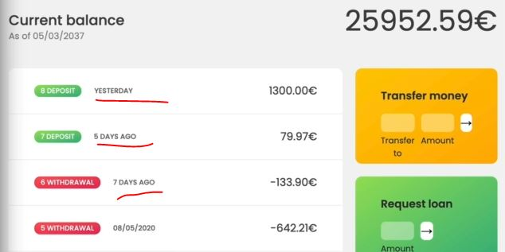
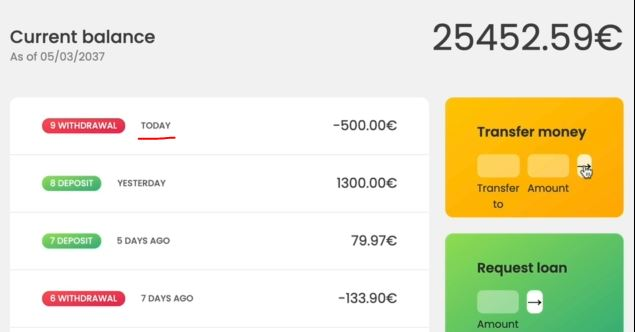
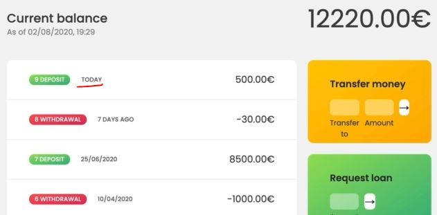

# Operations With Dates

- we'll do calculation with dates like addition , etc

## Examples - operation with Date

- Eg 1 : Operation with Date
    - doing subtraction one date from another date in order to calculate how many days have passed b/w two dates <br>
        & this will work because whenever we try to convert a date to a number then the result is going to be <br> 
        the timestamp in milliseconds & then with these milliseconds we can perform calculations
    - so the timestamp are helpful & important 
    - `STEP 1` : converting the date in timestamp
        ```js
        const future = new Date(2037, 10, 19, 15, 23)
        console.log(Number(future)) // OR another way console.log(+future)
        // output : 2142237180000 
        ```
        - now we can do operations , so if we subtract one date from another <br>
            then the result is going to be a number like this `2142237180000` which is a timestamp in milliseconds <br>
            & then we can simple convert that milliseconds back to days or two hours or whatever we want
    - `STEP 2` : creating a function that takes two dates & return the number of days that pass b/w those two dates
        ```js
        const future = new Date(2037, 10, 19, 15, 23)
        console.log(Number(future))

        const calcDaysPassed = (date1, date2) => (date2 - date1)

        // new Date(2037, 3, 14) -> means 3 is April & 14 is date
        //  new Date(2037, 3, 24) -> means 3 is April & 24 is date
        const days1 = calcDaysPassed(new Date(2037, 3, 14), new Date(2037, 3, 24))
        console.log(days1) // output : 864000000
        ```
        - here we got milliseconds i.e `864000000` & now we need to convert those two dates
    - `STEP 3` : converting those two dates
        ```js
        const future = new Date(2037, 10, 19, 15, 23)
        console.log(Number(future))

        // this (date2 - date1) / (1000) --> will convert milliseconds to seconds
        // (date2 - date1) / (1000 * 60) --> will convert seconds to minutes
        // (date2 - date1) / (1000 * 60 * 60) --> will convert minutes to hours
        // (date2 - date1) / (1000 * 60 * 60 * 24) --> will convert hours to a day
            // 24 hrs in a day , 60 minute in 1hr , 60 seconds in 1min & 1000 milliseconds in 1second
        const calcDaysPassed = (date1, date2) => (date2 - date1) / (1000 * 60 * 60 * 24)

        const days1 = calcDaysPassed(new Date(2037, 3, 14), new Date(2037, 3, 24))
        console.log(days1) // output : 10
        ```
        - so we got `10` days , so April 24 to April 14 we have 10 days
        - but if we pass date2 as 4 & date1 as 14 then we'll get `-10` like this 
            ```js
            const future = new Date(2037, 10, 19, 15, 23)
            console.log(Number(future))

            const calcDaysPassed = (date1, date2) => (date2 - date1) / (1000 * 60 * 60 * 24)

            const days1 = calcDaysPassed(new Date(2037, 3, 14), new Date(2037, 3, 4))
            console.log(days1) // output : -10
            ```
        - so we don't want that negative days , so we'll use Math.abs() method for absolute value without any sign 💡💡💡
    - `STEP 4` : using Math.abs() for absolute no. of days b/w two different days
        ```js
        const future = new Date(2037, 10, 19, 15, 23)
        console.log(Number(future))

        const calcDaysPassed = (date1, date2) => Math.abs((date2 - date1) / (1000 * 60 * 60 * 24))

        const days1 = calcDaysPassed(new Date(2037, 3, 14), new Date(2037, 3, 4))
        // OR const days1 = calcDaysPassed(new Date(2037, 3, 4), new Date(2037, 3, 14)) -> still we'll get 10  
        console.log(days1) // output : 10
        ```
        - if you want very precise calculations like including time changes due to daylight saving changes <br>
            & other weird edge cases then we can use moment.js date library
        - now if we pass time in one the date like this 
            ```js
            const future = new Date(2037, 10, 19, 15, 23)
            console.log(Number(future))

            const calcDaysPassed = (date1, date2) => Math.abs((date2 - date1) / (1000 * 60 * 60 * 24))

            // here one of the date we passed 10 hr & 8 min to check what will happen to no. of days
            const days1 = calcDaysPassed(new Date(2037, 3, 4), new Date(2037, 3, 14, 10, 8)) 
            console.log(days1) // output : 10.4222222222222222
            ```
            - we don't want 10.4 days but we don't want , so we can use Math.round() method
    - `STEP 5` : using Math.round() to remove decimal part from no. of days if we pass time to any one of the date
        ```js
        const future = new Date(2037, 10, 19, 15, 23)
        console.log(Number(future))

        const calcDaysPassed = (date1, date2) => {
            return Math.round(Math.abs((date2 - date1) / (1000 * 60 * 60 * 24)))
        }

        const days1 = calcDaysPassed(new Date(2037, 3, 4), new Date(2037, 3, 14, 10, 8)) 
        console.log(days1) // output : 10
        ```

- now let's use this function to format & display our movement dates in a little bit nicer in our application 
    - we want if one movement happened today then instead of showing current date , we want to display today <br>
        then if it happened yesterday then display yesterday <br>
        then if it happened like a couple of days ago then display like two days ago or five days ago
    - we also have seen in many web applications like posted on facebook & if we didn't watch it today <br>
        the it'll say that you posted it yesterday & it's not going to display the exact date

## Starter code - of Bankist app to implement movement dates in more clear way

```js
const account1 = {
    owner: 'Jonas Schmedtmann',
    movements: [200, 450, -400, 3000, -650, -130, 70, 1300],
    interestRate: 1.2, // %
    pin: 1111,

    movementsDates: [
      '2019-11-18T21:31:17.178Z',
      '2019-12-23T07:42:02.383Z',
      '2020-01-28T09:15:04.904Z',
      '2020-04-01T10:17:24.185Z',
      '2020-05-08T14:11:59.604Z',
      '2020-05-27T17:01:17.194Z',
      '2020-07-11T23:36:17.929Z',
      '2020-07-12T10:51:36.790Z',
    ],
    currency: 'EUR',
    locale: 'pt-PT', // de-DE
};

const account2 = {
    owner: 'Jessica Davis',
    movements: [5000, 3400, -150, -790, -3210, -1000, 8500, -30],
    interestRate: 1.5,
    pin: 2222,

    movementsDates: [
      '2019-11-01T13:15:33.035Z',
      '2019-11-30T09:48:16.867Z',
      '2019-12-25T06:04:23.907Z',
      '2020-01-25T14:18:46.235Z',
      '2020-02-05T16:33:06.386Z',
      '2020-04-10T14:43:26.374Z',
      '2020-06-25T18:49:59.371Z',
      '2020-07-26T12:01:20.894Z',
    ],
    currency: 'USD',
    locale: 'en-US',
};

const account3 = {
    owner: 'Steven Thomas Williams',
    movements: [200, -200, 340, -300, -20, 50, 400, -460],
    interestRate: 0.7,
    pin: 3333,
};

const account4 = {
    owner: 'Sarah Smith',
    movements: [430, 1000, 700, 50, 90],
    interestRate: 1,
    pin: 4444,
};

const accounts = [account1, account2, account3, account4];

// Elements
const labelWelcome = document.querySelector('.welcome');
const labelDate = document.querySelector('.date');
const labelBalance = document.querySelector('.balance__value');
const labelSumIn = document.querySelector('.summary__value--in');
const labelSumOut = document.querySelector('.summary__value--out');
const labelSumInterest = document.querySelector('.summary__value--interest');
const labelTimer = document.querySelector('.timer');

const containerApp = document.querySelector('.app');
const containerMovements = document.querySelector('.movements');

const btnLogin = document.querySelector('.login__btn');
const btnTransfer = document.querySelector('.form__btn--transfer');
const btnLoan = document.querySelector('.form__btn--loan');
const btnClose = document.querySelector('.form__btn--close');
const btnSort = document.querySelector('.btn--sort');

const inputLoginUsername = document.querySelector('.login__input--user');
const inputLoginPin = document.querySelector('.login__input--pin');
const inputTransferTo = document.querySelector('.form__input--to');
const inputTransferAmount = document.querySelector('.form__input--amount');
const inputLoanAmount = document.querySelector('.form__input--loan-amount');
const inputCloseUsername = document.querySelector('.form__input--user');
const inputClosePin = document.querySelector('.form__input--pin');

const currencies = new Map([
  ['USD', 'United States dollar'],
  ['EUR', 'Euro'],
  ['GBP', 'Pound sterling'],
]);

const displayMovements = function(acc, sort = false) {
    containerMovements.innerHTML = ""

    const movs = sort ? acc.movements.slice().sort((a, b) => a - b) : acc.movements

    movs.forEach(function(mov, i) => {
        const type = mov > 0 ? 'deposit' : 'withdrawal'

        const date = new Date(acc.movementsDates[i]) 
        const day = `${date.getDate()}`.padStart(2, '0')  
        const month = `${date.getMonth() + 1}`.padStart(2, '0') 
        const year = date.getFullYear()  
        const displayDate = `${day}/${month}/${year}` 

        const html = `
            <div class="movements__row">
              <div class="movements__date">${displayDate}</div>
              <div class="movements__type movements__type--${type}">${i + 1} ${type}</div>
              <div class="movements__value">${mov}€</div>
            </div>
        `

        containerMovements.insertAdjacentHTML('afterbegin', html)
    })
}

const calcDisplayBalance = function(acc) {
    acc.balance = acc.reduce((acc , mov) => acc + mov, 0) 
    labelBalance.textContent = `${acc.balance}€`
}

const calcDisplaySummary = function(acc) {
    const incomes = acc.movements.filter(mov => mov > 0).reduce((acc, mov) => acc + mov, 0)
    labelSumIn.textContent = `${incomes}€`

    const out = acc.movements.filter(mov => mov < 0).reduce((acc , mov) => acc + mov, 0)
    labelSumOut.textContent = `${Math.abs(out)}€`

    const interest = acc.movements.filter(mov => mov > 0).map(deposit => {
        return (deposit * acc.interestRate)/100
      }).filter((int, i, arr) => {
          return int >= 1
      }).reduce((acc, int) => acc + int, 0)

    labelSumInterest.textContent = `${interest}€`
}

const createUsernames = function(accs) {
    accs.forEach(function(acc) {
        acc.username = acc.owner.toLowerCase().split(" ").map(name => name[0]).join('')
    })
}
createUsernames(accounts)

const updateUI = function(acc) {
    // display movements
    displayMovements(acc)
    // display balance
    calcDisplayBalance(acc) 
    // display summary
    calcDisplaySummary(acc)
}

let currentAccount ;

// Fake always logged in
currentAccount = account1 
updateUI(currentAccount)
containerApp.style.opacity = 100

btnLogin.addEventListener('click', e => {
    e.preventDefault() 

    currentAccount = accounts.find(acc => acc.username === inputLoginUsername.value)
    console.log(currentAccount)

    if (currentAccount?.pin === +inputLoginPin.value) {
        labelWelcome.textContent = `Welcome back, ${currentAccount.owner.split(" ")[0]}`
        containerApp.style.opacity = 100

        const now = new Date() 
        const day = `${now.getDate()}`.padStart(2, '0') 
        const month = `${now.getMonth() + 1}`.padStart(2, '0') 
        const year = now.getFullYear()  
        const hour = `${now.getHours()}`.padStart(2, '0')  
        const min = `${now.getMinutes()}`.padStart(2, '0')  
        labelDate.textContent = `${day}/${month}/${year}, ${hour}:${min}` 

        inputLoginUsername.value = inputLoginPin.value = "" 
        inputLoginPin.blur()
        // update UI 
        updateUI(currentAccount) 
    }
})

btnTransfer.addEventListener('submit', function(e) {
    e.preventDefault()
    const amount = +inputTransferAmount.value 
    const receiverAcc = accounts.find(acc => acc.username === inputTransferTo.value)

    if (amount > 0 && 
        receiverAcc && 
        currentAmount.balance >= amount && 
        receiverAcc?.username !=== currentAccount.username) {
            // doing the transfer
            currentAccount.movements.push(-amount)
            receiverAcc.movements.push(amount)
            // add transfer date
            currentAccount.movementsDates.push(new Date().toISOString())
            receiverAccount.movementsDates.push(new Date().toISOString())
            // updateUI
            updateUI(currentAccount)
    }
})

btnLoan.addEventListener('submit', function(e) => {
    e.preventDefault()

    const amount = +inputLoanAmount.value

    if (amount > 0 && currentAccount.movements.some(mov => mov >= amount * 0.1)) {
        // add movement
        currentAccount.movements.push(amount)
        // Add loan date
        currentAccount.movementsDates.push(new Date().toISOString())
        // update UI
        updateUI(currentAccount)
    }

    inputLoanAmount.value = ""
})

btnClose.addEventListener('submit', function(e) => {
    e.preventDefault()

    if(inputCloseUsername.value === currentAccount.username && +inputClosePin.value === currentAccount.pin) {
        const index = accounts.findIndex(acc => acc.username === currentAccount.username)
        // Delete account
        accounts.splice(index, 1) 
        // Hide UI
        containerApp.style.opacity = 0
    }

    inputCloseUsername.value = inputClosePin.value = ''
})


let sorted = false
btnSort.addEventListener('click', function(e) {
    e.preventDefault()
    displayMovements(currentAccount.movements, !sorted) 
    sorted = !sorted
})
```

## Step 

- `STEP 1` : take this line code & put inside displayMovements() , inside mov.forEach()
    ```js
    const calcDaysPassed = (date1, date2) => {
        return Math.round(Math.abs((date2 - date1) / (1000 * 60 * 60 * 24)))
    }
    ```
    - inside displayMovements() , inside mov.forEach()
        ```js
        const displayMovements = function(acc, sort = false) {
            containerMovements.innerHTML = ""

            const movs = sort ? acc.movements.slice().sort((a, b) => a - b) : acc.movements

            movs.forEach(function(mov, i) => {
                const type = mov > 0 ? 'deposit' : 'withdrawal'

                const date = new Date(acc.movementsDates[i]) 
                const day = `${date.getDate()}`.padStart(2, '0')  
                const month = `${date.getMonth() + 1}`.padStart(2, '0') 
                const year = date.getFullYear()  
                const displayDate = `${day}/${month}/${year}` 

                const calcDaysPassed = (date1, date2) => {
                    return Math.round(Math.abs((date2 - date1) / (1000 * 60 * 60 * 24)))
                }

                const html = `
                    <div class="movements__row">
                      <div class="movements__date">${displayDate}</div>
                      <div class="movements__type movements__type--${type}">${i + 1} ${type}</div>
                      <div class="movements__value">${mov}€</div>
                    </div>
                `

                containerMovements.insertAdjacentHTML('afterbegin', html)
            })
        }
        ```
    - `STEP 1.1` : but let's create a global function for formatting movement dates to make code modular
        ```js
        // put code before it 
        const currencies = new Map([
          ['USD', 'United States dollar'],
          ['EUR', 'Euro'],
          ['GBP', 'Pound sterling'],
        ]);

        const formatMovementDate = function(date) {
            const calcDaysPassed = (date1, date2) => {
                return Math.round(Math.abs((date2 - date1) / (1000 * 60 * 60 * 24)))
            }

            const day = `${date.getDate()}`.padStart(2, '0')  
            const month = `${date.getMonth() + 1}`.padStart(2, '0') 
            const year = date.getFullYear()  
            return `${day}/${month}/${year}` 
        }

        const displayMovements = function(acc, sort = false) {
            containerMovements.innerHTML = ""

            const movs = sort ? acc.movements.slice().sort((a, b) => a - b) : acc.movements

            movs.forEach(function(mov, i) => {
                const type = mov > 0 ? 'deposit' : 'withdrawal'

                const date = new Date(acc.movementsDates[i]) 
                const displayDate = formatMovementDate(date)

                const html = `
                    <div class="movements__row">
                      <div class="movements__date">${displayDate}</div>
                      <div class="movements__type movements__type--${type}">${i + 1} ${type}</div>
                      <div class="movements__value">${mov}€</div>
                    </div>
                `

                containerMovements.insertAdjacentHTML('afterbegin', html)
            })
        }
        // put code after it 
        ```
        - checking output : login as jonas & then movement dates are still correctly printed
    - now calculate how many days passed since the current date & b/w the date that we're working with

- `STEP 2` : calculate how many days passed b/w the current date & the date
    ```js
    // put code from STEP 1.1 before it 
    const formatMovementDate = function(date) {
        const calcDaysPassed = (date1, date2) => {
            return Math.round(Math.abs((date2 - date1) / (1000 * 60 * 60 * 24)))
        }

        const daysPassed = calcDaysPassed(new Date(), date)
        console.log(datePassed)

        const day = `${date.getDate()}`.padStart(2, '0')  
        const month = `${date.getMonth() + 1}`.padStart(2, '0') 
        const year = date.getFullYear()  
        return `${day}/${month}/${year}` 
    }

    const displayMovements = function(acc, sort = false) {
        containerMovements.innerHTML = ""

        const movs = sort ? acc.movements.slice().sort((a, b) => a - b) : acc.movements

        movs.forEach(function(mov, i) => {
            const type = mov > 0 ? 'deposit' : 'withdrawal'

            const date = new Date(acc.movementsDates[i]) 
            const displayDate = formatMovementDate(date)

            const html = `
                <div class="movements__row">
                  <div class="movements__date">${displayDate}</div>
                  <div class="movements__type movements__type--${type}">${i + 1} ${type}</div>
                  <div class="movements__value">${mov}€</div>
                </div>
            `

            containerMovements.insertAdjacentHTML('afterbegin', html)
        })
    }
    // put code after it 
    ```
    - checking output : we'll get correct output i.e no. of days in the console tab 
    - `STEP 2.1` : in jonas account , now making one date as yesterday & date like 3 or 4 days ago for checking  
        ```js
        const account1 = {
            owner: 'Jonas Schmedtmann',
            movements: [200, 450, -400, 3000, -650, -130, 70, 1300],
            interestRate: 1.2, // %
            pin: 1111,

            movementsDates: [
              '2019-11-18T21:31:17.178Z',
              '2019-12-23T07:42:02.383Z',
              '2020-01-28T09:15:04.904Z',
              '2020-04-01T10:17:24.185Z',
              '2020-05-08T14:11:59.604Z',
              '2020-07-26T17:01:17.194Z', // 2020-07-26 -> means july 26
              '2020-07-28T23:36:17.929Z', // 2020-07-28 -> means July 28
              '2020-08-01T10:51:36.790Z', // 2020-08-01 -> means August 1st
            ],
            currency: 'EUR',
            locale: 'pt-PT', // de-DE
        };
        ```
    - `STEP 2.2` : now implementing logic based on those day past
        ```js
        // put code from STEP 1.1 before it 
        const formatMovementDate = function(date) {
            const calcDaysPassed = (date1, date2) => {
                return Math.round(Math.abs((date2 - date1) / (1000 * 60 * 60 * 24)))
            }

            const daysPassed = calcDaysPassed(new Date(), date)
            console.log(datePassed)

            // if this is return then others will not be executed & same with others
                // & this is the pretty common technique 💡💡💡
            if (daysPassed === 0) return 'Today' 
            // if one day is passed then show yesterday
            if (daysPassed === 1) return 'Yesterday'
            if (daysPassed <= 7) return `${daysPassed} days ago`
            else {
                const day = `${date.getDate()}`.padStart(2, '0')  
                const month = `${date.getMonth() + 1}`.padStart(2, '0') 
                const year = date.getFullYear()  
                return `${day}/${month}/${year}` 
            }
        }

        const displayMovements = function(acc, sort = false) {
            containerMovements.innerHTML = ""

            const movs = sort ? acc.movements.slice().sort((a, b) => a - b) : acc.movements

            movs.forEach(function(mov, i) => {
                const type = mov > 0 ? 'deposit' : 'withdrawal'

                const date = new Date(acc.movementsDates[i]) 
                const displayDate = formatMovementDate(date)

                const html = `
                    <div class="movements__row">
                      <div class="movements__date">${displayDate}</div>
                      <div class="movements__type movements__type--${type}">${i + 1} ${type}</div>
                      <div class="movements__value">${mov}€</div>
                    </div>
                `

                containerMovements.insertAdjacentHTML('afterbegin', html)
            })
        }
        ```
        - checking output : we'll get correct output 
            
            - when we transfer to let's say `jd` & amount `500` & hit enter we'll get this output  
            
            - now if we login as `jd` & `2222` pin , then we'll get deposit of today like this
            
    - `STEP 2.3` removing the else block because we don't need that 
        ```js
        // put code from STEP 1.1 before it 
        const formatMovementDate = function(date) {
            const calcDaysPassed = (date1, date2) => {
                return Math.round(Math.abs((date2 - date1) / (1000 * 60 * 60 * 24)))
            }

            const daysPassed = calcDaysPassed(new Date(), date)
            console.log(datePassed)

            if (daysPassed === 0) return 'Today' 
            if (daysPassed === 1) return 'Yesterday'
            if (daysPassed <= 7) return `${daysPassed} days ago`

            // here we removed the else block statement because we don't need 
                // because these lines of code only be executed when above all if statement are false ✔️✔️✔️
            const day = `${date.getDate()}`.padStart(2, '0')  
            const month = `${date.getMonth() + 1}`.padStart(2, '0') 
            const year = date.getFullYear()  
            return `${day}/${month}/${year}` 
        }

        const displayMovements = function(acc, sort = false) {
            containerMovements.innerHTML = ""

            const movs = sort ? acc.movements.slice().sort((a, b) => a - b) : acc.movements

            movs.forEach(function(mov, i) => {
                const type = mov > 0 ? 'deposit' : 'withdrawal'

                const date = new Date(acc.movementsDates[i]) 
                const displayDate = formatMovementDate(date)

                const html = `
                    <div class="movements__row">
                      <div class="movements__date">${displayDate}</div>
                      <div class="movements__type movements__type--${type}">${i + 1} ${type}</div>
                      <div class="movements__value">${mov}€</div>
                    </div>
                `

                containerMovements.insertAdjacentHTML('afterbegin', html)
            })
        }
        ```

- in next lecture , we'll see internationalization which is format automatically these dates & numbers (like amount) <br>
    according to each of the countries of these accounts
