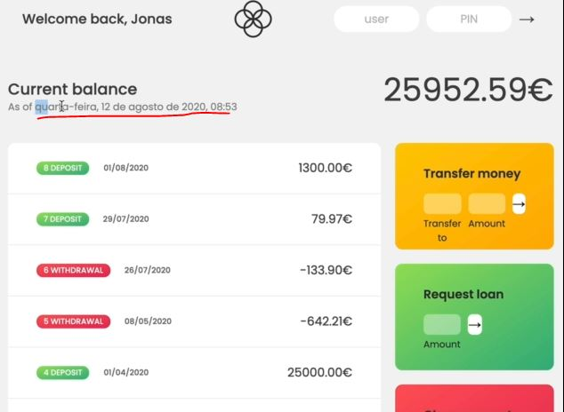

# Internationalizing Dates (Intl)

- JS has a new internationalization API
- `about internationalization ✅` : 
    - used to easily format numbers & strings automatically according to different languages 💡💡💡
    - with this API , we can make our applications support different languages for users around the world <br>
        for Example : currencies or dates are represented in a completely different way in Europe or in the US or in Asia <br>
- Now there's a lot of language specific things that we can do with the internationalization API <br>
    But in this lecture , we'll just see about formatting dates & numbers

## using only Internationalization Dates in our application

- in our application , we have dates in two places 
    - `1` : we have a date in current balance
    - `2` : we have movement dates

- inside displayMovements() function , 
    ```js
    const displayMovements = function(acc, sort = false) {
        containerMovements.innerHTML = ""

        const movs = sort ? acc.movements.slice().sort((a, b) => a - b) : acc.movements

        movs.forEach(function(mov, i) => {
            const type = mov > 0 ? 'deposit' : 'withdrawal'

            const date = new Date(acc.movementsDates[i]) 
            const day = `${date.getDate()}`.padStart(2, '0')  
            const month = `${date.getMonth() + 1}`.padStart(2, '0') 
            const year = date.getFullYear()  
            const displayDate = `${day}/${month}/${year}` 

            const html = `
                <div class="movements__row">
                  <div class="movements__date">${displayDate}</div>
                  <div class="movements__type movements__type--${type}">${i + 1} ${type}</div>
                  <div class="movements__value">${mov}€</div>
                </div>
            `

            containerMovements.insertAdjacentHTML('afterbegin', html)
        })
    }
    ```
    - we'll replace this lines of code i.e through internationalization API , so that we can get automatic formatting
        ```
        const date = new Date(acc.movementsDates[i]) 
        const day = `${date.getDate()}`.padStart(2, '0')  
        const month = `${date.getMonth() + 1}`.padStart(2, '0') 
        const year = date.getFullYear()  
        const displayDate = `${day}/${month}/${year}` 
        ```

## starter code 

```js
const account1 = {
    owner: 'Jonas Schmedtmann',
    movements: [200, 450, -400, 3000, -650, -130, 70, 1300],
    interestRate: 1.2, // %
    pin: 1111,

    movementsDates: [
      '2019-11-18T21:31:17.178Z',
      '2019-12-23T07:42:02.383Z',
      '2020-01-28T09:15:04.904Z',
      '2020-04-01T10:17:24.185Z',
      '2020-05-08T14:11:59.604Z',
      '2020-07-26T17:01:17.194Z', 
      '2020-07-28T23:36:17.929Z', 
      '2020-08-01T10:51:36.790Z',
    ],
    currency: 'EUR',
    locale: 'pt-PT', // de-DE
};

const account2 = {
    owner: 'Jessica Davis',
    movements: [5000, 3400, -150, -790, -3210, -1000, 8500, -30],
    interestRate: 1.5,
    pin: 2222,

    movementsDates: [
      '2019-11-01T13:15:33.035Z',
      '2019-11-30T09:48:16.867Z',
      '2019-12-25T06:04:23.907Z',
      '2020-01-25T14:18:46.235Z',
      '2020-02-05T16:33:06.386Z',
      '2020-04-10T14:43:26.374Z',
      '2020-06-25T18:49:59.371Z',
      '2020-07-26T12:01:20.894Z',
    ],
    currency: 'USD',
    locale: 'en-US',
};

const account3 = {
    owner: 'Steven Thomas Williams',
    movements: [200, -200, 340, -300, -20, 50, 400, -460],
    interestRate: 0.7,
    pin: 3333,
};

const account4 = {
    owner: 'Sarah Smith',
    movements: [430, 1000, 700, 50, 90],
    interestRate: 1,
    pin: 4444,
};

const accounts = [account1, account2, account3, account4];

// Elements
const labelWelcome = document.querySelector('.welcome');
const labelDate = document.querySelector('.date');
const labelBalance = document.querySelector('.balance__value');
const labelSumIn = document.querySelector('.summary__value--in');
const labelSumOut = document.querySelector('.summary__value--out');
const labelSumInterest = document.querySelector('.summary__value--interest');
const labelTimer = document.querySelector('.timer');

const containerApp = document.querySelector('.app');
const containerMovements = document.querySelector('.movements');

const btnLogin = document.querySelector('.login__btn');
const btnTransfer = document.querySelector('.form__btn--transfer');
const btnLoan = document.querySelector('.form__btn--loan');
const btnClose = document.querySelector('.form__btn--close');
const btnSort = document.querySelector('.btn--sort');

const inputLoginUsername = document.querySelector('.login__input--user');
const inputLoginPin = document.querySelector('.login__input--pin');
const inputTransferTo = document.querySelector('.form__input--to');
const inputTransferAmount = document.querySelector('.form__input--amount');
const inputLoanAmount = document.querySelector('.form__input--loan-amount');
const inputCloseUsername = document.querySelector('.form__input--user');
const inputClosePin = document.querySelector('.form__input--pin');

const currencies = new Map([
  ['USD', 'United States dollar'],
  ['EUR', 'Euro'],
  ['GBP', 'Pound sterling'],
]);

const formatMovementDate = function(date) {
    const calcDaysPassed = (date1, date2) => {
        return Math.round(Math.abs((date2 - date1) / (1000 * 60 * 60 * 24)))
    }

    const daysPassed = calcDaysPassed(new Date(), date)
    console.log(datePassed)

    if (daysPassed === 0) return 'Today' 
    if (daysPassed === 1) return 'Yesterday'
    if (daysPassed <= 7) return `${daysPassed} days ago`

    const day = `${date.getDate()}`.padStart(2, '0')  
    const month = `${date.getMonth() + 1}`.padStart(2, '0') 
    const year = date.getFullYear()  
    return `${day}/${month}/${year}` 
}

const displayMovements = function(acc, sort = false) {
    containerMovements.innerHTML = ""

    const movs = sort ? acc.movements.slice().sort((a, b) => a - b) : acc.movements

    movs.forEach(function(mov, i) => {
        const type = mov > 0 ? 'deposit' : 'withdrawal'

        const date = new Date(acc.movementsDates[i]) 
        const displayDate = formatMovementDate(date)

        const html = `
            <div class="movements__row">
              <div class="movements__date">${displayDate}</div>
              <div class="movements__type movements__type--${type}">${i + 1} ${type}</div>
              <div class="movements__value">${mov}€</div>
            </div>
        `

        containerMovements.insertAdjacentHTML('afterbegin', html)
    })
}

const calcDisplayBalance = function(acc) {
    acc.balance = acc.reduce((acc , mov) => acc + mov, 0) 
    labelBalance.textContent = `${acc.balance}€`
}

const calcDisplaySummary = function(acc) {
    const incomes = acc.movements.filter(mov => mov > 0).reduce((acc, mov) => acc + mov, 0)
    labelSumIn.textContent = `${incomes}€`

    const out = acc.movements.filter(mov => mov < 0).reduce((acc , mov) => acc + mov, 0)
    labelSumOut.textContent = `${Math.abs(out)}€`

    const interest = acc.movements.filter(mov => mov > 0).map(deposit => {
        return (deposit * acc.interestRate)/100
      }).filter((int, i, arr) => {
          return int >= 1
      }).reduce((acc, int) => acc + int, 0)

    labelSumInterest.textContent = `${interest}€`
}

const createUsernames = function(accs) {
    accs.forEach(function(acc) {
        acc.username = acc.owner.toLowerCase().split(" ").map(name => name[0]).join('')
    })
}
createUsernames(accounts)

const updateUI = function(acc) {
    // display movements
    displayMovements(acc)
    // display balance
    calcDisplayBalance(acc) 
    // display summary
    calcDisplaySummary(acc)
}

let currentAccount ;

// Fake always logged in
currentAccount = account1 
updateUI(currentAccount)
containerApp.style.opacity = 100

btnLogin.addEventListener('click', e => {
    e.preventDefault() 

    currentAccount = accounts.find(acc => acc.username === inputLoginUsername.value)
    console.log(currentAccount)

    if (currentAccount?.pin === +inputLoginPin.value) {
        labelWelcome.textContent = `Welcome back, ${currentAccount.owner.split(" ")[0]}`
        containerApp.style.opacity = 100

        const now = new Date() 
        const day = `${now.getDate()}`.padStart(2, '0') 
        const month = `${now.getMonth() + 1}`.padStart(2, '0') 
        const year = now.getFullYear()  
        const hour = `${now.getHours()}`.padStart(2, '0')  
        const min = `${now.getMinutes()}`.padStart(2, '0')  
        labelDate.textContent = `${day}/${month}/${year}, ${hour}:${min}` 

        inputLoginUsername.value = inputLoginPin.value = "" 
        inputLoginPin.blur()
        // update UI 
        updateUI(currentAccount) 
    }
})

btnTransfer.addEventListener('submit', function(e) {
    e.preventDefault()
    const amount = +inputTransferAmount.value 
    const receiverAcc = accounts.find(acc => acc.username === inputTransferTo.value)

    if (amount > 0 && 
        receiverAcc && 
        currentAmount.balance >= amount && 
        receiverAcc?.username !=== currentAccount.username) {
            // doing the transfer
            currentAccount.movements.push(-amount)
            receiverAcc.movements.push(amount)
            // add transfer date
            currentAccount.movementsDates.push(new Date().toISOString())
            receiverAccount.movementsDates.push(new Date().toISOString())
            // updateUI
            updateUI(currentAccount)
    }
})

btnLoan.addEventListener('submit', function(e) => {
    e.preventDefault()

    const amount = +inputLoanAmount.value

    if (amount > 0 && currentAccount.movements.some(mov => mov >= amount * 0.1)) {
        // add movement
        currentAccount.movements.push(amount)
        // Add loan date
        currentAccount.movementsDates.push(new Date().toISOString())
        // update UI
        updateUI(currentAccount)
    }

    inputLoanAmount.value = ""
})

btnClose.addEventListener('submit', function(e) => {
    e.preventDefault()

    if(inputCloseUsername.value === currentAccount.username && +inputClosePin.value === currentAccount.pin) {
        const index = accounts.findIndex(acc => acc.username === currentAccount.username)
        // Delete account
        accounts.splice(index, 1) 
        // Hide UI
        containerApp.style.opacity = 0
    }

    inputCloseUsername.value = inputClosePin.value = ''
})


let sorted = false
btnSort.addEventListener('click', function(e) {
    e.preventDefault()
    displayMovements(currentAccount.movements, !sorted) 
    sorted = !sorted
})
```

## Steps - to implement Date (of current balance section)

- `STEP 1` : let's just display that date (of current balance section) outside of the login
    - so that we can experiment a little bit with this internationalization API without having to login all the time 
    ```js
    // Fake always logged in
    currentAccount = account1 
    updateUI(currentAccount)
    containerApp.style.opacity = 100

    // Experiment of internationalization API
    const now = new Date() // here we putted the new date globally 
    labelDate.textContent 

    btnLogin.addEventListener('click', e => {
        e.preventDefault() 

        currentAccount = accounts.find(acc => acc.username === inputLoginUsername.value)
        console.log(currentAccount)

        if (currentAccount?.pin === +inputLoginPin.value) {
            labelWelcome.textContent = `Welcome back, ${currentAccount.owner.split(" ")[0]}`
            containerApp.style.opacity = 100

            const day = `${now.getDate()}`.padStart(2, '0') 
            const month = `${now.getMonth() + 1}`.padStart(2, '0') 
            const year = now.getFullYear()  
            const hour = `${now.getHours()}`.padStart(2, '0')  
            const min = `${now.getMinutes()}`.padStart(2, '0')  
            labelDate.textContent = `${day}/${month}/${year}, ${hour}:${min}` 

            inputLoginUsername.value = inputLoginPin.value = "" 
            inputLoginPin.blur()
            // update UI 
            updateUI(currentAccount) 
        }
    })
    ```
    - `labelDate.textContent` here we define this globally because we want to set a date as a formatted state <br>
        so we'll use the internationalization API
    - `STEP 1.1` : using this API to formate the date of current balance section
        ```js
        // Fake always logged in
        currentAccount = account1 
        updateUI(currentAccount)
        containerApp.style.opacity = 100

        // Experiment of internationalization API
        const now = new Date()  
        // Intl -> is a class to use internationalization API
            // & to format times & dates we use DateTimeFormat() method of it  
            // new Intl.DateTimeFormat() -> this method takes two arguments 
                // first argument : locale string for date & second argument : options object for time 
            // locale -> is just the language & then dash or hyphen then country like this `en-US` 💡💡💡
            // new Intl.DateTimeFormat('en-US') -> then this whole will 
                // create a formatter for this english/en language 
                // & there are many locale language 
            // Intl.DateTimeFormat('en-US').format() -> format() method takes date 💡💡💡
        labelDate.textContent = new Intl.DateTimeFormat('en-US').format(now)

        btnLogin.addEventListener('click', e => {
            e.preventDefault() 

            currentAccount = accounts.find(acc => acc.username === inputLoginUsername.value)
            console.log(currentAccount)

            if (currentAccount?.pin === +inputLoginPin.value) {
                labelWelcome.textContent = `Welcome back, ${currentAccount.owner.split(" ")[0]}`
                containerApp.style.opacity = 100

                const day = `${now.getDate()}`.padStart(2, '0') 
                const month = `${now.getMonth() + 1}`.padStart(2, '0') 
                const year = now.getFullYear()  
                const hour = `${now.getHours()}`.padStart(2, '0')  
                const min = `${now.getMinutes()}`.padStart(2, '0')  
                labelDate.textContent = `${day}/${month}/${year}, ${hour}:${min}` 

                inputLoginUsername.value = inputLoginPin.value = "" 
                inputLoginPin.blur()
                // update UI 
                updateUI(currentAccount) 
            }
        })
        ``` 
        - checking output : we fake the login as Jonas 
            - & right now date & time is 12/08/2020, 08:07 of current balance section
            - but after implementing internationalization API for only date then we'll get 8/12/2020 <br>
                means first month came & then date
            - if we do `labelDate.textContent = new Intl.DateTimeFormat('en-GB').format(now)` : GB means great Britain <br>
                then we'll get 12/08/2020 , so here first date & then month
            - `ar-SY` means serie in arabic then we'll get different date format based on that country
        - for more country code check this : http://www.lingoes.net/en/translator/langcode.htm 

    - now let's customize more , right now we're just displaying date but not time 

- `STEP 2` : displaying time also through defining options objects
    ```js
    // Fake always logged in
    currentAccount = account1 
    updateUI(currentAccount)
    containerApp.style.opacity = 100

    // Experiment of internationalization API
    const now = new Date()  
    const options = { // defining options objects to define time by using this API
        // inside this "options" object , each key name & value 
            // should be same due to rules & order of defining time 💡💡💡
        hour : 'numeric', 
        minute: 'numeric',
    }
        // passing "options" object as second argument inside DateTimeFormat() method of this API for time 
    labelDate.textContent = new Intl.DateTimeFormat('en-US', options).format(now)

    btnLogin.addEventListener('click', e => {
        e.preventDefault() 

        currentAccount = accounts.find(acc => acc.username === inputLoginUsername.value)
        console.log(currentAccount)

        if (currentAccount?.pin === +inputLoginPin.value) {
            labelWelcome.textContent = `Welcome back, ${currentAccount.owner.split(" ")[0]}`
            containerApp.style.opacity = 100

            const day = `${now.getDate()}`.padStart(2, '0') 
            const month = `${now.getMonth() + 1}`.padStart(2, '0') 
            const year = now.getFullYear()  
            const hour = `${now.getHours()}`.padStart(2, '0')  
            const min = `${now.getMinutes()}`.padStart(2, '0')  
            labelDate.textContent = `${day}/${month}/${year}, ${hour}:${min}` 

            inputLoginUsername.value = inputLoginPin.value = "" 
            inputLoginPin.blur()
            // update UI 
            updateUI(currentAccount) 
        }
    })
    ```
    - checking output : now only time is coming but not date
        - so inside `options` object , we can specify weekday , year, month & day
    - `STEP 2.1` : inside `options` object of this API , defining information related to date to show the date with time 
        ```js
        // Fake always logged in
        currentAccount = account1 
        updateUI(currentAccount)
        containerApp.style.opacity = 100

        // Experiment of internationalization API
        const now = new Date()  
        const options = { // defining options objects to define time by using this API
            // NOTE ✅ : all these keys of "options" object should be defined in order/sequence wise like this only 
                // if you want to display date first & time after date 

            // information for defining time 
            hour : 'numeric', 
            minute: 'numeric',
            // information for defining date with time
            day: 'numeric', 
            month: 'long', 
            // for month key , we can define value as 'long' -> we'll get August 12, 8:42 AM 💡💡💡
                // if we define '2-digit' value of month key -> we'll get 08/12, 8:43 AM 💡💡💡
                // if we define value of month key as 'numeric' -> we'll get 8/12, 8:42 AM 💡💡💡

            year: 'numeric', 
                // if we define value of year key as 'numeric' -> we'll get August 12,2020 , 8:43 AM 💡💡💡
                // if we define value of year key as '2-digit' ->  we'll get August 12,20 , 8:43 AM 💡💡💡

            weekday: 'long' // we can define it's value as 'short' or 'narrow' for week name 

        }
        labelDate.textContent = new Intl.DateTimeFormat('en-US', options).format(now)

        btnLogin.addEventListener('click', e => {
            e.preventDefault() 

            currentAccount = accounts.find(acc => acc.username === inputLoginUsername.value)
            console.log(currentAccount)

            if (currentAccount?.pin === +inputLoginPin.value) {
                labelWelcome.textContent = `Welcome back, ${currentAccount.owner.split(" ")[0]}`
                containerApp.style.opacity = 100

                const day = `${now.getDate()}`.padStart(2, '0') 
                const month = `${now.getMonth() + 1}`.padStart(2, '0') 
                const year = now.getFullYear()  
                const hour = `${now.getHours()}`.padStart(2, '0')  
                const min = `${now.getMinutes()}`.padStart(2, '0')  
                labelDate.textContent = `${day}/${month}/${year}, ${hour}:${min}` 

                inputLoginUsername.value = inputLoginPin.value = "" 
                inputLoginPin.blur()
                // update UI 
                updateUI(currentAccount) 
            }
        })
        ```
        - checking output : we'll get wednesday, August 12,2020 , 8:44 AM
            - but if define `pt-PT` for portugal then we'll get date & time based on portugal

    - Now in many situations , don't define the locale manually <br>
        but simply get that locale string from the user's browser by using `language` property of `navigator` object 💡💡💡
    - `STEP 2.2` : getting that locale string for language of that country from the user's browser 
        - to define date & time based on the user's language 
        ```js
        // Fake always logged in
        currentAccount = account1 
        updateUI(currentAccount)
        containerApp.style.opacity = 100

        // Experiment of internationalization API
        const now = new Date()  
        const options = { 
            hour : 'numeric', 
            minute: 'numeric',
            day: 'numeric', 
            month: 'long', 
            year: 'numeric', 
            weekday: 'long' 
        }
        // getting the language from the user's browser to format the date & time based on that user's language 
        const locale = navigator.language 
        labelDate.textContent = new Intl.DateTimeFormat(locale, options).format(now)

        btnLogin.addEventListener('click', e => {
            e.preventDefault() 

            currentAccount = accounts.find(acc => acc.username === inputLoginUsername.value)
            console.log(currentAccount)

            if (currentAccount?.pin === +inputLoginPin.value) {
                labelWelcome.textContent = `Welcome back, ${currentAccount.owner.split(" ")[0]}`
                containerApp.style.opacity = 100

                const day = `${now.getDate()}`.padStart(2, '0') 
                const month = `${now.getMonth() + 1}`.padStart(2, '0') 
                const year = now.getFullYear()  
                const hour = `${now.getHours()}`.padStart(2, '0')  
                const min = `${now.getMinutes()}`.padStart(2, '0')  
                labelDate.textContent = `${day}/${month}/${year}, ${hour}:${min}` 

                inputLoginUsername.value = inputLoginPin.value = "" 
                inputLoginPin.blur()
                // update UI 
                updateUI(currentAccount) 
            }
        })
        ```
        - checking output : we'll get date & time format in that language based in your's browser have
    - `STEP 2.3` : put all the experiment code of that internationalization API inside login
        - remove this internationalization API code from global scope & put inside btnLogin code 
            ```
            const now = new Date()  
            const options = { 
                hour : 'numeric', 
                minute: 'numeric',
                day: 'numeric', 
                month: 'long', 
                year: 'numeric', 
                weekday: 'long' 
            }
            const locale = navigator.language 
            labelDate.textContent = new Intl.DateTimeFormat(locale, options).format(now)
            ```
        - & remove this date related line of code by that API code 
            ```
            const day = `${now.getDate()}`.padStart(2, '0') 
            const month = `${now.getMonth() + 1}`.padStart(2, '0') 
            const year = now.getFullYear()  
            const hour = `${now.getHours()}`.padStart(2, '0')  
            const min = `${now.getMinutes()}`.padStart(2, '0')  
            labelDate.textContent = `${day}/${month}/${year}, ${hour}:${min}` 
            ```
        ```js
        // Fake always logged in
        currentAccount = account1 
        updateUI(currentAccount)
        containerApp.style.opacity = 100

        btnLogin.addEventListener('click', e => {
            e.preventDefault() 

            currentAccount = accounts.find(acc => acc.username === inputLoginUsername.value)
            console.log(currentAccount)

            if (currentAccount?.pin === +inputLoginPin.value) {
                labelWelcome.textContent = `Welcome back, ${currentAccount.owner.split(" ")[0]}`
                containerApp.style.opacity = 100

                // Experiment of internationalization API
                const now = new Date()  
                const options = { 
                    hour : 'numeric', 
                    minute: 'numeric',
                    day: 'numeric', 
                    month: 'long', 
                    year: 'numeric', 
                    weekday: 'long' 
                }
                const locale = navigator.language 
                labelDate.textContent = new Intl.DateTimeFormat(locale, options).format(now)
                // const day = `${now.getDate()}`.padStart(2, '0') 
                // const month = `${now.getMonth() + 1}`.padStart(2, '0') 
                // const year = now.getFullYear()  
                // const hour = `${now.getHours()}`.padStart(2, '0')  
                // const min = `${now.getMinutes()}`.padStart(2, '0')  
                // labelDate.textContent = `${day}/${month}/${year}, ${hour}:${min}` 

                inputLoginUsername.value = inputLoginPin.value = "" 
                inputLoginPin.blur()
                // update UI 
                updateUI(currentAccount) 
            }
        })
        ```
    - inside each user account object , we define locale string , so let's use this locale string based on user's account

- `STEP 3` : using locale string of each user account object instead of user's browser locale 
    - remove this user's browser locale string 
        ```
        const locale = navigator.language 
        ```
    - now let's use locale string based on current user's login account object which is given
        ```js
        // Fake always logged in
        currentAccount = account1 
        updateUI(currentAccount)
        containerApp.style.opacity = 100

        btnLogin.addEventListener('click', e => {
            e.preventDefault() 

            currentAccount = accounts.find(acc => acc.username === inputLoginUsername.value)
            console.log(currentAccount)

            if (currentAccount?.pin === +inputLoginPin.value) {
                labelWelcome.textContent = `Welcome back, ${currentAccount.owner.split(" ")[0]}`
                containerApp.style.opacity = 100

                // Experiment of internationalization API
                const now = new Date()  
                const options = { 
                    hour : 'numeric', 
                    minute: 'numeric',
                    day: 'numeric', 
                    month: 'long', 
                    year: 'numeric', 
                    weekday: 'long' 
                }
                labelDate.textContent = new Intl.DateTimeFormat(currentAccount.locale, options).format(now)

                inputLoginUsername.value = inputLoginPin.value = "" 
                inputLoginPin.blur()
                // update UI 
                updateUI(currentAccount) 
            }
        })
        ```
        - checking output : login as jonas
            - then we'll getting date & time based on jonas logged in account of current balance section
                
            - now the problem is our entire application is in english but weekday & month name in portuguese <br>
                so remove this problem set the month as 'numeric' & remove weekday key from `options` object
    - `STEP 3.1` : removing the problem i.e weekday & month name is coming in portuguese but our application is in english
        ```js
        // Fake always logged in
        currentAccount = account1 
        updateUI(currentAccount)
        containerApp.style.opacity = 100

        btnLogin.addEventListener('click', e => {
            e.preventDefault() 

            currentAccount = accounts.find(acc => acc.username === inputLoginUsername.value)
            console.log(currentAccount)

            if (currentAccount?.pin === +inputLoginPin.value) {
                labelWelcome.textContent = `Welcome back, ${currentAccount.owner.split(" ")[0]}`
                containerApp.style.opacity = 100

                // Experiment of internationalization API
                const now = new Date()  
                const options = { 
                    hour : 'numeric', 
                    minute: 'numeric',
                    day: 'numeric', 
                    month: 'numeric', 
                    year: 'numeric', 
                }
                labelDate.textContent = new Intl.DateTimeFormat(currentAccount.locale, options).format(now)

                inputLoginUsername.value = inputLoginPin.value = "" 
                inputLoginPin.blur()
                // update UI 
                updateUI(currentAccount) 
            }
        })
        ```
        - checking output : login as jonas & we'll get the proper date & time format based on our application
            - i.e first date will come & then month
        - now date & time of current balance section is formatted successfully , let's format the movement dates

- `STEP 4` : working on movement dates
    ```js
    const formatMovementDate = function(date) {
        const calcDaysPassed = (date1, date2) => {
            return Math.round(Math.abs((date2 - date1) / (1000 * 60 * 60 * 24)))
        }

        const daysPassed = calcDaysPassed(new Date(), date)
        console.log(datePassed)

        if (daysPassed === 0) return 'Today' 
        if (daysPassed === 1) return 'Yesterday'
        if (daysPassed <= 7) return `${daysPassed} days ago`

        // const day = `${date.getDate()}`.padStart(2, '0')  
        // const month = `${date.getMonth() + 1}`.padStart(2, '0') 
        // const year = date.getFullYear()  
        // return `${day}/${month}/${year}` 
        return new Intl.DateTimeFormat(locale).format(date)
    }

    const displayMovements = function(acc, sort = false) {
        containerMovements.innerHTML = ""

        const movs = sort ? acc.movements.slice().sort((a, b) => a - b) : acc.movements

        movs.forEach(function(mov, i) => {
            const type = mov > 0 ? 'deposit' : 'withdrawal'

            const date = new Date(acc.movementsDates[i]) 
            const displayDate = formatMovementDate(date)

            const html = `
                <div class="movements__row">
                  <div class="movements__date">${displayDate}</div>
                  <div class="movements__type movements__type--${type}">${i + 1} ${type}</div>
                  <div class="movements__value">${mov}€</div>
                </div>
            `

            containerMovements.insertAdjacentHTML('afterbegin', html)
        })
    }
    ```
    - but here we don't have `locale` inside formatMovementDate() function , <br> 
        so let's pass parameter & argument inside formatMovementDate() function
    - `STEP 4.1` : passing parameter & argument inside formatMovementDate() function to access locale
        ```js
        const formatMovementDate = function(date, locale) {
            const calcDaysPassed = (date1, date2) => {
                return Math.round(Math.abs((date2 - date1) / (1000 * 60 * 60 * 24)))
            }

            const daysPassed = calcDaysPassed(new Date(), date)
            console.log(datePassed)

            if (daysPassed === 0) return 'Today' 
            if (daysPassed === 1) return 'Yesterday'
            if (daysPassed <= 7) return `${daysPassed} days ago`

            return new Intl.DateTimeFormat(locale).format(date)
        }

        const displayMovements = function(acc, sort = false) {
            containerMovements.innerHTML = ""

            const movs = sort ? acc.movements.slice().sort((a, b) => a - b) : acc.movements

            movs.forEach(function(mov, i) => {
                const type = mov > 0 ? 'deposit' : 'withdrawal'

                const date = new Date(acc.movementsDates[i]) 
                const displayDate = formatMovementDate(date, acc.locale)

                const html = `
                    <div class="movements__row">
                      <div class="movements__date">${displayDate}</div>
                      <div class="movements__type movements__type--${type}">${i + 1} ${type}</div>
                      <div class="movements__value">${mov}€</div>
                    </div>
                `

                containerMovements.insertAdjacentHTML('afterbegin', html)
            })
        }
        ```
        - checking output : when we login let's as jonas , then we'll get proper date & time of current balance section
            - & we'll get movement dates properly also
            - & even we can check through transfer money from one account to another

- Internalization API check MDN : https://developer.mozilla.org/en-US/docs/Web/JavaScript/Reference/Global_Objects/Intl 
