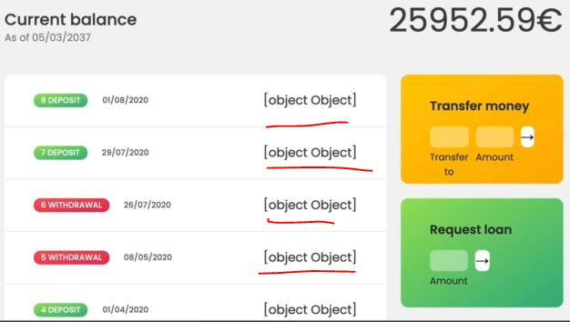

# Internationalizing Numbers (Intl)

- here we'll use `Intl.NumberFormat()` method of internationalization API to format numbers of our app 💡💡💡

- `about Intl.NumberFormat()` method :
    - this method takes two arguments
        - `1` : locale string (required)
        - `2` : options object (optional) 
    - & `Intl.NumberFormat().format()` : format() method takes only 1 argument i.e which thing we want to format 💡💡💡

## Example - of Internationalization API for numbers

- Eg 1 : formatting numbers through Internationalization Numbers
    ```js
    const num = 3884764.23

    console.log('US: ', new Intl.NumberFormat('en-US').format(num))
    // output : 3,884,764.23
    ```
    - so here commas are separators for easier reading

- Eg 2 : formatting numbers in germany & other countries & based on user's browser
    ```js
    const num = 3884764.23
    console.log('Germany: ', new Intl.NumberFormat('de-DE').format(num)) // output : 3.884.764,23 
    console.log('Syria: ', new Intl.NumberFormat('ar-SY').format(num)) // output : ٣٬٨٨٤٬٧٦٤٫٢٣ 
    console.log("User's Browser: ", navigator.language , new Intl.NumberFormat(navigator.language).format(num)) 
    // output : User's Browser:  en-US 3,884,764.23 
    ```

- Eg 3 : using second argument of Internationalization numbers i.e options object
    - to format Internationalization numbers , we have different keys & there values based on situation what we want <br>
        here we're dealing with normal numbers , so we'll have specific keys & there values inside options object 
    ```js
    const num = 3884764.23
    const options = {
        // we have different values for style -> key & for unit -> key also
        style: 'unit', 
            // for style key , we have different values i.e 'percent' , 'currency' & 'unit' that's it 💡💡💡
        unit: 'mile-per-hour' 
            // we have values of unit -> key like 'celsius' 
    }
    console.log('Germany: ', new Intl.NumberFormat('de-DE', options).format(num)) 
    // output : Germany:  3.884.764,23 mi/h  
    console.log('Syria: ', new Intl.NumberFormat('ar-SY', options).format(num)) 
    // output : Syria:  ٣٬٨٨٤٬٧٦٤٫٢٣ ميل/س 
    console.log("User's Browser: ", navigator.language , new Intl.NumberFormat(navigator.language, options).format(num)) 
    // output : User's Browser:  en-US 3,884,764.23 mph 
    ```
    - if we define value of style -> key as 'currency' then unit -> key will not work with currency <br>
        that's why we use currency -> key for currency style
    - `STEP 3.1` : using currency key & it's other related keys ✔️
        ```js
        const num = 3884764.23
        const options = {
            style: 'currency', 
            unit: 'mile-per-hour' ,
            currency: 'EUR' 
        }
        console.log('Germany: ', new Intl.NumberFormat('de-DE', options).format(num)) 
        // output : Germany:  3.884.764,23 € 
        console.log('Syria: ', new Intl.NumberFormat('ar-SY', options).format(num)) 
        // output : Syria:  ٣٬٨٨٤٬٧٦٤٫٢٣ € 
        console.log("User's Browser: ", navigator.language , new Intl.NumberFormat(navigator.language, options).format(num)) 
        // output : User's Browser:  en-US €3,884,764.23  
        ```
        - `useGrouping` key of options object , used to remove the separators like comma b/w numbers 💡💡💡
    - `STEP 3.2` : using useGrouping key ✔️
        ```js
        const num = 3884764.23
        const options = {
            style: 'currency', 
            unit: 'mile-per-hour' ,
            currency: 'EUR' ,
            useGrouping: false
        }
        console.log('US: ', new Intl.NumberFormat('en-US', options).format(num)) 
        // output : US:  €3884764.23 
        ```

- for more check documentation & now we'll format the money/currency which is movements by using internationalization API for numbers
- & now we have a lot of code , so in the real world , we split up all this code of 1 file into different files because it's messy 💡

## Starter code 

```js
const account1 = {
    owner: 'Jonas Schmedtmann',
    movements: [200, 450, -400, 3000, -650, -130, 70, 1300],
    interestRate: 1.2, // %
    pin: 1111,

    movementsDates: [
      '2019-11-18T21:31:17.178Z',
      '2019-12-23T07:42:02.383Z',
      '2020-01-28T09:15:04.904Z',
      '2020-04-01T10:17:24.185Z',
      '2020-05-08T14:11:59.604Z',
      '2020-07-26T17:01:17.194Z', 
      '2020-07-28T23:36:17.929Z', 
      '2020-08-01T10:51:36.790Z',
    ],
    currency: 'EUR',
    locale: 'pt-PT', // de-DE
};

const account2 = {
    owner: 'Jessica Davis',
    movements: [5000, 3400, -150, -790, -3210, -1000, 8500, -30],
    interestRate: 1.5,
    pin: 2222,

    movementsDates: [
      '2019-11-01T13:15:33.035Z',
      '2019-11-30T09:48:16.867Z',
      '2019-12-25T06:04:23.907Z',
      '2020-01-25T14:18:46.235Z',
      '2020-02-05T16:33:06.386Z',
      '2020-04-10T14:43:26.374Z',
      '2020-06-25T18:49:59.371Z',
      '2020-07-26T12:01:20.894Z',
    ],
    currency: 'USD',
    locale: 'en-US',
};

const account3 = {
    owner: 'Steven Thomas Williams',
    movements: [200, -200, 340, -300, -20, 50, 400, -460],
    interestRate: 0.7,
    pin: 3333,
};

const account4 = {
    owner: 'Sarah Smith',
    movements: [430, 1000, 700, 50, 90],
    interestRate: 1,
    pin: 4444,
};

const accounts = [account1, account2, account3, account4];

// Elements
const labelWelcome = document.querySelector('.welcome');
const labelDate = document.querySelector('.date');
const labelBalance = document.querySelector('.balance__value');
const labelSumIn = document.querySelector('.summary__value--in');
const labelSumOut = document.querySelector('.summary__value--out');
const labelSumInterest = document.querySelector('.summary__value--interest');
const labelTimer = document.querySelector('.timer');

const containerApp = document.querySelector('.app');
const containerMovements = document.querySelector('.movements');

const btnLogin = document.querySelector('.login__btn');
const btnTransfer = document.querySelector('.form__btn--transfer');
const btnLoan = document.querySelector('.form__btn--loan');
const btnClose = document.querySelector('.form__btn--close');
const btnSort = document.querySelector('.btn--sort');

const inputLoginUsername = document.querySelector('.login__input--user');
const inputLoginPin = document.querySelector('.login__input--pin');
const inputTransferTo = document.querySelector('.form__input--to');
const inputTransferAmount = document.querySelector('.form__input--amount');
const inputLoanAmount = document.querySelector('.form__input--loan-amount');
const inputCloseUsername = document.querySelector('.form__input--user');
const inputClosePin = document.querySelector('.form__input--pin');

const currencies = new Map([
  ['USD', 'United States dollar'],
  ['EUR', 'Euro'],
  ['GBP', 'Pound sterling'],
]);

const formatMovementDate = function(date, locale) {
    const calcDaysPassed = (date1, date2) => {
        return Math.round(Math.abs((date2 - date1) / (1000 * 60 * 60 * 24)))
    }

    const daysPassed = calcDaysPassed(new Date(), date)
    console.log(datePassed)

    if (daysPassed === 0) return 'Today' 
    if (daysPassed === 1) return 'Yesterday'
    if (daysPassed <= 7) return `${daysPassed} days ago`

    return new Intl.DateTimeFormat(locale).format(date)
}

const displayMovements = function(acc, sort = false) {
    containerMovements.innerHTML = ""

    const movs = sort ? acc.movements.slice().sort((a, b) => a - b) : acc.movements

    movs.forEach(function(mov, i) => {
        const type = mov > 0 ? 'deposit' : 'withdrawal'

        const date = new Date(acc.movementsDates[i]) 
        const displayDate = formatMovementDate(date, acc.locale)

        const html = `
            <div class="movements__row">
              <div class="movements__date">${displayDate}</div>
              <div class="movements__type movements__type--${type}">${i + 1} ${type}</div>
              <div class="movements__value">${mov}€</div>
            </div>
        `

        containerMovements.insertAdjacentHTML('afterbegin', html)
    })
}

const calcDisplayBalance = function(acc) {
    acc.balance = acc.reduce((acc , mov) => acc + mov, 0) 
    labelBalance.textContent = `${acc.balance}€`
}

const calcDisplaySummary = function(acc) {
    const incomes = acc.movements.filter(mov => mov > 0).reduce((acc, mov) => acc + mov, 0)
    labelSumIn.textContent = `${incomes}€`

    const out = acc.movements.filter(mov => mov < 0).reduce((acc , mov) => acc + mov, 0)
    labelSumOut.textContent = `${Math.abs(out)}€`

    const interest = acc.movements.filter(mov => mov > 0).map(deposit => {
        return (deposit * acc.interestRate)/100
      }).filter((int, i, arr) => {
          return int >= 1
      }).reduce((acc, int) => acc + int, 0)

    labelSumInterest.textContent = `${interest}€`
}

const createUsernames = function(accs) {
    accs.forEach(function(acc) {
        acc.username = acc.owner.toLowerCase().split(" ").map(name => name[0]).join('')
    })
}
createUsernames(accounts)

const updateUI = function(acc) {
    // display movements
    displayMovements(acc)
    // display balance
    calcDisplayBalance(acc) 
    // display summary
    calcDisplaySummary(acc)
}

let currentAccount ;

// Fake always logged in
currentAccount = account1 
updateUI(currentAccount)
containerApp.style.opacity = 100

btnLogin.addEventListener('click', e => {
    e.preventDefault() 

    currentAccount = accounts.find(acc => acc.username === inputLoginUsername.value)
    console.log(currentAccount)

    if (currentAccount?.pin === +inputLoginPin.value) {
        labelWelcome.textContent = `Welcome back, ${currentAccount.owner.split(" ")[0]}`
        containerApp.style.opacity = 100

        // Experiment of internationalization API
        const now = new Date()  
        const options = { 
            hour : 'numeric', 
            minute: 'numeric',
            day: 'numeric', 
            month: 'numeric', 
            year: 'numeric', 
        }
        labelDate.textContent = new Intl.DateTimeFormat(currentAccount.locale, options).format(now)

        inputLoginUsername.value = inputLoginPin.value = "" 
        inputLoginPin.blur()
        // update UI 
        updateUI(currentAccount) 
    }
})

btnTransfer.addEventListener('submit', function(e) {
    e.preventDefault()
    const amount = +inputTransferAmount.value 
    const receiverAcc = accounts.find(acc => acc.username === inputTransferTo.value)

    if (amount > 0 && 
        receiverAcc && 
        currentAmount.balance >= amount && 
        receiverAcc?.username !=== currentAccount.username) {
            // doing the transfer
            currentAccount.movements.push(-amount)
            receiverAcc.movements.push(amount)
            // add transfer date
            currentAccount.movementsDates.push(new Date().toISOString())
            receiverAccount.movementsDates.push(new Date().toISOString())
            // updateUI
            updateUI(currentAccount)
    }
})

btnLoan.addEventListener('submit', function(e) => {
    e.preventDefault()

    const amount = +inputLoanAmount.value

    if (amount > 0 && currentAccount.movements.some(mov => mov >= amount * 0.1)) {
        // add movement
        currentAccount.movements.push(amount)
        // Add loan date
        currentAccount.movementsDates.push(new Date().toISOString())
        // update UI
        updateUI(currentAccount)
    }

    inputLoanAmount.value = ""
})

btnClose.addEventListener('submit', function(e) => {
    e.preventDefault()

    if(inputCloseUsername.value === currentAccount.username && +inputClosePin.value === currentAccount.pin) {
        const index = accounts.findIndex(acc => acc.username === currentAccount.username)
        // Delete account
        accounts.splice(index, 1) 
        // Hide UI
        containerApp.style.opacity = 0
    }

    inputCloseUsername.value = inputClosePin.value = ''
})


let sorted = false
btnSort.addEventListener('click', function(e) {
    e.preventDefault()
    displayMovements(currentAccount.movements, !sorted) 
    sorted = !sorted
})
```

## Steps - to format the movements currency of our app

- `STEP 1` : using internationalization API to format the movements currency
    ```js
    const displayMovements = function(acc, sort = false) {
        containerMovements.innerHTML = ""

        const movs = sort ? acc.movements.slice().sort((a, b) => a - b) : acc.movements

        movs.forEach(function(mov, i) => {
            const type = mov > 0 ? 'deposit' : 'withdrawal'

            const date = new Date(acc.movementsDates[i]) 
            const displayDate = formatMovementDate(date, acc.locale)

            // we're creating a variable for formatting the movements currency 
                // so that we don't have to do all that formatting inside this template literals
            const formattedMov = new Intl.NumberFormat(acc.locale , { 
                style: 'currency', 
                currency: 'EURO'
            })

            const html = `
                <div class="movements__row">
                  <div class="movements__date">${displayDate}</div>
                  <div class="movements__type movements__type--${formattedMov}</div>
                  <div class="movements__value">${mov}€</div>
                </div>
            `

            containerMovements.insertAdjacentHTML('afterbegin', html)
        })
    }
    ```
    - checking output : before login to any account , we'll get a wrong output like this 
        
        - because we didn't called `format()` method which is used to tell which thing we want to format
    - `STEP 1.1` : using `format()` method of internationalization number API to format the numbers
        ```js
        const displayMovements = function(acc, sort = false) {
            containerMovements.innerHTML = ""

            const movs = sort ? acc.movements.slice().sort((a, b) => a - b) : acc.movements

            movs.forEach(function(mov, i) => {
                const type = mov > 0 ? 'deposit' : 'withdrawal'

                const date = new Date(acc.movementsDates[i]) 
                const displayDate = formatMovementDate(date, acc.locale)

                const formattedMov = new Intl.NumberFormat(acc.locale , { 
                    style: 'currency', 
                    currency: 'EURO'
                }).format(mov)

                const html = `
                    <div class="movements__row">
                      <div class="movements__date">${displayDate}</div>
                      <div class="movements__type movements__type--${formattedMov}</div>
                      <div class="movements__value">${mov}€</div>
                    </div>
                `

                containerMovements.insertAdjacentHTML('afterbegin', html)
            })
        }
        ```
        - checking output : before login to any account , we'll get a correct output
            - but when we login as jonas , then we'll get currency as US dollar but number is in portuguese like this 
            
            - because we used the locale string based on the current user's login
    - now let's get the locale currency based on the current user's login
    - `STEP 1.2` : also getting locale currency based on the current user's login
        ```js
        const displayMovements = function(acc, sort = false) {
            containerMovements.innerHTML = ""

            const movs = sort ? acc.movements.slice().sort((a, b) => a - b) : acc.movements

            movs.forEach(function(mov, i) => {
                const type = mov > 0 ? 'deposit' : 'withdrawal'

                const date = new Date(acc.movementsDates[i]) 
                const displayDate = formatMovementDate(date, acc.locale)

                const formattedMov = new Intl.NumberFormat(acc.locale , { 
                    style: 'currency', 
                    currency: acc.currency
                }).format(mov)

                const html = `
                    <div class="movements__row">
                      <div class="movements__date">${displayDate}</div>
                      <div class="movements__type movements__type--${formattedMov}</div>
                      <div class="movements__value">${mov}€</div>
                    </div>
                `

                containerMovements.insertAdjacentHTML('afterbegin', html)
            })
        }
        ```
        - checking output : now both number & currency will be formatted based on user's login
    
- now we also have currency in other places like current balance & in summary section
- `STEP 2` : formatting the currency & currency numbers based on the user's login account
    - copy this line code 
        ```
        const formattedMov = new Intl.NumberFormat(acc.locale , { 
            style: 'currency', 
            currency: acc.currency
        }).format(mov)
        ```
    - & paste it inside these code
    ```js
    const calcDisplayBalance = function(acc) {
        acc.balance = acc.reduce((acc , mov) => acc + mov, 0) 
        labelBalance.textContent = `${acc.balance}€`
    }

    const calcDisplaySummary = function(acc) {
        const incomes = acc.movements.filter(mov => mov > 0).reduce((acc, mov) => acc + mov, 0)
        labelSumIn.textContent = `${incomes}€`

        const out = acc.movements.filter(mov => mov < 0).reduce((acc , mov) => acc + mov, 0)
        labelSumOut.textContent = `${Math.abs(out)}€`

        const interest = acc.movements.filter(mov => mov > 0).map(deposit => {
            return (deposit * acc.interestRate)/100
          }).filter((int, i, arr) => {
              return int >= 1
          }).reduce((acc, int) => acc + int, 0)

        labelSumInterest.textContent = `${interest}€`
    }
    ```
    - but it's not a good practice because we're repeating & not following DRY principle , <br>
        so create a function for formatting the currencies
    - `STEP 2.1` : creating a global function for formatting the currencies
        ```js
        // for formatting the currencies
            // here we passed all the values based on user's account instead of passing whole account object
            // so we're making this function as less dependent on the other data 💡💡💡
                // means this function can take any value , any locale , any currency 
                // & this function is not dependent on other data 💡💡💡
        const formatCur = function(value, locale, currency) {
            return new Intl.NumberFormat(locale , { 
                style: 'currency', 
                currency: currency
            }).format(value)
        }

        const displayMovements = function(acc, sort = false) {
            containerMovements.innerHTML = ""

            const movs = sort ? acc.movements.slice().sort((a, b) => a - b) : acc.movements

            movs.forEach(function(mov, i) => {
                const type = mov > 0 ? 'deposit' : 'withdrawal'

                const date = new Date(acc.movementsDates[i]) 
                const displayDate = formatMovementDate(date, acc.locale)

                const formattedMov = formatCur(mov, acc.locale, acc.currency)

                const html = `
                    <div class="movements__row">
                      <div class="movements__date">${displayDate}</div>
                      <div class="movements__type movements__type--${formattedMov}</div>
                      <div class="movements__value">${mov}€</div>
                    </div>
                `

                containerMovements.insertAdjacentHTML('afterbegin', html)
            })
        }

        const calcDisplayBalance = function(acc) {
            acc.balance = acc.reduce((acc , mov) => acc + mov, 0) 
            labelBalance.textContent = formatCur(acc.balance, acc.locale, acc.currency)
        }

        const calcDisplaySummary = function(acc) {
            const incomes = acc.movements.filter(mov => mov > 0).reduce((acc, mov) => acc + mov, 0)
            labelSumIn.textContent = formatCur(incomes, acc.locale, acc.currency)

            const out = acc.movements.filter(mov => mov < 0).reduce((acc , mov) => acc + mov, 0)
            labelSumOut.textContent = formatCur(Math.abs(out), acc.locale, acc.currency)

            const interest = acc.movements.filter(mov => mov > 0).map(deposit => {
                return (deposit * acc.interestRate)/100
              }).filter((int, i, arr) => {
                  return int >= 1
              }).reduce((acc, int) => acc + int, 0)

            labelSumInterest.textContent = formatCur(interest, acc.locale, acc.currency)
        }
        ```
        - checking output : when we login as jonas 
            - then both current balance & summary will be formatted based on this user account 
            - & same work with other user's account

- there any many thing which we can do cool stuff with internationalization API 😱
