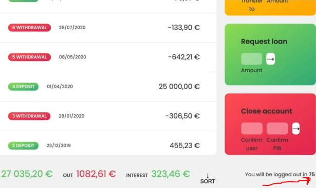

# Implementing a Countdown Timer

- in Real life , for security reasons , real bank applications will log out users after some inactive time
    - for Eg : after 5 minutes without doing anything

- look at the flow chart because timer appears in multiple places
    - `1` : inside our UI , so whenever the user logs in the lockout timer will start or restart 
    - `2` : when user remove/delete/close the account then logout timer expires (which will be after 5 or 10 minutes) 
        - then we want to lock the user out 

## Starter code 

```js
const account1 = {
    owner: 'Jonas Schmedtmann',
    movements: [200, 450, -400, 3000, -650, -130, 70, 1300],
    interestRate: 1.2, // %
    pin: 1111,

    movementsDates: [
      '2019-11-18T21:31:17.178Z',
      '2019-12-23T07:42:02.383Z',
      '2020-01-28T09:15:04.904Z',
      '2020-04-01T10:17:24.185Z',
      '2020-05-08T14:11:59.604Z',
      '2020-07-26T17:01:17.194Z', 
      '2020-07-28T23:36:17.929Z', 
      '2020-08-01T10:51:36.790Z',
    ],
    currency: 'EUR',
    locale: 'pt-PT', // de-DE
};

const account2 = {
    owner: 'Jessica Davis',
    movements: [5000, 3400, -150, -790, -3210, -1000, 8500, -30],
    interestRate: 1.5,
    pin: 2222,

    movementsDates: [
      '2019-11-01T13:15:33.035Z',
      '2019-11-30T09:48:16.867Z',
      '2019-12-25T06:04:23.907Z',
      '2020-01-25T14:18:46.235Z',
      '2020-02-05T16:33:06.386Z',
      '2020-04-10T14:43:26.374Z',
      '2020-06-25T18:49:59.371Z',
      '2020-07-26T12:01:20.894Z',
    ],
    currency: 'USD',
    locale: 'en-US',
};

const account3 = {
    owner: 'Steven Thomas Williams',
    movements: [200, -200, 340, -300, -20, 50, 400, -460],
    interestRate: 0.7,
    pin: 3333,
};

const account4 = {
    owner: 'Sarah Smith',
    movements: [430, 1000, 700, 50, 90],
    interestRate: 1,
    pin: 4444,
};

const accounts = [account1, account2, account3, account4];

// Elements
const labelWelcome = document.querySelector('.welcome');
const labelDate = document.querySelector('.date');
const labelBalance = document.querySelector('.balance__value');
const labelSumIn = document.querySelector('.summary__value--in');
const labelSumOut = document.querySelector('.summary__value--out');
const labelSumInterest = document.querySelector('.summary__value--interest');
const labelTimer = document.querySelector('.timer');

const containerApp = document.querySelector('.app');
const containerMovements = document.querySelector('.movements');

const btnLogin = document.querySelector('.login__btn');
const btnTransfer = document.querySelector('.form__btn--transfer');
const btnLoan = document.querySelector('.form__btn--loan');
const btnClose = document.querySelector('.form__btn--close');
const btnSort = document.querySelector('.btn--sort');

const inputLoginUsername = document.querySelector('.login__input--user');
const inputLoginPin = document.querySelector('.login__input--pin');
const inputTransferTo = document.querySelector('.form__input--to');
const inputTransferAmount = document.querySelector('.form__input--amount');
const inputLoanAmount = document.querySelector('.form__input--loan-amount');
const inputCloseUsername = document.querySelector('.form__input--user');
const inputClosePin = document.querySelector('.form__input--pin');

const currencies = new Map([
  ['USD', 'United States dollar'],
  ['EUR', 'Euro'],
  ['GBP', 'Pound sterling'],
]);

const formatMovementDate = function(date, locale) {
    const calcDaysPassed = (date1, date2) => {
        return Math.round(Math.abs((date2 - date1) / (1000 * 60 * 60 * 24)))
    }

    const daysPassed = calcDaysPassed(new Date(), date)
    console.log(datePassed)

    if (daysPassed === 0) return 'Today' 
    if (daysPassed === 1) return 'Yesterday'
    if (daysPassed <= 7) return `${daysPassed} days ago`

    return new Intl.DateTimeFormat(locale).format(date)
}

const formatCur = function(value, locale, currency) {
    return new Intl.NumberFormat(locale , { 
        style: 'currency', 
        currency: currency
    }).format(value)
}

const displayMovements = function(acc, sort = false) {
    containerMovements.innerHTML = ""

    const movs = sort ? acc.movements.slice().sort((a, b) => a - b) : acc.movements

    movs.forEach(function(mov, i) => {
        const type = mov > 0 ? 'deposit' : 'withdrawal'

        const date = new Date(acc.movementsDates[i]) 
        const displayDate = formatMovementDate(date, acc.locale)

        const formattedMov = formatCur(mov, acc.locale, acc.currency)

        const html = `
            <div class="movements__row">
              <div class="movements__date">${displayDate}</div>
              <div class="movements__type movements__type--${formattedMov}</div>
              <div class="movements__value">${mov}€</div>
            </div>
        `

        containerMovements.insertAdjacentHTML('afterbegin', html)
    })
}

const calcDisplayBalance = function(acc) {
    acc.balance = acc.reduce((acc , mov) => acc + mov, 0) 
    labelBalance.textContent = formatCur(acc.balance, acc.locale, acc.currency)
}

const calcDisplaySummary = function(acc) {
    const incomes = acc.movements.filter(mov => mov > 0).reduce((acc, mov) => acc + mov, 0)
    labelSumIn.textContent = formatCur(incomes, acc.locale, acc.currency)

    const out = acc.movements.filter(mov => mov < 0).reduce((acc , mov) => acc + mov, 0)
    labelSumOut.textContent = formatCur(Math.abs(out), acc.locale, acc.currency)

    const interest = acc.movements.filter(mov => mov > 0).map(deposit => {
        return (deposit * acc.interestRate)/100
      }).filter((int, i, arr) => {
          return int >= 1
      }).reduce((acc, int) => acc + int, 0)

    labelSumInterest.textContent = formatCur(interest, acc.locale, acc.currency)
}

const createUsernames = function(accs) {
    accs.forEach(function(acc) {
        acc.username = acc.owner.toLowerCase().split(" ").map(name => name[0]).join('')
    })
}
createUsernames(accounts)

const updateUI = function(acc) {
    // display movements
    displayMovements(acc)
    // display balance
    calcDisplayBalance(acc) 
    // display summary
    calcDisplaySummary(acc)
}

let currentAccount ;

// Fake always logged in
currentAccount = account1 
updateUI(currentAccount)
containerApp.style.opacity = 100

btnLogin.addEventListener('click', e => {
    e.preventDefault() 

    currentAccount = accounts.find(acc => acc.username === inputLoginUsername.value)
    console.log(currentAccount)

    if (currentAccount?.pin === +inputLoginPin.value) {
        labelWelcome.textContent = `Welcome back, ${currentAccount.owner.split(" ")[0]}`
        containerApp.style.opacity = 100

        // Experiment of internationalization API
        const now = new Date()  
        const options = { 
            hour : 'numeric', 
            minute: 'numeric',
            day: 'numeric', 
            month: 'numeric', 
            year: 'numeric', 
        }
        labelDate.textContent = new Intl.DateTimeFormat(currentAccount.locale, options).format(now)

        inputLoginUsername.value = inputLoginPin.value = "" 
        inputLoginPin.blur()
        // update UI 
        updateUI(currentAccount) 
    }
})

btnTransfer.addEventListener('submit', function(e) {
    e.preventDefault()
    const amount = +inputTransferAmount.value 
    const receiverAcc = accounts.find(acc => acc.username === inputTransferTo.value)

    if (amount > 0 && 
        receiverAcc && 
        currentAmount.balance >= amount && 
        receiverAcc?.username !=== currentAccount.username) {
            // doing the transfer
            currentAccount.movements.push(-amount)
            receiverAcc.movements.push(amount)
            // add transfer date
            currentAccount.movementsDates.push(new Date().toISOString())
            receiverAccount.movementsDates.push(new Date().toISOString())
            // updateUI
            updateUI(currentAccount)
    }
})

btnLoan.addEventListener('submit', function(e) => {
    e.preventDefault()

    const amount = +inputLoanAmount.value

    if (amount > 0 && currentAccount.movements.some(mov => mov >= amount * 0.1)) {
        setTimeout(function() {
            // add movement
            currentAccount.movements.push(amount)
            // Add loan date
            currentAccount.movementsDates.push(new Date().toISOString())
            // update UI
            updateUI(currentAccount)
        }, 2500)
    }

    inputLoanAmount.value = ""
})

btnClose.addEventListener('submit', function(e) => {
    e.preventDefault()

    if(inputCloseUsername.value === currentAccount.username && +inputClosePin.value === currentAccount.pin) {
        const index = accounts.findIndex(acc => acc.username === currentAccount.username)
        // Delete account
        accounts.splice(index, 1) 
        // Hide UI
        containerApp.style.opacity = 0
    }

    inputCloseUsername.value = inputClosePin.value = ''
})


let sorted = false
btnSort.addEventListener('click', function(e) {
    e.preventDefault()
    displayMovements(currentAccount.movements, !sorted) 
    sorted = !sorted
})
```

## Steps - to implement timer (when user login & when user delete his own account)

- `STEP 1` : creating a separate function for logout timer in global scope because in btnLogin we have plenty of code 
    ```js
    const updateUI = function(acc) {
        // display movements
        displayMovements(acc)
        // display balance
        calcDisplayBalance(acc) 
        // display summary
        calcDisplaySummary(acc)
    }

    const startLogOutTimer = function() {
        // pseudo code to export some functionality into an external function
        // 1 - set time to 5 minutes
        // 2 - call the timer every seconds
        // 3 - in each callback call , print the remaining time to UI
        // 4 - when 0 seconds , stop timer & log out user
    }

    let currentAccount ;

    // Fake always logged in
    currentAccount = account1 
    updateUI(currentAccount)
    containerApp.style.opacity = 100

    btnLogin.addEventListener('click', e => {
        e.preventDefault() 

        currentAccount = accounts.find(acc => acc.username === inputLoginUsername.value)
        console.log(currentAccount)

        if (currentAccount?.pin === +inputLoginPin.value) {
            labelWelcome.textContent = `Welcome back, ${currentAccount.owner.split(" ")[0]}`
            containerApp.style.opacity = 100

            // Experiment of internationalization API
            const now = new Date()  
            const options = { 
                hour : 'numeric', 
                minute: 'numeric',
                day: 'numeric', 
                month: 'numeric', 
                year: 'numeric', 
            }
            labelDate.textContent = new Intl.DateTimeFormat(currentAccount.locale, options).format(now)

            inputLoginUsername.value = inputLoginPin.value = "" 
            inputLoginPin.blur()
            // update UI 
            updateUI(currentAccount) 
        }
    })
    ```
    - checking output : in working application , when user login then a timer starts from 10 min & goes to 0
        - & then timer reach to 0 second then automatically user logged out from his account 💡💡💡
    - `STEP 1.1` : working on startLogOutTimer() function
        ```js
        const updateUI = function(acc) {
            // display movements
            displayMovements(acc)
            // display balance
            calcDisplayBalance(acc) 
            // display summary
            calcDisplaySummary(acc)
        }

        const startLogOutTimer = function() {
            // 1 - set time to 5 minutes
            let time = 100
            // 2 - call the timer every seconds
            setInterval(function() {
                // 3 - in each callback call , print the remaining time to UI
                labelTimer.textContent = time

                // 3.1 - decrease the timer by 1
                timer-- // OR timer = timer - 1 // OR timer -= 1

                // 4 - when 0 seconds , stop timer & log out user
            }, 1000)
        }

        let currentAccount ;

        // Fake always logged in
        currentAccount = account1 
        updateUI(currentAccount)
        containerApp.style.opacity = 100

        btnLogin.addEventListener('click', e => {
            e.preventDefault() 

            currentAccount = accounts.find(acc => acc.username === inputLoginUsername.value)
            console.log(currentAccount)

            if (currentAccount?.pin === +inputLoginPin.value) {
                labelWelcome.textContent = `Welcome back, ${currentAccount.owner.split(" ")[0]}`
                containerApp.style.opacity = 100

                // Experiment of internationalization API
                const now = new Date()  
                const options = { 
                    hour : 'numeric', 
                    minute: 'numeric',
                    day: 'numeric', 
                    month: 'numeric', 
                    year: 'numeric', 
                }
                labelDate.textContent = new Intl.DateTimeFormat(currentAccount.locale, options).format(now)

                inputLoginUsername.value = inputLoginPin.value = "" 
                inputLoginPin.blur()

                // before updating UI , we called startLogOutTimer() timer 
                startLogOutTimer()

                // update UI 
                updateUI(currentAccount) 
            }
        })
        ```
        - checking output : login as jonas 
            - & we'll get timer in decreasing order i.e from 100 to 0
                
        - now we don't want to see only seconds means we also want minutes

- `STEP 2` : implementing minute for timer
    ```js
    const updateUI = function(acc) {
        // display movements
        displayMovements(acc)
        // display balance
        calcDisplayBalance(acc) 
        // display summary
        calcDisplaySummary(acc)
    }

    const startLogOutTimer = function() {
        // 1 - set time to 5 minutes
        let time = 100
        // 2 - call the timer every seconds
        setInterval(function() {
            const min = time / 60

            // 3 - in each callback call , print the remaining time to UI
            labelTimer.textContent = min
            // 3.1 - decrease the timer by 1
            timer-- 

            // 4 - when 0 seconds , stop timer & log out user
        }, 1000)
    }

    let currentAccount ;

    // Fake always logged in
    currentAccount = account1 
    updateUI(currentAccount)
    containerApp.style.opacity = 100

    btnLogin.addEventListener('click', e => {
        e.preventDefault() 

        currentAccount = accounts.find(acc => acc.username === inputLoginUsername.value)
        console.log(currentAccount)

        if (currentAccount?.pin === +inputLoginPin.value) {
            labelWelcome.textContent = `Welcome back, ${currentAccount.owner.split(" ")[0]}`
            containerApp.style.opacity = 100

            // Experiment of internationalization API
            const now = new Date()  
            const options = { 
                hour : 'numeric', 
                minute: 'numeric',
                day: 'numeric', 
                month: 'numeric', 
                year: 'numeric', 
            }
            labelDate.textContent = new Intl.DateTimeFormat(currentAccount.locale, options).format(now)

            inputLoginUsername.value = inputLoginPin.value = "" 
            inputLoginPin.blur()

            // before updating UI , we called startLogOutTimer() timer 
            startLogOutTimer()
            // update UI 
            updateUI(currentAccount) 
        }
    })
    ```
    - but one problem is when timer becomes 0 then seconds are going in negative , so we need to stop at 0 <br>
        so this we'll do later on , first implement the minute
    - checking output : login as jonas then we'll get minute in decimal point  
    - `STEP 2.1` : implementing seconds with minute in timer
        ```js
        const updateUI = function(acc) {
            // display movements
            displayMovements(acc)
            // display balance
            calcDisplayBalance(acc) 
            // display summary
            calcDisplaySummary(acc)
        }

        const startLogOutTimer = function() {
            // 1 - set time to 5 minutes
            let time = 100
            // 2 - call the timer every seconds
            setInterval(function() {
                const min = time / 60 // when we do 100 / 60 then we'll get 1.666666666666667
                const sec = time % 60 // when we do 100 % 60 then we'll get 40 because 60 + 40 = 100

                // 3 - in each callback call , print the remaining time to UI
                labelTimer.textContent = `${min}:${sec}`
                // 3.1 - decrease the timer by 1
                timer-- 

                // 4 - when 0 seconds , stop timer & log out user
            }, 1000)
        }

        let currentAccount ;

        // Fake always logged in
        currentAccount = account1 
        updateUI(currentAccount)
        containerApp.style.opacity = 100

        btnLogin.addEventListener('click', e => {
            e.preventDefault() 

            currentAccount = accounts.find(acc => acc.username === inputLoginUsername.value)
            console.log(currentAccount)

            if (currentAccount?.pin === +inputLoginPin.value) {
                labelWelcome.textContent = `Welcome back, ${currentAccount.owner.split(" ")[0]}`
                containerApp.style.opacity = 100

                // Experiment of internationalization API
                const now = new Date()  
                const options = { 
                    hour : 'numeric', 
                    minute: 'numeric',
                    day: 'numeric', 
                    month: 'numeric', 
                    year: 'numeric', 
                }
                labelDate.textContent = new Intl.DateTimeFormat(currentAccount.locale, options).format(now)

                inputLoginUsername.value = inputLoginPin.value = "" 
                inputLoginPin.blur()

                // before updating UI , we called startLogOutTimer() timer 
                startLogOutTimer()
                // update UI 
                updateUI(currentAccount) 
            }
        })
        ```
        - checking output : login as jonas , then we'll get timer in decimal point which we don't want 
    - `STEP 2.2` : removing decimal part from minute & seconds of timer 
        ```js
        const updateUI = function(acc) {
            // display movements
            displayMovements(acc)
            // display balance
            calcDisplayBalance(acc) 
            // display summary
            calcDisplaySummary(acc)
        }

        const startLogOutTimer = function() {
            // 1 - set time to 5 minutes
            let time = 100
            // 2 - call the timer every seconds
            setInterval(function() {
                    // removing decimal part & using padStart() string method 
                        // to add 0 (zero) if we have one digit number
                    // using String() constructor function to convert into string , 
                        // so that we can use padStart() string method 💡💡💡
                const min = String(Math.trunc(time / 60)).padStart(2, '0') 
                const sec = String(Math.trunc(time % 60)).padStart(2, '0')

                // 3 - in each callback call , print the remaining time to UI
                labelTimer.textContent = `${min}:${sec}`
                // 3.1 - decrease the timer by 1
                timer-- 

                // 4 - when 0 seconds , stop timer & log out user
            }, 1000)
        }

        let currentAccount ;

        // Fake always logged in
        currentAccount = account1 
        updateUI(currentAccount)
        containerApp.style.opacity = 100

        btnLogin.addEventListener('click', e => {
            e.preventDefault() 

            currentAccount = accounts.find(acc => acc.username === inputLoginUsername.value)
            console.log(currentAccount)

            if (currentAccount?.pin === +inputLoginPin.value) {
                labelWelcome.textContent = `Welcome back, ${currentAccount.owner.split(" ")[0]}`
                containerApp.style.opacity = 100

                // Experiment of internationalization API
                const now = new Date()  
                const options = { 
                    hour : 'numeric', 
                    minute: 'numeric',
                    day: 'numeric', 
                    month: 'numeric', 
                    year: 'numeric', 
                }
                labelDate.textContent = new Intl.DateTimeFormat(currentAccount.locale, options).format(now)

                inputLoginUsername.value = inputLoginPin.value = "" 
                inputLoginPin.blur()

                // before updating UI , we called startLogOutTimer() timer 
                startLogOutTimer()
                // update UI 
                updateUI(currentAccount) 
            }
        })
        ```
        - checking output : login as jonas & then we'll get proper minute & seconds of timer 

- `STEP 3` : clearing/removing the timer when it reaches to 0 & setting re-login dashboard & set opacity 0
    ```js
    const updateUI = function(acc) {
        // display movements
        displayMovements(acc)
        // display balance
        calcDisplayBalance(acc) 
        // display summary
        calcDisplaySummary(acc)
    }

    const startLogOutTimer = function() {
        // 1 - set time to 5 minutes
        let time = 100
        // 2 - call the timer every seconds
        setInterval(function() {
            const min = String(Math.trunc(time / 60)).padStart(2, '0') 
            const sec = String(Math.trunc(time % 60)).padStart(2, '0')

            // 3 - in each callback call , print the remaining time to UI
            labelTimer.textContent = `${min}:${sec}`
            // 3.1 - decrease the timer by 1
            timer-- 

            // 4 - when 0 seconds , stop timer & log out user
            if (time === 0) {
                clearInterval(timer)
                // then show the re-login dashboard & set opacity 0
                labelWelcome.textContent = 'Log in to get started'
                containerApp.style.opacity = 0
            }
        }, 1000)
    }

    let currentAccount ;

    // Fake always logged in
    // currentAccount = account1 
    // updateUI(currentAccount)
    // containerApp.style.opacity = 100
        // here we hided the fake login

    btnLogin.addEventListener('click', e => {
        e.preventDefault() 

        currentAccount = accounts.find(acc => acc.username === inputLoginUsername.value)
        console.log(currentAccount)

        if (currentAccount?.pin === +inputLoginPin.value) {
            labelWelcome.textContent = `Welcome back, ${currentAccount.owner.split(" ")[0]}`
            containerApp.style.opacity = 100

            // Experiment of internationalization API
            const now = new Date()  
            const options = { 
                hour : 'numeric', 
                minute: 'numeric',
                day: 'numeric', 
                month: 'numeric', 
                year: 'numeric', 
            }
            labelDate.textContent = new Intl.DateTimeFormat(currentAccount.locale, options).format(now)

            inputLoginUsername.value = inputLoginPin.value = "" 
            inputLoginPin.blur()

            // before updating UI , we called startLogOutTimer() timer 
            startLogOutTimer()
            // update UI 
            updateUI(currentAccount) 
        }
    })
    ```
    - checking output : we login as jonas 
        - & then timer comes at 0 then login dashboard will come & UI will get hidden
        - but here's the problem i.e when we re-login then scroll down immediately then we'll see we had 00:01 <br> 
            because that callback function argument of setInterval() function is only first executed after 1 second <br>
            means that callback function argument (of setInterval() function) is not called immediately 
            & that callback function argument will only get called after 1 second but we want to call it immediately 💡💡💡
        - so just create a separate function & then pass that function as callback function argument in setInterval() 💡💡💡
    - `STEP 3.1` : creating a separate function & then passing that function as callback function argument in setInterval()
        - to call that function immediately
        ```js
        const updateUI = function(acc) {
            // display movements
            displayMovements(acc)
            // display balance
            calcDisplayBalance(acc) 
            // display summary
            calcDisplaySummary(acc)
        }

        const startLogOutTimer = function() {
            const tick = function() {
                const min = String(Math.trunc(time / 60)).padStart(2, '0') 
                const sec = String(Math.trunc(time % 60)).padStart(2, '0')

                // 3 - in each callback call , print the remaining time to UI
                labelTimer.textContent = `${min}:${sec}`
                // 3.1 - decrease the timer by 1
                timer-- 

                // 4 - when 0 seconds , stop timer & log out user
                if (time === 0) {
                    clearInterval(timer)
                    // then show the re-login dashboard & set opacity 0
                    labelWelcome.textContent = 'Log in to get started'
                    containerApp.style.opacity = 0
                }
            }

            // 1 - set time to 5 minutes
            let time = 10
            // 2 - call the timer every seconds
            tick()
            setInterval(tick, 1000)
        }

        let currentAccount ;

        btnLogin.addEventListener('click', e => {
            e.preventDefault() 

            currentAccount = accounts.find(acc => acc.username === inputLoginUsername.value)
            console.log(currentAccount)

            if (currentAccount?.pin === +inputLoginPin.value) {
                labelWelcome.textContent = `Welcome back, ${currentAccount.owner.split(" ")[0]}`
                containerApp.style.opacity = 100

                // Experiment of internationalization API
                const now = new Date()  
                const options = { 
                    hour : 'numeric', 
                    minute: 'numeric',
                    day: 'numeric', 
                    month: 'numeric', 
                    year: 'numeric', 
                }
                labelDate.textContent = new Intl.DateTimeFormat(currentAccount.locale, options).format(now)

                inputLoginUsername.value = inputLoginPin.value = "" 
                inputLoginPin.blur()
                // before updating UI , we called startLogOutTimer() timer 
                startLogOutTimer()
                // update UI 
                updateUI(currentAccount) 
            }
        })
        ```
        - checking output : login as jonas 
            - & then we don't see that after 1second timer starts the setInterval()
            - now timer starts from 10 seconds to 0
            - but again one problem that when we reach at 1 second then we logged out <br>
                but we want to logout immediately at 0 , so just put `time--` after that `if (time===0)` statement 
    - `STEP 3.2` : putting time-- after that `if (time===0)` statement
        ```js
        const updateUI = function(acc) {
            // display movements
            displayMovements(acc)
            // display balance
            calcDisplayBalance(acc) 
            // display summary
            calcDisplaySummary(acc)
        }

        const startLogOutTimer = function() {
            const tick = function() {
                const min = String(Math.trunc(time / 60)).padStart(2, '0') 
                const sec = String(Math.trunc(time % 60)).padStart(2, '0')

                // 3 - in each callback call , print the remaining time to UI
                labelTimer.textContent = `${min}:${sec}`

                // 4 - when 0 seconds , stop timer & log out user
                if (time === 0) {
                    clearInterval(timer)
                    // then show the re-login dashboard & set opacity 0
                    labelWelcome.textContent = 'Log in to get started'
                    containerApp.style.opacity = 0
                }

                // 4.1 - decrease the timer by 1
                timer-- 
            }

            // 1 - set time to 5 minutes
            let time = 10
            // 2 - call the timer every seconds
            tick()
            setInterval(tick, 1000)
        }

        let currentAccount ;

        btnLogin.addEventListener('click', e => {
            e.preventDefault() 

            currentAccount = accounts.find(acc => acc.username === inputLoginUsername.value)
            console.log(currentAccount)

            if (currentAccount?.pin === +inputLoginPin.value) {
                labelWelcome.textContent = `Welcome back, ${currentAccount.owner.split(" ")[0]}`
                containerApp.style.opacity = 100

                // Experiment of internationalization API
                const now = new Date()  
                const options = { 
                    hour : 'numeric', 
                    minute: 'numeric',
                    day: 'numeric', 
                    month: 'numeric', 
                    year: 'numeric', 
                }
                labelDate.textContent = new Intl.DateTimeFormat(currentAccount.locale, options).format(now)

                inputLoginUsername.value = inputLoginPin.value = "" 
                inputLoginPin.blur()
                // before updating UI , we called startLogOutTimer() timer 
                startLogOutTimer()
                // update UI 
                updateUI(currentAccount) 
            }
        })
        ```
        - checking output : login as jonas & then logout only happen on 0second 
            - but when we increase the value of time as 30 like this `let time = 30` <br>
                then we'll get two times at the same time because we're running two timers at the same time <br>
                one timer is jonas & one timer is jessica account
            - to fix this problem , so whenever a user login then we check if there is already a timer running <br>
                & if so , then we stop that timer 💡💡💡
    - `STEP 3.3` : stopping two timers of different user's account which are running simultaneously
        ```js
        const updateUI = function(acc) {
            // display movements
            displayMovements(acc)
            // display balance
            calcDisplayBalance(acc) 
            // display summary
            calcDisplaySummary(acc)
        }

        const startLogOutTimer = function() {
            const tick = function() {
                const min = String(Math.trunc(time / 60)).padStart(2, '0') 
                const sec = String(Math.trunc(time % 60)).padStart(2, '0')
                // 3 - in each callback call , print the remaining time to UI
                labelTimer.textContent = `${min}:${sec}`
                // 4 - when 0 seconds , stop timer & log out user
                if (time === 0) {
                    clearInterval(timer)
                    labelWelcome.textContent = 'Log in to get started'
                    containerApp.style.opacity = 0
                }
                // 4.1 - decrease the timer by 1
                timer-- 
            }
            // 1 - set time to 5 minutes
            let time = 10
            // 2 - call the timer every seconds
            tick()
            setInterval(tick, 1000)
            return timer
        }

        let currentAccount , timer ; 
            // here we created 'timer' variable to persist b/w different logins account
                // otherwise after this btnLogin.addEventListener() would be ready then the timer variable would disappear
                // that's why we created the currentAccount & timer variables 
                    // because this is the only way in which we can actually check if it appears 💡💡💡

        btnLogin.addEventListener('click', e => {
            e.preventDefault() 

            currentAccount = accounts.find(acc => acc.username === inputLoginUsername.value)
            console.log(currentAccount)

            if (currentAccount?.pin === +inputLoginPin.value) {
                labelWelcome.textContent = `Welcome back, ${currentAccount.owner.split(" ")[0]}`
                containerApp.style.opacity = 100

                // Experiment of internationalization API
                const now = new Date()  
                const options = { 
                    hour : 'numeric', 
                    minute: 'numeric',
                    day: 'numeric', 
                    month: 'numeric', 
                    year: 'numeric', 
                }
                labelDate.textContent = new Intl.DateTimeFormat(currentAccount.locale, options).format(now)

                inputLoginUsername.value = inputLoginPin.value = "" 
                inputLoginPin.blur()

                // before updating UI , we called startLogOutTimer() timer 
                if (timer) clearInterval(timer)
                timer = startLogOutTimer() 
                    // set the value of timer which is returned , However , if there's already a timer
                        // then first need to clear the previous timer & reset the timer as new 
                
                // update UI 
                updateUI(currentAccount) 
            }
        })
        ```
        - checking output : we login as jonas
            - then timer will start from 10 to 0 seconds
            - but when we login as jessica , then our timer already exist , so that previous timer will be removed <br>
                so again that timer will start as new , so basically we're calling startLogOutTimer() function <br>
                for each account separately

- we want another functionality that reset the timer when we do something in the account like transferring , request loan , etc
    - because it'll yet whatever we did is logout when user is not doing anything <br>
        but if we do like transfer money then we don't want to logout means timer should be reset
    - so we want to reset the timer whenever the user does a transfer or request a loan <br>
        so these are two activities we want in our application 
- `STEP 4` : resetting the timer if user do any activities like transfer or request a loan 
    ```js
    const updateUI = function(acc) {
        // display movements
        displayMovements(acc)
        // display balance
        calcDisplayBalance(acc) 
        // display summary
        calcDisplaySummary(acc)
    }

    const startLogOutTimer = function() {
        const tick = function() {
            const min = String(Math.trunc(time / 60)).padStart(2, '0') 
            const sec = String(Math.trunc(time % 60)).padStart(2, '0')
            // 3 - in each callback call , print the remaining time to UI
            labelTimer.textContent = `${min}:${sec}`
            // 4 - when 0 seconds , stop timer & log out user
            if (time === 0) {
                clearInterval(timer)
                labelWelcome.textContent = 'Log in to get started'
                containerApp.style.opacity = 0
            }
            // 4.1 - decrease the timer by 1
            timer-- 
        }
        // 1 - set time to 5 minutes
        let time = 10
        // 2 - call the timer every seconds
        tick()
        setInterval(tick, 1000)
        return timer
    }

    let currentAccount , timer ; 

    btnLogin.addEventListener('click', e => {
        e.preventDefault() 

        currentAccount = accounts.find(acc => acc.username === inputLoginUsername.value)
        console.log(currentAccount)

        if (currentAccount?.pin === +inputLoginPin.value) {
            labelWelcome.textContent = `Welcome back, ${currentAccount.owner.split(" ")[0]}`
            containerApp.style.opacity = 100

            // Experiment of internationalization API
            const now = new Date()  
            const options = { 
                hour : 'numeric', 
                minute: 'numeric',
                day: 'numeric', 
                month: 'numeric', 
                year: 'numeric', 
            }
            labelDate.textContent = new Intl.DateTimeFormat(currentAccount.locale, options).format(now)

            inputLoginUsername.value = inputLoginPin.value = "" 
            inputLoginPin.blur()

            // before updating UI , we called startLogOutTimer() timer 
            if (timer) clearInterval(timer)
            timer = startLogOutTimer() 
            // update UI 
            updateUI(currentAccount) 
        }
    })

    btnTransfer.addEventListener('submit', function(e) {
        e.preventDefault()
        const amount = +inputTransferAmount.value 
        const receiverAcc = accounts.find(acc => acc.username === inputTransferTo.value)

        if (amount > 0 && 
            receiverAcc && 
            currentAmount.balance >= amount && 
            receiverAcc?.username !=== currentAccount.username) {
                // doing the transfer
                currentAccount.movements.push(-amount)
                receiverAcc.movements.push(amount)
                // add transfer date
                currentAccount.movementsDates.push(new Date().toISOString())
                receiverAccount.movementsDates.push(new Date().toISOString())
                // updateUI
                updateUI(currentAccount)
                // Reset Timer
                clearInterval(timer) 
                    // here timer -> is a global variable , so the reason is we created 'timer' as global variable 
                    // other usage of it 
                timer = startLogOutTimer()
        }
    })

    btnLoan.addEventListener('submit', function(e) => {
        e.preventDefault()

        const amount = +inputLoanAmount.value

        if (amount > 0 && currentAccount.movements.some(mov => mov >= amount * 0.1)) {
            setTimeout(function() {
                // add movement
                currentAccount.movements.push(amount)
                // Add loan date
                currentAccount.movementsDates.push(new Date().toISOString())
                // update UI
                updateUI(currentAccount)
                // Reset Timer
                clearInterval(timer) 
                timer = startLogOutTimer()
            }, 2500)
        }

        inputLoanAmount.value = ""
    })
    ```
    - checking output : we login as jonas & when we transfer money is done then timer also get reset
        - & same with request the loan

- in next module , we'll build some features of a real website like UI components (which is very common in websites) <br>
    like sliders or popup windows
