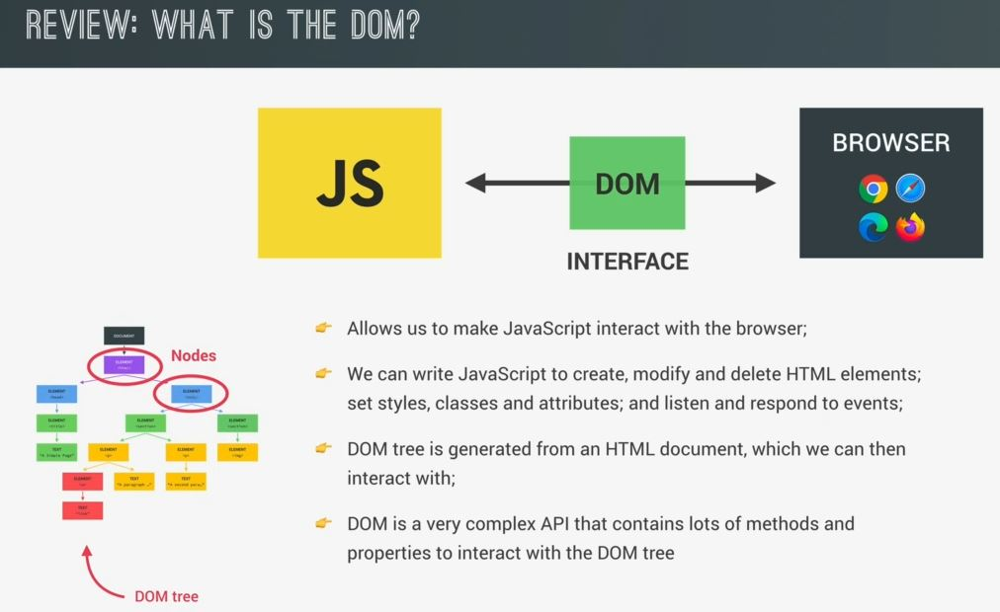
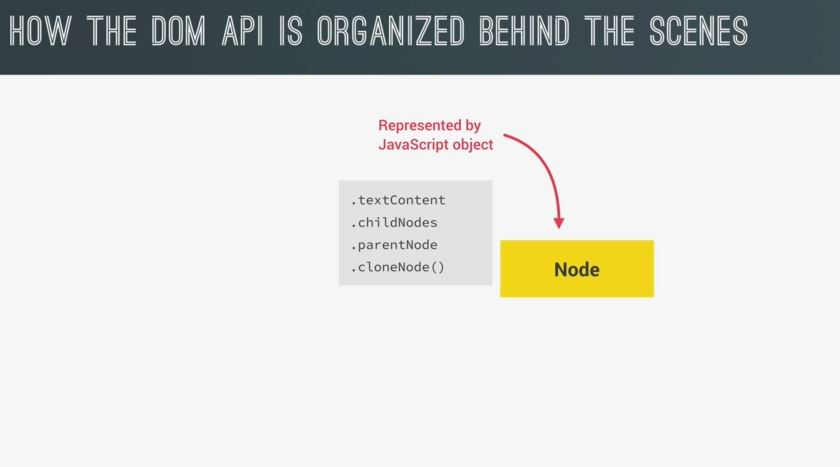
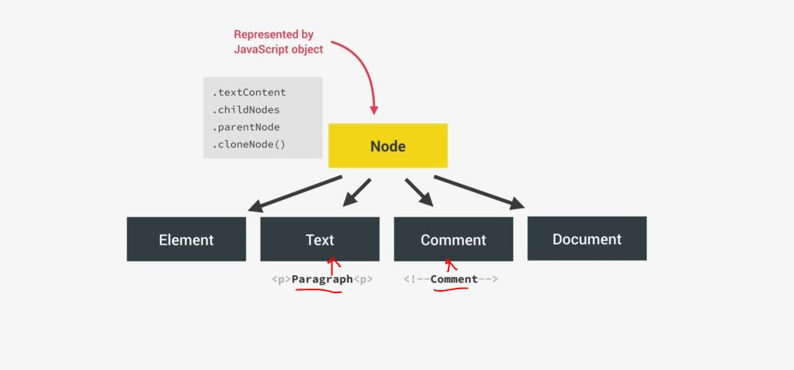
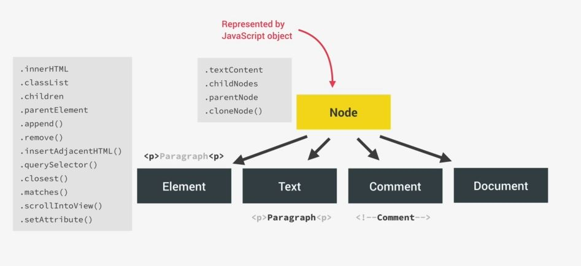
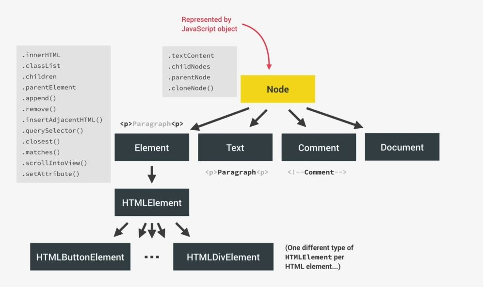
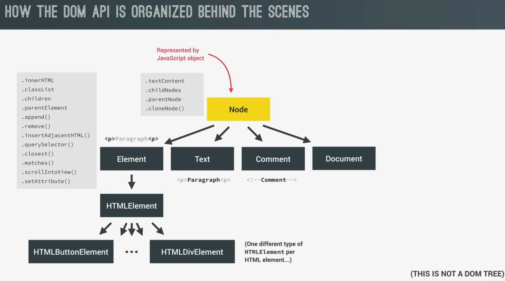
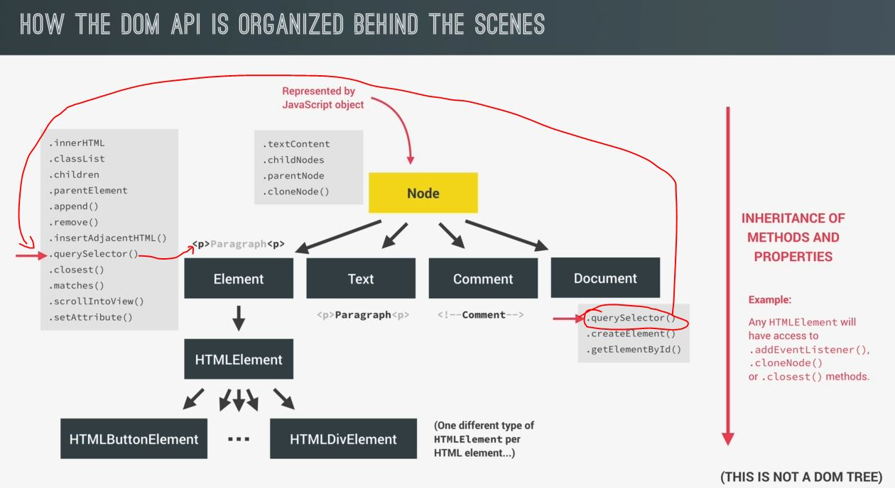
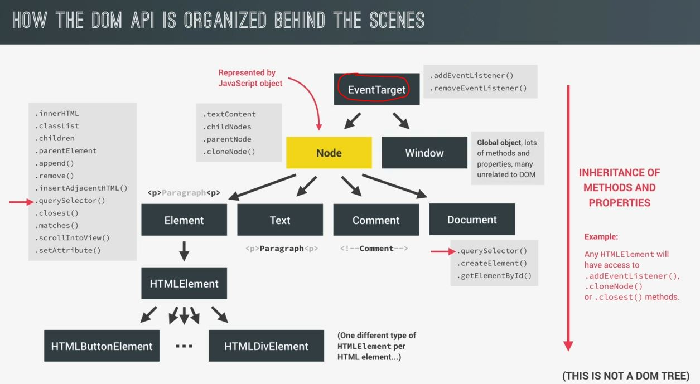

# How the DOM Really Works

- we'll see how the DOM really works behind the scenes & how it's organized internally

## About DOM 

- DOM is a interface b/w JS & the browser 
    
    - or we can say HTML documents that're rendered in & by the browser

- we wrote a ton of JS code but many times completely without interacting with the browser means without using the DOM 
    - so we'll see how to create amazing dynamic effects by using DOM
    - we already know that we can use DOM to make JS interact with the browser & we can create , modify & delete elements  
        & set the stuff like styles , classes & attributes & listen & respond to events
    - in Real work , DOM is generated from any HTML document & a DOM tree of a HTML document is a tree like structure  
        created out of nodes which look likes this
        
        - then we can interact with this tree

- `How interaction happens in DOM`
    - well the DOM is a very complex API 
    - so it's a interface which we can use to programmatically interact with the DOM  
        means in Real Work , the DOM contains a ton of methods & properties that we use to interact with the DOM tree  
        like querySelector() , addEventListener() , innerHTML , etc
    - in the DOM , there're different types of Nodes . Eg : some nodes are HTML elements but others are just text 💡💡💡  
        & this is important to know because all these DOM methods & properties are organized  
        into these different types of objects or Nodes 💡💡💡

## How the DOM API is organized behind the scenes

- `Types of Nodes in DOM api` : 
    - first , every single Node in the DOM tree is a type of Node 
        & in JS , each Node are represented in an object & that object gets access  
        of special Node methods & properties like textContent , childNodes , parentNode , cloneNode() , etc like this
        
    - now we know that there're different types of nodes , so `how should these different types of nodes are represented` 
        - so in diagram , that particular Node type has a couple of child types like element type , text type , comment type & document type 💡💡💡
        - so whenever there's text inside any element like this
            
            - then we already know that text (of that element) will get it's own Node type i.e Text 💡💡💡  
                & same thing with HTML comments 
            - because the rule is that everything that's in the HTML has to go into the DOM as well 💡💡💡
        - & for that element itself , there's a type of Node which gives each HTML element access  
            of useful properties & methods like this 
            
            - means behind the scene , each HTML elements will be treated/represented as an object
        - Now inside HTML element itself , there're are child elements & each child elements has there're own type like this 
            
            - so we have a special type for button , a special type for images , for links , etc 💡💡💡  
                & special type of each html element is important because each of these HTML elements have different unique properties
            - Eg : an `img` element has a source attribute which no other element has or anchor element has `href` attribute  
                used for links but no other element has that , etc
            - so the DOM needs a way of storing these different attributes & that's why different types of HTML elements   
                were created in the DOM API 💡💡💡
                 
                - this diagram is not a DOM tree means it's a not representation of a HTML document 
                - this is just a way that different types of Nodes are represented behind the scenes in the DOM API 💡💡💡

- `Inheritance` 
    - whatever we do in in DOM is done by Inheritance
    - Inheritance : means all the child Types will also get access to the methods & properties of all their parent node types
    - Eg : an HTML element will get access to everything from the element type like innerHTML or classList &  
        that HTML element also get access to everything from the Node type because `Node type` is a also  
        a parent type of that element like an HTML button element is also an element & also a Node 💡💡💡
    - in simple terms , DOM API is divided into these different types of nodes & each of these types of Nodes  
        has access to different properties & methods & some of them even inherit more properties & methods  
        from their ancestors or parent 

- `document` 
    - it's also another Node type
    - it contains important methods like querySelector() , createElement() ,etc
    - `Imp Note 🔥` : querySelector() method is presented in both `document` & on that html element also 💡💡💡 like this 
         

- `EventTarget` : another Node Type
    - now one thing is missing because the DOM API actually needs a way of allowing all the node types to listen to events  
        & usually listen for events by calling addEventListener() method on that element or the `document` object  
    - so there's a special Node type i.e `event.target` which is a parent of  
        both the Node Type & window Node Type like this 💡💡💡
         
    - & due to `event.target` & inheritance , we can call addEventListener() on every single type of Node in the DOM api  
        because all elements as well as document & window & even text & comment will inherit  
        this `addEventListener()` method that's why we can use this method on all of them just as this method is their own method
    - `Note` : we don't manually create an eventTarget object 

- `Imp Note ✅` : 
    - in diagram , that yellow color Node is `document` object  
        `document` object is a global object & it's a main Node of the HTML document & inside of it everything comes 💡💡💡  
    - but `window` object is also a global object & `document` global object is a property of `window`  
        so ultimately `window` global object is everything 
    - but most of most the time we don't need `window` global object because we use `document` global object  
        & in some situations we need `window` global object also

## conclusion 

- these all happens in behind the scenes to make all the functionality work as we expected it to work  
    & there're many stuff but this is enough & for more check MDN

## Extra Notes - DOM api

- `what is Node in DOM` :
    - In the DOM, all parts of the document, such as elements, attributes, text, etc.  
        are organized in a hierarchical tree-like structure with parents - children relationship 
    - These individual parts of the document are known as nodes
- more : https://stackoverflow.com/questions/24974621/what-is-a-node-in-javascript#:~:text=Nodes%20are%20in%20the%20DOM,document%20are%20known%20as%20nodes. 👍

- for more clear DOM structure will look like this 
    
