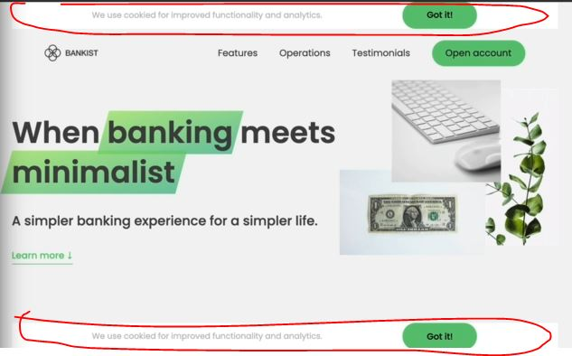

# Selecting , Creating & Deleting Elements

- we'll see how to select , create & delete elements 

## Examples - of Selecting 

- Eg 1 : of `documentElement` property
    - `document` object 
        - it's a main Node in DOM structure 
        - it's a global object as well as property of `window` global object
        - it gives entire HTML code with `<!DOCTYPE html>`
    - `documentElement` property 
        - it's a property of `document` object
        - it gives entire HTML code except `<!DOCTYPE html>`
    ```js
    console.log(document.documentElement)
    // output : give entire HTML code except <!DOCTYPE html>
    ```
    - `Note - why we didn't selected the document object itself`
        - here we didn't selected `document` object itself because it's not a good & it's not the real DOM element <br>
            & even if we want to apply css style to entire page then we need to select `documentElement` property 💡💡💡 
        - & even if we try to apply css style through `document` object like this `document.style.backgroundColor = '#222'` <br>
            then nothing will happen 

- Eg 2 : of selecting head & body element
    ```js
    console.log(document.head) // output : head element will be selected
    console.log(document.body) // output : body element will be selected
    ```

- Eg 3 : of selecting one unique element which can be either class or id 
    ```js
    document.querySelector('.header') 
    document.getElementById('section--1')
    ``` 

- Eg 3 : of selecting multiple elements which can be used to select only class
    ```js
    // take code of starter file of 3-lecture -> 13 module
    const allSections = document.querySelectorAll('.section')
    console.log(allSections)
    // output : we'll get an NodeList array which contain all the elements which has that class name

    document.getElementsByClassName('btn') // output : return an HTMLCollection array 💡💡💡
    ```
    - Eg 3.1 : of selecting all the buttons by using getElementsByTagName() method
        ```js
        const allButtons = document.getElementsByTagName('button')
        console.log(allButtons)
        // output : we'll get all the buttons of Bankist website in an HTMLCollection array
        // so this getElementsByTagName() method also returns HTMLCollection array ✔️✔️✔️
        ```

- `HTMLCollection array vs NodeList array ✅`
    - HTMLCollection array is kind-of known as life collection means if we update in DOM <br>
        then this HTMLCollection array is also immediately update automatically
    - Eg : if we delete a button this bankist website then this HTMLCollection array also gets updated automatically
    - so whenever we use this kind of method i.e getElementsByTagName() method then keep in mind <br>
        that sometimes an HTML Collection is quite helpful which updates automatically
    - But in NodeList array , if we do any changes in DOM then that NodeList will not update itself 

- most of time we use `querySelector()` & `querySelectorAll()` methods <br>
    but sometimes if we need HTMLCollection array instead of NodeList array , <br>
    then use getElementsByClassName() , getElementsByTagName() methods of `document` object 💡💡💡

- use `querySelector()` for id selector & `querySelectorAll()` for class selector

## Examples - of creating & inserting elements

- `insertAdjacentHTML(position, text)` method is a great way to insert/add a element inside the HTML document & it's used most of the time 💡💡💡 

- Eg 1 : of creating an element 
    - `createElement()` method 
        - it takes only one argument in double/single quotes i.e name of element which we want to create 
        - it return a DOM element which is created 💡💡💡
    ```js
    const header = document.querySelector('.header')

    // created the element 
    const message = document.createElement('div')
    // adding a class name inside that element 
    message.classList.add('cookie-message')
    // adding texts inside that element
    message.textContent = 'We use cookied for improved functionality & analytics'
    // inserting a html code 
        // innerHTML -> property is used for both to get the HTML code & set the HTML code 💡💡💡
    message.innerHTML = 'We use cookied for improved functionality & analytics. <button class="btn btn--close-cookie">Got it!</button>'

    // inserting/putting inside the HTML document
    header.prepend(message) 
        // prepend() method : used to add inserts a set of Node objects or string objects 
            // before the first child of that parent Element 
    ```
    - `prepend()` method : used to insert that element as first child inside that parent element 💡💡💡
    - `append()` method : used to insert that element as last child inside that parent element 💡💡💡

- Eg 2 : of inserting multiple copies of the same element ✅
    - `cloneNode()` method 
        - it's used to make multiple copies of the same element 
        - it takes true or false as only one argument <br>
            true means we want to make multiple copies of that same element & false means we don't want 💡💡💡 
    ```js
    // header -> variable is already selected & message -> variable is created , now 
    header.append(message.cloneNode(true))
    ```
    - output : we'll get the same message in two place at the same time like this 
        
    
- Eg 3 : of inserting an element before & after the header element 
    ```js
    header.before(message)
    header.after(message)
    ```
    - `before()` & `after()` methods : 
        - both takes one argument 
        - before() means add that message as sibling before the header element    
        - after() means add that message as sibling after the header element 
    - but we have a better way than these methods i.e `insertAdjacentHTML(position, text)` method ✔️✔️✔️

## Example - of delete 

- Eg 1 : removing that cookie div when we click on 'Got it!' button
    - `remove()` method used to delete a element on which this method called & it doesn't take any argument 💡💡💡
    ```js
    document.querySelector('.btn--close-cookie').addEventListener('click' , function() {
        message.remove()
    })
    ```
