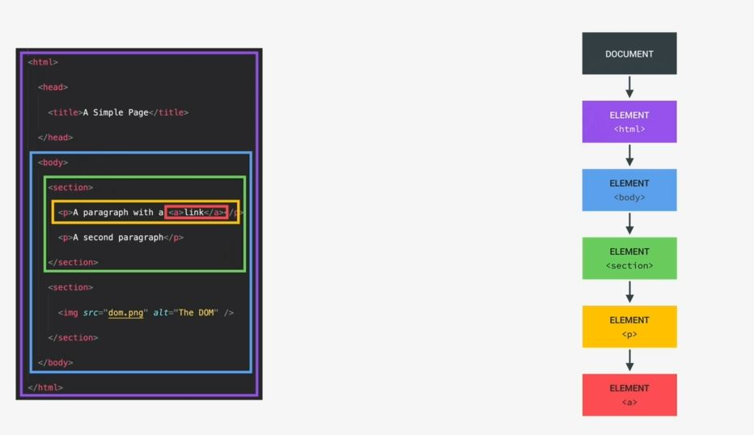
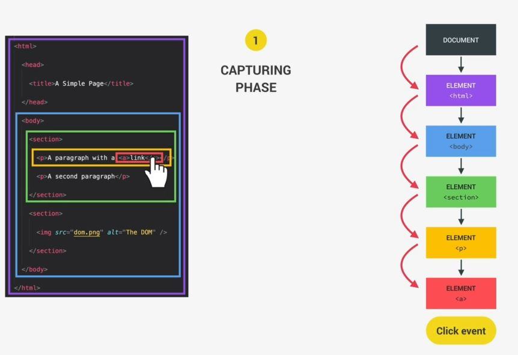
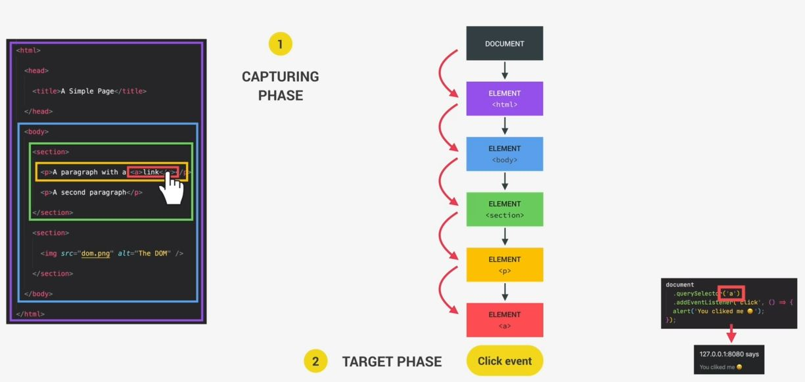
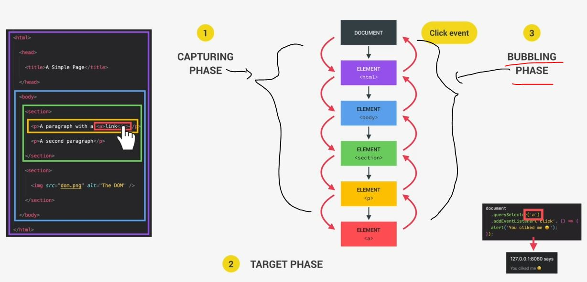
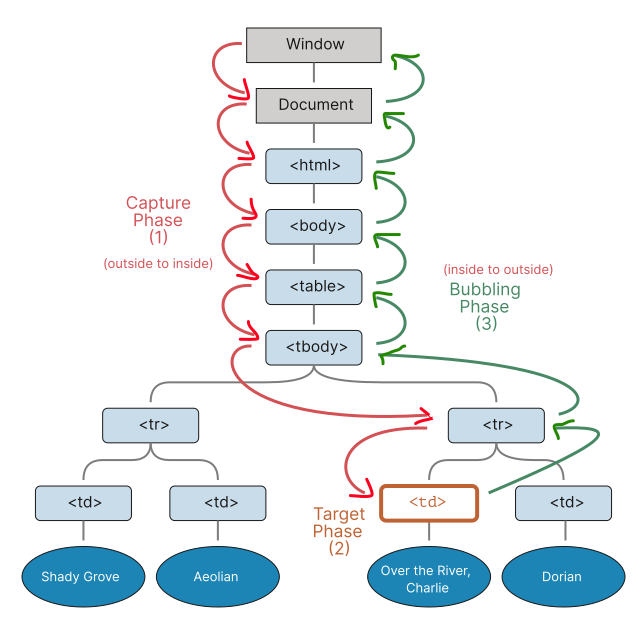

# Event Propagation : Bubbling and Capturing

- most important concept 🔥
- JS events have a very important property i.e a capturing phase & a bubbling phase 💡💡💡  
    if want to learn more about event then event propagation is the concept 
- `propagation` means travel further

## Bubbling & Capturing Phase

- here we can see all the parent elements of that red anchor element  
    & we'll simulate what exactly happens with an event when someone clicks on that link

- `Capturing Phase` : 
    - `1 Process : capturing phase` : 
        - let's say you clicked on that anchor tag directly & then DOM will fire/executed that click event immediately
        - however , that click event is actually not generated at the target element i.e anchor tag  
            click event is actually executed/fire at the root of the document i.e `document` object
        - & from the root of the document , capturing phase happens where that click or any event travels  
            all the way down from the document root to the target element (means from top/outside to bottom/inside)   
            & as that click event travels down the tree , that event will pass through every single parent element  
            of the target element like this
            
        - & as soon as the event reaches the target then the target phase begins
    - `2 Process : target phase` 
        - in Target Phase , events can be handled right at the target which we do with event listeners like this 
            
        - so event listeners wait for a certain event to happen on a certain element & as soon as the event occurs  
            then that event handler fire/execute/runs the attached callback function
        - Eg : in diagram , when callback function fire/executed then alert() function will be called  
            which happens in the target phase
    - now after reaching the target then the event actually travels all the wap-up  
        to the document object again which is called bubbling phase 💡💡💡
- `bubbling phase` : 
    - `1 Process : bubbling phase` : 
        - bubbling phase means that event bubble up from the target to the document root  
            means from bottom/inner to top/outer
        - & then that event passes from down to up inside the DOM tree through all it's parent elements  
            not through any sibling elements like this 💡💡💡
            
 
- `complete picture of event propagation/delegation or event flow` : 
    

## Why we're learning Bubbling & Capturing Phase & it's importance

- Bubbling & Capturing Phase are important because if the event is happened with target element  
    then that same event can also happened in each of the parent elements  
    means if we attached the same event listener for Eg: we attach the click event on the target element  
    & as well as on it's parent element let's say `section` element . so we have handled the exact same event twice  
    i.e once at it's target & once at of it's parent elements 💡💡💡
- so this behavior allows us to implement really powerful patterns
- By-default , events can only be handled in the target as bubbling phase  
    However , we can setup event listeners in a way that they listen to events in the capturing phase
    - Not all types of events do have a capturing & bubbling phase. Some of them are created completely  
        on the target element , so that we can only handle them there
    - but most of the events do capturing & bubbling phase
    - event propagation means that event propagating from one place to another 💡💡💡
