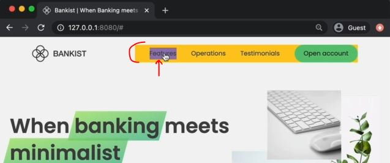
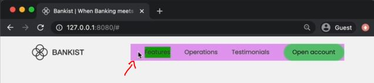
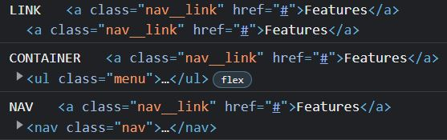

# Event Propagation in Practice

- let's see event propagation & mainly we'll see event bubbling
- we'll do by just attaching event handlers to the menu links of navigation & also on parent elements <br>
    & then when we click in menu links then we'll give random background colors to visualize <br>
    exactly how event bubbling is happening 
- concept of event propagation/delegation comes in the picture <br>
    when we applied the same event type on the child as well as it's parent element 💡💡💡

## starter Code 

```html
<nav class="nav">
    <ul class="menu">
      <li class="nav__item"> <a class="nav__link" href="#">Features</a> </li>
      <li class="nav__item"> <a class="nav__link" href="#">Operations</a> </li>
      <li class="nav__item"> <a class="nav__link" href="#">Testimonials</a> </li>
      <li class="nav__item"> <a class="nav__link nav__link--btn btn--show-modal" href="#">Open account</a> </li>
    </ul>
</nav>
```

- here we removed the '#section--1' from `href` attribute of link because we don't want to scroll <br>
    but we have to put `#` only as value of href otherwise page will get refresh when we click 💡💡💡 

## Example - of Bubbling Phase

- random background color generator
    - random rgb color starts from 0 to 255
    ```js
    const randomInt = (min , max) => Math.floor(Math.random() * (max - min + 1) + min)
    const randomColor = () => `rgb(${randomInt(0, 255)}, ${randomInt(0, 255)}, ${randomInt(0, 255)})`
    ```

- Examples : of bubbling phase
    - `by-default` event propagation will be bubbling phase 💡💡💡
        ```js
        const navLink = document.querySelector('.nav__link')
            // when we have many same classes then by-default , querySelector() method will select 
                // the only first element which has that class name 
                // & rest of the elements which has same class name will be skipped 💡💡💡

        const menu = document.querySelectorAll('.menu')

        navLink.addEventListener('click', function(e) {
            // when we use this -> keyword in anonymous function then this -> keyword pointing to that element itself
            // but if we pass anonymous arrow function as argument & inside of it , we're using this -> keyword 
                // then this -> keyword will point to window global object , 
                // so in this situation use e.target property 💡💡💡  

            this.style.backgroundColor = randomColor()
        })

        menu.addEventListener('click', function(e) {
            
        })
        ```
        - output : when we on that first link then background color will change
    - Eg 1 : but if we perform same action on parent element 
        ```js
        const navLink = document.querySelector('.nav__link')
        const menu = document.querySelector('.menu')

        navLink.addEventListener('click', function(e) {
            this.style.backgroundColor = randomColor()
        })

        menu.addEventListener('click', function(e) {
            this.style.backgroundColor = randomColor()        
        })
        ```
        - output : when we clicked on that target element i.e anchor tag then background color will change 
            - & simultaneously , background color of it's parent element i.e `ul` element also change like this 
                 
        - so event actually happens at the document root & from the document root , that event travels down <br>
            to the target element & from the target element , that click event bubbles up 💡💡💡 <br>
            bubbling up means that the same event had also happened in all of the parent elements 💡💡💡 <br>
            of that child element (which is a target element)
            - bubbling phase means that event “bubble” from the inner element up through parents <br>
                like a bubble in the water.
        - output : when we directly click on the parent element i.e `ul` element 
            - then background color will only change of this `ul` element , not of target element i.e anchor tag like this 
                 
            - because `ul` element is a parent element , so from here , that event only bubbles up to it's parent elements 💡💡💡
    - Eg 2 : performing change action on complete navbar
        ```js
        const navigation = document.querySelector('.nav')
        const menu = document.querySelector('.menu')
        const navLink = document.querySelector('.nav__link')

        navLink.addEventListener('click', function(e) {
            this.style.backgroundColor = randomColor()
        })

        menu.addEventListener('click', function(e) {
            this.style.backgroundColor = randomColor()
        })

        navigation.addEventListener('click', function(e) {
            this.style.backgroundColor = randomColor()
        })
        ```
        - output : when we click on the target element i.e anchor tag menu link 
            - then background color of it's will change & simultaneously , <br>
                background color of it's parent element also change i.e `ul` element & `nav` element
            - so click event was handled in all three places
    - Eg 3 : using e.target to check from where that click event first happened
        - `e.target` property means where that event first happened 💡💡💡
        ```js
        const navigation = document.querySelector('.nav')
        const menu = document.querySelector('.menu')
        const navLink = document.querySelector('.nav__link')

        navLink.addEventListener('click', function(e) {
            this.style.backgroundColor = randomColor()
            console.log('LINK' , e.target)
        })

        menu.addEventListener('click', function(e) {
            this.style.backgroundColor = randomColor()
            console.log('CONTAINER' , e.target)        
        })

        navigation.addEventListener('click', function(e) {
            this.style.backgroundColor = randomColor()
            console.log('NAV' , e.target)        
        })
        ```
        - output : when we click on that target element i.e anchor tag
            - then `e.target` will print anchor tag three times in console tab
            - because anchor tag was the target element from where that click event fire/executed/runs
            - & that anchor tag appears in all the three handlers because all of them are handling the exact same event <br>
                so that each `e` which is event receives the exact same event due to event bubbling 
            - so the event originates/runs/executed from that anchor tag then that event bubbles up <br>
                to it's parent element i.e ul & then next parent element i.e nav & from there , <br>
                that event will travel even further in the DOM tree , so we can handle that event in all of the parent elements <br>  
    - Eg 4 : getting the current target
        - `e.currentTarget` property will give the element on which the event handler is attached 💡💡💡
        ```js
        const navigation = document.querySelector('.nav')
        const menu = document.querySelector('.menu')
        const navLink = document.querySelector('.nav__link')

        const randomInt = (min , max) => Math.floor(Math.random() * (max - min + 1) + min)
        const randomColor = () => `rgb(${randomInt(0, 255)}, ${randomInt(0, 255)}, ${randomInt(0, 255)})`

        navLink.addEventListener('click', function(e) {
            this.style.backgroundColor = randomColor()
            console.log('LINK' , e.target, e.currentTarget)
            console.log(e.currentTarget === this) // true 💡💡💡
        })

        menu.addEventListener('click', function(e) {
            this.style.backgroundColor = randomColor()
            console.log('CONTAINER' , e.target, e.currentTarget)        
        })

        navigation.addEventListener('click', function(e) {
            this.style.backgroundColor = randomColor()
            console.log('NAV' , e.target, e.currentTarget)        
        })
        ```
        - output : when we click on target element i.e anchor tag
            - then `e.target` will give the anchor element three times 
            - & `e.currentTarget` will give the current element like this 
            

## stop the propagation 

- `e.stopPropagation()` method 
    - is a method of `e` object
    - it's used to stop the propagation further of that event 💡💡💡

- Eg : of stopping the propagation inside anchor tag
    ```js
    const navigation = document.querySelector('.nav')
    const menu = document.querySelector('.menu')
    const navLink = document.querySelector('.nav__link')

    const randomInt = (min , max) => Math.floor(Math.random() * (max - min + 1) + min)
    const randomColor = () => `rgb(${randomInt(0, 255)}, ${randomInt(0, 255)}, ${randomInt(0, 255)})`

    navLink.addEventListener('click', function(e) {
        this.style.backgroundColor = randomColor()
        console.log('LINK' , e.target, e.currentTarget)

        e.stopPropagation()
    })

    menu.addEventListener('click', function(e) {
        this.style.backgroundColor = randomColor()
        console.log('CONTAINER' , e.target, e.currentTarget)        
    })

    navigation.addEventListener('click', function(e) {
        this.style.backgroundColor = randomColor()
        console.log('NAV' , e.target, e.currentTarget)        
    })
    ```
    - output : when we click on the target element i.e anchor tag 
        - then click event will executed but further propagation/travel of that event will not go to the parent element <br>
            but if we directly click on it's parent element i.e menu then that event will travel/propagate further
        - so we only want stop the propagation of that click event when we click on that target element i.e anchor  
    - `best practice ✅` : 
        - in practice , never don't stop the default propagation i.e bubbling phase 💡💡💡 <br>
        - but if we actually stopping the event propagation can sometimes fix problems in very complex applications <br>
            with many handlers for the same events
        - but in general , it's not a good idea to stop the propagation of events

## Example - of Capture Phase

- by-default , event propagation is in bubbling phase & knowing about capturing phase is not that useful
- Now the bubbling phase can be very useful for event delegation 💡💡💡 <br> 
    However , if we really want to catch events during the capturing phase then use third argument of addEventListener() method

- Example - of capturing phase
    - in addEventListener() method , defining third argument as `true` or `false` <br>
        so `true` means capturing phase & `false` means bubbling phase
    - by-default , third argument of addEventListener() method will be false behind the scene 💡💡💡
    ```js
    const navigation = document.querySelector('.nav')
    const menu = document.querySelector('.menu')
    const navLink = document.querySelector('.nav__link')

    const randomInt = (min , max) => Math.floor(Math.random() * (max - min + 1) + min)
    const randomColor = () => `rgb(${randomInt(0, 255)}, ${randomInt(0, 255)}, ${randomInt(0, 255)})`

    navLink.addEventListener('click', function(e) {
        this.style.backgroundColor = randomColor()
        console.log('LINK' , e.target, e.currentTarget)

        e.stopPropagation()
    })

    menu.addEventListener('click', function(e) {
        this.style.backgroundColor = randomColor()
        console.log('CONTAINER' , e.target, e.currentTarget)        
    })

    navigation.addEventListener('click', function(e) {
        this.style.backgroundColor = randomColor()
        console.log('NAV' , e.target, e.currentTarget)        
    } , true) // capturing phase
    // OR 
    // navigation.addEventListener('click', function(e) {
    //     this.style.backgroundColor = randomColor()
    //     console.log('NAV' , e.target, e.currentTarget)        
    // } , {capture: true}) // capturing phase
    ```
    - output : when we click on that target element i.e anchor tag of menu
        - then first that click event will passes through `nav` element then anchor tag & then menu i.e ul element 
        - so first that click event travel/propagate through `nav` element because `nav` element is actually <br> 
            listening for the event as it travels down from the DOM while other element are listening for that event <br>
            as that event travels back up
        - because in capturing phase , the event travels/propagate from top/outside to bottom/inside <br>
            means that event travels down all the way to the target & then that event bubbles back up <br>
            because other two same events are in bubbling phase 💡💡💡

- capturing phase is rarely used these days 

## conclusion 

- we should know why those three different elements gets background color <br>
    even though the click only happened on that anchor tag because of bubbling phase 💡💡💡

## Extra notes - event propagation/delegation

- Bubbling and capturing : https://javascript.info/bubbling-and-capturing ⭐
- event delegation : https://javascript.info/event-delegation ⭐
