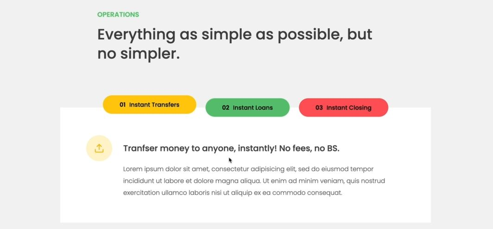

# Building a Tabbed Component

- a very popular component i.e tabbed component
    
    - so when we click on any one button then based on that below information will change

## starter code 

```html
<div class="operations">
  <div class="operations__tab-container">
    <button class="btn operations__tab operations__tab--1 operations__tab--active" data-tab="1">
      <span>01</span>Instant Transfers
    </button>
    <button class="btn operations__tab operations__tab--2" data-tab="2">
      <span>02</span>Instant Loans
    </button>
    <button class="btn operations__tab operations__tab--3" data-tab="3">
      <span>03</span>Instant Closing
    </button>
  </div>
  <div class="operations__content operations__content--1 operations__content--active">
    <div class="operations__icon operations__icon--1">
      <svg><use xlink:href="img/icons.svg#icon-upload"></use></svg>
    </div>
    <h5 class="operations__header">Tranfser money to anyone, instantly! No fees, no BS.</h5>
    <p>
      Lorem ipsum dolor sit amet, consectetur adipisicing elit, sed do
      eiusmod tempor incididunt ut labore et dolore magna aliqua. Ut enim
      ad minim veniam, quis nostrud exercitation ullamco laboris nisi ut
      aliquip ex ea commodo consequat.
    </p>
  </div>

  <div class="operations__content operations__content--2">
    <div class="operations__icon operations__icon--2">
      <svg><use xlink:href="img/icons.svg#icon-home"></use></svg>
    </div>
    <h5 class="operations__header">Buy a home or make your dreams come true, with instant loans.</h5>
    <p>Duis aute irure dolor in reprehenderit in voluptate velit esse
      cillum dolore eu fugiat nulla pariatur. Excepteur sint occaecat
      cupidatat non proident, sunt in culpa qui officia deserunt mollit
      anim id est laborum.
    </p>
  </div>
  <div class="operations__content operations__content--3">
    <div class="operations__icon operations__icon--3">
      <svg><use xlink:href="img/icons.svg#icon-user-x"></use></svg>
    </div>
    <h5 class="operations__header">No longer need your account? No problem! Close it instantly.</h5>
    <p>Excepteur sint occaecat cupidatat non proident, sunt in culpa qui
      officia deserunt mollit anim id est laborum. Ut enim ad minim
      veniam, quis nostrud exercitation ullamco laboris nisi ut aliquip ex
      ea commodo consequat.
    </p>
  </div>
</div>
```

- things in this 
    - 1 : we have value of `data-tab` data attribute which is related to operations__content--1
    - 2 : when we're clicking on any of the button then we're not creating any extra element 
        - we're just hiding previous one & making active based on which button is clicked  

## Steps - to implement tabbed component

- `STEP 1` : selecting required element
    ```js
    const tabs = document.querySelectorAll('.operations__tab')
    const tabsContainer = document.querySelector('.operations__tab-container')
    const tabsContent = document.querySelectorAll('.operations__content')

    // just for checking 
    tabs.forEach(t => t.addEventListener('click', () => {
        console.log('TAB')
    }))
    ```
    - checking output : when we click on any of the button then we'll get output 'TAB'
    - `Note ✅` : `tabs.forEach(t => t.addEventListener('click', () => {console.log('TAB')}))`
        - doing this is a bad practice because what if we had like 200 tabs <br>
            then we would have 200 copies of that exact callback function
        - & that would simply slow down the page which is not good , so use event delegation 💡💡💡
        - so in event delegation/propagation , we need to attach the event handler on <br>
            the common parent element of those all child elements which we're interested in 💡💡💡

- `STEP 2` : using event delegation
    ```js
    const tabs = document.querySelectorAll('.operations__tab')
    const tabsContainer = document.querySelector('.operations__tab-container')
    const tabsContent = document.querySelectorAll('.operations__content')

    tabsContainer.addEventListener('click' , function(e) {
        const clicked = e.target
        console.log(clicked)
    })
    ```
    - checking output : when we click on any on the tab button then we'll get that `button` element
        - but if we click on like number `02` which is inside tab button then we'll get `span` element 
    - so we want if we click on either a button itself or span element , we still need that button <br>  
        so we can use either closest() or matches() methods 
    - but here , closest() method would be great because we want to apply class name also  
    - `STEP 2.1` : selecting button itself
        ```js
        const tabs = document.querySelectorAll('.operations__tab')
        const tabsContainer = document.querySelector('.operations__tab-container')
        const tabsContent = document.querySelectorAll('.operations__content')

        tabsContainer.addEventListener('click' , function(e) {
            const clicked = e.target.closest('.operations__tab')
            console.log(clicked)

            // Guard clause
            if (!clicked) return 
                // we'll return if user clicked on wrong element , so !null means true 
                    // but if clicked to the correct element then return will not be executed 
                    // & after this line of code , rest of the code will be executed 💡💡💡
                // writing condition statement is modern way instead of writing this way 
                    // if (clicked) {
                    //      clicked.classList.add('operations__tab--active')
                    // }
        })
        ```
    - `STEP 2.2` : by-default removing the operations__tab--active class 
        - & then applying this same class on the button which is clicked
        ```js
        const tabs = document.querySelectorAll('.operations__tab')
        const tabsContainer = document.querySelector('.operations__tab-container')
        const tabsContent = document.querySelectorAll('.operations__content')

        tabsContainer.addEventListener('click' , function(e) {
            const clicked = e.target.closest('.operations__tab')
            console.log(clicked)

            // Guard clause
            if (!clicked) return 

            // by-default removing 
            tabs.forEach(t => t.classList.remove('operations__tab--active'))
            // applying the same class based on click
            clicked.classList.add('operations__tab--active')
        })
        ```

- `STEP 3` : activating the content box based on the button which is clicked
    ```js
    const tabs = document.querySelectorAll('.operations__tab')
    const tabsContainer = document.querySelector('.operations__tab-container')
    const tabsContent = document.querySelectorAll('.operations__content')

    tabsContainer.addEventListener('click' , function(e) {
        const clicked = e.target.closest('.operations__tab')
        console.log(clicked)

        // Guard clause
        if (!clicked) return 

        // Activating the particular Tab
        tabs.forEach(t => t.classList.remove('operations__tab--active'))
        clicked.classList.add('operations__tab--active')

        // Activate content area
        document.querySelector(`.operations__content--${clicked.dataset.tab}`).classList.add('operations__content--active')
    })
    ```
    - checking output : when we click on first tab button then we'll get it's content
        - & so on with other tab buttons but this not we want 
        - by-default we need to hide all the content
    - `STEP 3.1` : by-default hiding all the content
        ```js
        const tabs = document.querySelectorAll('.operations__tab')
        const tabsContainer = document.querySelector('.operations__tab-container')
        const tabsContent = document.querySelectorAll('.operations__content')

        tabsContainer.addEventListener('click' , function(e) {
            const clicked = e.target.closest('.operations__tab')
            console.log(clicked)

            // Guard clause
            if (!clicked) return 

            // by-default removing the class name from all tab buttons  
            tabs.forEach(t => t.classList.remove('operations__tab--active'))
            // by-default removing the class name from all content  
            tabsContent.forEach(c => c.classList.remove('operations__content--active'))

            // Activating the particular Tab
            clicked.classList.add('operations__tab--active')

            // Activate the particular content area
            document.querySelector(`.operations__content--${clicked.dataset.tab}`).classList.add('operations__content--active')
        })
        ```
