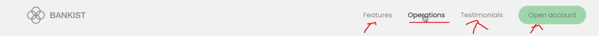

# Passing Arguments to Event Handlers

- creating nice effect on the navigation where all the links fade out except that link which is hovered like this
    

## starter code 

```html
<nav class="nav">
  
  <ul class="nav__links">
    <li class="nav__item">
      <a class="nav__link" href="#section--1">Features</a>
    </li>
    <li class="nav__item">
      <a class="nav__link" href="#section--2">Operations</a>
    </li>
    <li class="nav__item">
      <a class="nav__link" href="#section--3">Testimonials</a>
    </li>
    <li class="nav__item">
      <a class="nav__link nav__link--btn btn--show-modal" href="#">Open account</a>
    </li>
  </ul>
</nav>
```

## Steps - to implement fade out effect on menu items

- we don't want to attach to each of these menu links , because we know that would be bad practice <br>
    & we should do event delegation
- `Best practices` : put all the selected elements at the top which are globally done  

- `STEP 1` : selecting required element
    ```js
    const nav = document.querySelector('.nav')
    ```

- `STEP 2` : adding event listener 
    - `mouseenter VS mouseover` : `mouseenter` event doesn't not bubble & `mouseover` event does bubbling 💡💡💡
    - & in this situation we're need bubbling phase , so we'll use mouseover
    - opposite of mouseenter is `mouseleave` & of mouseover is `mouseout` 💡💡💡
    ```js
    const nav = document.querySelector('.nav')
    nav.addEventListener('mouseover', (e) => {
            // here we're not using closest() method because 
                // inside nav__links class there's no child elements that we can accidentally click 💡💡💡
        if (e.target.classList.contains('nav__link')) { 
            const link = e.target
            const siblings = link.closest('.nav').querySelector('.nav__link')
            const logo = link.closest('.nav').querySelector('img')

            siblings.forEach(el => {
                if (el !== link) el.style.opacity = 0.5
            })

            logo.style.opacity = 0.5
        }
    })

    nav.addEventListener('mouseover', (e) => { })
    ```
    - checking output : now let's say we hover on `operations` menu link 
        - then logo , & other links & button also gets less opacity of navigation
        - but the movement we remove the cursor from `operations` menu link then things are not going back
    - `STEP 2.2` : bringing back the opacity when we're not hovering on any thing of navigation
        ```js
        const nav = document.querySelector('.nav')
        nav.addEventListener('mouseover', (e) => {
            if (e.target.classList.contains('nav__link')) { 
                const link = e.target
                const siblings = link.closest('.nav').querySelector('.nav__link')
                const logo = link.closest('.nav').querySelector('img')

                siblings.forEach(el => {
                    if (el !== link) el.style.opacity = 0.5
                })

                logo.style.opacity = 0.5
            }
        })

        nav.addEventListener('mouseover', (e) => {
            if (e.target.classList.contains('nav__link')) { 
                const link = e.target
                const siblings = link.closest('.nav').querySelector('.nav__link')
                const logo = link.closest('.nav').querySelector('img')

                siblings.forEach(el => {
                    if (el !== link) el.style.opacity = 1
                })

                logo.style.opacity = 1
            }
        })
        ```
        - output : we'll get the correct output but when we hover on logo then other things will not fade out
        - & right now our code is repetitive , so we need to refactor the code to make it clean <br>
            & usually refactoring done by creating a new global function 💡💡💡

- `STEP 3` : refactoring the code 
    ```js
    const nav = document.querySelector('.nav')

    const handleHover = function(e, opacity) {
        if (e.target.classList.contains('nav__link')) { 
            const link = e.target
            const siblings = link.closest('.nav').querySelector('.nav__link')
            const logo = link.closest('.nav').querySelector('img')

            siblings.forEach(el => {
                if (el !== link) el.style.opacity = opacity
            })

            logo.style.opacity = opacity
        }
    }

    nav.addEventListener('mouseover', handleHover)
    nav.addEventListener('mouseover', handleHover)
    ```
    - checking output : nothing will happen 
        - & if even you think that we'll do this `nav.addEventListener('mouseover', handleHover(e, 0.5))` <br>
            then still nothing will happen
        - because addEventListener() method expects the callback function as second argument <br>
            & we're not returning anything from handleHover() function 💡💡💡
        - solution is we can pass a callback function as second argument <br>
            & inside of it call that function like this `handleHover(e, 0.5)` 💡💡💡
    - `STEP 3.1` : defining a callback function as second argument ✅
        - & inside of it , calling handleHover() with arguments
        ```js
        const nav = document.querySelector('.nav')

        const handleHover = function(e, opacity) {
            if (e.target.classList.contains('nav__link')) { 
                const link = e.target
                const siblings = link.closest('.nav').querySelector('.nav__link')
                const logo = link.closest('.nav').querySelector('img')

                siblings.forEach(el => {
                    if (el !== link) el.style.opacity = opacity
                })

                logo.style.opacity = opacity
            }
        }

        nav.addEventListener('mouseover', function(e) {
            handleHover(e, 0.5)
        })
        nav.addEventListener('mouseover', function(e) {
            handleHover(e, 1)
        })
        ```
        - output : we'll get correct output 
        - but we can do even better because `nav.addEventListener('mouseover', function(e) { handleHover(e, 0.5)})`
            - here that callback function calling that another function
            - so we can use bind() method
            - `bind()` method creates a copy of the function which is called on & it'll set the `this` keyword <br>
                on that function call to whatever value that we pass into bind 💡💡💡
    - `STEP 3.2` : simplifying the code through bind() method
        ```js
        const nav = document.querySelector('.nav')

        // from here , we removed the 'opacity' argument
            // because this handleHover() function becomes handler function
            // so this function only ever have one real parameter i.e event
            // but if we want to pass additional values into the handler function 
                // then we need to use the this -> keyword
                // & if we want multiple argument then we can pass an array inside bind() method
            // but generally the handler function can only take one argument 💡💡💡
        const handleHover = function(e) {
            console.log(this, e.currentTarget) // we know that this -> keyword is equal-to current target 

            if (e.target.classList.contains('nav__link')) { 
                const link = e.target
                const siblings = link.closest('.nav').querySelector('.nav__link')
                const logo = link.closest('.nav').querySelector('img')

                siblings.forEach(el => {
                    if (el !== link) el.style.opacity = this // now this -> keyword becomes our opacity
                })

                logo.style.opacity = this // now this -> keyword becomes our opacity
            }
        }

        nav.addEventListener('mouseover', handleHover.bind(0.5))
            // handleHover.bind(0.5) -> this complete thing also a function
                // because bind() method will return a new function 💡💡💡 
        nav.addEventListener('mouseover', handleHover.bind(1))
        ```
        - output : when we hover on nav element then we'll get 0.5 value & that nav element itself
            - & we remove the cursor then we'll get 1 & again nav element itself 
