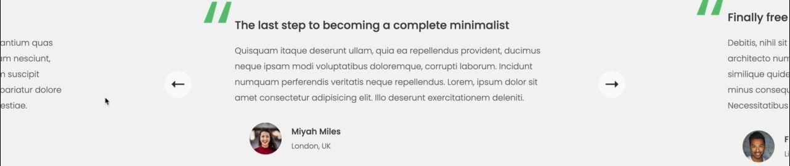
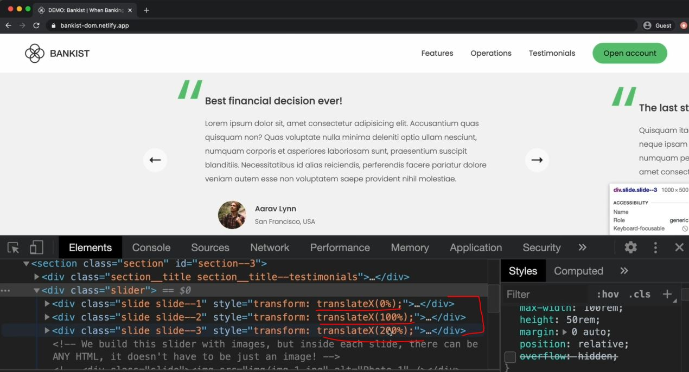
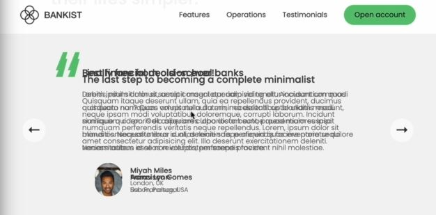

# Building a Slider Component : Part 1

- when we we slide to the next the according to this , below dots also move with their respective slides <br>
    & we can slide the carousel by clicking on dots also

## Starter code 

```html
<section class="section" id="section--3">
    <div class="section__title section__title--testimonials">
      <h2 class="section__description">Not sure yet?</h2>
      <h3 class="section__header">Millions of Bankists are already making their lifes simpler.</h3>
    </div>

    <div class="slider">
      <div class="slide slide--1">
        <div class="testimonial">
          <h5 class="testimonial__header">Best financial decision ever!</h5>
          <blockquote class="testimonial__text">
            Lorem ipsum dolor sit, amet consectetur adipisicing elit.
            Accusantium quas quisquam non? Quas voluptate nulla minima
            deleniti optio ullam nesciunt, numquam corporis et asperiores
            laboriosam sunt, praesentium suscipit blanditiis. Necessitatibus
            id alias reiciendis, perferendis facere pariatur dolore veniam
            autem esse non voluptatem saepe provident nihil molestiae.
          </blockquote>
          <address class="testimonial__author">
            
            <h6 class="testimonial__name">Aarav Lynn</h6>
            <p class="testimonial__location">San Francisco, USA</p>
          </address>
        </div>
      </div>

      <div class="slide slide--2">
        <div class="testimonial">
          <h5 class="testimonial__header">The last step to becoming a complete minimalist</h5>
          <blockquote class="testimonial__text">
            Quisquam itaque deserunt ullam, quia ea repellendus provident,
            ducimus neque ipsam modi voluptatibus doloremque, corrupti
            laborum. Incidunt numquam perferendis veritatis neque repellendus.
            Lorem, ipsum dolor sit amet consectetur adipisicing elit. Illo
            deserunt exercitationem deleniti.
          </blockquote>
          <address class="testimonial__author">
            
            <h6 class="testimonial__name">Miyah Miles</h6>
            <p class="testimonial__location">London, UK</p>
          </address>
        </div>
      </div>

      <div class="slide slide--3">
        <div class="testimonial">
          <h5 class="testimonial__header">Finally free from old-school banks</h5>
          <blockquote class="testimonial__text">
            Debitis, nihil sit minus suscipit magni aperiam vel tenetur
            incidunt commodi architecto numquam omnis nulla autem,
            necessitatibus blanditiis modi similique quidem. Odio aliquam
            culpa dicta beatae quod maiores ipsa minus consequatur error sunt,
            deleniti saepe aliquid quos inventore sequi. Necessitatibus id
            alias reiciendis, perferendis facere.
          </blockquote>
          <address class="testimonial__author">
            
            <h6 class="testimonial__name">Francisco Gomes</h6>
            <p class="testimonial__location">Lisbon, Portugal</p>
          </address>
        </div>
      </div>

      <!-- <div class="slide"></div>
      <div class="slide"></div>
      <div class="slide"></div>
      <div class="slide"></div> -->
      <button class="slider__btn slider__btn--left">&larr;</button>
      <button class="slider__btn slider__btn--right">&rarr;</button>
      <div class="dots"></div>
    </div>
</section>
```
- so when we remove the `overflow : hidden` from `slider` class then we can see that next slider <br>
    & when we click on forward arrow then previous slide will move to left side & that current slide come in center <br>
    & next slide will be on right sod side like this 
    
    - & that slide will happen due to `transform: translateX()` property & values of these property i.e <br>
        - first slide has 0% , 2 slide is 100% & 3 slide is 200% like this 
        

## Steps - to implement slider component

- right now all the slides are one top of each other like this 
    
    - so we need to write the condition , so that each of the conditions will be side by side

- starter code for demo purpose
    ```html
    <div class="slide"></div>
    <div class="slide"></div>
    <div class="slide"></div>
    <div class="slide"></div> 
    ```
    - right now all these images are on top of each other

- `STEP 1` : selecting necessary elements
    ```js
    const slides = document.querySelectorAll('.slide')

    slides.forEach((s, i) => s.style.transform = `transformX(${})`)
    ```
    - now we want position , so first slide at 0% , second slide at 100% & third slide is 200% & then 300% <br>
        & we need 4 values because we have total 4 slides 💡💡💡
    - `STEP 1.1` : defining positions & working only to move to next slide
        ```js
        const slides = document.querySelectorAll('.slide')
        const btnLeft = document.querySelector('.slider__btn--left')
        const btnRight = document.querySelector('.slider__btn--right')

        let curSlide = 0

        const slider = document.querySelector('.slider')
        slider.style.transform = 'scale(0.4) translateX(-800px)' // for testing purpose
        slider.style.overflow = 'visible' // for testing purpose

        slides.forEach((s, i) => s.style.transform = `transformX(${100 * i}%)`)

        // Next Slide
            // so go to the next slide we're just changing th value of transform property
            // so active slide will have 0% & previous slide will have -100% & next slide will have 100% 💡💡💡
        btnRight.addEventListener('click', function() {
            curSlide++ // when we want to go to next slide then we want to increase the value

            slide.forEach((s, i) => (s.style.transform = `transformX(${100 * (i - curSlide)}%)`))
            // Note : transformX(${100 * (i - curSlide)}%)
                // means let's say current slide is 1 then we want don't want this value 0% , 100% , 200% , 300%
                // so we want first slide as -100% & current slide as 0% 
                    // & next slide as 100% & another next slide as 200% 💡💡💡
        })
        ```
        - output : when w click on right button to move forward then slide will move 
            - but when w reach to last slide then w clicked on right button then slide will move forward <br>
                so we need to stop from going further

- `STEP 2` : stopping the slider from moving further even after the last slide over
    - so we need to define the number of slides & then make it stop once we reach the last onw
    ```js
    const slides = document.querySelectorAll('.slide')
    const btnLeft = document.querySelector('.slider__btn--left')
    const btnRight = document.querySelector('.slider__btn--right')

    let curSlide = 0
    const maxSlide = slides.length

    const slider = document.querySelector('.slider')
    slider.style.transform = 'scale(0.4) translateX(-800px)' // for testing purpose
    slider.style.overflow = 'visible' // for testing purpose

    slides.forEach((s, i) => s.style.transform = `transformX(${100 * i}%)`)

    // Next Slide
    btnRight.addEventListener('click', function() {
        // here we did subtract the maxSlide by 1 because length starts from 1
            // because when we reach to the last side then when we click on right button then slide move to empty slide 
            // so that's why we want length as 0 based because index of array starts from 0 💡💡💡
        if (curSlide == maxSlide - 1) { 
            curSlide = 0
        } else {
            curSlide++ 
        }


        slide.forEach((s, i) => (s.style.transform = `transformX(${100 * (i - curSlide)}%)`))
    })
    ```
    - output : when we reach to the last side & click on right button then we move to first side again 
    - now let's refactor the code 

- `STEP 3` : refactoring the code 
    ```js
    const slides = document.querySelectorAll('.slide')
    const btnLeft = document.querySelector('.slider__btn--left')
    const btnRight = document.querySelector('.slider__btn--right')

    let curSlide = 0
    const maxSlide = slides.length

    const slider = document.querySelector('.slider')
    slider.style.transform = 'scale(0.4) translateX(-800px)' // for testing purpose
    slider.style.overflow = 'visible' // for testing purpose

    // slides.forEach((s, i) => s.style.transform = `transformX(${100 * i}%)`)
        // to remove this line of code , 
        // then call that goToSlide() function with the slide set to 0 which is default position 💡💡💡

    const goToSlide = function(slide) {
        slide.forEach((s, i) => (s.style.transform = `transformX(${100 * (i - curSlide)}%)`))
    }

    goToSlide(0)

    // Next Slide
    const nextSlide = function() {
        if (curSlide == maxSlide - 1) { 
            curSlide = 0
        } else {
            curSlide++ 
        }

        goToSlide(curSlide)
    }

    btnRight.addEventListener('click', nextSlide)
    ```

- `STEP 4` : working on button left
    ```js
    const slides = document.querySelectorAll('.slide')
    const btnLeft = document.querySelector('.slider__btn--left')
    const btnRight = document.querySelector('.slider__btn--right')

    let curSlide = 0
    const maxSlide = slides.length

    const goToSlide = function(slide) {
        slide.forEach((s, i) => (s.style.transform = `transformX(${100 * (i - curSlide)}%)`))
    }

    goToSlide(0)

    // Next Slide
    const nextSlide = function() {
        if (curSlide === maxSlide - 1) { 
            curSlide = 0
        } else {
            curSlide++ 
        }

        goToSlide(curSlide)
    }

    // Previous Slide
    const prevSlide = function() {
        if (curSlide === 0) { 
            curSlide = maxSlide - 1
        } else {
            curSlide-- 
        }
        goToSlide(curSlide)
    }

    btnRight.addEventListener('click', nextSlide)
    btnLeft.addEventListener('click', prevSlide)
    ```

## conclusion

- most tricky part is the code of goToSlide() function 
