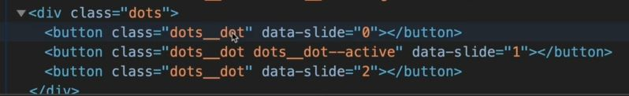
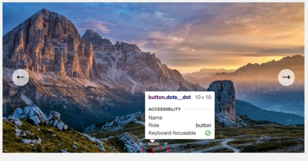

# Building a Slider Component : Part 1

- now let's attach the event handler with keyboard event , so that we want slide through left & right arrow keys <br> 
    & implement the feature to slide slider through dot

## stater code JS 

```js
const slides = document.querySelectorAll('.slide')
const btnLeft = document.querySelector('.slider__btn--left')
const btnRight = document.querySelector('.slider__btn--right')

let curSlide = 0
const maxSlide = slides.length

const goToSlide = function(slide) {
    slide.forEach((s, i) => (s.style.transform = `transformX(${100 * (i - curSlide)}%)`))
}

goToSlide(0)

// Next Slide
const nextSlide = function() {
    if (curSlide === maxSlide - 1) { 
        curSlide = 0
    } else {
        curSlide++ 
    }

    goToSlide(curSlide)
}

// Previous Slide
const prevSlide = function() {
    if (curSlide === 0) { 
        curSlide = maxSlide - 1
    } else {
        curSlide-- 
    }
    goToSlide(curSlide)
}

btnRight.addEventListener('click', nextSlide)
btnLeft.addEventListener('click', prevSlide)
```

## Steps - to implement keyboard event to slide through left & right arrow keys 

- `STEP 1` : adding keyboard events
    - `keydown` & `keyup` keyboard events 💡💡💡
    ```js
    const slides = document.querySelectorAll('.slide')
    const btnLeft = document.querySelector('.slider__btn--left')
    const btnRight = document.querySelector('.slider__btn--right')

    let curSlide = 0
    const maxSlide = slides.length

    const goToSlide = function(slide) {
        slide.forEach((s, i) => (s.style.transform = `transformX(${100 * (i - curSlide)}%)`))
    }

    goToSlide(0)

    // Next Slide
    const nextSlide = function() {
        if (curSlide === maxSlide - 1) { 
            curSlide = 0
        } else {
            curSlide++ 
        }

        goToSlide(curSlide)
    }

    // Previous Slide
    const prevSlide = function() {
        if (curSlide === 0) { 
            curSlide = maxSlide - 1
        } else {
            curSlide-- 
        }
        goToSlide(curSlide)
    }

    btnRight.addEventListener('click', nextSlide)
    btnLeft.addEventListener('click', prevSlide)

    document.addEventListener('keydown', function(e) {
        console.log(e)
    })
    ```
    - output : when we press down arrow key then we'll get KeyboardEvent object 
        - & when we press left arrow key then inside of KeyboardEvent object , we have `key` property as "ArrowLeft" value 
        - so we'll use `key` property 💡💡💡

- `STEP 2` : using `key` property of keyboard event 
    ```js
    const slides = document.querySelectorAll('.slide')
    const btnLeft = document.querySelector('.slider__btn--left')
    const btnRight = document.querySelector('.slider__btn--right')

    let curSlide = 0
    const maxSlide = slides.length

    const goToSlide = function(slide) {
        slide.forEach((s, i) => (s.style.transform = `transformX(${100 * (i - curSlide)}%)`))
    }

    goToSlide(0)

    // Next Slide
    const nextSlide = function() {
        if (curSlide === maxSlide - 1) { 
            curSlide = 0
        } else {
            curSlide++ 
        }

        goToSlide(curSlide)
    }

    // Previous Slide
    const prevSlide = function() {
        if (curSlide === 0) { 
            curSlide = maxSlide - 1
        } else {
            curSlide-- 
        }
        goToSlide(curSlide)
    }

    btnRight.addEventListener('click', nextSlide)
    btnLeft.addEventListener('click', prevSlide)

    document.addEventListener('keydown', function(e) {
        if (e.key === 'ArrowLeft') prevSlide() 
            // from here we'll able to understand 
                // why we have created a separate function for previous slide & next slide 💡💡💡
        e.key === 'ArrowRight' && nextSlide() // here we used short circuiting trick 💡💡💡
    })
    ```
    - output : when we press right or left arrow key then according that slide will move

## Steps - to implement dots carousel

```html
<div class="dots"></div>
```

- `STEP 1` : selecting elements
    ```js
    const slides = document.querySelectorAll('.slide')
    const btnLeft = document.querySelector('.slider__btn--left')
    const btnRight = document.querySelector('.slider__btn--right')
    const dotContainer = document.querySelector('.dots')

    let curSlide = 0
    const maxSlide = slides.length

    const goToSlide = function(slide) {
        slide.forEach((s, i) => (s.style.transform = `transformX(${100 * (i - curSlide)}%)`))
    }

    goToSlide(0)

    // Next Slide
    const nextSlide = function() {
        if (curSlide === maxSlide - 1) { 
            curSlide = 0
        } else {
            curSlide++ 
        }

        goToSlide(curSlide)
    }

    // Previous Slide
    const prevSlide = function() {
        if (curSlide === 0) { 
            curSlide = maxSlide - 1
        } else {
            curSlide-- 
        }
        goToSlide(curSlide)
    }

    btnRight.addEventListener('click', nextSlide)
    btnLeft.addEventListener('click', prevSlide)

    document.addEventListener('keydown', function(e) {
        if (e.key === 'ArrowLeft') prevSlide() 
        e.key === 'ArrowRight' && nextSlide() 
    })
    ```
    - now we want this output inside the dot container like this
        
        - we have data attribute to store the number of the slide that clicking the button will go to

- `STEP 2` : creating element for each of the slides
    ```js
    const slides = document.querySelectorAll('.slide')
    const btnLeft = document.querySelector('.slider__btn--left')
    const btnRight = document.querySelector('.slider__btn--right')
    const dotContainer = document.querySelector('.dots')

    let curSlide = 0
    const maxSlide = slides.length

    const createDots = function() {
            // now we're don't need first argument , so we'll use throwaway variable by using underscore 💡💡💡
        slides.forEach(function(_, i) => {
            dotContainer.insertAdjacentHTML('beforeend' , `<button class="dots__dot" data-slide="${i}"></button>`)
        })
    }
    createDots()

    const goToSlide = function(slide) {
        slide.forEach((s, i) => (s.style.transform = `transformX(${100 * (i - curSlide)}%)`))
    }

    goToSlide(0)

    // Next Slide
    const nextSlide = function() {
        if (curSlide === maxSlide - 1) { 
            curSlide = 0
        } else {
            curSlide++ 
        }

        goToSlide(curSlide)
    }

    // Previous Slide
    const prevSlide = function() {
        if (curSlide === 0) { 
            curSlide = maxSlide - 1
        } else {
            curSlide-- 
        }
        goToSlide(curSlide)
    }

    btnRight.addEventListener('click', nextSlide)
    btnLeft.addEventListener('click', prevSlide)

    document.addEventListener('keydown', function(e) {
        if (e.key === 'ArrowLeft') prevSlide() 
        e.key === 'ArrowRight' && nextSlide() 
    })
    ```
    - output : we'll get four dots like this
        
        - so index is starting from 0 & we can see inside that dot container html code
    - `Note` : now we're not gonna attach one event handler to each dot because we already know the reason
        - so we'll put the event handler to the common parent instead of each dot 💡💡💡 

- `STEP 3` : putting the event handler to the common parent of each dots 
    ```js
    const slides = document.querySelectorAll('.slide')
    const btnLeft = document.querySelector('.slider__btn--left')
    const btnRight = document.querySelector('.slider__btn--right')
    const dotContainer = document.querySelector('.dots')

    let curSlide = 0
    const maxSlide = slides.length

    const createDots = function() {
            // now we're don't need first argument , so we'll use throwaway variable by using underscore 💡💡💡
        slides.forEach(function(_, i) => {
            dotContainer.insertAdjacentHTML('beforeend' , `<button class="dots__dot" data-slide="${i}"></button>`)
        })
    }
    createDots()

    const goToSlide = function(slide) {
        slide.forEach((s, i) => (s.style.transform = `transformX(${100 * (i - curSlide)}%)`))
    }

    goToSlide(0)

    // Next Slide
    const nextSlide = function() {
        if (curSlide === maxSlide - 1) { 
            curSlide = 0
        } else {
            curSlide++ 
        }

        goToSlide(curSlide)
    }

    // Previous Slide
    const prevSlide = function() {
        if (curSlide === 0) { 
            curSlide = maxSlide - 1
        } else {
            curSlide-- 
        }
        goToSlide(curSlide)
    }

    btnRight.addEventListener('click', nextSlide)
    btnLeft.addEventListener('click', prevSlide)

    document.addEventListener('keydown', function(e) {
        if (e.key === 'ArrowLeft') prevSlide() 
        e.key === 'ArrowRight' && nextSlide() 
    })

    dotContainer.addEventListener('click' , function(e) {
        if (e.target.classList.contains('dots__dot')) { // e.target.matches('dots__dot')
            // const slide = e.target.dataset.slide 
                // here we can use destructuring because here slide & dataset.slide has same name 💡💡💡 
            const {slide} = e.target.dataset
            goToSlide(slide)
        }
    })
    ```
    - output : moving slide through dots is working fine 
        - but we also need to know the current dot as little highlighted , 
        - so let's give special class to that current active dot 
        - so whenever we change the slide we want to change the active dot also

- `STEP 4` : working on activating dots according to current slide that we're in
    ```js
    const slides = document.querySelectorAll('.slide')
    const btnLeft = document.querySelector('.slider__btn--left')
    const btnRight = document.querySelector('.slider__btn--right')
    const dotContainer = document.querySelector('.dots')

    let curSlide = 0
    const maxSlide = slides.length

    const createDots = function() {
            // now we're don't need first argument , so we'll use throwaway variable by using underscore 💡💡💡
        slides.forEach(function(_, i) => {
            dotContainer.insertAdjacentHTML('beforeend' , `<button class="dots__dot" data-slide="${i}"></button>`)
        })
    }
    createDots()

    const activateDot = function(slide) {
        // so we'll remove the special class by-default & then we'll add the active class 
        document.querySelectorAll('.dots__dot').forEach(dot => dot.classList.remove('dots__dot--active'));

        // selecting active dot based on the value of that data attribute value i.e data-slide
        document.querySelector(`.dots__dot[data-slide="${slide}"]`).classList.add('dots__dot--active');
    }

    const goToSlide = function(slide) {
        slide.forEach((s, i) => (s.style.transform = `transformX(${100 * (i - curSlide)}%)`))
    }

    goToSlide(0)

    // Next Slide
    const nextSlide = function() {
        if (curSlide === maxSlide - 1) { 
            curSlide = 0
        } else {
            curSlide++ 
        }

        goToSlide(curSlide)
        activateDot(curSlide)
    }

    // Previous Slide
    const prevSlide = function() {
        if (curSlide === 0) { 
            curSlide = maxSlide - 1
        } else {
            curSlide-- 
        }
        goToSlide(curSlide)
        activateDot(curSlide)
    }

    btnRight.addEventListener('click', nextSlide)
    btnLeft.addEventListener('click', prevSlide)

    document.addEventListener('keydown', function(e) {
        if (e.key === 'ArrowLeft') prevSlide() 
        e.key === 'ArrowRight' && nextSlide() 
    })

    dotContainer.addEventListener('click' , function(e) {
        if (e.target.classList.contains('dots__dot')) { 
            const {slide} = e.target.dataset
            goToSlide(slide)
            activateDot(slide)
        }
    })
    ```
    - output : now we'll get the correct output & that active dot also moving based on current slide that we're in 
        - but one problem is that when we refresh the page then we'll not see the active dot <br>
            because we need to call that activateDot() function globally
    - `STEP 4.1` : calling that activateDot() function globally with default argument as 0 index
        ```js
        const slides = document.querySelectorAll('.slide')
        const btnLeft = document.querySelector('.slider__btn--left')
        const btnRight = document.querySelector('.slider__btn--right')
        const dotContainer = document.querySelector('.dots')

        let curSlide = 0
        const maxSlide = slides.length

        const createDots = function() {
            slides.forEach(function(_, i) => {
                dotContainer.insertAdjacentHTML('beforeend' , `<button class="dots__dot" data-slide="${i}"></button>`)
            })
        }
        createDots()

        const activateDot = function(slide) {
            document.querySelectorAll('.dots__dot').forEach(dot => dot.classList.remove('dots__dot--active'));

            document.querySelector(`.dots__dot[data-slide="${slide}"]`).classList.add('dots__dot--active');
        }
        activateDot(0)

        const goToSlide = function(slide) {
            slide.forEach((s, i) => (s.style.transform = `transformX(${100 * (i - curSlide)}%)`))
        }

        goToSlide(0)

        // Next Slide
        const nextSlide = function() {
            if (curSlide === maxSlide - 1) { 
                curSlide = 0
            } else {
                curSlide++ 
            }

            goToSlide(curSlide)
            activateDot(curSlide)
        }

        // Previous Slide
        const prevSlide = function() {
            if (curSlide === 0) { 
                curSlide = maxSlide - 1
            } else {
                curSlide-- 
            }
            goToSlide(curSlide)
            activateDot(curSlide)
        }

        btnRight.addEventListener('click', nextSlide)
        btnLeft.addEventListener('click', prevSlide)

        document.addEventListener('keydown', function(e) {
            if (e.key === 'ArrowLeft') prevSlide() 
            e.key === 'ArrowRight' && nextSlide() 
        })

        dotContainer.addEventListener('click' , function(e) {
            if (e.target.classList.contains('dots__dot')) { 
                const {slide} = e.target.dataset
                goToSlide(slide)
                activateDot(slide)
            }
        })
        ```
    - now let's refactor the code because we're calling same calling in two different places <br>
        so we'll make the initialization function to initialize

- `STEP 5` : making a initialization function to initialize 
    ```js
    const slider = function() { // putting all the global variables & other slider code inside a function
        const slides = document.querySelectorAll('.slide')
        const btnLeft = document.querySelector('.slider__btn--left')
        const btnRight = document.querySelector('.slider__btn--right')
        const dotContainer = document.querySelector('.dots')

        let curSlide = 0
        const maxSlide = slides.length

        const createDots = function() {
            slides.forEach(function(_, i) => {
                dotContainer.insertAdjacentHTML('beforeend' , `<button class="dots__dot" data-slide="${i}"></button>`)
            })
        }
        createDots()

        const activateDot = function(slide) {
            document.querySelectorAll('.dots__dot').forEach(dot => dot.classList.remove('dots__dot--active'));

            document.querySelector(`.dots__dot[data-slide="${slide}"]`).classList.add('dots__dot--active');
        }
        activateDot(0)

        const goToSlide = function(slide) {
            slide.forEach((s, i) => (s.style.transform = `transformX(${100 * (i - curSlide)}%)`))
        }

        goToSlide(0)

        // Next Slide
        const nextSlide = function() {
            if (curSlide === maxSlide - 1) { 
                curSlide = 0
            } else {
                curSlide++ 
            }

            goToSlide(curSlide)
            activateDot(curSlide)
        }

        // Previous Slide
        const prevSlide = function() {
            if (curSlide === 0) { 
                curSlide = maxSlide - 1
            } else {
                curSlide-- 
            }
            goToSlide(curSlide)
            activateDot(curSlide)
        }

        const init = function() {
            goToSlide(0)
            createDots()

            activateDot(0)
        }
        init()

        btnRight.addEventListener('click', nextSlide)
        btnLeft.addEventListener('click', prevSlide)

        document.addEventListener('keydown', function(e) {
            if (e.key === 'ArrowLeft') prevSlide() 
            e.key === 'ArrowRight' && nextSlide() 
        })

        dotContainer.addEventListener('click' , function(e) {
            if (e.target.classList.contains('dots__dot')) { 
                const {slide} = e.target.dataset
                goToSlide(slide)
                activateDot(slide)
            }
        })
    }

    slider()
    ```
    - now use the actual HTML slider code  
    - Output : this slide build dynamically based on how much slide we'll be putting in future
