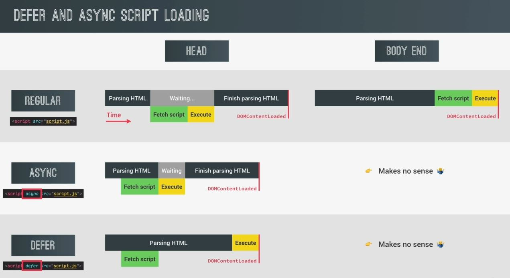
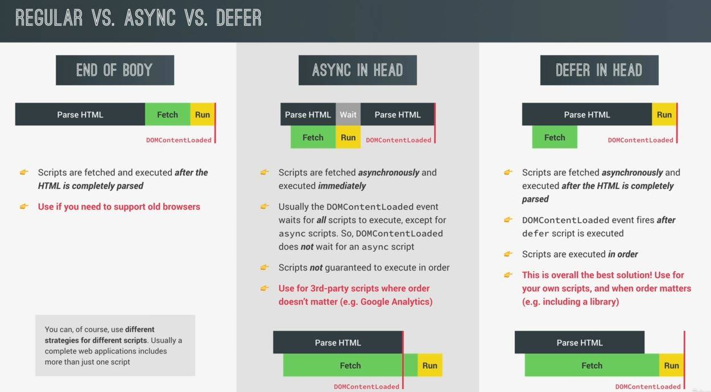
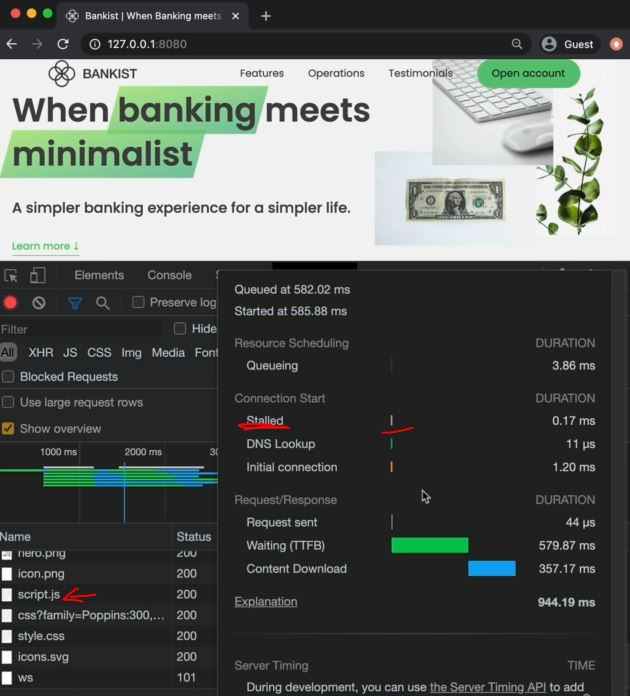

# Efficient Script Loading : defer and async

- different ways of loading JS script in HTML 
    - `1` : normal way which we usually do
    - `2` : `async` attribute of script tag 
    - `3` : `defer` attribute of script tag 

- these async & defer attributes are gonna influence the way in which the JS file is fetched  
    which means downloaded & then executed
- & we have two ways where we can put script tag i.e inside at end of head tag or body tag
    - but if we're using async or defer attributes then we'll be putting our script inside head tag at the very end  
        but we're not doing the same thing inside body tag because this doesn't make any sense ✔️✔️✔️ 

## different ways of loading JS script in html

- `parsing the HTML` means loading the DOM tree  

- so in `async` attribute , `DOMContentLoaded` event doesn't wait for any async script
    - `use case ✅` : use it for 3rd-party scripts where order doesn't matter like google analytics 💡💡💡
    

- we'll do testing inside Network tab 
    - with normal script (which is kept just before the body ending tag)
    - using async script just before the head ending tag
    - using defer script just before the head ending tag
        
        - here we can see that stalled time of script tag is less
        - `stalled` time/period means a beginning time where the time doesn't even loaded  
            but async script tag , will have more stalled time
