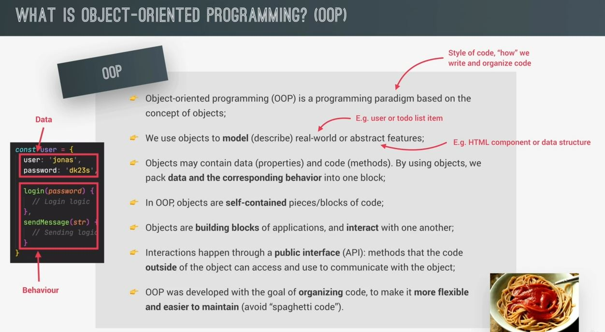
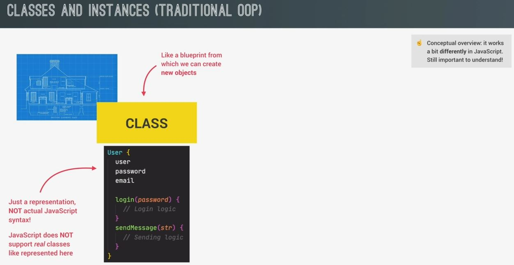
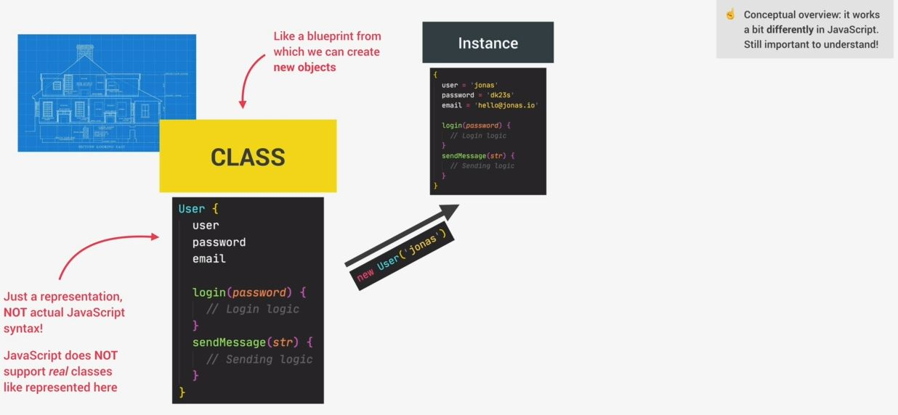
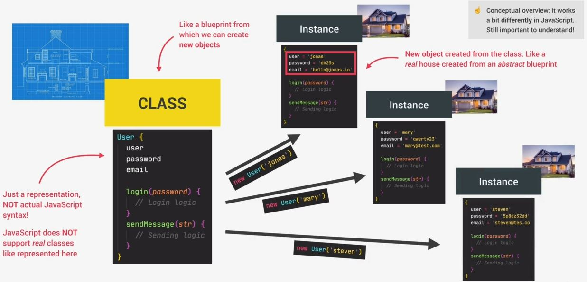
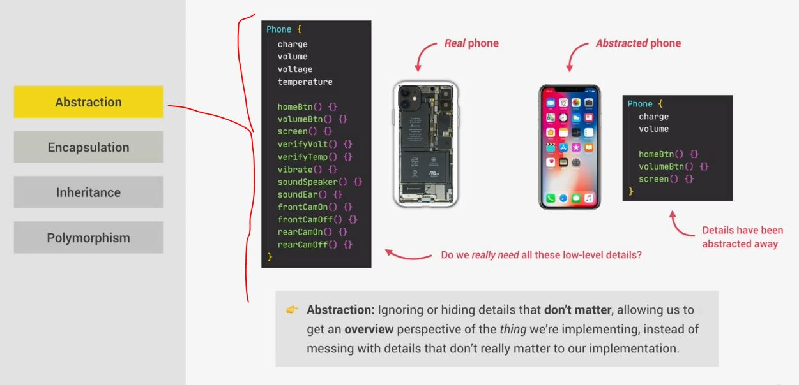
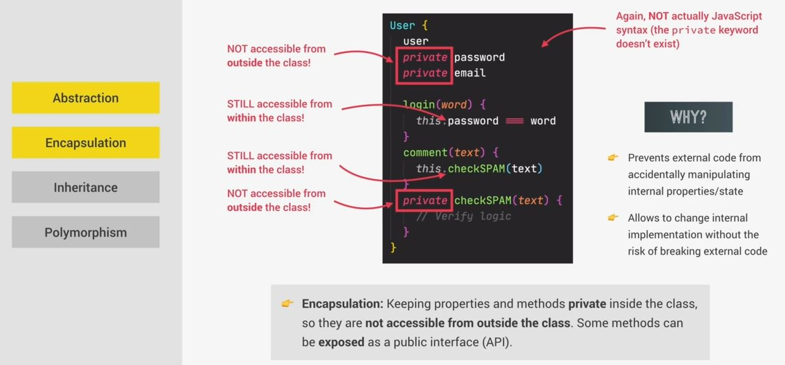
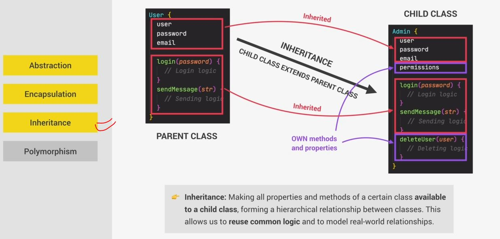
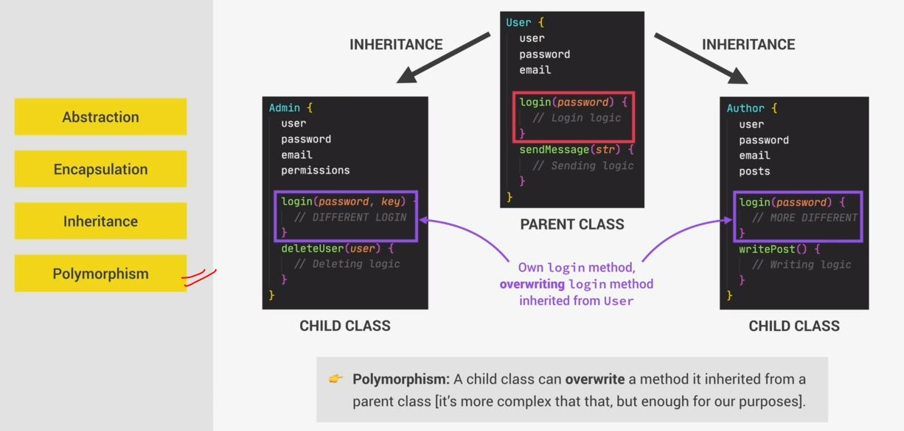

# What is Object-Oriented Programming

- we'll learn about OOP & it's 4 fundamental features

## What is OOP

- it's a programming paradigm which is based on the concept of objects  
    & paradigm simply means the style of the code (means how we write & organize code)
- we use objects to model (means to describe aspects) of real world or abstract features
    - real world means Eg : user or todo list item
    - abstract features means Eg : HTML component or data structure 
- Objects may contain data (which is properties) & code (which is methods)  
    so by using objects , we pack all the data & the corresponding behavior all into one big block (i.e object)  
    & this makes super easy to act directly on the data & blocks are object
- in OOP , objects are self-contained pieces/blocks of code. Eg : small applications on their own    
    & we can use these objects as building blocks of our applications & make objects interact with one another
- Now these interactions happen through a so-called public interface which is also called API  
    & these interface is a bunch of methods which are used outside of the objects & can access to communicate with the object
- `why does OOP exist` : 
    - this paradigm was developed to organizing code , so to make it more flexible & easier to maintain
    - `spaghetti code` means code is not organized & makes hard to maintain large code bases  
        so that's why OOP is created
    - OOP is a most popular programming paradigm in large scale software engineering  
        but it's not the only one programming paradigm of writing organized & maintainable code  
        so one of the most popular paradigm is functional programming 

## classes & instances (traditional OOP) ✅

- a class used to create a new object based on the rules described in the class  
    means it's like a architecture where the architect develops a blueprint to exactly plan & describe a house  
    but the blueprint (means a class) is really just an abstract plan like a set of rules   
    but nothing tangible that you can actually touch . However , from the blueprint, many real houses can then be built  
    in the real world & with classes it's just the same 💡💡💡

- Eg : we have a fictional model in the form of a class
    
    - here we have a username , a password an email which is a description of data about a User  
        but User is not the data itself yet . Because remember , the class is really just a plan  
        & a plan doesn't contain the real world data just yet 💡💡💡
    - & then we have the behavior which is associated with the data eg : login & sendMessage Methods  
        so this class has everything related to a user i.e data/description  
        & behavior all packed into one nice , self-contained block 💡💡💡
    - now let's use that `User` class & actually create a new object/instance from this class like this 
        
        - & we inserted the real data about a user inside the object
    - so a instance/object is a real thing which was created from a class & a class itself isn't an object 💡💡💡  
        so a new object is created from the class like a real house created from an abstract blueprint 💡💡💡  
        now we can use this class to create as many different instances/objects as we need in our application like this 
        
        - just like we can build multiple houses from just one blueprint
    - & all of these instances/objects can have different with little bit similar or complete different data in them  
        but they all share the same functionality i.e login & send messages

## 4 fundamental OOP principles ✅

- now next question is how do we actually design a class or in other words , how we model real-world data into classes  
    so these questions are just like an architecture student asking i.e how do we actually plan & design a house  
    so answer is there's no single way of designing classes , however , 4 fundamental principles  
    which can guide us toward a good class implementation 💡💡💡

- `4 fundamental OOP principles`
    - `1` : abstraction 
    - `2` : Encapsulation
    - `3` : Inheritance 
    - `4` : Polymorphism
- & these are actually techniques that can also be used outside of OOP concept  
    but these fundamental actually define a core of OOP concept 💡💡💡

- `abstraction` : 
    - means hide details which don't matter or relevant for the user
    - it's allows us to get an overview perspective of whatever we're implemented
    - Eg : we define a class which contain all the blueprint stuff to make a phone 
        - but user who is going to interact with the phone doesn't need that all the detailed stuff 
        - so those details have been abstracted away from us as the user & at the end , user will use simple phone  
            has home button , volume , screen , charge , etc which are related to view & interacting stuff 
        - so we're hiding those details which doesn't need for the user & those stuff are handled at the backend  
            which means we're doing abstracting the details which doesn't need the user like this 
            
    - abstraction is generally important in programming , not just in OOP . Eg : using addEventListener() method  
        we just simply used & we don't need to know how addEventListener() working behind the scene

- `encapsulation` : 
    - means keep some properties & methods as private inside only in the class  
        means they're not accessible from outside the class . However , some methods can be exposed as a public interface  
        which is API , so interactions b/w objects happen through a public interface
    - Eg : inside User class , we made the private property like this 
        
        - but in JS , `private` keyword doesn't exist 
        - we can't access those private properties & methods outside the class  
            but we can access them inside the class itself eg : password is important in the login method  
            so inside login method , we can use it 💡💡💡 
    - so we encapsulated & due to this , we prevent external code from accidentally  
        manipulating the internal state (means an object's data) & this is important because allowing external code  
        to manipulate internal state directly can cause many kinds of bugs especially in large code bases 💡💡💡  
        so we want no one else outside of the class to be able to use these properties & methods  
        & due to this , we don't make them part of the public interface
    - so public interface means is all the methods that're not private means they're not encapsulated  
        so make our code private makes easier to change our code without breaking code from the outside .  
        - Eg : if checkSpam() method was public then it could be used anywhere in our code & if we then changed   
            the implementation of the method then it might break that code i.e replying on it 
        - so this helps avoiding bugs & spaghetti code 💡💡💡
    - `Best practices for encapsulation ✅` : 
        - we should always have the goal to encapsulate most of our state/properties & methods 
        - & only leaving essential methods as public 💡💡💡  

- `inheritance` : 
    - Eg : we have two classes i.e User & Admin & both of them have a lot in common
        - so if we create/design another class like this means two separate identities   
            then we'll end up with a lot of duplicate code which is bad 
        - so here comes inheritance , so when we have two classes which are related to each other  
            then we can inherit one class from the other
        - means we have on parent class & one child class & a child class extends/inherit the parent class 💡💡💡 
        - so inheritance allows to reuse the same stuff in child class which has already has in parent class  
            so instead of writing the login logic twice , we can inherit from the parent/global class  
            & child class can have it's own methods & properties means we added some functionality  
            inside the child class 💡💡💡 like this 
            

- `polymorphism` : 
    - polymorphism means many shapes
    - means a child class can overwrite a method which is inherited from a parent class  
    - Eg : so Admin & Author child classes both are special kind of users , so they both inherit from the User class  
        - now focus on login method , let's say an admin requires a different kind of login method Eg : a more secure  
            which has two-factor authentication & let's say we need a special login method for authors 
        - so how we can give them different login methods , so in each class we just write a `new` method  
            which is also called login method & according to polymorphism , that login method will overwrite  
            that login method (which is inherited from the User class) 💡💡💡
            
