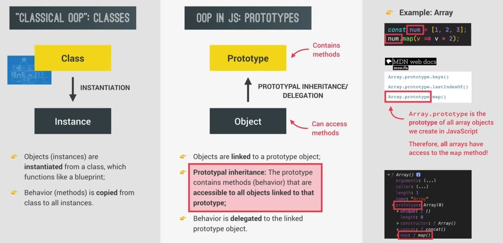

# OOP in JS 

- we'll learn OOP specifically in JS & how it's different from the more traditional OOP

## Explanation 

- `classical OOP` : in previous lecture , we learned about classical OOP i.e classes & objects
    - so that class can be used to create actual objects which are called instances <br>
        & this process of creating an instance is called `instantiation` 💡💡💡 like this 

- `How does OOP work in JS` :
    - in JS , we have prototypes & all objects are linked to a some prototype object means that each object has a prototype
    - so a particular prototype object contains methods & properties that all the objects which are linked to that prototype <br>
        can access & use & this behavior is called prototypal inheritance 💡💡💡
    - `prototypal inheritance` means that all objects that're linked to a certain prototype object <br>
        can use the methods & properties that're defined on that prototype 
    - means objects inherit methods & properties from the prototype & this mechanism called prototypal inheritance 💡💡💡
    - & this prototypal inheritance is different than normal inheritance in OOP 
        - in normal inheritance : one class inheriting from another class 
        - but in prototypal inheritance : an instance inheriting from a class 💡💡💡
    - in prototypal inheritance , we can say that objects delegate behavior to the linked prototype <br>
        & behavior (means methods) . So this mechanism also called delegation because objects delegate <br>
        their behavior to the prototype but in classical OOP with classes, the behavior(means methods) are <br>
        actually copied from the class to the object 💡💡💡

- Eg : of prototypal inheritance
    - each time we used an array method like map() method & we're able to use this method because of prototypal inheritance
    ```js
    const num = [1, 2, 3]
    num.map(v => v * 2)
    ```
    - so when we go to MDN for any array method , then we'll see like this `Array.prototype.map()` <br>
        so here `Array.prototype` is a prototype object of all the arrays method & `Array.prototype` contain all the methods <br>
        so this is place where all the array methods are defined
    - so `array.prototype` is the prototype of the `num` array which means that `num` is linked to that prototype <br>
        that's why `num` has access to all the methods  
    - So we can say our array inherits the map() method <br>
        or that the array delegated the behavior of mapping to it's prototype 💡💡💡 <br>
        don't think that map() method is defined on the `num` array variable
    

## 3 ways of implementing prototypal inheritance in JS 

- how we can actually create prototypes ? & how do we link objects to prototypes ? <br>
    how can we create new objects without having classes 💡💡💡

- `3 ways to implement prototypal inheritance in JS`
    - `1` : constructor function
        - it's a way of creating object programmatically using a function which will also set the new object's prototype
        - this is how built-in objects like Arrays , Map() or Set() constructor are implemented & this is how OOP has been done in JS 
    - `2` : ES6 classes
        - it's more modern way of doing OOP in JS & a alternative of constructor function syntax
        - "Syntactic sugar" : behind the scenes , ES6 classes work exactly like constructor functions <br>
            means behind the scenes , ES6 classes are actually implemented with constructor functions which means they also use prototypal inheritance
        - Es6 classes don't behave like classes in "classical OOP"
    - `3` : Object.create()
        - it's a easiest & most straightforward way of linking an object to a prototype object <br>
            but it's not used as other two ways

- & 4 pillars of OOP is still important with prototypal inheritance 💡💡💡
