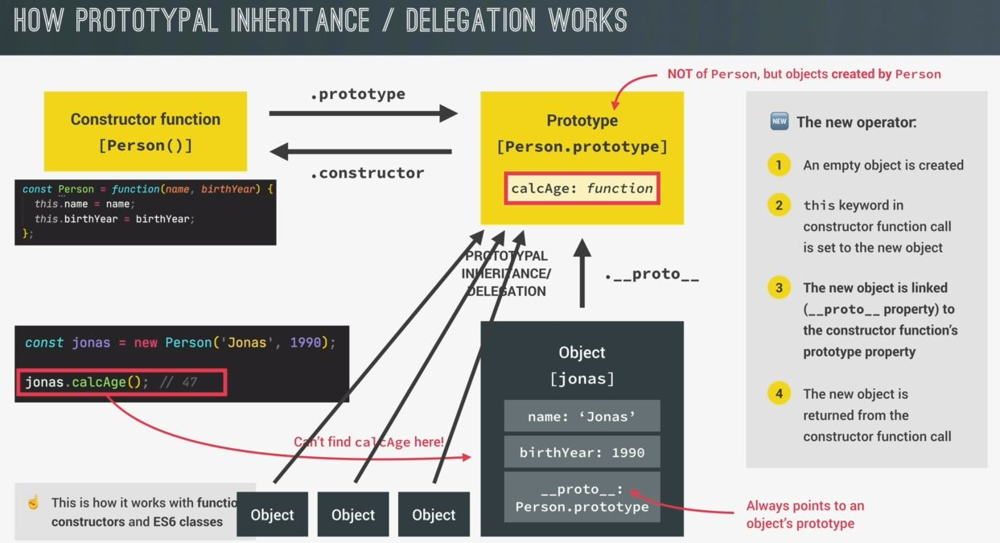
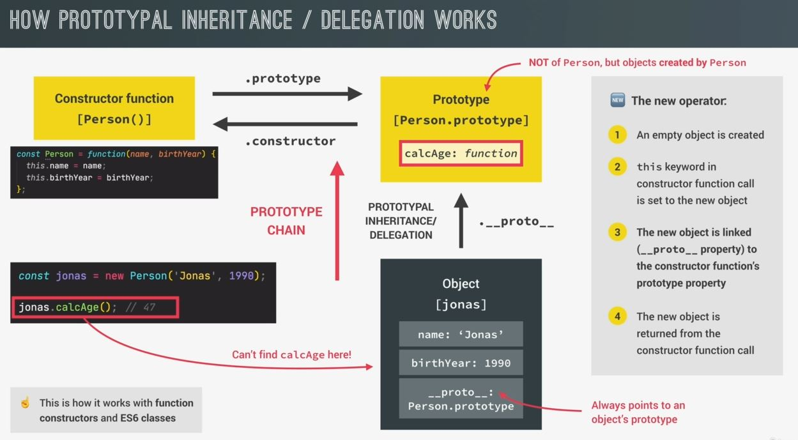
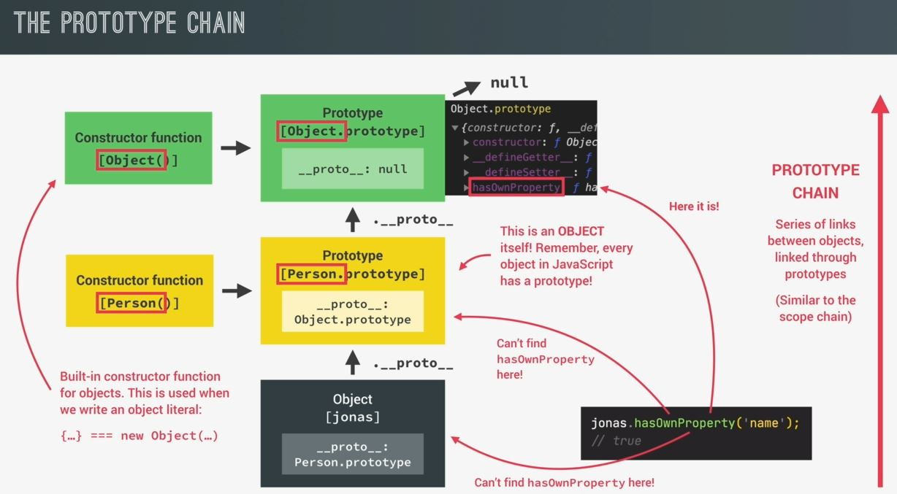

# Prototypal Inheritance and The Prototype Chain

- we'll understand the concept of `prototype` property & prototypal inheritance & the prototype chain in diagram form 

## how prototypal inheritance works 

- `STEP 1` : we'll understand by taking previous example
    - we have `Person` constructor function has a `prototype` property (which is an object) <br>
        & inside the `prototype` object , we defined the calcAge() method & `Person.prototype` has a reference back <br>
        to `Person` constructor function which is the `constructor` property 💡💡💡
        ```js
        const Person = function(firstName, birthYear) {
            this.firsName = firstName
            this.birthYear = birthYear
        }

        const jonas = new Person('Jonas', 1991)
        const matilda = new Person('Matilda', 2017)
        const jack = new Person('Jack', 1975)

        // constructor property
        console.log(`constructor function of the jonas object is ${jonas.constructor}`)
        /* output : constructor function of the jonas object is function Person(firstName, birthYear) {
                        this.firsName = firstName;
                        this.birthYear = birthYear;
                    } 
        */
        ```
        - so `Person.prototype.constructor` will point back to `Person` constructor function itself 💡💡💡
        - Note : `Person.prototype` is actually not equal-to/same to the prototype of Peron
            - but all the objects that're created through the `Person` constructor function
            
    - `STEP 2` : analyze how an object is created using `new` keyword operator & the constructor function
        - so when we call a constructor function through `new` keyword operator then 
            - first thing will happen that is that a new empty object `{ }` is created instantly
            - then the `this` keyword & calling that constructor function will set to that newly created empty object <br>
                so inside that constructor function's execution context , `this` keyword is now the new empty object <br>
                that's why in the constructor function's code , we set the `firstName` & `birthYear` properties on <br>
                that `this` keyword because doing this thing , will ultimately set them inside that new empty object 
        - now here comes magical step , now that new object is linked to the constructor function's `prototype` property <br>
            i.e `Person.prototype` & this happens internally by adding the `__proto__` property to that new object . <br>
            so , `Person.prototype` is now that new object's prototype which is denoted in the `__proto__` property <br>
            of object i.e jonas . so `__proto__` always points to all object prototype & i.e true for all objects in JS 
        - & the each new object will automatically returned from the constructor function call unless <br>
            we explicitly return something else than `this` keyword . But inside a constructor function like `Person` <br>
            we usually never return `this` keyword because behind the scene `return this` will happen automatically <br>
            & the result of the `new` operator & the `Person` constructor function is that a new object <br>
            which we just created programmatically & that new object stored in the `jonas` variable 
        - this whole process is for how `new` keyword works with constructor function & with ES6 classes also <br>
            but now with object
    

    - `why does this work this way & why is this technique so powerful & useful` :  
        ```js
        const jonas = new Person('Jonas', 1990)
        jonas.calcAge()
        ```
        - here we move to jonas.calcAge() . However , actually JS can't find the calcAge() function directly in the jonas object <br>
            so we already observe this behavior
        - now what happens in this situation , so if a property or a method can't be found in a certain object <br>
            then js will look into that object's prototype & there's a calcAge() function , so JS will simply use that one <br> 
            so that's how the calcAge() function can run correctly & return a result <br>
            & this behavior is called `prototypal inheritance/delegation` 💡💡💡 <br>
        - so the jonas object inherited the calcAge() method from it's prototype or in other words <br>
            it delegated the calcAge() functionality to it's prototype 💡💡💡. now the cool thing is that we can <br>
            create as many objects of `Person` as we want & all those objects will inherit that calcAge() method <br>
            without the method being directly attached to all the objects themselves & this is important for <br>
            code performance because imagine , we had a 1000 objects in the code & all of them would have to <br>
            carry the calcAge() function around which will impact the performance so instead of that , <br>
            they can all simply use the calcAge() function from their common prototype 💡💡💡
        - now `jonas` object is connected to a prototype & ability of looking up methods & properties in a prototype which <br>
            is called prototype chain 💡💡💡 , so the `jonas` object & it's prototype basically form a prototype chain 💡💡💡 <br>
            but actually the prototype chain doesn't end here 
    

- `prototype chain ✅` : 
    - we have `Person` constructor function & it's prototype property & to `jonas` object linked to it's prototype <br>
        via/through the `__proto__` property
    - & `Peron.prototype` itself is also an object & all objects in JS have a prototype . <br>
        That's why , `Person.prototype` itself must also have a prototype & the prototype of `Person.prototype` <br> 
        is `Object.prototype` & why it this because Person.prototype is just a simple object which means <br>
        that it has been built by built in object constructor function & this is actually the function <br>
        which is called behind the scenes whenever we create an object literal (means simple object with curly braces) <br>
        so the curly braces are just like a shortcut to write a new object
    - so important thing is `Person.prototype` itself needs to have a prototype & since it has been created <br>
        by the object constructor function . so it's prototype is gonna be object.prototype <br>
        & same thing with the `jonas` object . so , since jonas has been built by a Person , so `Person.prototype` of jonas
    - now this entire series of links b/w the objects is called the prototype chain & `object.__proto__` is usually <br>
        the top in the prototype chain 💡💡💡 which means that it's prototype is null so `__proto__` will point <br>
        to null which marks the end of the prototype chain
    - `scope chain vs prototype chain` : 
        - so in a certain way , the prototype chain is very similar to the scope chain but with prototypes <br>
            so in the scope chain , whenever JS can't find a certain variable in a certain scope then JS looks <br>
            into the next scope & a scope chain & tries to find the variable there <br>
        - on the other hand , in the prototype chain , whenever JS can't find a certain property or method in a certain object <br>
            then JS look up into the next prototype in the prototype chain & if it can find it there
        - so the prototype chain pretty same to the scope chain but working of with scopes , <br>
            it works with properties & methods in objects 💡💡💡
    - Eg : let's see another example of a method lookup i.e `hasOwnProperty()` method of object
        - we call `hasOwnProperty()` method on the `jonas` object
        - so JS gonna try to find that called method on the object itself . it can't find the has own property method on jonas <br>
            so , according to how the prototype chain works , JS will look into it's prototype which is `Person.prototype` <br>
        - now , we didn't define any `hasOwnProperty()` method of object inside `jonas.__proto__` , so JS will not gonna <br>
            find this method there that's why it'll move up even further in the prototype chain & now look into Object.prototype <br>
            & `Object.prototype` does actually contain a bunch of build-in methods & `hasOwnProperty()` is one of them <br> 
            so JS can take that method from inside `Object.prototype` & run it on the `jonas` object property <br>
            as if `hasOwnProperty()` method had been defined directly on `jonas` object & <br>
            Note : that method has not been copied to the `jonas` object . Instead , it simply inherited <br>
            the method from `Object.prototype` via the prototype chain 💡💡💡
    

## conclusion

- this is the magic of prototype & prototype chain & this will actually become even more interesting <br>
    & useful once we add inheritance b/w two different kinds of objects or two different classes ✔️✔️✔️
