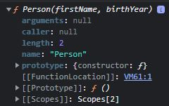

# Prototypal Inheritance on Built-In Objects

- prototypal inheritance & the prototype chain on built-in objects

## prototypal inheritance & the prototype chain

- Eg 1 : of prototype of prototype of the object
    ```js
    const Person = function(firstName, birthYear) {
        this.firsName = firstName
        this.birthYear = birthYear
    }

    const jonas = new Person('Jonas', 1991)
    const matilda = new Person('Matilda', 20)

    // checking prototype of the prototype of the object
    console.log(jonas.__proto__.__proto__) // we'll get the prototype property of object
    // output : inside that object , we'll see methods that we already used like hasOwnProperty() method
        // that's why we can use hasOwnProperty() method directly on the object
        // because of the prototype chain 💡💡💡
    ```
    - Eg 1.1 : of prototype of prototype of prototype of the object
        ```js
        console.log(jonas.__proto__.__proto__.__proto__) // output : null
            // we got null because object.prototype is usually the top 
                // of the scope chain i.e jonas.__proto__.__proto__ 💡💡💡
        ```

- Eg 2 : of `constructor` property of `prototype` object/property of the Constructor function
    ```js
    console.log(Person.prototype.constructor) // output : we'll get the constructor function itself
    ```
    - now to inspect the constructor function then use `console.dir()`
        ```js
        console.dir(Person.prototype.constructor) 
        ```
        
    - now let's take a look at the prototype of a function means any function is also an object <br>
        that's why it also has a `prototype` property 💡💡💡 <br>
        for Example : let's see the prototype property of an array 
        ```js
        const arr = [1, 2, 3, 4,5, 6]
        console.log(arr.__proto__)
            // output : we'll get the object i.e prototype of a array
                // & inside of the object , we have all the methods of the array 💡💡💡
                // that's why array variable get access to all of these methods
                // means each array doesn't contain all those array methods 
                    // means each array will inherit these methods from it's prototype 💡💡💡

        console.log(arr.__proto__ === Array.prototype) // output : true
            // means the prototype property of the constructor function i.e Array is equal-to 
                // the prototype of all the objects created by that constructor 💡💡💡
            // so writing an array like this shorthand i.e const arr = [1, 2, 3, 4, 5, 6] is 
                // same as new Array(1, 2, 3, 4, 5, 6)
                // that's why whenever we create an array like this [1, 2, 3, 4, 5, 6] 
                    // behind the scene , Array() constructor will be created for these elements 💡💡💡
        ```
        - if we print value of `arr` variable inside console tab , then we'll get output & when we open it <br>
            then inside of it , we can see `__proto__` property & `__proto__` is a also an object <br>
            which contain all the array methods 💡💡💡
        - even when we check array `filter()` method on mdn then we'll see `Array.prototype.filter()` <br>
            becaus this filter() method live in the `prototype` object/property of the Array constructor 
        - so prototypal inheritance is the mechanism to reusing code , so all the arrays will get access <br>
            these array methods through the prototype chain & prototypal inheritance 💡💡💡

- Eg 3 : now we know that any array inherits all their methods from it's prototype
    - now we'll use this knowledge to extend the functionality of arrays
    ```js
    // STEP 1 : 
        Array.prototype

    // STEP 2 : now we can create a method on this prototype object/property & all the arrays will inherit it 💡💡💡
        // let's create a function which return a unique elements 
        const arr = [1, 2, 4, 3, 4, 5, 6]

        Array.prototype.unique = function() {
            return [...new Set(this)]
        } 
        
        console.log(arr.unique()) // output : [1, 2, 4, 3, 5, 6]
    ```
    - `best practices ✅` : 
        - however , generally extending the `prototype` object/property of a built-in object is not a good idea 💡💡💡
        - means just working on a small project on your own then we can do this . But don't get into the habit <br>
            of doing this for multiple reasons
        - `1st reason` : is that the next version of JS might add a method with same name (which we're adding)
            - then that method will work in a different way means that method use as the `new` method <br>  
                which eventually break the code
        - `2nd reason` : don't do because when you work on a team of developers then this really gonna be bad idea
            - because if multiple developers implement the same method with a different name <br>
                then that's just going to create so many bugs 
        - so for experiment , we can do this but in practice or real work , never don't do it 

- Eg 4 : built-in objects
    ```js
    // 1 - we know that behind the scenes , all the DOM elements are objects 💡💡💡 
    const h1 = document.querySelector('h1')
    console.dir(h1) // output : we'll get the actual object i.e h1 which contain all the properties & methods 
        // but at the bottom , we'll see prototype like this __proto__ : HTMLHeadingElement
            // & inside of that __proto__ object/property contains a lot of information
            // & inside of __proto__ : HTMLHeadingElement , there's __proto__: HTMLElement 💡💡💡
            // so behind the scenes, these different elements are really different like constructor functions 💡💡💡
                // means even if we go inside  __proto__: HTMLElement , 
                // then we'll see at the bottom i.e __proto__ : Element 
                // which means HTMLElement was a child element of element & element itself was a child of node 
                    // that's why the prototype of element is gonna be node 💡💡💡
             // so if we go inside __proto__ : Element & at the bottom , we'll see __proto__ : Node 
                // & then this -> __proto__ : Node , has __proto__ : EventTarget & further more we can go
        // so this is hue prototype chain
    ```
    - Eg 4.1 : a function is also an object 
        ```js
        console.dir(x => x + 1) // output : we'll get anonymous() & inside of it we'll see __proto__ : f()
            // so that's why function also has a prototype property 💡💡💡
            // & that prototype contain the methods which we used on functions like apply() , bind() , etd
            // so that's the reason , we can actually call methods on functions
                // because they're objects & objects have prototypes
        ```
