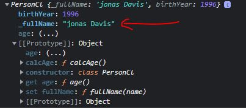

# Setters and Getters

- getters & setters are the feature of objects 
- so every object can have setter & getter properties & we call these special properties assessor properties <br>
    while the more normal properties are called data properties ✔️✔️✔️

- `about getters & setters` : these are basically functions which is used to get & set a value 
    - `get` : means to get/retrieve the value 
    - `set` : means to set/add/update the value , but we don't return anything 💡💡💡

## Example - of getters & setters

- Eg 1 : of getter
    - for getter , we use `get` operator before the function name of that object
    - `get` keyword operator used to access a getter method of that object as in property form , not as a method 💡💡💡
    - Note : we return something from the getter method by using `return` keyword <br>
        but in setter method , we don't return anything because setter method used to set/update the value/something 💡💡💡
    ```js
    const account = {
        owner: 'jonas' , 
        movements: [200, 530, 120, 300], 

        get latest() {
            return this.movements.slice(-1).pop() 
        }
    }

    console.log(account.latest) // here access that latest() method as in property form 💡💡💡 
        // so use get -> keyword operator if you want to access that method of that object as in property form 💡💡💡
    ```

- Eg 2 : of setter
    - we use `set` keyword operator to set/add/update something like updating the value of a property <br>
        inside that method of that class or that normal object as in property form 💡💡💡
    ```js
    const account = {
        owner: 'jonas' , 
        movements: [200, 530, 120, 300], 

        get latest() {
            return this.movements.slice(-1).pop() 
        } ,
 
        // Note ✅ : we use same method name for setter function & getter function because of readability 💡💡💡
            // any setter method of that object always takes one argument to set the value 💡💡💡 
        set latest() {
            this.movements.push(mov)
        }
    }

    console.log(account.latest) 

    account.latest = 50
    console.log(account.movements) // output : [200, 530, 120, 300, 50]
    ```

- Eg 3 : we can use getter & setter inside with methods which are defined inside a class
    ```js
    class PersonCl {
        constructor(firstName , birthYear) {
            this.firstName = firstName
            this.birthYear = birthYear
        }

        // methods 
        calcAge() {
            console.log(2037 - this.birthYear)
        }

        get age() {
            return 2037 - this.birthYear
        }
    }

    // creating objects
    const jonas = new PersonCl('jonas' , 1996)
    console.log(jonas.age) // output : 41
    console.log(jonas) // output : inside of it's object , inside it's prototype 
        // we'll see that age as a property & it's value  but at the bottom we'll also having get age() function
    ```

## use case of getter & setter ✅ 

- we can use getter & setter for data validation 💡💡💡
- Eg : checking data validation by using getter & setter inside the class
    - `STEP 1` : here we're creating a setter which will check whether that name if full name or not 
        ```js
        class PersonCl {
            constructor(fullName , birthYear) {
                this.fullName = fullName
                this.birthYear = birthYear
            }

            // methods 
            calcAge() {
                console.log(2037 - this.birthYear)
            }

            get age() {
                return 2037 - this.birthYear
            }

            // so here we need to think that fullName property already exist & 
                // & we're using fullName() function as a property by using setter 
                    // to validate the actual fullName property 💡💡💡
            set fullName (name) {
                console.log(name) 
                // includes() is a method of both string & array 💡💡💡 
                if (name.includes(' ')) this.fullName = name
                else alert(`${name} is not a full name!`)
            }
        }

        // creating objects
        const jonas = new PersonCl('jonas Davis' , 1996)
        console.log(jonas) 
        // ultimately , we'll get an error i.e max call stack exceed
        ```
    - `STEP 2` : here's a conflict that both i.e the setter function & that constructor function are trying to set the exact same <br>
        - property name , so to solve this we can use `_` underscore before the `this.fullName` inside that setter function like this 
        ```js
        class PersonCl {
            constructor(fullName , birthYear) {
                this.fullName = fullName
                this.birthYear = birthYear
            }

            // methods 
            calcAge() {
                console.log(2037 - this.birthYear)
            }

            get age() {
                return 2037 - this.birthYear
            }

            set fullName (name) {
                console.log(name) 

                // Note ✅ : when we have a setter function which is trying to set a property which already exist
                    // then we use underscore sign as a convention before that property 
                        // name inside the setter function 💡💡💡
                        // like this -> this._fullName , due to this it'll become a different variable name
                            // to avoid that naming conflict , however when we use this underscore convention , 
                                // then we're actually creating a new variable i.e new fullName variable 💡💡💡
                    // & that's the convention means made by the programmers , it's not a JS feature  
                if (name.includes(' ')) this._fullName = name
                else alert(`${name} is not a full name!`)
            }
        }

        // creating objects
        const jonas = new PersonCl('jonas Davis' , 1996)
        console.log(jonas) 
        ```
    
    - so inside the object of jonas , we can see that property exist with underscore i.e `_fullName` <br>
        but when we access `jonas.fullName` then we'll get undefined , so to fix this we'll use getter function 💡💡💡
    - `STEP 3` : creating getter function
        ```js
        class PersonCl {
            constructor(fullName , birthYear) {
                this.fullName = fullName
                this.birthYear = birthYear
            }

            calcAge() {
                console.log(2037 - this.birthYear)
            }

            get age() {
                return 2037 - this.birthYear
            }

            set fullName (name) {
                console.log(name) 

                if (name.includes(' ')) this._fullName = name
                else alert(`${name} is not a full name!`)
            }

            get fullName() {
                return this._fullName
            }

            // Note : for getting or setting/updating the property by using getter & setter functions 🔥 
                // whenever we're using getter & setter then 
                // that both getter function & setter function must has same function name 
                    // & when we're using the same property (which is defined inside the constructor function)
                    // inside that getter function & setter function then , we use _ (underscore sign convention)
                    // to avoid the conflict of having same property name 💡💡💡 
        }

        const jonas = new PersonCl('jonas Davis' , 1996)
        console.log(jonas)
        ```
        - output : now when we do `jonas.fullName` then we'll get it's value as a output
            - but actual property i.e `_fullName` will set/added inside the jonas object <br>
                & also the `fullName` property without underscore 
    - checking when we pass first name only 
        ```js
        const walter = new PersonCl('walter', 1965) // output : we'll get alert message
        console.log(walter) // output : we'll not get any fullName property
        ```

- `said by jonas` : we don't need to use getter & setter most of the time , because this feature use rarely
    - but sometimes it's nice to use these features , so use this when we're dealing with classes <br>
        or creating a normal object & want to validate the data then use getter & setter 💡💡💡
