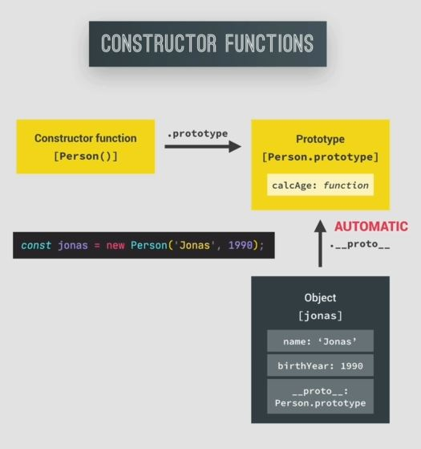
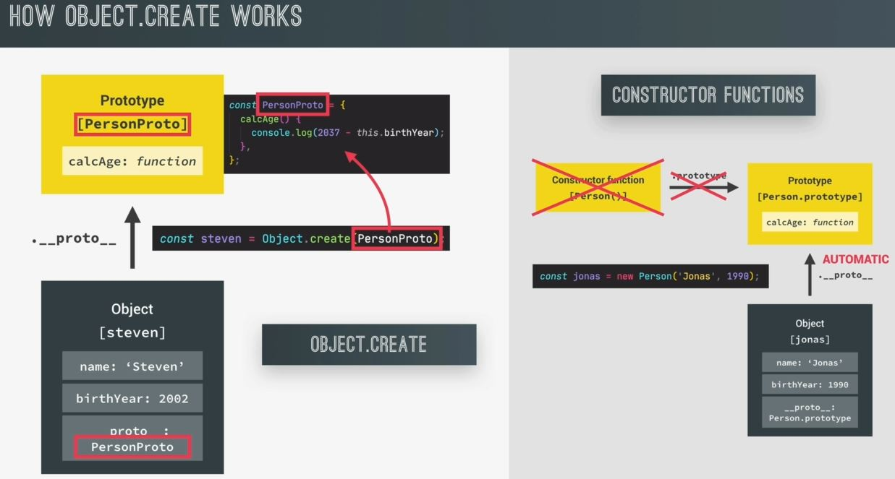

# Object.create() method

- 3rd way to implement prototypal inheritance/delegation by using Object.create() <br>
    which works in different way than the constructor functions & classes work 💡💡💡 
- to implement the idea of prototypal inheritance without using no `prototype` property & no constructor function <br>
    & no `new` keyword operator involved then we can use Object.create() to manually set the prototype of an object <br>
    to any other object 💡💡💡

## Example - of Object.create() method to implement idea of prototypal inheritance

- if we want to set the `prototype` of a object to any object , first we need to create an object <br>
    which we want to be the prototype of all the objects of that class 💡💡💡

- Eg : of Object.create() method to implement idea of prototypal inheritance
    - `Note` : inside prototype object , we put only the methods , not the properties 💡💡💡 
    - `STEP 1` : globally , creating prototype object of that class 
        ```js
        const PersonProto = {
            // put all the methods here which we created inside PersonCl class
            calcAge() {
                console.log(2037 - this.birthYear)
            }
        }

        class PersonCl {
            constructor(fullName , birthYear) {
                this.fullName = fullName
                this.birthYear = birthYear
            }

            static hey() {
                console.log("hey there")
            }
        }
        ```
        - so all the methods will be putted inside the `PersonProto` prototype object <br>
            which we want objects (of the `Person` class) to inherit
        - so that's why we put them inside the prototype object
    - `STEP 2` : using Object.create() method
        - `Object.create()` method 
            - it's a method of `Object` constructor class function 
            - it's used to make that object (of `Person` class) with the `PersonProto` object as the prototype <br>
                means it creates a new object by using the prototype of an existing object of the newly created object 💡💡💡
        ```js
        const PersonProto = {
            calcAge() {
                console.log(2037 - this.birthYear)
            }
        }

        const steven = Object.create(PersonProto)
            // here PersonProto object becomes the prototype of steven object 💡💡💡
        console.log(steven) // output : {} -> we don't any properties inside steven object
            // inside this empty object , there's is a __proto__ : Object
            // & inside __proto__ : Object , we'll be having calcAge() method 

        // putting properties inside steven object
        steven.name = "Steven"
        steven.birthYear = 2002
        steven.calcAge() // output : 35
        ```

- Eg : of checking whether steven object is linked to the prototype of Person class or not
    ```js
    const PersonProto = {
        calcAge() {
            console.log(2037 - this.birthYear)
        }
    }

    const steven = Object.create(PersonProto)
    console.log(steven) 

    steven.name = "Steven"
    steven.birthYear = 2002
    steven.calcAge()

    // checking 
    console.log(steven.__proto__) // output : {calcAge: f}
    console.log(steven.__proto__ === PersonProto) // output : true 
    ```

- Eg : of creating a function like a constructor to create the properties inside of creating globally 
    ```js
    const PersonProto = {
        calcAge() {
            console.log(2037 - this.birthYear)
        }

        // using function like constructor to put all the properties inside of the function
            // but the function will be different than the actual constructor function 
                // because we're not using the new -> keyword operator 
            // this is the manual way of initializing objects 💡💡💡
        init(firstName, birthYear) {
            this.firstName = firstName
            this.birthYear = birthYear
        }
    }

    const steven = Object.create(PersonProto)

    // globally created properties
    steven.name = "Steven"
    steven.birthYear = 2002
    steven.calcAge()

    const sarah = Object.create(PersonProto)
    sarah.init('Sarah' , 1979)
    sarah.calcAge() // output : 58
    ```

## understanding prototype & prototypal inheritance via diagram

- working of prototype in the constructor function or a class <br>
    
    - so when we use the `new` keyword operator in while calling the constructor function or a class
    - then that `new` keyword operator , behind the scene automatically sets the `prototype` of the instances/objects <br>
        to the `prototype` property of the constructor  
    - so this is happen automatically
- working of prototype with Object.create() method
    - through Object.create() method , we can set the prototype of objects manually to any object that we want
    - so here we're manually set the prototype of the `steven` object to the `PersonProto` object <br>
        & now those two objects are linked through the `__proto__` property
    - so if we look inside `__proto__` property for properties or methods in a prototype chain <br>
        works just like in the constructor function or in class 
    - difference b/w working of prototype in the constructor function or a class & rototype with Object.create() method
        - we didn't need any constructor function & also no `prototype` property & no `new` keyword operator 
    

- we're learning about Object.create() method because in real world 
    - Object.create() method used very less of implementing prototypal inheritance 
    - but it's still important because we'll see this Object.create() in real life also
    - & important thing i.e we need Object.create() to link prototypes in order to implement <br>
        inheritance b/w classes 💡💡💡 , so Object.create() is important in OOP 

- `use case of Object.create() method` : will come when we want to create prototype object manually <br> 
    for that Class or the constructor function

## Extra notes 

- https://developer.mozilla.org/en-US/docs/Web/JavaScript/Reference/Global_Objects/Object/create
- https://www.programiz.com/javascript/library/object/create
- https://www.javatpoint.com/javascript-object-create-method
- https://medium.com/@happymishra66/object-create-in-javascript-fa8674df6ed2
- https://www.w3schools.com/js/js_object_definition.asp
- https://www.geeksforgeeks.org/object-create-javascript/
