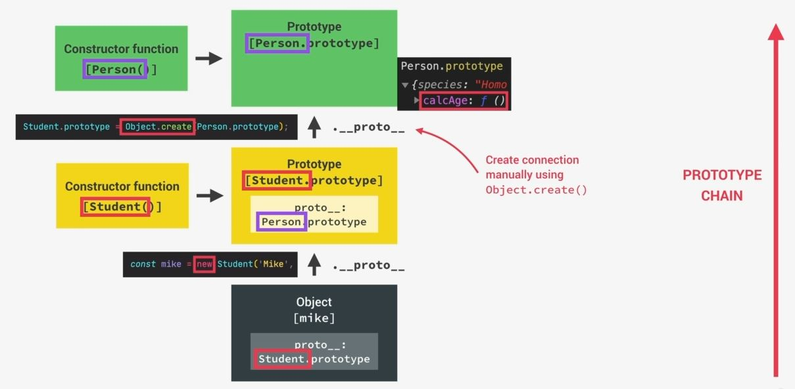

# Inheritance Between Classes & Constructor Functions

- so in previous lectures , we learned about how prototype inheritance works in JS <br>
    & we did that by using different techniques so we use constructor function , ES6 classes & Object.create() method
- now all these techniques allows the object to inherit methods from it's prototypes <br>
    or means to delegate behavior of that class to the prototype of that class 💡💡💡

## Inheritance b/w classes or subClasses

- so real inheritance means b/w classes b/w classes means not just prototypal inheritance <br>
    b/w instances & prototype property but real classes & core OOP doesn't exists in JS 
    
    - here we created the `Student` class make it inherit from the `Person` class <br>
        so `Person` class will be parent class & `Student` class will be child/sub class <br>
        here `Student` sub class is also a person but it's more specific ✔️✔️✔️
    - & in sub class , there will be some additional features with including feature of it's parent class 💡💡💡

- Eg : Inheritance b/w classes or sub classes
    ```js
    const Person = function(firstName, birthYear) {
        this.firstName = firstName ;
        this.birthYear = birthYear ;
    }

    Person.prototype.calcAge = function() {
        console.log(2037 - this.birthYear)
    }

    const Student = function(firstName, birthYear , course) {
        this.firstName = firstName ;
        this.birthYear = birthYear ;
        this.course = course
    }

    Student.prototype.introduce = function() {
        console.log(`My name is ${this.firstName} and I study ${this.course}`)
    }
    
    const mike = new Student('Mike', 2020, 'Computer Science')
    mike.introduce()
    ```
    - here we can see that we just copy the properties of `Person` parent class & putted inside the `Student` child/sub class <br>
        so duplicate code is not good idea because of two reasons 💡💡💡
        - `1` : due to DRY principle 
        - `2` : Imagine that implementation of that `Person` parent class changes in the future 

    - `STEP 1` : removing duplicate code from `Student` child class by just calling Parent class 
        ```js
        const Person = function(firstName, birthYear) {
            this.firstName = firstName ;
            this.birthYear = birthYear ;
        }

        Person.prototype.calcAge = function() {
            console.log(2037 - this.birthYear)
        }

        const Student = function(firstName, birthYear , course) {
            Person(firstName, birthYear) // output : error come with undefined
                // because we're calling this Person constructor function as a regular function call 
                // in normal function call , this -> keyword is set to undefined 💡💡💡

            this.course = course
        }

        Student.prototype.introduce = function() {
            console.log(`My name is ${this.firstName} and I study ${this.course}`)
        }
        
        const mike = new Student('Mike', 2020, 'Computer Science')
        mike.introduce()  
        ```

    - `STEP 2` : setting `this` keyword on that Person constructor function call
        - so whenever we're calling parent class inside the child class , then to set the `this` keyword manually <br>
            on that parent class , we use `call()` method
        ```js
        const Person = function(firstName, birthYear) {
            this.firstName = firstName ;
            this.birthYear = birthYear ;
        }

        Person.prototype.calcAge = function() {
            console.log(2037 - this.birthYear)
        }

        const Student = function(firstName, birthYear , course) {
            Person.call(this, firstName, birthYear) 
                // means here we define this -> keyword as first argument 
                    // because this -> keyword will be the empty object in the beginning which is created 
                        // by the new -> keyword i.e new Student() , 
                        // & on that newly object , we'll set firstName & birthYear 💡💡💡
                // Note : used to invoke/call a method with an owner object as an argument or parameter. 
                    // With call() , an object can use a method belonging to another object
                    // here this -> keyword means Person constructor function itself 💡💡💡
                 
            this.course = course
        }

        Student.prototype.introduce = function() {
            console.log(`My name is ${this.firstName} and I study ${this.course}`)
        }
        
        const mike = new Student('Mike', 2020, 'Computer Science')
        mike.introduce() // output : My name is Mike & I study Computer Science
        ```
    - so far we did this <br>
        
        - so we created `Student` constructor function & it's `prototype` property <br> 
            & then `mike` object is linked to `Student` prototype & that prototype is <br>
            the Student constructor function prototype property
        - & the Student constructor function prototype property & this is linked b/w instance & prototype <br> 
            has been made automatically by create a `mike` object with the `new` keyword operator 
        - & `Student` child class is also a Person , so we want these both should be connected like this 
            
            - so we want that `Student` should be the child class & inherit from the Person parent class <br>
            - & due to this , all the instances/objects (of Student class) can have a access to methods from the Person <br>
                `prototype` property like calcAge() , etc through the prototype chain like this 
            
    - so the complete idea of inheritance is that the child classes can share behavior/methods & properties from <br>
        the parent class , so we want to make `Person.prototype` the prototype of the `Student.prototype` <br>
        means we want to make `__proto__` property of `Student.prototype` to the `Person.prototype` like this
         <br>
        but we need to create this connection manually b/w these two objects we use Object.create() like this
         

    - `STEP 3` : building connection b/w those to prototype objects of Student & Person
        ```js
        const Person = function(firstName, birthYear) {
            this.firstName = firstName ;
            this.birthYear = birthYear ;
        }

        Person.prototype.calcAge = function() {
            console.log(2037 - this.birthYear)
        }

        const Student = function(firstName, birthYear , course) {
            Person.call(this, firstName, birthYear) 
                 
            this.course = course
        }

        // linking prototypes
        Student.prototype = Object.create(Person.prototype)
            // now Student.prototype object is now a object which inherits stuff of Person.prototype object 💡💡💡
            // & here we didn't do this without Object.create() like this Student.prototype = Person.prototype
                // because that will not work
        
        // now we need to make the connection because Object.create(Person.prototype) will create an empty object
            // & due to that , Student.prototype object will be empty

        Student.prototype.introduce = function() {
            console.log(`My name is ${this.firstName} and I study ${this.course}`)
        }
        
        const mike = new Student('Mike', 2020, 'Computer Science')
        mike.introduce()
        mike.calcAge() // output : 17
        ```
        - `Note - why we need Object.create() method ✅` : why we didn't did this `Student.prototype = Person.prototype`
            - because we'll get the connection b/w them & prototype chain will not be created , then we'll get this
             
            - because we're actually setting the value like we normally do 
            - so we don't want that , we actually need the connection b/w those two prototype of those two object <br>
                that's why we need Object.create() method 💡💡💡
        
    - let's understand how prototype chain is working 
        - so when we do `mike.calcAge()` which means we're looking for a method , so JS will try to find that method <br>
            or property & we now that `calcAge()` method is not directly presented inside `mike` object <br>
            even not inside the mike's prototype <br>
        - so when that method or a property not presented inside the prototype of that object then JS will further lookup <br>
            inside the prototype chain & JS look into the prototype of it's parent 💡💡💡
        - now JS will finally find , calcAge() function inside `Peron.prototype` , <br>
            now `mike` object can inherit from it's Parent class like this
             

    - `STEP 4` : checking prototype of mike object
        ```js
        console.log(mike.__proto__) // output : Person {introduce: f}
            // & inside of Person {introduce: f} , there's is a __proto__ : Object 

        // seeing further prototype 
        console.log(mike.__proto__.__proto__) // output : {calcAge: f, constructor: f}  
            // now this {calcAge: f, constructor: f}  is the prototype of Person parent class

        console.log(mike) // output : we'll get mike object
            // & inside of it , we'll see __proto__ : Person --> which is a mistake that we need to fix as Student
            // & then inside of __proto__ : Person & at the bottom we'll see __proto__ : Object 
            // then inside __proto__ : Object , we'll see calcAge() function
                // so this function is inside the prototype of the prototype 
        ```
        - now let's fix that issue , so `console.dir(Student.prototype.constructor)` should be Student constructor <br>
            but we'll get `Person` constructor function because we set the prototype property of the Student <br>
            by using Object.create() & due to this , the constructor of `Student.prototype` is still Person 💡💡💡
        - `STEP 4.1` : fix the problem
            ```js
            const Person = function(firstName, birthYear) {
                this.firstName = firstName ;
                this.birthYear = birthYear ;
            }

            Person.prototype.calcAge = function() {
                console.log(2037 - this.birthYear)
            }

            const Student = function(firstName, birthYear , course) {
                Person.call(this, firstName, birthYear) 
                     
                this.course = course
            }

            // linking prototypes
            Student.prototype = Object.create(Person.prototype)

            Student.prototype.introduce = function() {
                console.log(`My name is ${this.firstName} and I study ${this.course}`)
            }
            
            const mike = new Student('Mike', 2020, 'Computer Science')
            mike.calcAge()

            Student.prototype.constructor = Student 
                // setting constructor of Student.prototype as Student constructor function itself 💡💡💡
            console.dir(Student.prototype.constructor) // output : Student constructor function will be printed

            // checking whether prototype chain is setup properly or not 💡💡💡
                console.log(mike instanceof Student) // output : true
                console.log(mike instanceof Person) // output : true
                    // console.log(mike instanceof Person) is also giving true 
                        // because we linked the prototypes together
                            // but if we remove Object.create(Person.prototype) then we'll get an error 
                            // & we can't access calcAge() function
                
                // now mike object is also a instance of Object  
                    // because mike object is also in prototype chain of Object 
                console.log(mike instanceof Object) // output : true

            // so we successfully setup the prototype chain 
                // because through this we'll able to change/manipulate the prototype chain manually 💡💡💡
            ```
