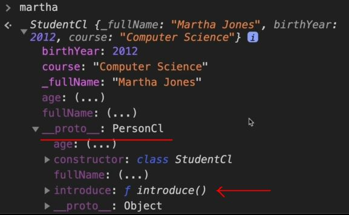

# Inheritance b/w Classes by using ES6 Classes

- we'll implement Inheritance b/w classes by using ES6 classes instead of constructor functions <br>
    & we already know that ES6 classes is just a layer which hides the working of the constructor function 
- Inheritance is useful for code reusability: 
    - reuse properties and methods of an existing class when you create a new class. 💡💡💡

## Example 

- testing code
    ```js
    class PersonCl {
        constructor(fullName , birthYear) {
            this.fullName = fullName
            this.birthYear = birthYear
        }

        calcAge() {
            console.log(2037 - this.birthYear)
        }

        get age() {
            return 2037 - this.birthYear
        }

        set fullName (name) {
            console.log(name) 

            if (name.includes(' ')) this._fullName = name
            else alert(`${name} is not a full name!`)
        }

        get fullName() {
            return this._fullName
        }
    }

    const jonas = new PersonCl('jonas Davis' , 1996)
    console.log(jonas)
    ```

- `STEP 1` : implementing Inheritance b/w classes by using ES6 classes
    - we need both a `extends` keyword & a `super()` function to implement inheritance b/w parent class & child classes
    - `extends` keyword used keyword is used to create a child class of another/parent class.
    - `super()` function 
        - it's used/called inside the constructor() function of the child class to call the constructor <br>
            of its parent class to access the parent's properties and methods. 💡💡💡
        - it's called via a parenthesis when we want to access properties of the parent class <br>
            & to access methods (of the parent class) we use dot operator on this `super` <br>
            inside the constructor function of the child class 💡💡💡 just like we do with normal function
    ```js
    class PersonCl {
        constructor(fullName , birthYear) {
            this.fullName = fullName
            this.birthYear = birthYear
        }

        calcAge() {
            console.log(2037 - this.birthYear)
        }

        get age() {
            return 2037 - this.birthYear
        }

        set fullName (name) {
            console.log(name) 

            if (name.includes(' ')) this._fullName = name
            else alert(`${name} is not a full name!`)
        }

        get fullName() {
            return this._fullName
        }
    }

    const jonas = new PersonCl('jonas Davis' , 1996)

    class StudentCl extends PersonCl {
        // constructor(fullName, birthYear, course) {
            // super(fullName, birthYear) // instead of using this -> PersonCl.call(this, fullName, birthYear)
                // Note : before access any properties & methods of the parent class 
                    // always define/call super() function 
                    // before accessing any properties & methods of the parent class 💡💡💡

            // this.course = course            
        // }
    }

    const martha = new StudentCl('Martha Jones', 2012)
    console.log(martha) // output : StudentCl {_fullName: 'Martha Jones' , birthYear: 2012}
        // we got output even without defining constructor function in StudentCl class 
            // because we used extends -> keyword
        // but we're getting _fullName but it's a problem because at the end this also a property
    ```
    - this example is for when we don't need any new properties then we don't need to define a `constructor()` method <br>
        in the child class 💡💡💡

- Eg 1 : of inheriting properties of parent class inside the child class
    ```js
    class PersonCl {
        constructor(fullName , birthYear) {
            this.fullName = fullName
            this.birthYear = birthYear
        }

        calcAge() {
            console.log(2037 - this.birthYear)
        }

        get age() {
            return 2037 - this.birthYear
        }

        set fullName (name) {
            console.log(name) 

            if (name.includes(' ')) this._fullName = name
            else alert(`${name} is not a full name!`)
        }

        get fullName() {
            return this._fullName
        }
    }

    const jonas = new PersonCl('jonas Davis' , 1996)

    class StudentCl extends PersonCl {
        constructor(fullName, birthYear, course) {
            super(fullName, birthYear) 
            this.course = course            
        }

        introduce() {
            console.log(`My name is ${this.fullName} and I study ${this.course}`)
        }
    }

    const martha = new StudentCl('Martha Jones', 2012, "Computer Science")
    martha.introduce() // output : My name is Martha Jones and I study Computer Science

    // even we can access calcAge() function the parent class
    martha.calcAge() // output : 25
    ```
    - checking prototype chain , console.log(martha) , we'll get output
        
        - but now in the prototype of Object itself i.e `__proto__: Object` means PersonCl parent class , we have <br>
            calcAge() method , greet() , get age() , get fullName() , set fullName()
        - so this tells us that prototype chain is automatically setup behind the scene <br>
            because of that `extends` keyword 💡💡💡

- Eg 2 : let's override one of the methods of the parent class ✅
    ```js
    class PersonCl {
        constructor(fullName , birthYear) {
            this.fullName = fullName
            this.birthYear = birthYear
        }

        calcAge() {
            console.log(2037 - this.birthYear)
        }

        get age() {
            return 2037 - this.birthYear
        }

        set fullName (name) {
            console.log(name) 

            if (name.includes(' ')) this._fullName = name
            else alert(`${name} is not a full name!`)
        }

        get fullName() {
            return this._fullName
        }
    }

    const jonas = new PersonCl('jonas Davis' , 1996)

    class StudentCl extends PersonCl {
        constructor(fullName, birthYear, course) {
            super(fullName, birthYear) 
            this.course = course            
        }

        introduce() {
            console.log(`My name is ${this.fullName} and I study ${this.course}`)
        }

        calcAge() {
            console.log(`I'm ${2037 - this.birthYear} years old , 
                but as a student I feel more like ${2037 - this.birthYear + 10}`)
        }
    }

    const martha = new StudentCl('Martha Jones', 2012, "Computer Science")
    martha.introduce() // output : My name is Martha Jones and I study Computer Science

    // even we can access calcAge() function the parent class
    martha.calcAge() // output : I'm 25 years old , but a a student I feel more like 35
        // so calcAge() method is called of StudentCl class instead of it's parent class 
            // because calcAge() method (of StudentCl child class) appeared first 💡💡💡
        // or we can say that calcAge() method (of StudentCl child class) 
            // is shadowing the calcAge() method of the parent class 💡💡💡
    ```

- `said by jonas` : inheritance b/w classes
    - so this mechanism of this inheritance way can be actually be very problematic & dangerous in the real world <br>
        when we're designing software 
    - However , we'll see this in functional programming because functional programming is a alternative of OOP
