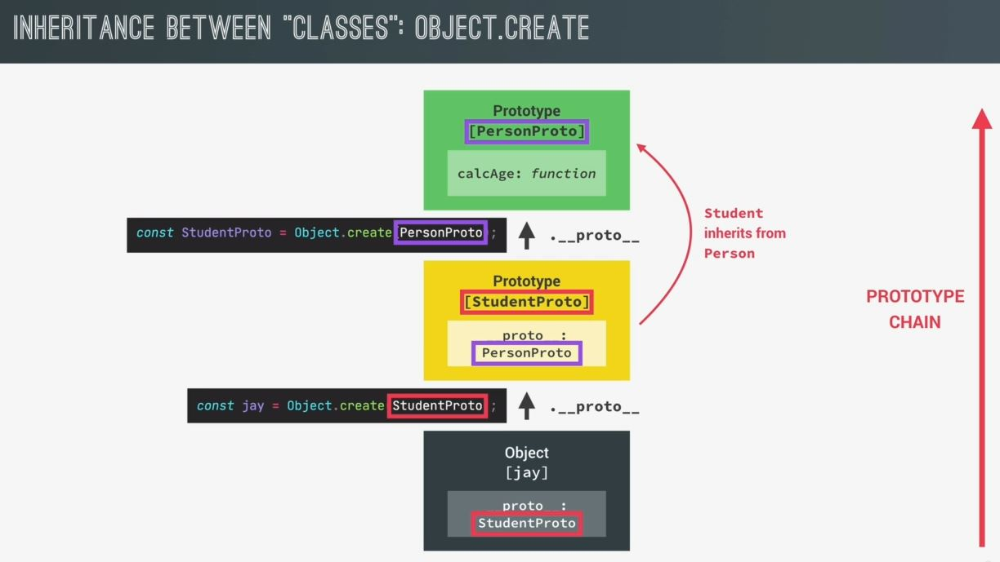

# Inheritance b/w Classes by using Object.create() method

- let's see how we can use Object.create() method in order to implement a complex prototype chain for inheritance

## Example - of implementing b/w classes by using Object.create() method

- testing code : 
    ```js
    const PersonProto = {
        calcAge() {
            console.log(2037 - this.birthYear)
        }

        init(firstName, birthYear) {
            this.firstYear = firstYear
            this.birthYear = birthYear
        }
    }

    const steven = Object.create(PersonProto)
        // here PersonProto object will serve as the prototype to create a new person object 
            // by using Object.create() method
    ```
    - so PersonProto object will be treated as the prototype of all the new objects of PersonProto <br>
        but now we want to add another prototype in the middle of the chain means b/w PersonProto & the object <br>
        so that student inherit directly from person 💡💡💡
    
- `STEP 1` : creating an object which will be the prototype of student
    ```js
    const PersonProto = {
        calcAge() {
            console.log(2037 - this.birthYear)
        }

        init(firstName, birthYear) {
            this.firstYear = firstYear
            this.birthYear = birthYear
        }
    }

    const steven = Object.create(PersonProto)

    const StudentProto = Object.create(PersonProto)
        // now we'll use StudentProto to create a new students
    ```

- `STEP 2` : using StudentProto to create a new students
    ```js
    const PersonProto = {
        calcAge() {
            console.log(2037 - this.birthYear)
        }

        init(firstName, birthYear) {
            this.firstYear = firstYear
            this.birthYear = birthYear
        }
    }

    const steven = Object.create(PersonProto)

    const StudentProto = Object.create(PersonProto)
    const jay = Object.create(StudentProto) // so jay student will inherit from the StudentProto
        // so StudentProto is the prototype of the jay object & PersonProto is the prototype of StudentProto
            // that's why PersonProto is a parent prototype of jay object 
                // which means that it's in its prototype chain 💡💡💡
    ```
    - let's understand through diagram
        
        - so everything starts with the PersonProto object which used to be the prototype of all person objects 
        - but now using Object.create() method , we make that PersonProto will become the prototype of StudentProto 
        - now basically student inherits from person , so due to this , we already established the parent child relationship that we were looking for
        - Now we need to do i.e now use Object.create() method again but this time to create a new actual student object <br>
            so `jay` student object will inherit from StudentProto which is now jay's prototype <br>
            & due to this , we created a nice & simple prototype chain 💡💡💡
        - so `jay` object inherits from StudentProto which will inherits from PersonProto & that's why `jay` object will be able <br>
            to use all the methods & properties that're contained in StudentProto & PersonProto 💡💡💡 <br>
            same thing happen with scope chain 💡💡💡 

- `STEP 3` : now we successfully established the prototype chain
    - now let's add an init method inside the student prototype i.e `StudentProto` 
    ```js
    const PersonProto = {
        calcAge() {
            console.log(2037 - this.birthYear)
        }

        init(firstName, birthYear) {
            this.firstYear = firstYear
            this.birthYear = birthYear
        }
    }

    const steven = Object.create(PersonProto)

    const StudentProto = Object.create(PersonProto)
    StudentProto.init = function(firstName, birthYear, course) {
        // now let's reuse that init() function of PersonProto inside StudentProto instead of creating again
        PersonProto.init.call(this, firstName, birthYear)
        this.course = course
    }

    const jay = Object.create(StudentProto)
    jay.init('Jay', 2010, 'Computer Science')
    // output : we'll get object of jay
    ```

- Eg : adding a method on the prototype of student i.e StudentProto
    ```js
    const PersonProto = {
        calcAge() {
            console.log(2037 - this.birthYear)
        }

        init(firstName, birthYear) {
            this.firstYear = firstYear
            this.birthYear = birthYear
        }
    }

    const steven = Object.create(PersonProto)

    const StudentProto = Object.create(PersonProto)

    StudentProto.init = function(firstName, birthYear, course) {
        PersonProto.init.call(this, firstName, birthYear)
        this.course = course
    }

    StudentProto.introduce = function() {
        console.log(`My name is ${this.fullName} and I study ${this.course}`)
    }

    const jay = Object.create(StudentProto)
    jay.init('Jay', 2010, 'Computer Science')
    // just for testing purpose
    jay.introduce()
    jay.calcAge('')
    // output : inside jay object , we'll see __proto__ : object
        // __proto__ : object contains init() & introduce() functions 
        // & inside this __proto__ : object , has it's own prototype i.e __proto__ : object
            // inside __proto__ : object , contain calcAge()  , so __proto__ : object --> is a PersonProto 💡💡💡
    ```

- `said by jonas` : 
    - in this , we didn't used constructor functions , `prototype` property & no `new` keyword operator <br> 
        so it's just really objects linked to other objects by using Object.create() method
    - so faking classes we did through constructor function & ES6 classes but using Object.create() method , we're not faking <br>
        classes because we're just linking together where some objects serve as the prototype to other objects 💡💡💡
    - ES6 classes & constructor function are used more in the real world but Object.create() method is also important <br>
        but in real world & in modern JS , most of the time we'll see ES6 classes 💡💡💡
