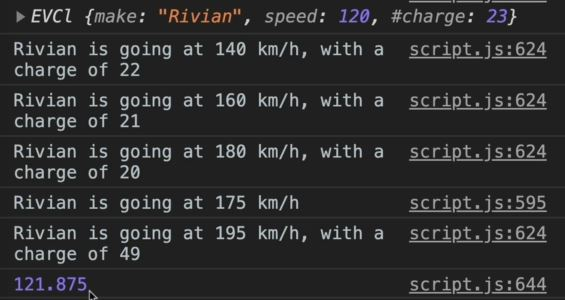

# Coding Challenge 4

- problem statement : 
    - `1` : Re-create challenge #3, but this time using ES6 classes: create an 'EVCl' child class of the 'CarCl' class
    - `2` : Make the 'charge' property private;
    - `3` : Implement the ability to chain the 'accelerate' and 'chargeBattery' methods of this class, 
        and also update the 'brake' method in the 'CarCl' class. They experiment with chining!
    - DATA CAR 1: 'Rivian' going at 120 km/h, with a charge of 23%

## Solution

```js
class CarCl {
  constructor(make, speed) {
    this.make = make;
    this.speed = speed;
  }

  accelerate() {
    this.speed += 10;
    console.log(`${this.make} is going at ${this.speed} km/h`);
  }

  brake() {
    this.speed -= 5;
    console.log(`${this.make} is going at ${this.speed} km/h`);
    return this;
  }

  get speedUS() {
    return this.speed / 1.6;
  }

  set speedUS(speed) {
    this.speed = speed * 1.6;
  }
}

class EVCl extends CarCl {
  #charge;

  constructor(make, speed, charge) {
    super(make, speed);
    this.#charge = charge;
  }

  chargeBattery(chargeTo) {
    this.#charge = chargeTo;
    return this; // chaining the methods of a class
  }

  accelerate() {
    this.speed += 20;
    this.#charge--;
    console.log(`${this.make} is going at ${this.speed} km/h, with a charge of ${this.#charge}`);
    return this; // chaining the methods of a class
  }
}
const rivian = new EVCl('Rivian', 120, 23);

console.log(rivian); // output : EVCl {make: "Rivian", speed: 120, #charge: 23}

// console.log(rivian.#charge); 
  // this will not work & we'll get error because #charge property is truly private & encapsulated inside of the class
  // & chargeBattery() is a public instance/API , so that we can manipulate 
    // the charge property from the outside of the class

rivian.accelerate().accelerate().accelerate().brake().chargeBattery(50).accelerate();
console.log(rivian.speedUS);
```


- in next module , we'll make a project which will be completely based on objects 
