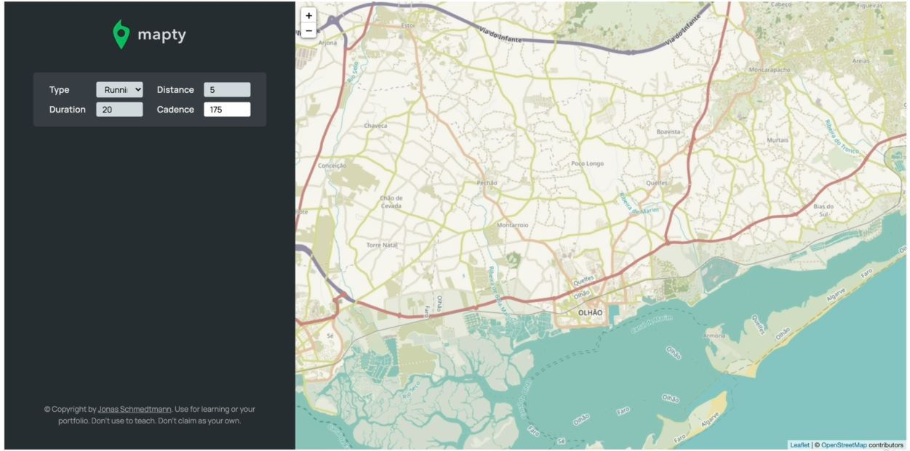
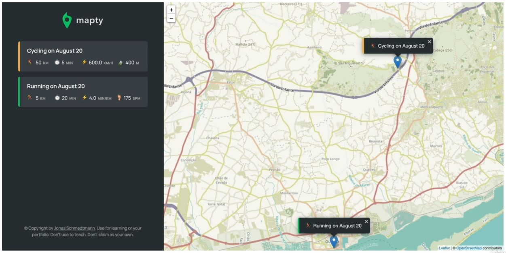

# Project Overview

- working project : https://mapty.netlify.app/

## what we have in this project

- we have a sidebar on left side & the main part of the application on right side 
- that map is loaded by using 3rd party service/library & we'll see how the position  
    is actually automatically obtained by the browser using geolocation , so if we allow our location   
    then JS will fetch the your location position & load on the map 
    

- so the purpose of this project is to track your workout
    - Allow the browser to track your location then reload the browser then browser will ask for allow , so allow the location it 
    - `STEP 1` : let's say you workout on a particular city (so just click on that city) & we'll get a form on left side  
        so let's say we provided these inputs inside the form like this
        
    - `STEP 2` : & after hitting Enter key , we'll get the position marked on that city which we have selected like this 
        
        - so we can see message is printed on the left side & on the map position is marked
    - `STEP 3` : now let's say you were cycled on this location , so clicked on it & we'll get this another form for input like this 
            
        - so when we select cyclic then other input fields will be changed like this 
            
        - now we provided inputs in the another form for cyclic like this   
            
        - & then hit enter then we'll get this output 
            
    - `STEP 4` : same thing we did for another location like this
            
    - `STEP 5` : now when we click on any of the location which is on left side then map will move & come to that location 
    - of course , we can add more features like trace the lines , but we want to keep this simple project to apply the concepts  
        which we already learned
    - `STEP 6` : now another thing is when we reload the page , then data will be persist due to local storage of a browser
        - even if we copy the url & paste on the another tab of the browser ,  
            then data will not be removed so we persist the data

## Starter code

- see the folder of starter code inside 15 module of notes-pics folder
