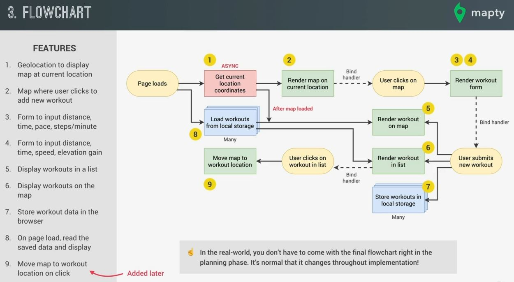

# How to Plan a Web Project

- most important 🔥

- in the real world project, it's very important that you always start with a planning phase  
    before building any project because otherwise you're setting yourself up to lot of confusion & problems down the road 

## About Project planning 

- now there are many different ways of planning a project , but we'll see Jonas's favorite process  
    which works great for many small & medium sized projects i.e `User stories` 💡💡💡

- `STEP 1 : Planning Steps` : 
    - `STEP 1.1` : User story 
        - it means a description of the application's functionality from the user's perspective
        - & then the user stories put together will clearly describe the functionality of the entire application
        - so it's just a high level overview of the whole application means from which stuff user will going to interact 💡💡💡

    - `STEP 1.2` : features
        - So "User story" allows to determine the exact features that we need to implement  
            in order to make the user stories actually work as intended

    - `STEP 1.3` : flow chart
        - to visualize different actions that a user can take & how the program react to these actions ,   
            we usually put all these features into a nice flow chart

    - `STEP 1.4` : Project Architecture
        - once we know exactly what we're gonna build
        - now , it's time to think about how we're gonna build it & this brings us to the project's architecture
        - so Architecture means how we'll organize our code & what JS features we'll use
        - so Project Architecture holds all the code together & it gives us a structure in which we can then develop  
            the application's functionality
    
    - so the goal is not to become software architect , the simple goal is to make a simply to stop & think about  
        about how we'll implement all this functionality before implementing 
        - so organization & making steps about what we're gonna do & how we're gonna do is important thing 
        - so we different ways to make that project 
            - `1` : we could have one big file with no organization at all
            - `2` : or we could divide everything into functions or we could use classes or use multiple files  
                or a mix of everything 

    - `why we need Project planning` : 
        - so the possibilities are really endless , so we have a lot of choice & all that choice can sometimes be a problem  
            & so if we don't think about the architecture of that project before writing the main part of our application 
        - then we'll end up with a mess of unmanageable spaghetti code

    - so once we done with the project's architecture which means we're done with the planning step  
        & ready to move on to the development step

    - & Note : doing `discussion` after these steps is the best way to clear more stuff before working on a project 💡💡💡

- `STEP 2` : now Development step comes

## Mapty - Project Planning 

- `STEP 1 - user stories` :
    - user stories is essentially a description of the application's functionality from the user's perspective
    - So when you put all the user stories together then it'll provide a complete picture  
        of the application's with whole functionality 
    - now there're a lot of formats in which we can write user stories but the most common one is to write sentences  
        with this format like this - As a [type of user] , i want [an Action] so that [a benefit]  
        & by using this format , we answer the question who , what & why
    - `1` :  for the first user story could go something like this , as a user , i want to log my running workouts  
        with location , distance , time , pace , etc . So i can keep a log of all my running .  
        so if we analyze this sentence then this tells us who wants to perform which action & why  
        & based on this , we'll be able to plan the application's necessary features in a next step
    - `2` : for another steps , as a User , i want to log my cycling workouts with location , distance , time , etc  
        so i can keep a log of all my cycling
    - `3` : next thing , as a user , i want to see all my workOuts as a glance to track my progress easily over time
    - `4` : as a user , i want to see all my workouts on a map , so that i can see easily check where i work out the most
    - `5` : finally , the last user story , as a user , i want to see all my workouts when i leave the app & come back later  
        so that i can use the app over time 
    - by using User stories , we can describe exactly what the application will do 💡💡💡
    
    - in real world , you'll be building the application from scratch on your own. so therefore , you'll really have to think  
        as if you were the user & put yourself in the user's feet , so that you can come up with these user stories  
        & then build your features from there

- `STEP 2 - Features` : 
    - so features will be based on the user stories
    - so based on that first user's story , we can imagine a couple of features that our application is gonna need
        - `1` : we're gonna need a map where the user can click in order to add a new workout  
            that's because the user wants to log the workout with the location . so the best way to get the location  
            coordinates is gonna be just clicking on a map
        - `2` : since we're working with maps , then we should probably use geolocation in order to display the map  
            at the current location of the user because this is a lot more user friendly  
            instead of the user scroll to their current position . So this is a perfect use case for geolocation  
            because even geolocation feature supported by browser & mobile
        - `3` : then we need form to input for distance , steps per minute (which is called cadence) , etc stuff
        - so form the first user story alone , we could already know that we need these 3 features  
            i mean , we don't really need them but they're nice to have because they allow us to satisfy the user story
    - & same process we'll follow for each user stories like this
    - & to persist the data , we're using Browser API instead of the database because we're building small app
    

- `STEP 3 - flow chart` : 
    - now let's put those features on the flow chart . so the flow chart should contain these different features   
        which we're gonna implement but it's gonna contain how the different parts of the app interact with each other  
        which event makes sense to implement & also how data flows across the application
    - first couple of features : we need to implement in the flow chart 
        - i.e geolocation to display the map at the user's location & then to also display a map  
            where the user can click to add new workouts like this 
        
        - but think about why we put them like this on the flow chart , so whenever we start to build a flow chart  
            like this , then it's a good idea to start with events 💡💡💡 , so in this case , I'm starting with the event  
            of the page loading & so that's always a good event to start on the flow chart because that's always   
            the first event that basically occurs on any page . I mean it's not an event that we're gonna handle ,  
            but this is the starting point where all the code that's in the top level will be executed when the page loads  
        - so when the page does load , we want to start by getting the user's location coordinates using the geolocation API
        - & after that data arrives , then we want to render the map centered on the current location of the user
    - second couple of features : 
        - then we need a form to input the data for cycling & for running , so we need to display a form  
            & we need the form to display/render whenever the user clicks on a certain position on a map  
            
            - in this flow chart , yellow boxes are the actions & the green boxes is when we render something on the UI  
                & red boxes are for operators which will happen async way
        - & don't worry about making flow chart because just like programming needs practice
        - Now , just to know in the real world , we usually don't always come up with all the steps in the flow chart   
            in the planning process/phase , so it's fine to have a rough sketch in the beginning & then come up  
            with the exact detail during the implementation . 
            - So definitely don't get hangup on building the perfect flow chart because it's all about practice  
                because it's not important in the beginning so don't waste too much time on this so as you  
                become better with practice , this'll become easier & then you might be able to add more & more details  
                to your flow chart right at the beginning
            - but if you're just starting out without any experience & working on your first applications then don't stress  
                too much on this 💡💡💡
    - third couple of features : 
        - we want to display workouts in a list & on the map too
        - so basically , we rendered the form in above steps already & then we're going to have an event listener on that form  
            so then whenever the user submits in it's own workout then it's gonna be rendered on the map & on the list 
        - & we want to store the workout data in the browser & then read that data whenever the page loads  
            & another thing is whenever a user creates a new workout , then that data will store all the workouts in local storage  
            so we're using that local storage API in the browser
        - & whenever the page loads, then on left side we'll get all of the workouts from the local storage  
            & render them on the map & on the list & this will only happen after the current location has been fetched  
            & a map has been displayed so that's what async means
            
            - so here the red box means it's an operation which takes time & only after it's completed then the rest  
                of the operations cane be executed which are depend on it
        - another feature , move the map to the workout location whenever we click on one on the workouts in the list   
            so we need an click event handler on each of the list & when user clicks on any one of the workout in the list  
            then map will move to that workout's location
            

- so this is how our application is gonna work . So the features are need to implement using this flow/sequence  
    so this flow chart is just telling only one thing that what our program/app will do but not how it does it  
    so that's more specific which we'll figure out through architecture 💡💡💡

- `STEP 4 - Architecture` :     
    - Now just like flow chart , we don't always need to have the perfect final architecture before implementation  
        so first we can do some experiment , play around with the code & only then think about the architecture  
        for the final project 💡💡💡
    - & then we'll start to implementing features according to th flow chart & while implementing stuff   
        if we need more organization then we'll do organization & ways to manage our data  
        then we'll come back to thinking about the architecture

## Extra notes - how to plan a dev project

- https://yuridevat.hashnode.dev/how-i-got-my-first-job-as-a-developer
- https://waydev.co/software-projects-planning/
