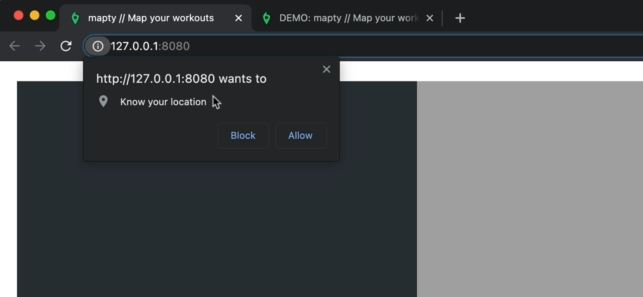
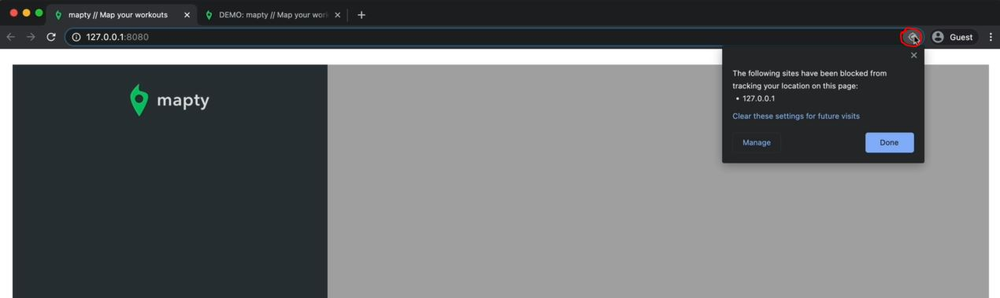
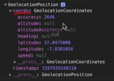

# Using the Geolocation API

- `Geolocation API` : 
    - it's called an API because it's a browser API just like internationalization or timers , etc which is provided by the browser
    - it's a modern API & we have other modern API's like <br>
        access the user's camera or even to make a use's phone vibrate , etc 💡💡💡

## Steps - Mapty project : using geolocation

- `STEP 1` : using `geolocation` object/property of `navigator` object
    ```js
    const months = ['January', 'February', 'March', 'April', 
        'May', 'June', 'July', 'August', 'September', 'October', 'November', 'December'];

    const form = document.querySelector('.form');
    const containerWorkouts = document.querySelector('.workouts');
    const inputType = document.querySelector('.form__input--type');
    const inputDistance = document.querySelector('.form__input--distance');
    const inputDuration = document.querySelector('.form__input--duration');
    const inputCadence = document.querySelector('.form__input--cadence');
    const inputElevation = document.querySelector('.form__input--elevation');

    navigator.geolocation.getCurrentPosition()
        // getCurrentPosition() method (of geolocation object) takes only two arguments & both are callback function
            // first argument : a callback function -> which will be called on success
                // it takes only one argument i.e position/coordinates for the location 💡💡💡
                // so whenever the browser successfully got the coordinates of the current position of the user
            // second argument : a callback function -> for the error callback
                // which is called when there happened an error while getting the coordinates 💡💡💡
    ```
    - `STEP 1.1` : passing both the arguments inside `navigator.geolocation.getCurrentPosition()` method
        ```js
        // put above code from STEP 1

        navigator.geolocation.getCurrentPosition(
            function(position) {
                console.log(position)
            } , function() {
                alert('Could not get your position')
            }
        )
        ```
    - `STEP 1.2` : now to make sure that we don't get any errors in an old browser 
        - so we can test if that navigator.geolocation actually exists or not for old browser
        ```js
        // put above code from STEP 1

        if (navigator.geolocation) {
            navigator.geolocation.getCurrentPosition(
                function(position) {
                    console.log(position)
                } , function() {
                    alert('Could not get your position')
                }
            )
        }
        ```
        
        - so here we can see that we're getting a popup window from the browser asking for permission to use your location
        - for checking output : just click on block button then we'll get that alert() message <br>
            so this is the situation in which there is an error getting the coordinates 💡💡💡
        - for checking output : now click in this icon of address bar like this 
            
            - & then click on that `Clear these settings for future visits`
            - & just again reload the page then we'll get that popup again for accessing location <br>
                now this time , click on allow button & inside the console tab we'll get GeolocationPosition like this 
                
            - & we're interested in `coords` property , so we have altitude , speed but these are probably only available on <br>
                mobile phones because most computers don't have a way of knowing the altitude
            - but we're interested in `latitude` & `longitude` properties of geolocation 💡💡💡

- `STEP 2` : getting latitude & longitude for coordinates
    ```js
    // put above code from STEP 1

    if (navigator.geolocation) {
        navigator.geolocation.getCurrentPosition(
            function(position) {
                // const latitude = position.coords.latitude
                // const longitude = position.coords.longitude
                // but we have better way is using object destructuring to access those properties 💡💡💡  
                const { latitude } = position.coords
                const { longitude  } = position.coords
                console.log(latitude , longitude) // output : reload the page 
                    // then we'll get the coordinates of our location
                    // those coordinates are not 100% accurate


            } , function() {
                alert('Could not get your position')
            }
        )
    }
    ```
    - now we need to do with this coordinates i.e load the map & then center that map on this position/coordinates 💡💡💡<br>
        which we'll do in next lecture

- `STEP 3` : now let's create a link on google maps
    - `STEP 3.1` : go to google maps
    - `STEP 3.2` : now when we see the URL then we have the latitude & longitude <br>
        `Note ✅` : latitude comes first & longitude comes second 💡💡💡
    - `STEP 3.3` : so copy that URL till longitude like this `https://www.google.com/maps/@28.555064,77.2812722`
    - `STEP 3.4` : inside the code
        ```js
        // put above code from STEP 1

        if (navigator.geolocation) {
            navigator.geolocation.getCurrentPosition(
                function(position) {
                    const { latitude } = position.coords
                    const { longitude  } = position.coords
                    console.log(`https://www.google.com/maps/@${latitude},${longitude} `) 

                } , function() {
                    alert('Could not get your position')
                }
            )
        }
        ```
        - output : we'll get the link in the console tab & click on that link then inside the google map ,
            - your current location will be loaded
