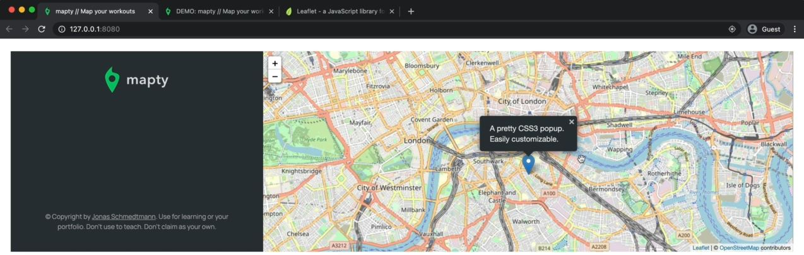
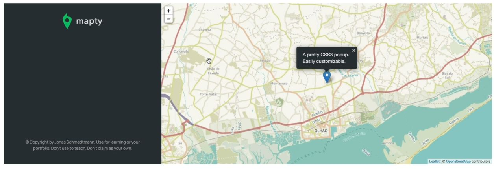

# Displaying a Map Using Leaflet Library

- we'll be using third party library/services i.e `Leaflet` to show the map on the right side our app 
    - go to the `download` link of it & copy the css link & js to enable subResource integrity

## Steps - Mapty : implementing the leaflet library

- `STEP 1` : go to this link `https://leafletjs.com/download.html` 
    - & copy this CDN link of both CSS & JS 
    ```html
    <link rel="stylesheet" href="https://unpkg.com/leaflet@1.8.0/dist/leaflet.css" 
        integrity="sha512-hoalWLoI8r4UszCkZ5kL8vayOGVae1oxXe/2A4AO6J9+580uKHDO3JdHb7NzwwzK5xr/Fs0W40kiNHxM9vyTtQ==" 
        crossorigin="" />
    <script src="https://unpkg.com/leaflet@1.8.0/dist/leaflet.js" 
        integrity="sha512-BB3hKbKWOc9Ez/TAwyWxNXeoV9c1v6FIeYiBieIWkpLjauysF18NzgR1MBNBXf8/KABdlkX68nAhlwcDFLGPCQ==" 
        crossorigin=""></script>
    ```
    - `STEP 1.1` : paste the CDN link inside the HTML file 
        ```html
        <head>
            <meta charset="UTF-8" />
            <meta name="viewport" content="width=device-width, initial-scale=1.0" />
            <meta http-equiv="X-UA-Compatible" content="ie=edge" />
            <link rel="shortcut icon" type="image/png" href="/icon.png" />

            <link
              href="https://fonts.googleapis.com/css2?family=Manrope:wght@400;600;700;800&display=swap"
              rel="stylesheet"
            />

            <link rel="stylesheet" href="style.css" />

            <link rel="stylesheet" href="https://unpkg.com/leaflet@1.8.0/dist/leaflet.css" 
                integrity="sha512-hoalWLoI8r4UszCkZ5kL8vayOGVae1oxXe/2A4AO6J9+580uKHDO3JdHb7NzwwzK5xr/Fs0W40kiNHxM9vyTtQ==" 
                crossorigin="" />
        
             <!-- Make this script as defer -->
            <script defer src="https://unpkg.com/leaflet@1.8.0/dist/leaflet.js" 
                integrity="sha512-BB3hKbKWOc9Ez/TAwyWxNXeoV9c1v6FIeYiBieIWkpLjauysF18NzgR1MBNBXf8/KABdlkX68nAhlwcDFLGPCQ==" 
                crossorigin=""></script>

            <script defer src="script.js"></script>
            <title>mapty // Map your workouts</title>
        </head>
        ```

- `STEP 2` : in the overview section of that website
    - we can see a simple example of how we could implement a map with a certain coordinates & how to display that simple marker 
    - so copy that code 
        ```js
        var map = L.map('map').setView([51.505, -0.09], 13);

        L.tileLayer('https://{s}.tile.openstreetmap.org/{z}/{x}/{y}.png', {
            attribution: '&copy; <a href="https://www.openstreetmap.org/copyright">OpenStreetMap</a> contributors'
        }).addTo(map);

        L.marker([51.5, -0.09]).addTo(map)
            .bindPopup('A pretty CSS3 popup.<br> Easily customizable.')
            .openPopup();
        ```
    - `STEP 2.1` : now paste this code when the browser successfully loaded the map like this
        ```js
        const months = ['January', 'February', 'March', 'April', 
            'May', 'June', 'July', 'August', 'September', 'October', 'November', 'December'];

        const form = document.querySelector('.form');
        const containerWorkouts = document.querySelector('.workouts');
        const inputType = document.querySelector('.form__input--type');
        const inputDistance = document.querySelector('.form__input--distance');
        const inputDuration = document.querySelector('.form__input--duration');
        const inputCadence = document.querySelector('.form__input--cadence');
        const inputElevation = document.querySelector('.form__input--elevation');

        if (navigator.geolocation) {
            navigator.geolocation.getCurrentPosition(
                function(position) {
                    const { latitude } = position.coords
                    const { longitude  } = position.coords
                    console.log(`https://www.google.com/maps/@${latitude},${longitude} `) 

                    // STEP 1 : change from var to const 
                    // STEP 2 : L.map('map') --> inside the map() method , whatever a string we pass as an argument 
                        // that must be the ID name as "map" only (because of readability) of an element in our HTML 💡💡💡
                        // so inside the HTML file , we can see <div id="map"></div> 
                    // STEP 3 : here L -> means the main function i.e Leaflet which gives us as an entry point
                        // so here L -> is a like a namespace just like Intl namespace for Internationalization API 💡💡💡
                        // then L -> object has couple of methods which we can use like map() method , 
                            // tileLayer() method which is used to define the tiles of our map
                            // marker() method used to display markers 💡💡💡
                    const map = L.map('map').setView([51.505, -0.09], 13);

                    L.tileLayer('https://{s}.tile.openstreetmap.org/{z}/{x}/{y}.png', {
                        attribution: '&copy; <a href="https://www.openstreetmap.org/copyright">OpenStreetMap</a> contributors'
                    }).addTo(map);

                    L.marker([51.5, -0.09]).addTo(map)
                        .bindPopup('A pretty CSS3 popup.<br> Easily customizable.')
                        .openPopup();

                } , function() {
                    alert('Could not get your position')
                }
            )
        }
        ```
        - output : reload the page , & nothing is happening 
            - so just for checking to know whether we have access of that `L` object , so inside the console tab <br>
                write `L` & press enter then the `L` object is gets printed because `L` object is a global variable of leaflet library <br>
                that's why we got `L` & even we can see inside HTML , src of script i.e leaflet.js
            - & just for checking purpose , create a file as other.js & then link it before the main script.js file like this
                ```html
                <script defer src="other.js"></script>
                <script defer src="script.js"></script>
                ```
            - & inside other.js file , write this code 
                ```js
                const firstName = 'Jonas'
                ```
            - & inside script.js file , we can see print that firstName like this
                ```js
                console.log(firstName) // output : Jonas
                ```
                - because that `firstName` variable is the global variable in script.js file 
                - so script.js file , can access all the things whatever inside the other.js file but other.js can't access stuff <br>
                    from script.js file if we do then we'll get error because order of we put those scripts
        - so we got this output on the map 
            

- `STEP 3` : let's define our own positions i.e latitude & longitude
    - right now default position is london 
    - `STEP 3.1` : creating an array for coords inside the success callback function argument
        ```js
        const months = ['January', 'February', 'March', 'April', 
            'May', 'June', 'July', 'August', 'September', 'October', 'November', 'December'];

        const form = document.querySelector('.form');
        const containerWorkouts = document.querySelector('.workouts');
        const inputType = document.querySelector('.form__input--type');
        const inputDistance = document.querySelector('.form__input--distance');
        const inputDuration = document.querySelector('.form__input--duration');
        const inputCadence = document.querySelector('.form__input--cadence');
        const inputElevation = document.querySelector('.form__input--elevation');

        if (navigator.geolocation) {
            navigator.geolocation.getCurrentPosition(
                function(position) {
                    const { latitude } = position.coords
                    const { longitude } = position.coords
                    console.log(`https://www.google.com/maps/@${latitude},${longitude} `) 

                    const coords = [latitude, longitude] // Note : we define the position inside an array 
                        // because here setView() method takes first argument i.e position 
                            // in the form of an array that's why 💡💡💡

                    // pass the coords as the first argument inside the setView() method of map() method of L object
                    // second argument of setView() method is zoom level i.e 13 💡💡💡
                    const map = L.map('map').setView(coords , 13);

                    L.tileLayer('https://{s}.tile.openstreetmap.org/{z}/{x}/{y}.png', {
                        attribution: '&copy; <a href="https://www.openstreetmap.org/copyright">OpenStreetMap</a> contributors'
                    }).addTo(map);

                    // here also passed the coords
                    L.marker(coords).addTo(map)
                        .bindPopup('A pretty CSS3 popup.<br> Easily customizable.')
                        .openPopup();

                } , function() {
                    alert('Could not get your position')
                }
            )
        }
        ```
        - output : we'll get correct output

- `STEP 4` : let's see about tileLayer() method of `L` object
    - so the map that we saw on the page is made up of small tiles <br>
        & these tiles they come from this URL `https://{s}.tile.openstreetmap.org/{z}/{x}/{y}.png` 
    - so we can use this URL to change the appearance of our map 💡💡💡 right now default map of 'open street map' <br>
        so when we do google then we can find different styles & change like this in this URL <br>
    - `STEP 4.1` : changing the default style of open street map into something else 
        ```js
        // put code from STEP 3.1

        if (navigator.geolocation) {
            navigator.geolocation.getCurrentPosition(
                function(position) {
                    const { latitude } = position.coords
                    const { longitude } = position.coords
                    console.log(`https://www.google.com/maps/@${latitude},${longitude} `) 

                    const coords = [latitude, longitude] 
                    const map = L.map('map').setView(coords , 13);

                    // here we changed the style/theme of the map
                    L.tileLayer(`https://{s}.tile.openstreetmap.fr/hot/{z}/{x}/{y}.png`, {
                        attribution: '&copy; <a href="https://www.openstreetmap.org/copyright">OpenStreetMap</a> contributors'
                    }).addTo(map);

                    // here also passed the coords
                    L.marker(coords).addTo(map)
                        .bindPopup('A pretty CSS3 popup.<br> Easily customizable.')
                        .openPopup();

                } , function() {
                    alert('Could not get your position')
                }
            )
        }
        ```
        - output : style of map looks like now this 
            

- in next lecture , we'll see markers & how we can create our own marker <br>
    & then display both a pop-up & the marker together whenever we click any position on the map
