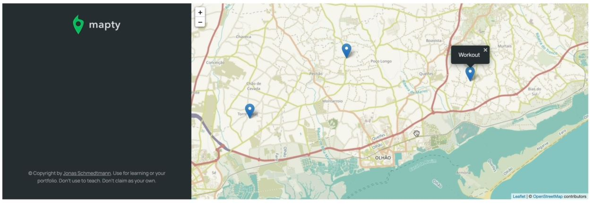
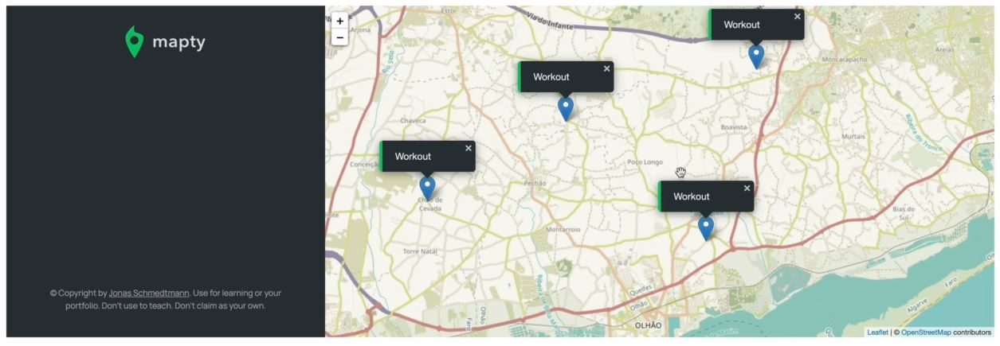

# Displaying a Map Marker

- so we'll display a marker whenever we click on the map , so for that , we'll use leaflet library <br>
    see the flow chart to make sure that till yet we're following the right path according to our flow chart
    - so we did i.e page loads , get current location coordinates , render map on current location
    - now we need to do is to bind an event handler so that whenever the user clicks on the map , <br>
        we can then display a marker on the map . Then we're gonna jump to `Render workout form` to `user submits new workout` <br>
        & then continue working with map ✔️✔️✔️
    - so we're gonna basically render a workout on the map just by putting a pin or a marker on the map <br>
        & then after we can replace that with data coming from the workout ✔️✔️✔️

## Steps - Mapty : implementing an event handler to display a marker on the map

- `STEP 1` : add the event handler to the map
    - so that way we can handle any incoming clicks but how we can add the event handler to the map ?
    - mean should we simply attach an event listener of that whole `map` element <br>
        but this wouldn't really work because we would have no way of knowing where exactly the user clicked on the map <br>
        means we didn't able to know the GPS coordinates of that location which is clicked by the user on the map <br> 
        because that's the data that only the map knows
    - means when you click , let's say somewhere on the map then i want to handle that click exactly at that position <br>
        so to do this we need access to the coordinates of the point that was just clicked 💡💡💡
    - so ultimately , we're want to say that we cannot simply use the addEventListener() <br>
        so instead , we'll use something similar i.e actually available on Leaflet library i.e `on()` method 
    - `STEP 1.1` : understanding on() method of leaflet library
        - `on()` method of leaftlet library is like a addEventListener() method of JS 
        ```js
        const months = ['January', 'February', 'March', 'April', 
            'May', 'June', 'July', 'August', 'September', 'October', 'November', 'December'];

        const form = document.querySelector('.form');
        const containerWorkouts = document.querySelector('.workouts');
        const inputType = document.querySelector('.form__input--type');
        const inputDistance = document.querySelector('.form__input--distance');
        const inputDuration = document.querySelector('.form__input--duration');
        const inputCadence = document.querySelector('.form__input--cadence');
        const inputElevation = document.querySelector('.form__input--elevation');

        if (navigator.geolocation) {
            navigator.geolocation.getCurrentPosition(
                function(position) {
                    const { latitude } = position.coords
                    const { longitude } = position.coords
                    console.log(`https://www.google.com/maps/@${latitude},${longitude} `) 

                    const coords = [latitude, longitude] 
                    const map = L.map('map').setView(coords , 13);
                    // before using on() method , let's print map -> variable 
                    console.log(map) // output : we'll get a object which contain a lot of information
                        // & we can see that the developers of this library , 
                            // also use that underscore convention with properties & methods as protected
                            // so we shouldn't manipulate those manually 💡💡💡
                        // now when we go inside the prototype of prototype , then we'll see that on() method

                    // here we changed the style/theme of the map
                    L.tileLayer(`https://{s}.tile.openstreetmap.fr/hot/{z}/{x}/{y}.png`, {
                        attribution: '&copy; <a href="https://www.openstreetmap.org/copyright">OpenStreetMap</a> contributors'
                    }).addTo(map);

                    // here also passed the coords
                    L.marker(coords).addTo(map).bindPopup('A pretty CSS3 popup.<br> Easily customizable.').openPopup();

                } , function() {
                    alert('Could not get your position')
                }
            )
        }
        ```
    - `STEP 1.2` : using on() method of Leaflet library on map instead of addEventListener() method
        ```js
        // put above code from STEP 1.1

        if (navigator.geolocation) {
            navigator.geolocation.getCurrentPosition(
                function(position) {
                    const { latitude } = position.coords
                    const { longitude } = position.coords
                    console.log(`https://www.google.com/maps/@${latitude},${longitude} `) 

                    const coords = [latitude, longitude] 
                    const map = L.map('map').setView(coords , 13);
                    L.tileLayer(`https://{s}.tile.openstreetmap.fr/hot/{z}/{x}/{y}.png`, {
                        attribution: '&copy; <a href="https://www.openstreetmap.org/copyright">OpenStreetMap</a> contributors'
                    }).addTo(map);

                    // here also passed the coords
                    L.marker(coords).addTo(map).bindPopup('A pretty CSS3 popup.<br> Easily customizable.').openPopup();

                    map.on('click', function(mapEvent) { 
                        // just like the second argument of addEventListener() method 
                            // i.e callback function takes e -> argument
                        // same thing on() method of leaflet library takes second argument i.e callback function
                            // & that callback function takes mapEvent argument 
                            // & we gave mapEvent name to make more readable & understandable 

                        console.log(map) // output : when we click on a map then we'll get the object
                            // & that object contain like latlng -> property which contain latitude & longitude 💡💡💡
                    })

                } , function() {
                    alert('Could not get your position')
                }
            )
        }
        ```
        - now we can take those coordinates & then add a marker at exactly that point
        - so take this code `L.marker(coords).addTo(map).bindPopup('A pretty CSS3 popup.<br> Easily customizable.').openPopup();` <br>
            & put inside the `on()` method 
    - `STEP 1.3` : taking those coordinates & then creating a marker at exactly that point 
        ```js
        // put above code from STEP 1.1

        if (navigator.geolocation) {
            navigator.geolocation.getCurrentPosition(
                function(position) {
                    const { latitude } = position.coords
                    const { longitude } = position.coords
                    console.log(`https://www.google.com/maps/@${latitude},${longitude} `) 

                    const coords = [latitude, longitude] 
                    const map = L.map('map').setView(coords , 13);
                    L.tileLayer(`https://{s}.tile.openstreetmap.fr/hot/{z}/{x}/{y}.png`, {
                        attribution: '&copy; <a href="https://www.openstreetmap.org/copyright">OpenStreetMap</a> contributors'
                    }).addTo(map);

                    map.on('click', function(mapEvent) { 
                        const { lat , lng } = mapEvent.latlng

                        L.marker([coords]).addTo(map).bindPopup('A pretty CSS3 popup.<br> Easily customizable.').openPopup();

                    })

                } , function() {
                    alert('Could not get your position')
                }
            )
        }
        ``` 
        - output : when we click on somewhere but not in the middle that at that point , marker will not be added <br>
            so we'll get that marker on the center because we didn't fix the coords yet
    - `STEP 1.4` : putting pin/marker on that coordinate where user clicked on the map , instead of putting the pin on center
        ```js   
        // put above code from STEP 1.1

        if (navigator.geolocation) {
            navigator.geolocation.getCurrentPosition(
                function(position) {
                    const { latitude } = position.coords
                    const { longitude } = position.coords
                    console.log(`https://www.google.com/maps/@${latitude},${longitude} `) 

                    const coords = [latitude, longitude] 
                    const map = L.map('map').setView(coords , 13);
                    L.tileLayer(`https://{s}.tile.openstreetmap.fr/hot/{z}/{x}/{y}.png`, {
                        attribution: '&copy; <a href="https://www.openstreetmap.org/copyright">OpenStreetMap</a> contributors'
                    }).addTo(map);

                    map.on('click', function(mapEvent) { 
                        const { lat , lng } = mapEvent.latlng

                        L.marker([lat , lng]).addTo(map).bindPopup('Workout').openPopup();
                            // bindPopup() method means it'll create a popup & bind it to the marker with a message i.e workout 💡💡💡
                    })

                } , function() {
                    alert('Could not get your position')
                }
            )
        }
        ```
        - output : when we clicked on any point on the map then the marker will be added on that point with marker like this
            
            - now in working app , we did some style changes that for running , we have green border <br>
                & for cycling , we have orange left border
            - so we'll use bindPopup() method to customize the popup
    - `STEP 1.5` : using bindPopup() method of leaflet to customize the popup
        ```js
        // put above code from STEP 1.1

        if (navigator.geolocation) {
            navigator.geolocation.getCurrentPosition(
                function(position) {
                    const { latitude } = position.coords
                    const { longitude } = position.coords
                    console.log(`https://www.google.com/maps/@${latitude},${longitude} `) 

                    const coords = [latitude, longitude] 
                    const map = L.map('map').setView(coords , 13);
                    L.tileLayer(`https://{s}.tile.openstreetmap.fr/hot/{z}/{x}/{y}.png`, {
                        attribution: '&copy; <a href="https://www.openstreetmap.org/copyright">OpenStreetMap</a> contributors'
                    }).addTo(map);

                    map.on('click', function(mapEvent) { 
                        const { lat , lng } = mapEvent.latlng

                        L.marker([lat , lng]).addTo(map).bindPopup(L.pop({})).openPopup();
                            // here we passed L.pop() method inside bindPopup() method 
                    })

                } , function() {
                    alert('Could not get your position')
                }
            )
        }
        ```
        - now let's see the documentation to customize the pop() , so inside the Docs or Documentation of leaflet <br>
            now inside the UI layers , so click on `marker` link , we have options like `riseOnHover` when we hover
        - now again go to Docs & click on the `Popup` section , so inside of it , inside `options` section , <br>
            we have maxWidth , minWidth properties to define size of the popup 
    - `STEP 1.6` : using maxWidth , minWidth properties to define the size of the popup
        ```js
        // put above code from STEP 1.1

        if (navigator.geolocation) {
            navigator.geolocation.getCurrentPosition(
                function(position) {
                    const { latitude } = position.coords
                    const { longitude } = position.coords
                    console.log(`https://www.google.com/maps/@${latitude},${longitude} `) 

                    const coords = [latitude, longitude] 
                    const map = L.map('map').setView(coords , 13);
                    L.tileLayer(`https://{s}.tile.openstreetmap.fr/hot/{z}/{x}/{y}.png`, {
                        attribution: '&copy; <a href="https://www.openstreetmap.org/copyright">OpenStreetMap</a> contributors'
                    }).addTo(map);

                    map.on('click', function(mapEvent) { 
                        const { lat , lng } = mapEvent.latlng

                        L.marker([lat , lng]).addTo(map).bindPopup(L.pop({
                            maxWidth: 250, 
                            minWidth: 100, 
                            autoClose: false , // autoClose -> property means when we created the one marker & it's popup
                                // then when we click on another coordinates on the map then we to show the marker & it's popup
                                // but we don't want to automatically close that previous marker & it's popup 💡💡💡
                                // so basically we're overriding the default behavior of the popup
                            closeOnClick: false, // again we're overriding the default value of it
                            className: 'running-popup' , // by-default we want to show the form & the popup of running 💡💡💡 
                                // inside the css file , at the bottom , we have a style for popup
                        })).openPopup();
                    })

                } , function() {
                    alert('Could not get your position')
                }
            )
        }
        ```
        - output : when we click on the map then a marker & it's popup will come <br>
            & the running-popup class will be applied on that popup i.e green or orange border based on the type <br>
            whether the user is running or cycling but we'll not get the message inside the popup 💡💡💡
            - so inside the `Popup methods inherited from layer` section , where we'll get the setPopupContent() method <br>
                to add the content inside the popup 💡💡💡
            - & the setPopupContent() method return `this` keyword , so due this we're able to know <br>
                that Developers of this library are using same concept which we learned in the prototype 
    - `STEP 1.7` : adding the content inside the popup for that position on the map
        ```js
        // put above code from STEP 1.1

        if (navigator.geolocation) {
            navigator.geolocation.getCurrentPosition(
                function(position) {
                    const { latitude } = position.coords
                    const { longitude } = position.coords
                    console.log(`https://www.google.com/maps/@${latitude},${longitude} `) 

                    const coords = [latitude, longitude] 
                    const map = L.map('map').setView(coords , 13);
                    L.tileLayer(`https://{s}.tile.openstreetmap.fr/hot/{z}/{x}/{y}.png`, {
                        attribution: '&copy; <a href="https://www.openstreetmap.org/copyright">OpenStreetMap</a> contributors'
                    }).addTo(map);

                    map.on('click', function(mapEvent) { 
                        const { lat , lng } = mapEvent.latlng

                        L.marker([lat , lng]).addTo(map).bindPopup(L.pop({
                                maxWidth: 250, 
                                minWidth: 100, 
                                autoClose: false , 
                                closeOnClick: false, 
                                className: 'running-popup', 
                            })
                        ).setPopupContent("Workout").openPopup();
                    })

                } , function() {
                    alert('Could not get your position')
                }
            )
        }
        ```
        - output : when we click on the map then the marker & it's popup will be created <br>
            with the content inside the popup like this 
            
            - but in the working app , the marker is not put on the map immediately <br>
                because the popup itself wil going to contain data about the workout <br>
            - so we first needed that data , so when we click on any where on the map then first a form will come <br> 
                on left side . so inside the flow chart , we have the render workout form whenever the user clicks on a map <br>
                instead of showing the maker & it's popup on that position immediately
