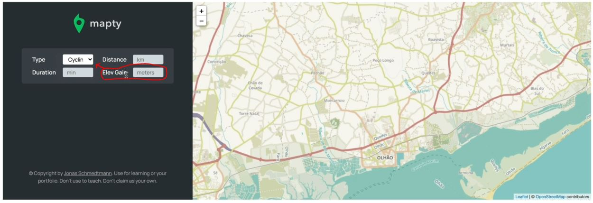

# Rendering Workout Input Form

- we'll render the workout Input form whenever the user clicks on the map <br>
    so the flow chart , before rendering the workout on the map , we need to first render the form input <br> 
    on that form we'll add an event listener . So that whatever that form is submitted only then the marker <br>
    is rendered on the map

## Steps - Mapty : render workout input form when user click on the map

- `STEP 1` : inside the html file 
    ```html
    <form class="form hidden"> 
        <!-- here we have hidden class but we'll do this manipulation 
            through JS instead of doing hard coded ✔️✔️✔️ -->

        <div class="form__row">
            <label class="form__label">Type</label>
            <select class="form__input form__input--type">
                <option value="running">Running</option>
                <option value="cycling">Cycling</option>
            </select>
        </div>
        <div class="form__row">
            <label class="form__label">Distance</label>
            <input class="form__input form__input--distance" placeholder="km" />
        </div>
        <div class="form__row">
            <label class="form__label">Duration</label>
            <input class="form__input form__input--duration" placeholder="min" />
        </div>
        <div class="form__row">
            <label class="form__label">Cadence</label>
            <input class="form__input form__input--cadence" placeholder="step/min" />
        </div>
        <div class="form__row form__row--hidden">
            <label class="form__label">Elev Gain</label>
            <input class="form__input form__input--elevation" placeholder="meters" />
        </div>
        <button class="form__btn">OK</button>
    </form>
    ```
    - `STEP 1.1` : rendering the form when user click on the map
        ```js
        const months = ['January', 'February', 'March', 'April', 
            'May', 'June', 'July', 'August', 'September', 'October', 'November', 'December'];

        const form = document.querySelector('.form');
        const containerWorkouts = document.querySelector('.workouts');
        const inputType = document.querySelector('.form__input--type');
        const inputDistance = document.querySelector('.form__input--distance');
        const inputDuration = document.querySelector('.form__input--duration');
        const inputCadence = document.querySelector('.form__input--cadence');
        const inputElevation = document.querySelector('.form__input--elevation');

        if (navigator.geolocation) {
            navigator.geolocation.getCurrentPosition(
                function(position) {
                    const { latitude } = position.coords
                    const { longitude } = position.coords
                    console.log(`https://www.google.com/maps/@${latitude},${longitude} `) 

                    const coords = [latitude, longitude] 
                    const map = L.map('map').setView(coords , 13);
                    L.tileLayer(`https://{s}.tile.openstreetmap.fr/hot/{z}/{x}/{y}.png`, {
                        attribution: '&copy; <a href="https://www.openstreetmap.org/copyright">OpenStreetMap</a> contributors'
                    }).addTo(map);

                    map.on('click', function(mapEvent) { 
                        form.classList.remove('hidden')

                        // const { lat , lng } = mapEvent.latlng

                        /*L.marker([lat , lng]).addTo(map).bindPopup(L.pop({
                                maxWidth: 250, 
                                minWidth: 100, 
                                autoClose: false , 
                                closeOnClick: false, 
                                className: 'running-popup', 
                            })
                        ).setPopupContent("Workout").openPopup();
                        */
                    })

                } , function() {
                    alert('Could not get your position')
                }
            )
        }
        ```
        - output : when we click on the map , then the form will rendered on the left side
            - one thing we can do for a better user experience is to immediately focus on that input of the form
    - `STEP 1.2` : immediately focus on that input of the form when the user click on the map for better UX
        ```js
        const months = ['January', 'February', 'March', 'April', 
            'May', 'June', 'July', 'August', 'September', 'October', 'November', 'December'];

        const form = document.querySelector('.form');
        const containerWorkouts = document.querySelector('.workouts');
        const inputType = document.querySelector('.form__input--type');
        const inputDistance = document.querySelector('.form__input--distance');
        const inputDuration = document.querySelector('.form__input--duration');
        const inputCadence = document.querySelector('.form__input--cadence');
        const inputElevation = document.querySelector('.form__input--elevation');

        if (navigator.geolocation) {
            navigator.geolocation.getCurrentPosition(
                function(position) {
                    const { latitude } = position.coords
                    const { longitude } = position.coords
                    console.log(`https://www.google.com/maps/@${latitude},${longitude} `) 

                    const coords = [latitude, longitude] 
                    const map = L.map('map').setView(coords , 13);
                    L.tileLayer(`https://{s}.tile.openstreetmap.fr/hot/{z}/{x}/{y}.png`, {
                        attribution: '&copy; <a href="https://www.openstreetmap.org/copyright">OpenStreetMap</a> contributors'
                    }).addTo(map);

                    map.on('click', function(mapEvent) { 
                        form.classList.remove('hidden')
                        inputDistance.focus() // focus() method is used to put the focus on this input element 💡💡💡
                    })

                } , function() {
                    alert('Could not get your position')
                }
            )
        }
        ```
        - output : when the user click on the map then the form will get rendered 
            - & then distance input of that form get focused
            - which is great for the UX , so that the user immediately starts typing
    - `STEP 1.3` : render the marker & it's popup on that position after submitting the form
        - `Note` : we'll not add the event listener inside on() method of leaflet library
            - because never add the event listener inside the event listener, because that doesn't make any sense 💡💡💡
        ```js
        // put above of code from STEP 1.2
        if (navigator.geolocation) {
            navigator.geolocation.getCurrentPosition(
                function(position) {
                    const { latitude } = position.coords
                    const { longitude } = position.coords
                    console.log(`https://www.google.com/maps/@${latitude},${longitude} `) 

                    const coords = [latitude, longitude] 
                    const map = L.map('map').setView(coords , 13);
                    L.tileLayer(`https://{s}.tile.openstreetmap.fr/hot/{z}/{x}/{y}.png`, {
                        attribution: '&copy; <a href="https://www.openstreetmap.org/copyright">OpenStreetMap</a> contributors'
                    }).addTo(map);

                    map.on('click', function(mapEvent) { 
                        form.classList.remove('hidden')
                        inputDistance.focus() 
                    })

                } , function() {
                    alert('Could not get your position')
                }
            )
        };

        form.addEventListener('submit', function() {
            // display maker

            const { lat , lng } = mapEvent.latlng

            L.marker([lat , lng]).addTo(map).bindPopup(L.pop({
                    maxWidth: 250, 
                    minWidth: 100, 
                    autoClose: false , 
                    closeOnClick: false, 
                    className: 'running-popup', 
                })
            ).setPopupContent("Workout").openPopup();
        })
        ```
        - now we have to create global variables to access map of leaflet , coordinates , etc
    - `STEP 1.4` : creating global variables to access stuff of leaflet inside the submit event listener
        ```js
        // put above of code from STEP 1.2 

        let map , mapEvent ;

        if (navigator.geolocation) {
            navigator.geolocation.getCurrentPosition(
                function(position) {
                    const { latitude } = position.coords
                    const { longitude } = position.coords
                    console.log(`https://www.google.com/maps/@${latitude},${longitude} `) 

                    const coords = [latitude, longitude] 
                    map = L.map('map').setView(coords , 13);
                    L.tileLayer(`https://{s}.tile.openstreetmap.fr/hot/{z}/{x}/{y}.png`, {
                        attribution: '&copy; <a href="https://www.openstreetmap.org/copyright">OpenStreetMap</a> contributors'
                    }).addTo(map);

                    // handling clicks on the map
                    map.on('click', function(mapE) { 
                        mapEvent = mapE // here we are accessing the mapEvent as globally variable

                        form.classList.remove('hidden')
                        inputDistance.focus() 
                    })

                } , function() {
                    alert('Could not get your position')
                }
            )
        };

        form.addEventListener('submit', function() {
            // display maker

            const { lat , lng } = mapEvent.latlng

            L.marker([lat , lng]).addTo(map).bindPopup(L.pop({
                    maxWidth: 250, 
                    minWidth: 100, 
                    autoClose: false , 
                    closeOnClick: false, 
                    className: 'running-popup', 
                })
            ).setPopupContent("Workout").openPopup();
        })
        ``` 
        - output : when we click on the map & then the form will be added 
            - & when we hit Enter key then suddenly that maker & popup will come & then gone
            - so we need to prevent the default action of submit event 
    - `STEP 1.5` : preventing the default action of the submit event 
        ```js
        // put above of code from STEP 1.2 

        let map , mapEvent ;

        if (navigator.geolocation) {
            navigator.geolocation.getCurrentPosition(
                function(position) {
                    const { latitude } = position.coords
                    const { longitude } = position.coords
                    console.log(`https://www.google.com/maps/@${latitude},${longitude} `) 

                    const coords = [latitude, longitude] 
                    map = L.map('map').setView(coords , 13);
                    L.tileLayer(`https://{s}.tile.openstreetmap.fr/hot/{z}/{x}/{y}.png`, {
                        attribution: '&copy; <a href="https://www.openstreetmap.org/copyright">OpenStreetMap</a> contributors'
                    }).addTo(map);

                    // handling clicks on the map
                    map.on('click', function(mapE) { 
                        mapEvent = mapE 

                        form.classList.remove('hidden')
                        inputDistance.focus() 
                    })

                } , function() {
                    alert('Could not get your position')
                }
            )
        };

        form.addEventListener('submit', function(e) {
            e.preventDefault()

            // display maker

            const { lat , lng } = mapEvent.latlng

            L.marker([lat , lng]).addTo(map).bindPopup(L.pop({
                    maxWidth: 250, 
                    minWidth: 100, 
                    autoClose: false , 
                    closeOnClick: false, 
                    className: 'running-popup', 
                })
            ).setPopupContent("Workout").openPopup();
        })
        ```
        - output : when we click on the map & then the form will be added & when we hit Enter key
            - then that popup with marker will be added on that position of the map
        - now we need to validate the form before submitting & form should be disappear after when it's filled completely

- `STEP 2` : validating the form before submitting & form should be disappear after when it's filled completely
    ```js
    // put above of code from STEP 1.2 

    let map , mapEvent ;

    if (navigator.geolocation) {
        navigator.geolocation.getCurrentPosition(
            function(position) {
                const { latitude } = position.coords
                const { longitude } = position.coords
                console.log(`https://www.google.com/maps/@${latitude},${longitude} `) 

                const coords = [latitude, longitude] 
                map = L.map('map').setView(coords , 13);
                L.tileLayer(`https://{s}.tile.openstreetmap.fr/hot/{z}/{x}/{y}.png`, {
                    attribution: '&copy; <a href="https://www.openstreetmap.org/copyright">OpenStreetMap</a> contributors'
                }).addTo(map);

                // handling clicks on the map
                map.on('click', function(mapE) { 
                    mapEvent = mapE 

                    form.classList.remove('hidden')
                    inputDistance.focus() 
                })

            } , function() {
                alert('Could not get your position')
            }
        )
    };

    form.addEventListener('submit', function(e) {
        e.preventDefault()

        // clear input fields by-default 
        inputDistance.value = inputDuration.value = inputCadence.value = inputElevation.value  = ''

        // display maker
        const { lat , lng } = mapEvent.latlng

        L.marker([lat , lng]).addTo(map).bindPopup(L.pop({
                maxWidth: 250, 
                minWidth: 100, 
                autoClose: false , 
                closeOnClick: false, 
                className: 'running-popup', 
            })
        ).setPopupContent("Workout").openPopup();
    })
    ```
    - checking output : when we click on the form
        - then the form gets rendered & then put the value on any input & hit Enter key
        - then the marker & popup will be added on that position where user clicked on 
    - `STEP 2.1` : implementing whenever the user change the type of the form 
        - from cycling to running & vice versa then according to that units of each field should change
        - so inside the html , that element is `form__input--type`
        ```js
        // put above of code from STEP 1.2 

        // put code from STEP 2

        form.addEventListener('submit', function(e) {
            e.preventDefault()

            // clear input fields by-default 
            inputDistance.value = inputDuration.value = inputCadence.value = inputElevation.value  = ''

            // display maker
            const { lat , lng } = mapEvent.latlng

            L.marker([lat , lng]).addTo(map).bindPopup(L.pop({
                    maxWidth: 250, 
                    minWidth: 100, 
                    autoClose: false , 
                    closeOnClick: false, 
                    className: 'running-popup', 
                })
            ).setPopupContent("Workout").openPopup();
        })

        // change -> event used when we're dealing with selection to choose one of them
        inputType.addEventListener('change', function() {
            // Best practice ✅ : write JS based on what we need & see the HTML file according to need 💡💡💡
            
            inputElevation.closest('.form__row')classList.toggle('.form__row--hidden')
            inputCadence.closest('.form__row')classList.toggle('.form__row--hidden')
                // we're implementing that when we select running type 
                    // then cadence should be visible as 4th input field
                    // & when we select the cycling type then cadence should be hidden & show Elev Gain
                // so basically , we'll toggle b/w these two 💡💡💡
                // that's why we selected their parent
        })
        ```
        - output : after clicking on the map
            - & then when we change the type then input elevation & input cadence will change like this
            
            - & then hit enter then popup & then marker will be added on that position on the map

- now in next lecture , we'll deal with data of the form & use that data to create an actual workout <br>
    & we need to manage that data means we need to have to stored data somewhere
