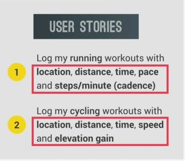
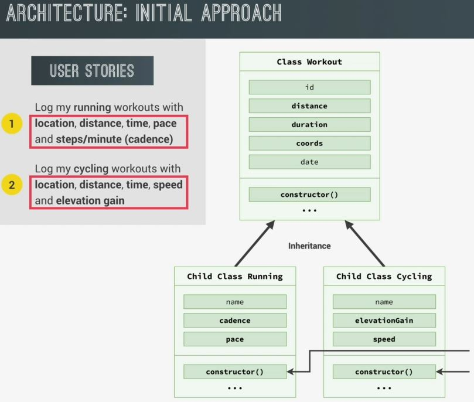
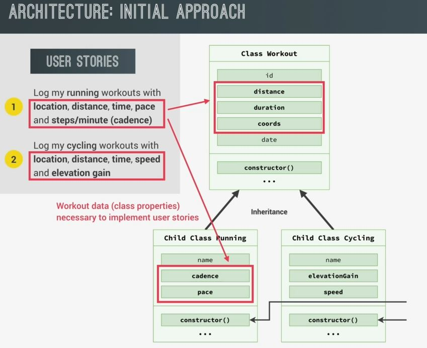
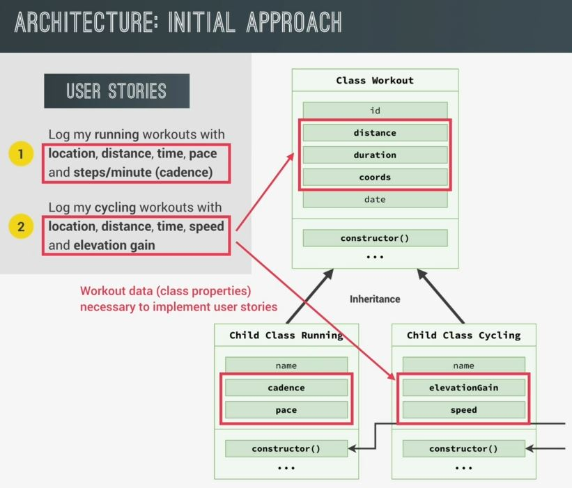
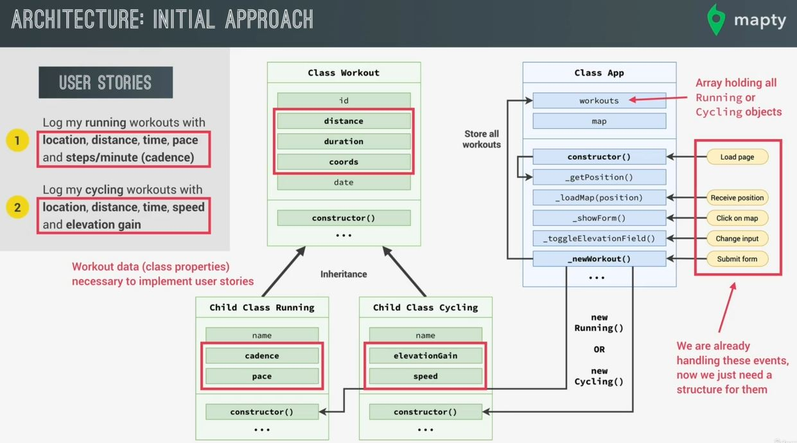

# Project Architecture

- we'll talk about some architecture patterns in JS later on but in this small project , we'll use OOP with classes 

## Architecture : Initial Approach

- `Architecture` : means all about giving the project a structure , so in that structure , we can develop the functionality
    - so in this project , i decided that the main structure will come from classes & objects

- so to start , one of the most important aspects of any Project Architecture i.e where & how to store the data 💡💡💡  
    because data is the most fundamental part of any application because with data ,  
    we can't have an application in the first place

- we need to store two different types of data , one for running workouts & one for cycling workouts  
    to manage which comes directly from the user stories i.e  
    
    - so we'll design our classes , so that they can create objects which will hold this kind of data like this 
        
        - so we'll be having a parent class i.e Workout & two different child classes 
        - Workout parent class will contain distance & duration in coordinates   
            & distance , duration & coords are common thing that's why we put them inside the parent class
        - & both those two child classes contain their own properties & methods based on the type of activity
    - things related to running class
        
    - things related to cycling class
        
    - usually in the OOP , parent class comes above & child classes come at the bottom  
        - & inside any class , we first put properties at the top & methods at the bottom 💡💡💡
        - & in the diagram , those triple dots means each classes can have more than just the constructor() function 

- that's all about the architecture of our data . 

## Structuring the code 

- now the rest of the architecture , it's more about structuring the code  
    which we already have from the previous lectures 💡💡💡 . Like we have different events on the previous code  
    i.e the loading of the page , then receiving a position from the Geolocation API & in tradition sense ,  
    on() method is not a event listener but we can consider it kind of as an event , we have click event on the map ,  
    we have changing the input from cycling to running or from running to cycling ,  
    then we also have the event of submitting a form

- so now we need to create different functions for handling those different events  
    & we're gonna do is to create a big class called `App` like this
    
    - `App` class will hold all of those functions as methods 💡💡💡

- A Quick look at this `app` or application class diagram ✅ :
    - we can immediately see that loading the page which will trigger the constructor of the object  
        that we're gonna create through this class
    - so at the beginning , we want to get the current position of the user using the Geolocation API 
    - then as we receive that position, we want to load the map based on that position  
        that's why we're gonna have a method i.e Load map . Then as we click on the map ,   
        we want a method called show form 
    - then as we change the input , we want a method called toggle elevation field  
        & then the most important one is the event of submitting the form
    - then that new workout method (of App class) will be the heart of this entire class  
        because is the one that will create new Running objects or new cycling objects  
        & these objects will be built based on the data which is coming from the form  
        & as the user keeps adding running or cycling workouts , a new object will be created for each of the workouts
    - & each of them will be stored in a workouts array which will hold all of these objects  
        so this is gonna be an important class property that all methods of the class will  
        be able to use to work with those workouts . so `App` class is a structure which is to build the application itself  
        & organized into one neat block of data & functionality
    
- if the Project is quite complex then we can extend this architecture further & create one class  
    which deals with the UI & one class for Business logic (which works only with the underlying data)

- so in this architecture , we divide the application & data to handle stuff easily  
    & we used data encapsulation to protect the methods & not accessible from everywhere else in the code  
    that's why in diagram , we use the `_` underscore convention
