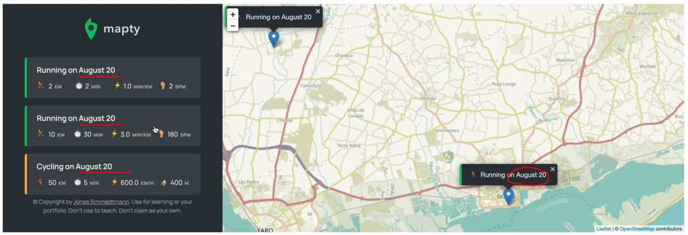

# Managing Workout Data - Creating Classes

- we'll implement classes to manage the data about our cycling & running workouts that're coming from the UI

## Steps - implementing classes to manage those two types of workouts

- `STEP 1` : creating the parent class for both types of workouts
    ```js
    const months = ['January', 'February', 'March', 'April', 
        'May', 'June', 'July', 'August', 'September', 'October', 'November', 'December'];

    const form = document.querySelector('.form');
    const containerWorkouts = document.querySelector('.workouts');
    const inputType = document.querySelector('.form__input--type');
    const inputDistance = document.querySelector('.form__input--distance');
    const inputDuration = document.querySelector('.form__input--duration');
    const inputCadence = document.querySelector('.form__input--cadence');
    const inputElevation = document.querySelector('.form__input--elevation');

    class Workout {
        constructor(coords , distance, duration) {
            this.coords = coords
            this.distance = distance // in km
            this.duration = duration // in min
        }
    }

    class App {
        #map ;
        #mapEvent ;

        constructor() {
            this._getPosition() 

            form.addEventListener('submit', this._newWorkout.bind(this))

            inputType.addEventListener('change', this._toggleElevationField)
        }

        _getPosition() {
            if (navigator.geolocation) {
                navigator.geolocation.getCurrentPosition(this._loadMap.bind(this) , function() {
                        alert('Could not get your position')
                    }
                )
            };
        }

        _loadMap(position) {
            const { latitude } = position.coords
            const { longitude } = position.coords
            console.log(`https://www.google.com/maps/@${latitude},${longitude} `) 

            const coords = [latitude, longitude] 
            
            this.#map = L.map('map').setView(coords , 13);
            L.tileLayer(`https://{s}.tile.openstreetmap.fr/hot/{z}/{x}/{y}.png`, {
                attribution: '&copy; <a href="https://www.openstreetmap.org/copyright">OpenStreetMap</a> contributors'
            }).addTo(this.#map);

            // handling clicks on the map
            this.#map.on('click', this._showForm.bind(this)) 
        }

        _showForm(mapE) {
            this.#mapEvent = mapE 
            form.classList.remove('hidden')
            inputDistance.focus() 
        }

        _toggleElevationField() {
            inputElevation.closest('.form__row').classList.toggle('.form__row--hidden')
            inputCadence.closest('.form__row').classList.toggle('.form__row--hidden')
        }

        _newWorkout(e) { 
            e.preventDefault()

            inputDistance.value = inputDuration.value = inputCadence.value = inputElevation.value  = ''

            // display maker
            const { lat , lng } = this.#mapEvent.latlng
            L.marker([lat , lng]).addTo(this.#map).bindPopup(L.pop({
                    maxWidth: 250, 
                    minWidth: 100, 
                    autoClose: false , 
                    closeOnClick: false, 
                    className: 'running-popup', 
                })
            ).setPopupContent("Workout").openPopup();
        }
    }

    const app = new App() 
    ```
    - now we also want a date for each workout object like this 
        
        - besides date , we also need an ID , so that should be a unique identifier <br>
            so in the bankers project where we also had an array of objects , so here we'll do the same thing <br>
            like we did in bankers project i.e having the array of objects , sometimes we need to find an object <br>
            in that array , So we used defined or defined index methods for that 
        - however , these methods only work if there is something by which we can search as some kind of unique identifier <br> 
            & in the bankers project there used to be simple the name of the account owner but that's just not a good practice <br>
            so instead any object should have some kind of unique identifier , so that we can later identify it using that ID
    - `STEP 1.1` : inside the Workout class , defining date & ID as public properties 
        ```js
        // put code before this from STEP 1

        class Workout {
            date = new Date()
            id = (new Date() + "").slice(-10) 
            // Note : we're defining variables as public properties
                // now in real world , we usually always use some kind of library to create good & unique ID numbers
                    // so usually , we should never create IDs on our own but always let some library take care of that 
                        // because it's a very important part of any application 💡💡💡
                    // however , we're not gonna use any library 
                    // so to generate , here we used the Date to create a new id & then convert that date into string 
                        // & then we took the last 10 numbers , which we'll be unique numbers 💡💡💡

            constructor(coords , distance, duration) {
                this.coords = coords
                this.distance = distance // in km
                this.duration = duration // in min
            }
        }

        class App {
            #map ;
            #mapEvent ;

            constructor() {
                this._getPosition() 

                form.addEventListener('submit', this._newWorkout.bind(this))

                inputType.addEventListener('change', this._toggleElevationField)
            }

            _getPosition() {
                if (navigator.geolocation) {
                    navigator.geolocation.getCurrentPosition(this._loadMap.bind(this) , function() {
                            alert('Could not get your position')
                        }
                    )
                };
            }

            _loadMap(position) {
                const { latitude } = position.coords
                const { longitude } = position.coords
                console.log(`https://www.google.com/maps/@${latitude},${longitude} `) 

                const coords = [latitude, longitude] 
                
                this.#map = L.map('map').setView(coords , 13);
                L.tileLayer(`https://{s}.tile.openstreetmap.fr/hot/{z}/{x}/{y}.png`, {
                    attribution: '&copy; <a href="https://www.openstreetmap.org/copyright">OpenStreetMap</a> contributors'
                }).addTo(this.#map);

                // handling clicks on the map
                this.#map.on('click', this._showForm.bind(this)) 
            }

            _showForm(mapE) {
                this.#mapEvent = mapE 
                form.classList.remove('hidden')
                inputDistance.focus() 
            }

            _toggleElevationField() {
                inputElevation.closest('.form__row').classList.toggle('.form__row--hidden')
                inputCadence.closest('.form__row').classList.toggle('.form__row--hidden')
            }

            _newWorkout(e) { 
                e.preventDefault()

                inputDistance.value = inputDuration.value = inputCadence.value = inputElevation.value  = ''

                // display maker
                const { lat , lng } = this.#mapEvent.latlng
                L.marker([lat , lng]).addTo(this.#map).bindPopup(L.pop({
                        maxWidth: 250, 
                        minWidth: 100, 
                        autoClose: false , 
                        closeOnClick: false, 
                        className: 'running-popup', 
                    })
                ).setPopupContent("Workout").openPopup();
            }
        }

        const app = new App() 
        ```
        - now we'll never directly create a workout object , so instead of that , <br>
            we need always either create a running or a cycling object , so these are the child classes 💡💡💡

- `STEP 2` : creating the child classes of both type of workouts 
    ```js
    // put code before this from STEP 1

    class Workout {
        date = new Date()
        id = (new Date() + "").slice(-10) 

        constructor(coords , distance, duration) {
            this.coords = coords
            this.distance = distance // in km
            this.duration = duration // in min
        }
    }

    class Running extends Workout {
        // so we'll inherit some properties from the parent class 
            // & add the additional properties & methods on this child class
        constructor(coords, distance, duration, cadence) {
            super(coords, distance, duration)
            this.cadence = cadence
        }
    }

    class Cycling extends Workout {
        constructor(coords, distance, duration, elevationGain) {
            super(coords, distance, duration)
            this.elevationGain = elevationGain
        }
    }

    class App {
        #map ;
        #mapEvent ;

        constructor() {
            this._getPosition() 

            form.addEventListener('submit', this._newWorkout.bind(this))

            inputType.addEventListener('change', this._toggleElevationField)
        }

        _getPosition() {
            if (navigator.geolocation) {
                navigator.geolocation.getCurrentPosition(this._loadMap.bind(this) , function() {
                        alert('Could not get your position')
                    }
                )
            };
        }

        _loadMap(position) {
            const { latitude } = position.coords
            const { longitude } = position.coords
            console.log(`https://www.google.com/maps/@${latitude},${longitude} `) 

            const coords = [latitude, longitude] 
            
            this.#map = L.map('map').setView(coords , 13);
            L.tileLayer(`https://{s}.tile.openstreetmap.fr/hot/{z}/{x}/{y}.png`, {
                attribution: '&copy; <a href="https://www.openstreetmap.org/copyright">OpenStreetMap</a> contributors'
            }).addTo(this.#map);

            // handling clicks on the map
            this.#map.on('click', this._showForm.bind(this)) 
        }

        _showForm(mapE) {
            this.#mapEvent = mapE 
            form.classList.remove('hidden')
            inputDistance.focus() 
        }

        _toggleElevationField() {
            inputElevation.closest('.form__row').classList.toggle('.form__row--hidden')
            inputCadence.closest('.form__row').classList.toggle('.form__row--hidden')
        }

        _newWorkout(e) { 
            e.preventDefault()

            inputDistance.value = inputDuration.value = inputCadence.value = inputElevation.value  = ''

            // display maker
            const { lat , lng } = this.#mapEvent.latlng
            L.marker([lat , lng]).addTo(this.#map).bindPopup(L.pop({
                    maxWidth: 250, 
                    minWidth: 100, 
                    autoClose: false , 
                    closeOnClick: false, 
                    className: 'running-popup', 
                })
            ).setPopupContent("Workout").openPopup();
        }
    }

    const app = new App() 
    ```
    - now see the flow chart what things we need to next
    - `STEP 2.1` : defining pace inside the running child class , speed in cycling class
        ```js
       // put code before this from STEP 1

        class Workout {
            date = new Date()
            id = (new Date() + "").slice(-10) 

            constructor(coords , distance, duration) {
                this.coords = coords // [lat, lng]
                this.distance = distance // in km
                this.duration = duration // in min
            }
        }

        class Running extends Workout {
            constructor(coords, distance, duration, cadence) {
                super(coords, distance, duration)
                this.cadence = cadence

                this.calcPace() 
                    // we're calling calcPace() method inside the constructor function 
                        // instead of calling methods on the object outside of the Running class
                        // because when the object is created then the constructor of the class 
                        // will be executed automatically 💡💡💡
            }

            calcPace() {
                // pace is usually defined in minutes per kilometer i.e min/km
                    // & in US , unit will be miles per kilometer
                this.pace = this.duration / this.distance
                return this.pace
            }
        }

        class Cycling extends Workout {
            constructor(coords, distance, duration, elevationGain) {
                super(coords, distance, duration)
                this.elevationGain = elevationGain
                this.calcSpeed()
            }

            calcSpeed() {
                // km/h
                this.speed = this.distance / (this.duration / 60) // duration in hours , so in 1 hr i.e 60 mins
                    // so speed is the opposite of pace
                return this.speed
            }
        }

        // Application architecture
        class App {
            #map ;
            #mapEvent ;

            constructor() {
                this._getPosition() 

                form.addEventListener('submit', this._newWorkout.bind(this))

                inputType.addEventListener('change', this._toggleElevationField)
            }

            _getPosition() {
                if (navigator.geolocation) {
                    navigator.geolocation.getCurrentPosition(this._loadMap.bind(this) , function() {
                            alert('Could not get your position')
                        }
                    )
                };
            }

            _loadMap(position) {
                const { latitude } = position.coords
                const { longitude } = position.coords
                console.log(`https://www.google.com/maps/@${latitude},${longitude} `) 

                const coords = [latitude, longitude] 
                
                this.#map = L.map('map').setView(coords , 13);
                L.tileLayer(`https://{s}.tile.openstreetmap.fr/hot/{z}/{x}/{y}.png`, {
                    attribution: '&copy; <a href="https://www.openstreetmap.org/copyright">OpenStreetMap</a> contributors'
                }).addTo(this.#map);

                // handling clicks on the map
                this.#map.on('click', this._showForm.bind(this)) 
            }

            _showForm(mapE) {
                this.#mapEvent = mapE 
                form.classList.remove('hidden')
                inputDistance.focus() 
            }

            _toggleElevationField() {
                inputElevation.closest('.form__row').classList.toggle('.form__row--hidden')
                inputCadence.closest('.form__row').classList.toggle('.form__row--hidden')
            }

            _newWorkout(e) { 
                e.preventDefault()

                inputDistance.value = inputDuration.value = inputCadence.value = inputElevation.value  = ''

                // display maker
                const { lat , lng } = this.#mapEvent.latlng
                L.marker([lat , lng]).addTo(this.#map).bindPopup(L.pop({
                        maxWidth: 250, 
                        minWidth: 100, 
                        autoClose: false , 
                        closeOnClick: false, 
                        className: 'running-popup', 
                    })
                ).setPopupContent("Workout").openPopup();
            }
        }

        const app = new App() 
        ```
    - `STEP 2.2` : creating an object of Running class
        ```js
      // put code before this from STEP 1

        class Workout {
            date = new Date()
            id = (new Date() + "").slice(-10) 

            constructor(coords , distance, duration) {
                this.coords = coords // [lat, lng]
                this.distance = distance // in km
                this.duration = duration // in min
            }
        }

        class Running extends Workout {
            constructor(coords, distance, duration, cadence) {
                super(coords, distance, duration)
                this.cadence = cadence

                this.calcPace()
            }

            calcPace() {
                this.pace = this.duration / this.distance
                return this.pace
            }
        }

        class Cycling extends Workout {
            constructor(coords, distance, duration, elevationGain) {
                super(coords, distance, duration)
                this.elevationGain = elevationGain
                this.calcSpeed()
            }

            calcSpeed() {
                // km/h
                this.speed = this.distance / (this.duration / 60) 
                return this.speed
            }
        }

        const run1 = new Running([39, -12] , 5.2, 24, 178)
            // [39, -12] - is coords , 5.2 is kilometers , 24 is minutes
            // 178 steps per minute
        const cycling1 = new Cycling([39, -12] , 27, 95, 523)
        console.log(run1, cycling1) // output we'll get the objects of each one of them
            // but id is actually not in appropriate manner

        // Application architecture
        class App {
            #map ;
            #mapEvent ;

            constructor() {
                this._getPosition() 

                form.addEventListener('submit', this._newWorkout.bind(this))

                inputType.addEventListener('change', this._toggleElevationField)
            }

            _getPosition() {
                if (navigator.geolocation) {
                    navigator.geolocation.getCurrentPosition(this._loadMap.bind(this) , function() {
                            alert('Could not get your position')
                        }
                    )
                };
            }

            _loadMap(position) {
                const { latitude } = position.coords
                const { longitude } = position.coords
                console.log(`https://www.google.com/maps/@${latitude},${longitude} `) 

                const coords = [latitude, longitude] 
                
                this.#map = L.map('map').setView(coords , 13);
                L.tileLayer(`https://{s}.tile.openstreetmap.fr/hot/{z}/{x}/{y}.png`, {
                    attribution: '&copy; <a href="https://www.openstreetmap.org/copyright">OpenStreetMap</a> contributors'
                }).addTo(this.#map);

                // handling clicks on the map
                this.#map.on('click', this._showForm.bind(this)) 
            }

            _showForm(mapE) {
                this.#mapEvent = mapE 
                form.classList.remove('hidden')
                inputDistance.focus() 
            }

            _toggleElevationField() {
                inputElevation.closest('.form__row').classList.toggle('.form__row--hidden')
                inputCadence.closest('.form__row').classList.toggle('.form__row--hidden')
            }

            _newWorkout(e) { 
                e.preventDefault()

                inputDistance.value = inputDuration.value = inputCadence.value = inputElevation.value  = ''

                // display maker
                const { lat , lng } = this.#mapEvent.latlng
                L.marker([lat , lng]).addTo(this.#map).bindPopup(L.pop({
                        maxWidth: 250, 
                        minWidth: 100, 
                        autoClose: false , 
                        closeOnClick: false, 
                        className: 'running-popup', 
                    })
                ).setPopupContent("Workout").openPopup();
            }
        }

        const app = new App() 
        ```
    - `STEP 2.3` : refactoring the code of ID to generate it in proper manner
        ```js
        // put code before this from STEP 1

        class Workout {
            date = new Date()
            id = (Date.now() + "").slice(-10) 
                // Date.now() -> will return the current time stamp

            constructor(coords , distance, duration) {
                this.coords = coords // [lat, lng]
                this.distance = distance // in km
                this.duration = duration // in min
            }
        }

        class Running extends Workout {
            constructor(coords, distance, duration, cadence) {
                super(coords, distance, duration)
                this.cadence = cadence

                this.calcPace()
            }

            calcPace() {
                this.pace = this.duration / this.distance
                return this.pace
            }
        }

        class Cycling extends Workout {
            constructor(coords, distance, duration, elevationGain) {
                super(coords, distance, duration)
                this.elevationGain = elevationGain
                this.calcSpeed()
            }

            calcSpeed() {
                // km/h
                this.speed = this.distance / (this.duration / 60) 
                return this.speed
            }
        }

        // experiment code 
            const run1 = new Running([39, -12] , 5.2, 24, 178)
                // [39, -12] - is coords , 5.2 is kilometers , 24 is minutes
                // 178 steps per minute
            const cycling1 = new Cycling([39, -12] , 27, 95, 523)
            console.log(run1, cycling1) // output : we'll get the correct output 
                // including correct format of ID
                // & both object will have the same ID number because they were created at the same time 💡💡💡
                // but in real world , as we used the application 
                    // then it's gonna be impossible to create two new objects at the same time
                    // but if we really working on the real world 
                        // then you have many users using the same application
                    // then some users can create objects at the same time
                    // so replying on the time to create ID's is gonna be a really bad idea 💡💡💡

        // Application architecture
        class App {
            #map ;
            #mapEvent ;

            constructor() {
                this._getPosition() 

                form.addEventListener('submit', this._newWorkout.bind(this))

                inputType.addEventListener('change', this._toggleElevationField)
            }

            _getPosition() {
                if (navigator.geolocation) {
                    navigator.geolocation.getCurrentPosition(this._loadMap.bind(this) , function() {
                            alert('Could not get your position')
                        }
                    )
                };
            }

            _loadMap(position) {
                const { latitude } = position.coords
                const { longitude } = position.coords
                console.log(`https://www.google.com/maps/@${latitude},${longitude} `) 

                const coords = [latitude, longitude] 
                
                this.#map = L.map('map').setView(coords , 13);
                L.tileLayer(`https://{s}.tile.openstreetmap.fr/hot/{z}/{x}/{y}.png`, {
                    attribution: '&copy; <a href="https://www.openstreetmap.org/copyright">OpenStreetMap</a> contributors'
                }).addTo(this.#map);

                // handling clicks on the map
                this.#map.on('click', this._showForm.bind(this)) 
            }

            _showForm(mapE) {
                this.#mapEvent = mapE 
                form.classList.remove('hidden')
                inputDistance.focus() 
            }

            _toggleElevationField() {
                inputElevation.closest('.form__row').classList.toggle('.form__row--hidden')
                inputCadence.closest('.form__row').classList.toggle('.form__row--hidden')
            }

            _newWorkout(e) { 
                e.preventDefault()

                inputDistance.value = inputDuration.value = inputCadence.value = inputElevation.value  = ''

                // display maker
                const { lat , lng } = this.#mapEvent.latlng
                L.marker([lat , lng]).addTo(this.#map).bindPopup(L.pop({
                        maxWidth: 250, 
                        minWidth: 100, 
                        autoClose: false , 
                        closeOnClick: false, 
                        className: 'running-popup', 
                    })
                ).setPopupContent("Workout").openPopup();
            }
        }

        const app = new App() 
        ```
