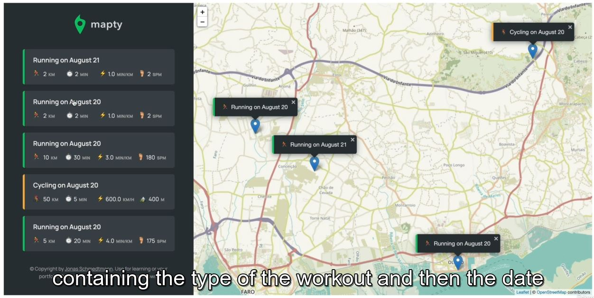
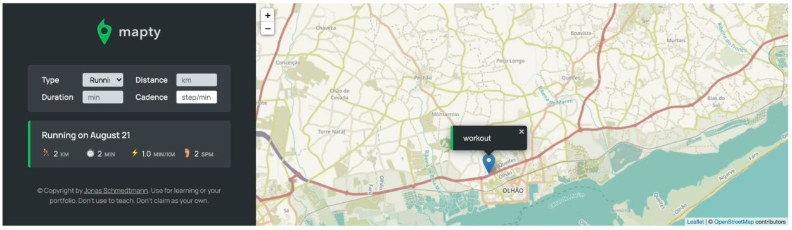
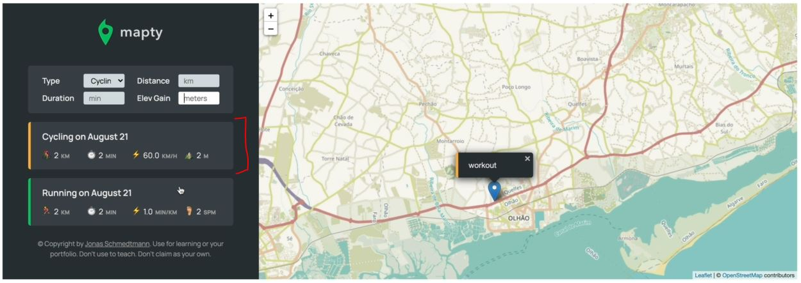
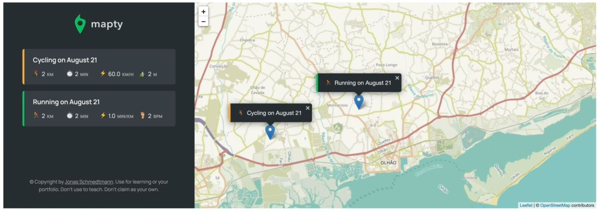

# Rendering Workouts

- let's render the new workouts in the sidebar in the form of list for each workout of our UI
    
- what we have in the list of workouts
    - so each workout contains the short description like this 
        
        - so the heading of each workout is - type of workout with date & this'll be same for the popup content
        - below will be relevant data for each workout

## Steps - rendering all the workouts in the form of list on the sidebar

- `STEP 1` : converting render workout related methods as protected methods
    ```js
    const months = ['January', 'February', 'March', 'April', 
        'May', 'June', 'July', 'August', 'September', 'October', 'November', 'December'];

    class Workout {
        date = new Date()
        id = (Date.now() + "").slice(-10) 

        constructor(coords , distance, duration) {
            this.coords = coords // [lat, lng]
            this.distance = distance // in km
            this.duration = duration // in min
        }
    }

    class Running extends Workout {
        type = "running"

        constructor(coords, distance, duration, cadence) {
            super(coords, distance, duration)
            this.cadence = cadence
            this.calcPace()
        }

        calcPace() {
            this.pace = this.duration / this.distance
            return this.pace
        }
    }

    class Cycling extends Workout {
        type = "cycling"

        constructor(coords, distance, duration, elevationGain) {
            super(coords, distance, duration)
            this.elevationGain = elevationGain
            this.calcSpeed()
        }

        calcSpeed() {
            // km/h
            this.speed = this.distance / (this.duration / 60) 
            return this.speed
        }
    }

    // Application architecture
    const form = document.querySelector('.form');
    const containerWorkouts = document.querySelector('.workouts');
    const inputType = document.querySelector('.form__input--type');
    const inputDistance = document.querySelector('.form__input--distance');
    const inputDuration = document.querySelector('.form__input--duration');
    const inputCadence = document.querySelector('.form__input--cadence');
    const inputElevation = document.querySelector('.form__input--elevation');

    class App {
        #map ;
        #mapEvent ;
        #workouts = [] ;

        constructor() {
            this._getPosition() 
            form.addEventListener('submit', this._newWorkout.bind(this))
            inputType.addEventListener('change', this._toggleElevationField)
        }

        _getPosition() {
            if (navigator.geolocation) {
                navigator.geolocation.getCurrentPosition(this._loadMap.bind(this) , function() {
                        alert('Could not get your position')
                    }
                )
            };
        }

        _loadMap(position) {
            const { latitude } = position.coords
            const { longitude } = position.coords
            console.log(`https://www.google.com/maps/@${latitude},${longitude} `) 

            const coords = [latitude, longitude] 
            
            this.#map = L.map('map').setView(coords , 13);
            L.tileLayer(`https://{s}.tile.openstreetmap.fr/hot/{z}/{x}/{y}.png`, {
                attribution: '&copy; <a href="https://www.openstreetmap.org/copyright">OpenStreetMap</a> contributors'
            }).addTo(this.#map);

            // handling clicks on the map
            this.#map.on('click', this._showForm.bind(this)) 
        }

        _showForm(mapE) {
            this.#mapEvent = mapE 
            form.classList.remove('hidden')
            inputDistance.focus() 
        }

        _toggleElevationField() {
            inputElevation.closest('.form__row').classList.toggle('.form__row--hidden')
            inputCadence.closest('.form__row').classList.toggle('.form__row--hidden')
        }

        _newWorkout(e) { 
            const validInputs = (...inputs) => inputs.every(inp => Number.isFinite(inp))
            const allPositive = (...inputs) => inputs.every(inp => inp > 0)

            e.preventDefault()

            // STEP 1 : get the data from the form
            const type = inputType.value 
            const distance = +inputDistance.value  
            const duration = +inputDuration.value
            const { lat , lng } = this.#mapEvent.latlng
            const workout ;

            // STEP 3 : if workout is running , create running object
            if (type === 'running') {
                const cadence = +inputCadence.value 
                // STEP 2 : Check if data is valid (must contain only number & those numbers should be positive)
                if (!validInputs(distance, duration, cadence) || !all(Positive(distance, duration, cadence))) {  
                    return alert("Inputs have to be positive numbers!") 
                }

                workout = new Running([lat, lng], distance, duration, cadence)
            }

            // STEP 3.1 : if workout is cycling , create cycling object
            if (type === 'cycling') {
                const elevation = +inputElevation.value 
                // STEP 2 : Check if data is valid (must contain only number & those numbers should be positive)
                if (!validInputs(distance, duration, elevation) || !all(Positive(distance, duration))) {  
                    return alert("Inputs have to be positive numbers!") 
                }

                workout = new Cycling([lat, lng], distance, duration, elevation)
            }
            // STEP 4 : add new object to workout array
            this.#workout.push(workout) 
            console.log(workout) 

            // STEP 5 : render workout on map as marker
            this._renderWorkoutMarker(workout) 

            // STEP 6 : render workout on list

            // STEP 7 : hide the form + clear input fields
            inputDistance.value = inputDuration.value = inputCadence.value = inputElevation.value  = ''
        }

        _renderWorkoutMarker(workout) {
            L.marker(workout.coords).addTo(this.#map).bindPopup(L.pop({
                    maxWidth: 250, 
                    minWidth: 100, 
                    autoClose: false , 
                    closeOnClick: false, 
                    className: `${workout.type}-popup`, 
                })
            ).setPopupContent('Workout').openPopup();
        }
    }

    const app = new App() 
    ```

- `STEP 2` : working on the render workout on list
    ```js
    // put code before this from STEP 1

    // Application architecture
    const form = document.querySelector('.form');
    const containerWorkouts = document.querySelector('.workouts');
    const inputType = document.querySelector('.form__input--type');
    const inputDistance = document.querySelector('.form__input--distance');
    const inputDuration = document.querySelector('.form__input--duration');
    const inputCadence = document.querySelector('.form__input--cadence');
    const inputElevation = document.querySelector('.form__input--elevation');

    class App {
        #map ;
        #mapEvent ;
        #workouts = [] ;

        constructor() {
            this._getPosition() 
            form.addEventListener('submit', this._newWorkout.bind(this))
            inputType.addEventListener('change', this._toggleElevationField)
        }

        _getPosition() {
            if (navigator.geolocation) {
                navigator.geolocation.getCurrentPosition(this._loadMap.bind(this) , function() {
                        alert('Could not get your position')
                    }
                )
            };
        }

        _loadMap(position) {
            const { latitude } = position.coords
            const { longitude } = position.coords
            console.log(`https://www.google.com/maps/@${latitude},${longitude} `) 

            const coords = [latitude, longitude] 
            
            this.#map = L.map('map').setView(coords , 13);
            L.tileLayer(`https://{s}.tile.openstreetmap.fr/hot/{z}/{x}/{y}.png`, {
                attribution: '&copy; <a href="https://www.openstreetmap.org/copyright">OpenStreetMap</a> contributors'
            }).addTo(this.#map);

            // handling clicks on the map
            this.#map.on('click', this._showForm.bind(this)) 
        }

        _showForm(mapE) {
            this.#mapEvent = mapE 
            form.classList.remove('hidden')
            inputDistance.focus() 
        }

        _toggleElevationField() {
            inputElevation.closest('.form__row').classList.toggle('.form__row--hidden')
            inputCadence.closest('.form__row').classList.toggle('.form__row--hidden')
        }

        _newWorkout(e) { 
            const validInputs = (...inputs) => inputs.every(inp => Number.isFinite(inp))
            const allPositive = (...inputs) => inputs.every(inp => inp > 0)

            e.preventDefault()

            // STEP 1 : get the data from the form
            const type = inputType.value 
            const distance = +inputDistance.value  
            const duration = +inputDuration.value
            const { lat , lng } = this.#mapEvent.latlng
            const workout ;

            // STEP 3 : if workout is running , create running object
            if (type === 'running') {
                const cadence = +inputCadence.value 
                // STEP 2 : Check if data is valid (must contain only number & those numbers should be positive)
                if (!validInputs(distance, duration, cadence) || !all(Positive(distance, duration, cadence))) {  
                    return alert("Inputs have to be positive numbers!") 
                }

                workout = new Running([lat, lng], distance, duration, cadence)
            }

            // STEP 3.1 : if workout is cycling , create cycling object
            if (type === 'cycling') {
                const elevation = +inputElevation.value 
                // STEP 2 : Check if data is valid (must contain only number & those numbers should be positive)
                if (!validInputs(distance, duration, elevation) || !all(Positive(distance, duration))) {  
                    return alert("Inputs have to be positive numbers!") 
                }

                workout = new Cycling([lat, lng], distance, duration, elevation)
            }
            // STEP 4 : add new object to workout array
            this.#workout.push(workout) 
            console.log(workout) 

            // STEP 5 : render workout on map as marker
            this._renderWorkoutMarker(workout) 

            // STEP 6 : render workout on list
            this._renderWorkout(workout)

            // STEP 7 : hide the form + clear input fields
            inputDistance.value = inputDuration.value = inputCadence.value = inputElevation.value  = ''
        }

        _renderWorkoutMarker(workout) {
            L.marker(workout.coords).addTo(this.#map).bindPopup(L.pop({
                    maxWidth: 250, 
                    minWidth: 100, 
                    autoClose: false , 
                    closeOnClick: false, 
                    className: `${workout.type}-popup`, 
                })
            ).setPopupContent('Workout').openPopup();
        }

        _renderWorkout(workout) {
            // we'll do some DOM manipulation
        }
    }

    const app = new App() 
    ```
    - inside the index.html , we have the html markup code which is commented out <br>
        so first one is for running & second one is for cycling , so right now just copy this html code 
        ```
        <li class="workout workout--running" data-id="1234567890">
            <h2 class="workout__title">Running on April 14</h2>
            <div class="workout__details">
              <span class="workout__icon">🏃‍♂️</span>
              <span class="workout__value">5.2</span>
              <span class="workout__unit">km</span>
            </div>
            <div class="workout__details">
              <span class="workout__icon">⏱</span>
              <span class="workout__value">24</span>
              <span class="workout__unit">min</span>
            </div>
        </li>
        ```

- `STEP 2` : creating a html code markup for DOM manipulation
    ```js
    // put code before this from STEP 1

    // Application architecture
    const form = document.querySelector('.form');
    const containerWorkouts = document.querySelector('.workouts');
    const inputType = document.querySelector('.form__input--type');
    const inputDistance = document.querySelector('.form__input--distance');
    const inputDuration = document.querySelector('.form__input--duration');
    const inputCadence = document.querySelector('.form__input--cadence');
    const inputElevation = document.querySelector('.form__input--elevation');

    class App {
        #map ;
        #mapEvent ;
        #workouts = [] ;

        constructor() {
            this._getPosition() 
            form.addEventListener('submit', this._newWorkout.bind(this))
            inputType.addEventListener('change', this._toggleElevationField)
        }

        _getPosition() {
            if (navigator.geolocation) {
                navigator.geolocation.getCurrentPosition(this._loadMap.bind(this) , function() {
                        alert('Could not get your position')
                    }
                )
            };
        }

        _loadMap(position) {
            const { latitude } = position.coords
            const { longitude } = position.coords
            console.log(`https://www.google.com/maps/@${latitude},${longitude} `) 

            const coords = [latitude, longitude] 
            
            this.#map = L.map('map').setView(coords , 13);
            L.tileLayer(`https://{s}.tile.openstreetmap.fr/hot/{z}/{x}/{y}.png`, {
                attribution: '&copy; <a href="https://www.openstreetmap.org/copyright">OpenStreetMap</a> contributors'
            }).addTo(this.#map);

            // handling clicks on the map
            this.#map.on('click', this._showForm.bind(this)) 
        }

        _showForm(mapE) {
            this.#mapEvent = mapE 
            form.classList.remove('hidden')
            inputDistance.focus() 
        }

        _toggleElevationField() {
            inputElevation.closest('.form__row').classList.toggle('.form__row--hidden')
            inputCadence.closest('.form__row').classList.toggle('.form__row--hidden')
        }

        _newWorkout(e) { 
            const validInputs = (...inputs) => inputs.every(inp => Number.isFinite(inp))
            const allPositive = (...inputs) => inputs.every(inp => inp > 0)

            e.preventDefault()

            // STEP 1 : get the data from the form
            const type = inputType.value 
            const distance = +inputDistance.value  
            const duration = +inputDuration.value
            const { lat , lng } = this.#mapEvent.latlng
            const workout ;

            // STEP 3 : if workout is running , create running object
            if (type === 'running') {
                const cadence = +inputCadence.value 
                // STEP 2 : Check if data is valid (must contain only number & those numbers should be positive)
                if (!validInputs(distance, duration, cadence) || !all(Positive(distance, duration, cadence))) {  
                    return alert("Inputs have to be positive numbers!") 
                }

                workout = new Running([lat, lng], distance, duration, cadence)
            }

            // STEP 3.1 : if workout is cycling , create cycling object
            if (type === 'cycling') {
                const elevation = +inputElevation.value 
                // STEP 2 : Check if data is valid (must contain only number & those numbers should be positive)
                if (!validInputs(distance, duration, elevation) || !all(Positive(distance, duration))) {  
                    return alert("Inputs have to be positive numbers!") 
                }

                workout = new Cycling([lat, lng], distance, duration, elevation)
            }
            // STEP 4 : add new object to workout array
            this.#workout.push(workout) 
            console.log(workout) 

            // STEP 5 : render workout on map as marker
            this._renderWorkoutMarker(workout) 

            // STEP 6 : render workout on list
            this._renderWorkout(workout)

            // STEP 7 : hide the form + clear input fields
            inputDistance.value = inputDuration.value = inputCadence.value = inputElevation.value  = ''
        }

        _renderWorkoutMarker(workout) {
            L.marker(workout.coords).addTo(this.#map).bindPopup(L.pop({
                    maxWidth: 250, 
                    minWidth: 100, 
                    autoClose: false , 
                    closeOnClick: false, 
                    className: `${workout.type}-popup`, 
                })
            ).setPopupContent('Workout').openPopup();
        }

        _renderWorkout(workout) {
            const html = `
                <li class="workout workout--${workout.type}" data-id="${workout.id}">
                    <h2 class="workout__title">Running on April 14</h2>
                    <div class="workout__details">
                      <span class="workout__icon">${workout.type === 'running' ? '🏃‍♂️' : '🚴‍♀️'}</span>
                      <span class="workout__value">${workout.distance}</span>
                      <span class="workout__unit">km</span>
                    </div>
                    <div class="workout__details">
                      <span class="workout__icon">⏱</span>
                      <span class="workout__value">${workout.duration}</span>
                      <span class="workout__unit">min</span>
                    </div>
            `
        }
    }

    const app = new App() 
    ```
    - to generate this description i.e Running on April 14 , we'll add a new method on the Workout class
    - `STEP 2.1` : creating a method on the Workout class , for the description heading of the workout type
        ```js
        class Workout {
            date = new Date()
            id = (Date.now() + "").slice(-10) 

            constructor(coords , distance, duration) {
                this.coords = coords // [lat, lng]
                this.distance = distance // in km
                this.duration = duration // in min
            }

            _setDescription() {
                const months = ['January', 'February', 'March', 'April', 
                    'May', 'June', 'July', 'August', 'September', 'October', 'November', 'December'];

                // description will be based on the name of the activity
                this.description = `${this.type[0].toUpperCase()}${this.type.slice(1)} on ${months[this.date.getMonth()]} ${this.date.getDate()}`
            }
        }

        class Running extends Workout {
            type = "running"

            constructor(coords, distance, duration, cadence) {
                super(coords, distance, duration)
                this.cadence = cadence
                this.calcPace()
            }

            calcPace() {
                this.pace = this.duration / this.distance
                return this.pace
            }
        }

        class Cycling extends Workout {
            type = "cycling"

            constructor(coords, distance, duration, elevationGain) {
                super(coords, distance, duration)
                this.elevationGain = elevationGain
                this.calcSpeed()
            }

            calcSpeed() {
                // km/h
                this.speed = this.distance / (this.duration / 60) 
                return this.speed
            }
        }

        // Application architecture
        const form = document.querySelector('.form');
        const containerWorkouts = document.querySelector('.workouts');
        const inputType = document.querySelector('.form__input--type');
        const inputDistance = document.querySelector('.form__input--distance');
        const inputDuration = document.querySelector('.form__input--duration');
        const inputCadence = document.querySelector('.form__input--cadence');
        const inputElevation = document.querySelector('.form__input--elevation');

        class App {
            #map ;
            #mapEvent ;
            #workouts = [] ;

            constructor() {
                this._getPosition() 
                form.addEventListener('submit', this._newWorkout.bind(this))
                inputType.addEventListener('change', this._toggleElevationField)
            }

            _getPosition() {
                if (navigator.geolocation) {
                    navigator.geolocation.getCurrentPosition(this._loadMap.bind(this) , function() {
                            alert('Could not get your position')
                        }
                    )
                };
            }

            _loadMap(position) {
                const { latitude } = position.coords
                const { longitude } = position.coords
                console.log(`https://www.google.com/maps/@${latitude},${longitude} `) 

                const coords = [latitude, longitude] 
                
                this.#map = L.map('map').setView(coords , 13);
                L.tileLayer(`https://{s}.tile.openstreetmap.fr/hot/{z}/{x}/{y}.png`, {
                    attribution: '&copy; <a href="https://www.openstreetmap.org/copyright">OpenStreetMap</a> contributors'
                }).addTo(this.#map);

                // handling clicks on the map
                this.#map.on('click', this._showForm.bind(this)) 
            }

            _showForm(mapE) {
                this.#mapEvent = mapE 
                form.classList.remove('hidden')
                inputDistance.focus() 
            }

            _toggleElevationField() {
                inputElevation.closest('.form__row').classList.toggle('.form__row--hidden')
                inputCadence.closest('.form__row').classList.toggle('.form__row--hidden')
            }

            _newWorkout(e) { 
                const validInputs = (...inputs) => inputs.every(inp => Number.isFinite(inp))
                const allPositive = (...inputs) => inputs.every(inp => inp > 0)

                e.preventDefault()

                // STEP 1 : get the data from the form
                const type = inputType.value 
                const distance = +inputDistance.value  
                const duration = +inputDuration.value
                const { lat , lng } = this.#mapEvent.latlng
                const workout ;

                // STEP 3 : if workout is running , create running object
                if (type === 'running') {
                    const cadence = +inputCadence.value 
                    // STEP 2 : Check if data is valid (must contain only number & those numbers should be positive)
                    if (!validInputs(distance, duration, cadence) || !all(Positive(distance, duration, cadence))) {  
                        return alert("Inputs have to be positive numbers!") 
                    }

                    workout = new Running([lat, lng], distance, duration, cadence)
                }

                // STEP 3.1 : if workout is cycling , create cycling object
                if (type === 'cycling') {
                    const elevation = +inputElevation.value 
                    // STEP 2 : Check if data is valid (must contain only number & those numbers should be positive)
                    if (!validInputs(distance, duration, elevation) || !all(Positive(distance, duration))) {  
                        return alert("Inputs have to be positive numbers!") 
                    }

                    workout = new Cycling([lat, lng], distance, duration, elevation)
                }
                // STEP 4 : add new object to workout array
                this.#workout.push(workout) 
                console.log(workout) 

                // STEP 5 : render workout on map as marker
                this._renderWorkoutMarker(workout) 

                // STEP 6 : render workout on list
                this._renderWorkout(workout)

                // STEP 7 : hide the form + clear input fields
                inputDistance.value = inputDuration.value = inputCadence.value = inputElevation.value  = ''
            }

            _renderWorkoutMarker(workout) {
                L.marker(workout.coords).addTo(this.#map).bindPopup(L.pop({
                        maxWidth: 250, 
                        minWidth: 100, 
                        autoClose: false , 
                        closeOnClick: false, 
                        className: `${workout.type}-popup`, 
                    })
                ).setPopupContent('Workout').openPopup();
            }

            _renderWorkout(workout) {
                const html = `
                    <li class="workout workout--${workout.type}" data-id="${workout.id}">
                        <h2 class="workout__title">Running on April 14</h2>
                        <div class="workout__details">
                          <span class="workout__icon">${workout.type === 'running' ? '🏃‍♂️' : '🚴‍♀️'}</span>
                          <span class="workout__value">${workout.distance}</span>
                          <span class="workout__unit">km</span>
                        </div>
                        <div class="workout__details">
                          <span class="workout__icon">⏱</span>
                          <span class="workout__value">${workout.duration}</span>
                          <span class="workout__unit">min</span>
                        </div>
                `
            }
        }

        const app = new App() 
        ```
    - `STEP 2.2` : calling the _setDescription() method inside the both type of workouts
        - instead of calling it inside Workout class because `Workout` class doesn't contain the `type` variable 💡💡💡
        ```js
        class Workout {
            date = new Date()
            id = (Date.now() + "").slice(-10) 

            constructor(coords , distance, duration) {
                this.coords = coords // [lat, lng]
                this.distance = distance // in km
                this.duration = duration // in min
            }

            _setDescription() {
                const months = ['January', 'February', 'March', 'April', 
                    'May', 'June', 'July', 'August', 'September', 'October', 'November', 'December'];

                // description will be based on the name of the activity
                this.description = `${this.type[0].toUpperCase()}${this.type.slice(1)} on ${months[this.date.getMonth()]} ${this.date.getDate()}`
            }
        }

        class Running extends Workout {
            type = "running"

            constructor(coords, distance, duration, cadence) {
                super(coords, distance, duration)
                this.cadence = cadence
                this.calcPace()
                this._setDescription()
                    // so as this method is executed from here , then it'll also get the access of type -> variable
            }

            calcPace() {
                this.pace = this.duration / this.distance
                return this.pace
            }
        }

        class Cycling extends Workout {
            type = "cycling"

            constructor(coords, distance, duration, elevationGain) {
                super(coords, distance, duration)
                this.elevationGain = elevationGain
                this.calcSpeed()
                this._setDescription()
            }

            calcSpeed() {
                // km/h
                this.speed = this.distance / (this.duration / 60) 
                return this.speed
            }
        }

        // Application architecture
        const form = document.querySelector('.form');
        const containerWorkouts = document.querySelector('.workouts');
        const inputType = document.querySelector('.form__input--type');
        const inputDistance = document.querySelector('.form__input--distance');
        const inputDuration = document.querySelector('.form__input--duration');
        const inputCadence = document.querySelector('.form__input--cadence');
        const inputElevation = document.querySelector('.form__input--elevation');

        class App {
            #map ;
            #mapEvent ;
            #workouts = [] ;

            constructor() {
                this._getPosition() 
                form.addEventListener('submit', this._newWorkout.bind(this))
                inputType.addEventListener('change', this._toggleElevationField)
            }

            _getPosition() {
                if (navigator.geolocation) {
                    navigator.geolocation.getCurrentPosition(this._loadMap.bind(this) , function() {
                            alert('Could not get your position')
                        }
                    )
                };
            }

            _loadMap(position) {
                const { latitude } = position.coords
                const { longitude } = position.coords
                console.log(`https://www.google.com/maps/@${latitude},${longitude} `) 

                const coords = [latitude, longitude] 
                
                this.#map = L.map('map').setView(coords , 13);
                L.tileLayer(`https://{s}.tile.openstreetmap.fr/hot/{z}/{x}/{y}.png`, {
                    attribution: '&copy; <a href="https://www.openstreetmap.org/copyright">OpenStreetMap</a> contributors'
                }).addTo(this.#map);

                // handling clicks on the map
                this.#map.on('click', this._showForm.bind(this)) 
            }

            _showForm(mapE) {
                this.#mapEvent = mapE 
                form.classList.remove('hidden')
                inputDistance.focus() 
            }

            _toggleElevationField() {
                inputElevation.closest('.form__row').classList.toggle('.form__row--hidden')
                inputCadence.closest('.form__row').classList.toggle('.form__row--hidden')
            }

            _newWorkout(e) { 
                const validInputs = (...inputs) => inputs.every(inp => Number.isFinite(inp))
                const allPositive = (...inputs) => inputs.every(inp => inp > 0)

                e.preventDefault()

                // STEP 1 : get the data from the form
                const type = inputType.value 
                const distance = +inputDistance.value  
                const duration = +inputDuration.value
                const { lat , lng } = this.#mapEvent.latlng
                const workout ;

                // STEP 3 : if workout is running , create running object
                if (type === 'running') {
                    const cadence = +inputCadence.value 
                    // STEP 2 : Check if data is valid (must contain only number & those numbers should be positive)
                    if (!validInputs(distance, duration, cadence) || !all(Positive(distance, duration, cadence))) {  
                        return alert("Inputs have to be positive numbers!") 
                    }

                    workout = new Running([lat, lng], distance, duration, cadence)
                }

                // STEP 3.1 : if workout is cycling , create cycling object
                if (type === 'cycling') {
                    const elevation = +inputElevation.value 
                    // STEP 2 : Check if data is valid (must contain only number & those numbers should be positive)
                    if (!validInputs(distance, duration, elevation) || !all(Positive(distance, duration))) {  
                        return alert("Inputs have to be positive numbers!") 
                    }

                    workout = new Cycling([lat, lng], distance, duration, elevation)
                }
                // STEP 4 : add new object to workout array
                this.#workout.push(workout) 
                console.log(workout) 

                // STEP 5 : render workout on map as marker
                this._renderWorkoutMarker(workout) 

                // STEP 6 : render workout on list
                this._renderWorkout(workout)

                // STEP 7 : hide the form + clear input fields
                inputDistance.value = inputDuration.value = inputCadence.value = inputElevation.value  = ''
            }

            _renderWorkoutMarker(workout) {
                L.marker(workout.coords).addTo(this.#map).bindPopup(L.pop({
                        maxWidth: 250, 
                        minWidth: 100, 
                        autoClose: false , 
                        closeOnClick: false, 
                        className: `${workout.type}-popup`, 
                    })
                ).setPopupContent('Workout').openPopup();
            }

            _renderWorkout(workout) {
                const html = `
                    <li class="workout workout--${workout.type}" data-id="${workout.id}">
                        <h2 class="workout__title">${workout._setDescription}</h2>
                        <div class="workout__details">
                          <span class="workout__icon">${workout.type === 'running' ? '🏃‍♂️' : '🚴‍♀️'}</span>
                          <span class="workout__value">${workout.distance}</span>
                          <span class="workout__unit">km</span>
                        </div>
                        <div class="workout__details">
                          <span class="workout__icon">⏱</span>
                          <span class="workout__value">${workout.duration}</span>
                          <span class="workout__unit">min</span>
                        </div>
                `
            }
        }

        const app = new App() 
        ```
    - `STEP 2.3` : creating condition for the type of the workout
        ```js
        class Workout {
            date = new Date()
            id = (Date.now() + "").slice(-10) 

            constructor(coords , distance, duration) {
                this.coords = coords // [lat, lng]
                this.distance = distance // in km
                this.duration = duration // in min
            }

            // workout description
            _setDescription() {
                const months = ['January', 'February', 'March', 'April', 
                    'May', 'June', 'July', 'August', 'September', 'October', 'November', 'December'];

                this.description = `${this.type[0].toUpperCase()}${this.type.slice(1)} on ${months[this.date.getMonth()]} ${this.date.getDate()}`
            }
        }

        class Running extends Workout {
            type = "running"

            constructor(coords, distance, duration, cadence) {
                super(coords, distance, duration)
                this.cadence = cadence
                this.calcPace()
                this._setDescription()
            }

            calcPace() {
                this.pace = this.duration / this.distance
                return this.pace
            }
        }

        class Cycling extends Workout {
            type = "cycling"

            constructor(coords, distance, duration, elevationGain) {
                super(coords, distance, duration)
                this.elevationGain = elevationGain
                this.calcSpeed()
                this._setDescription()
            }

            calcSpeed() {
                // km/h
                this.speed = this.distance / (this.duration / 60) 
                return this.speed
            }
        }

        // Application architecture
        const form = document.querySelector('.form');
        const containerWorkouts = document.querySelector('.workouts');
        const inputType = document.querySelector('.form__input--type');
        const inputDistance = document.querySelector('.form__input--distance');
        const inputDuration = document.querySelector('.form__input--duration');
        const inputCadence = document.querySelector('.form__input--cadence');
        const inputElevation = document.querySelector('.form__input--elevation');

        class App {
            #map ;
            #mapEvent ;
            #workouts = [] ;

            constructor() {
                this._getPosition() 
                form.addEventListener('submit', this._newWorkout.bind(this))
                inputType.addEventListener('change', this._toggleElevationField)
            }

            _getPosition() {
                if (navigator.geolocation) {
                    navigator.geolocation.getCurrentPosition(this._loadMap.bind(this) , function() {
                            alert('Could not get your position')
                        }
                    )
                };
            }

            _loadMap(position) {
                const { latitude } = position.coords
                const { longitude } = position.coords
                console.log(`https://www.google.com/maps/@${latitude},${longitude} `) 

                const coords = [latitude, longitude] 
                
                this.#map = L.map('map').setView(coords , 13);
                L.tileLayer(`https://{s}.tile.openstreetmap.fr/hot/{z}/{x}/{y}.png`, {
                    attribution: '&copy; <a href="https://www.openstreetmap.org/copyright">OpenStreetMap</a> contributors'
                }).addTo(this.#map);

                // handling clicks on the map
                this.#map.on('click', this._showForm.bind(this)) 
            }

            _showForm(mapE) {
                this.#mapEvent = mapE 
                form.classList.remove('hidden')
                inputDistance.focus() 
            }

            _toggleElevationField() {
                inputElevation.closest('.form__row').classList.toggle('.form__row--hidden')
                inputCadence.closest('.form__row').classList.toggle('.form__row--hidden')
            }

            _newWorkout(e) { 
                const validInputs = (...inputs) => inputs.every(inp => Number.isFinite(inp))
                const allPositive = (...inputs) => inputs.every(inp => inp > 0)

                e.preventDefault()

                // STEP 1 : get the data from the form
                const type = inputType.value 
                const distance = +inputDistance.value  
                const duration = +inputDuration.value
                const { lat , lng } = this.#mapEvent.latlng
                const workout ;

                // STEP 3 : if workout is running , create running object
                if (type === 'running') {
                    const cadence = +inputCadence.value 
                    // STEP 2 : Check if data is valid (must contain only number & those numbers should be positive)
                    if (!validInputs(distance, duration, cadence) || !all(Positive(distance, duration, cadence))) {  
                        return alert("Inputs have to be positive numbers!") 
                    }

                    workout = new Running([lat, lng], distance, duration, cadence)
                }

                // STEP 3.1 : if workout is cycling , create cycling object
                if (type === 'cycling') {
                    const elevation = +inputElevation.value 
                    // STEP 2 : Check if data is valid (must contain only number & those numbers should be positive)
                    if (!validInputs(distance, duration, elevation) || !all(Positive(distance, duration))) {  
                        return alert("Inputs have to be positive numbers!") 
                    }

                    workout = new Cycling([lat, lng], distance, duration, elevation)
                }
                // STEP 4 : add new object to workout array
                this.#workout.push(workout) 
                console.log(workout) 

                // STEP 5 : render workout on map as marker
                this._renderWorkoutMarker(workout) 

                // STEP 6 : render workout on list
                this._renderWorkout(workout)

                // STEP 7 : hide the form + clear input fields
                inputDistance.value = inputDuration.value = inputCadence.value = inputElevation.value  = ''
            }

            _renderWorkoutMarker(workout) {
                L.marker(workout.coords).addTo(this.#map).bindPopup(L.pop({
                        maxWidth: 250, 
                        minWidth: 100, 
                        autoClose: false , 
                        closeOnClick: false, 
                        className: `${workout.type}-popup`, 
                    })
                ).setPopupContent('Workout').openPopup();
            }

            _renderWorkout(workout) {
                let html = `
                    <li class="workout workout--${workout.type}" data-id="${workout.id}">
                        <h2 class="workout__title">${workout._setDescription}</h2>
                        <div class="workout__details">
                          <span class="workout__icon">${workout.type === 'running' ? '🏃‍♂️' : '🚴‍♀️'}</span>
                          <span class="workout__value">${workout.distance}</span>
                          <span class="workout__unit">km</span>
                        </div>
                        <div class="workout__details">
                          <span class="workout__icon">⏱</span>
                          <span class="workout__value">${workout.duration}</span>
                          <span class="workout__unit">min</span>
                        </div>
                ` ;

                if (workout.type === 'running') {
                    html += `
                        <div class="workout__details">
                            <span class="workout__icon">⚡️</span>
                            <span class="workout__value">${workout.pace.toFixed(1)}</span>
                            <span class="workout__unit">min/km</span>
                        </div>
                        <div class="workout__details">
                            <span class="workout__icon">🦶🏼</span>
                            <span class="workout__value">${workout.cadence}</span>
                            <span class="workout__unit">spm</span>
                        </div>
                    </li>
                    ` ;
                }

                if (workout.type === 'cycling') {
                    html += `
                        <div class="workout__details">
                            <span class="workout__icon">⚡️</span>
                            <span class="workout__value">${workout.speed.toFixed(1)}</span>
                            <span class="workout__unit">min/km</span>
                        </div>
                        <div class="workout__details">
                            <span class="workout__icon">🦶🏼</span>
                            <span class="workout__value">${workout.elevationGain}</span>
                            <span class="workout__unit">spm</span>
                        </div>
                    </li>
                    ` ;
                }
            }
        }

        const app = new App() 
        ```
    - `STEP 2.4` : injecting the HTML code , so inside the index.html file 
        - so we have `workouts` ul & inside of it, first child element is `form` element
        - & then only second element should then become the first activity , so that's why <br>
            we can't simply attach the new workout element to that `workouts` ul element <br>
            because we could either insert it as a first child or as a last child
        - but we don't want any of those options , we'll insert that html code close to that `form` element <br>
            but we'll insert it as a sibling element 💡💡💡
        ```js
        // put the code before this from STEP 2.3

        // Application architecture
        const form = document.querySelector('.form');
        const containerWorkouts = document.querySelector('.workouts');
        const inputType = document.querySelector('.form__input--type');
        const inputDistance = document.querySelector('.form__input--distance');
        const inputDuration = document.querySelector('.form__input--duration');
        const inputCadence = document.querySelector('.form__input--cadence');
        const inputElevation = document.querySelector('.form__input--elevation');

        class App {
            #map ;
            #mapEvent ;
            #workouts = [] ;

            constructor() {
                this._getPosition() 
                form.addEventListener('submit', this._newWorkout.bind(this))
                inputType.addEventListener('change', this._toggleElevationField)
            }

            _getPosition() {
                if (navigator.geolocation) {
                    navigator.geolocation.getCurrentPosition(this._loadMap.bind(this) , function() {
                            alert('Could not get your position')
                        }
                    )
                };
            }

            _loadMap(position) {
                const { latitude } = position.coords
                const { longitude } = position.coords
                console.log(`https://www.google.com/maps/@${latitude},${longitude} `) 

                const coords = [latitude, longitude] 
                
                this.#map = L.map('map').setView(coords , 13);
                L.tileLayer(`https://{s}.tile.openstreetmap.fr/hot/{z}/{x}/{y}.png`, {
                    attribution: '&copy; <a href="https://www.openstreetmap.org/copyright">OpenStreetMap</a> contributors'
                }).addTo(this.#map);

                // handling clicks on the map
                this.#map.on('click', this._showForm.bind(this)) 
            }

            _showForm(mapE) {
                this.#mapEvent = mapE 
                form.classList.remove('hidden')
                inputDistance.focus() 
            }

            _toggleElevationField() {
                inputElevation.closest('.form__row').classList.toggle('.form__row--hidden')
                inputCadence.closest('.form__row').classList.toggle('.form__row--hidden')
            }

            _newWorkout(e) { 
                const validInputs = (...inputs) => inputs.every(inp => Number.isFinite(inp))
                const allPositive = (...inputs) => inputs.every(inp => inp > 0)

                e.preventDefault()

                // STEP 1 : get the data from the form
                const type = inputType.value 
                const distance = +inputDistance.value  
                const duration = +inputDuration.value
                const { lat , lng } = this.#mapEvent.latlng
                const workout ;

                // STEP 3 : if workout is running , create running object
                if (type === 'running') {
                    const cadence = +inputCadence.value 
                    // STEP 2 : Check if data is valid (must contain only number & those numbers should be positive)
                    if (!validInputs(distance, duration, cadence) || !all(Positive(distance, duration, cadence))) {  
                        return alert("Inputs have to be positive numbers!") 
                    }

                    workout = new Running([lat, lng], distance, duration, cadence)
                }

                // STEP 3.1 : if workout is cycling , create cycling object
                if (type === 'cycling') {
                    const elevation = +inputElevation.value 
                    // STEP 2 : Check if data is valid (must contain only number & those numbers should be positive)
                    if (!validInputs(distance, duration, elevation) || !all(Positive(distance, duration))) {  
                        return alert("Inputs have to be positive numbers!") 
                    }

                    workout = new Cycling([lat, lng], distance, duration, elevation)
                }
                // STEP 4 : add new object to workout array
                this.#workout.push(workout) 
                console.log(workout) 

                // STEP 5 : render workout on map as marker
                this._renderWorkoutMarker(workout) 

                // STEP 6 : render workout on list
                this._renderWorkout(workout)

                // STEP 7 : hide the form + clear input fields
                inputDistance.value = inputDuration.value = inputCadence.value = inputElevation.value  = ''
            }

            _renderWorkoutMarker(workout) {
                L.marker(workout.coords).addTo(this.#map).bindPopup(L.pop({
                        maxWidth: 250, 
                        minWidth: 100, 
                        autoClose: false , 
                        closeOnClick: false, 
                        className: `${workout.type}-popup`, 
                    })
                ).setPopupContent('Workout').openPopup();
            }

            _renderWorkout(workout) {
                let html = `
                    <li class="workout workout--${workout.type}" data-id="${workout.id}">
                        <h2 class="workout__title">${workout._setDescription}</h2>
                        <div class="workout__details">
                          <span class="workout__icon">${workout.type === 'running' ? '🏃‍♂️' : '🚴‍♀️'}</span>
                          <span class="workout__value">${workout.distance}</span>
                          <span class="workout__unit">km</span>
                        </div>
                        <div class="workout__details">
                          <span class="workout__icon">⏱</span>
                          <span class="workout__value">${workout.duration}</span>
                          <span class="workout__unit">min</span>
                        </div>
                ` ;

                if (workout.type === 'running') {
                    html += `
                        <div class="workout__details">
                            <span class="workout__icon">⚡️</span>
                            <span class="workout__value">${workout.pace.toFixed(1)}</span>
                            <span class="workout__unit">min/km</span>
                        </div>
                        <div class="workout__details">
                            <span class="workout__icon">🦶🏼</span>
                            <span class="workout__value">${workout.cadence}</span>
                            <span class="workout__unit">spm</span>
                        </div>
                    </li>
                    ` ;
                }

                if (workout.type === 'cycling') {
                    html += `
                        <div class="workout__details">
                            <span class="workout__icon">⚡️</span>
                            <span class="workout__value">${workout.speed.toFixed(1)}</span>
                            <span class="workout__unit">min/km</span>
                        </div>
                        <div class="workout__details">
                            <span class="workout__icon">⛰</span>
                            <span class="workout__value">${workout.elevationGain}</span>
                            <span class="workout__unit">spm</span>
                        </div>
                    </li>
                    ` ;
                }

                form.insertAdjacentHTML('afterend', html)
            }
        }

        const app = new App()
        ```
        - output : after clicking on the form & then fill the form & hit Enter key 
            - then we'll get the correct output
            
            - & doing with cycling workout form then we'll get the cycling workout before the running workout <br>
                means new workout will be added on top of the previous one like as in stack  
            
        - now we need to hide the form whenever a new input is submitted

- `STEP 3` : hide the form whenever a new input is submitted 
    ```js
    // put the code before this from STEP 2.3

    // Application architecture
    const form = document.querySelector('.form');
    const containerWorkouts = document.querySelector('.workouts');
    const inputType = document.querySelector('.form__input--type');
    const inputDistance = document.querySelector('.form__input--distance');
    const inputDuration = document.querySelector('.form__input--duration');
    const inputCadence = document.querySelector('.form__input--cadence');
    const inputElevation = document.querySelector('.form__input--elevation');

    class App {
        #map ;
        #mapEvent ;
        #workouts = [] ;

        constructor() {
            this._getPosition() 
            form.addEventListener('submit', this._newWorkout.bind(this))
            inputType.addEventListener('change', this._toggleElevationField)
        }

        _getPosition() {
            if (navigator.geolocation) {
                navigator.geolocation.getCurrentPosition(this._loadMap.bind(this) , function() {
                        alert('Could not get your position')
                    }
                )
            };
        }

        _loadMap(position) {
            const { latitude } = position.coords
            const { longitude } = position.coords
            console.log(`https://www.google.com/maps/@${latitude},${longitude} `) 

            const coords = [latitude, longitude] 
            
            this.#map = L.map('map').setView(coords , 13);
            L.tileLayer(`https://{s}.tile.openstreetmap.fr/hot/{z}/{x}/{y}.png`, {
                attribution: '&copy; <a href="https://www.openstreetmap.org/copyright">OpenStreetMap</a> contributors'
            }).addTo(this.#map);

            // handling clicks on the map
            this.#map.on('click', this._showForm.bind(this)) 
        }

        _showForm(mapE) {
            this.#mapEvent = mapE 
            form.classList.remove('hidden')
            inputDistance.focus() 
        }

        _hideForm() {
            // 1 - Empty inputs
            inputDistance.value = inputDuration.value = inputCadence.value = inputElevation.value  = ''
            // 2 - add the hidden class
            form.classList.add('hidden')
        }


        _toggleElevationField() {
            inputElevation.closest('.form__row').classList.toggle('.form__row--hidden')
            inputCadence.closest('.form__row').classList.toggle('.form__row--hidden')
        }

        _newWorkout(e) { 
            const validInputs = (...inputs) => inputs.every(inp => Number.isFinite(inp))
            const allPositive = (...inputs) => inputs.every(inp => inp > 0)

            e.preventDefault()

            // STEP 1 : get the data from the form
            const type = inputType.value 
            const distance = +inputDistance.value  
            const duration = +inputDuration.value
            const { lat , lng } = this.#mapEvent.latlng
            const workout ;

            // STEP 3 : if workout is running , create running object
            if (type === 'running') {
                const cadence = +inputCadence.value 
                // STEP 2 : Check if data is valid (must contain only number & those numbers should be positive)
                if (!validInputs(distance, duration, cadence) || !all(Positive(distance, duration, cadence))) {  
                    return alert("Inputs have to be positive numbers!") 
                }

                workout = new Running([lat, lng], distance, duration, cadence)
            }

            // STEP 3.1 : if workout is cycling , create cycling object
            if (type === 'cycling') {
                const elevation = +inputElevation.value 
                // STEP 2 : Check if data is valid (must contain only number & those numbers should be positive)
                if (!validInputs(distance, duration, elevation) || !all(Positive(distance, duration))) {  
                    return alert("Inputs have to be positive numbers!") 
                }

                workout = new Cycling([lat, lng], distance, duration, elevation)
            }
            // STEP 4 : add new object to workout array
            this.#workout.push(workout) 
            console.log(workout) 

            // STEP 5 : render workout on map as marker
            this._renderWorkoutMarker(workout) 

            // STEP 6 : render workout on list
            this._renderWorkout(workout)

            // STEP 7 : hide the form + clear input fields
            this._hideForm()
        }

        _renderWorkoutMarker(workout) {
            L.marker(workout.coords).addTo(this.#map).bindPopup(L.pop({
                    maxWidth: 250, 
                    minWidth: 100, 
                    autoClose: false , 
                    closeOnClick: false, 
                    className: `${workout.type}-popup`, 
                })
            ).setPopupContent('Workout').openPopup();
        }

        _renderWorkout(workout) {
            let html = `
                <li class="workout workout--${workout.type}" data-id="${workout.id}">
                    <h2 class="workout__title">${workout._setDescription}</h2>
                    <div class="workout__details">
                      <span class="workout__icon">${workout.type === 'running' ? '🏃‍♂️' : '🚴‍♀️'}</span>
                      <span class="workout__value">${workout.distance}</span>
                      <span class="workout__unit">km</span>
                    </div>
                    <div class="workout__details">
                      <span class="workout__icon">⏱</span>
                      <span class="workout__value">${workout.duration}</span>
                      <span class="workout__unit">min</span>
                    </div>
            ` ;

            if (workout.type === 'running') {
                html += `
                    <div class="workout__details">
                        <span class="workout__icon">⚡️</span>
                        <span class="workout__value">${workout.pace.toFixed(1)}</span>
                        <span class="workout__unit">min/km</span>
                    </div>
                    <div class="workout__details">
                        <span class="workout__icon">🦶🏼</span>
                        <span class="workout__value">${workout.cadence}</span>
                        <span class="workout__unit">spm</span>
                    </div>
                </li>
                ` ;
            }

            if (workout.type === 'cycling') {
                html += `
                    <div class="workout__details">
                        <span class="workout__icon">⚡️</span>
                        <span class="workout__value">${workout.speed.toFixed(1)}</span>
                        <span class="workout__unit">min/km</span>
                    </div>
                    <div class="workout__details">
                        <span class="workout__icon">⛰</span>
                        <span class="workout__value">${workout.elevationGain}</span>
                        <span class="workout__unit">spm</span>
                    </div>
                </li>
                ` ;
            }

            form.insertAdjacentHTML('afterend', html)
        }
    }

    const app = new App()
    ```
    - checking output : when we click on the map then the form will be created 
        - & after submitting it with data then we'll get the workout list but the animation of it goes up <br>
            when the form gets hide
    - `STEP 3.1` : handling the animation of the form for hiding
        - in the working project , when we add the new form then all the list of workouts goes down in terms of animation
        - & after submitting the form then the new list will overwrite that form in terms of animation 💡💡💡
        ```js
        // put the code before this from STEP 2.3

        // Application architecture
        const form = document.querySelector('.form');
        const containerWorkouts = document.querySelector('.workouts');
        const inputType = document.querySelector('.form__input--type');
        const inputDistance = document.querySelector('.form__input--distance');
        const inputDuration = document.querySelector('.form__input--duration');
        const inputCadence = document.querySelector('.form__input--cadence');
        const inputElevation = document.querySelector('.form__input--elevation');

        class App {
            #map ;
            #mapEvent ;
            #workouts = [] ;

            constructor() {
                this._getPosition() 
                form.addEventListener('submit', this._newWorkout.bind(this))
                inputType.addEventListener('change', this._toggleElevationField)
            }

            _getPosition() {
                if (navigator.geolocation) {
                    navigator.geolocation.getCurrentPosition(this._loadMap.bind(this) , function() {
                            alert('Could not get your position')
                        }
                    )
                };
            }

            _loadMap(position) {
                const { latitude } = position.coords
                const { longitude } = position.coords
                console.log(`https://www.google.com/maps/@${latitude},${longitude} `) 

                const coords = [latitude, longitude] 
                
                this.#map = L.map('map').setView(coords , 13);
                L.tileLayer(`https://{s}.tile.openstreetmap.fr/hot/{z}/{x}/{y}.png`, {
                    attribution: '&copy; <a href="https://www.openstreetmap.org/copyright">OpenStreetMap</a> contributors'
                }).addTo(this.#map);

                // handling clicks on the map
                this.#map.on('click', this._showForm.bind(this)) 
            }

            _showForm(mapE) {
                this.#mapEvent = mapE 
                form.classList.remove('hidden')
                inputDistance.focus() 
            }

            _hideForm() {
                // 1 - Empty inputs
                inputDistance.value = inputDuration.value = inputCadence.value = inputElevation.value  = ''
                // 2 - form animation
                form.style.display = 'none'
                // 3 - add the hidden class
                form.classList.add('hidden')
                setTimeout(() => (form.style.display = "grid") , 1000)
            }

            _toggleElevationField() {
                inputElevation.closest('.form__row').classList.toggle('.form__row--hidden')
                inputCadence.closest('.form__row').classList.toggle('.form__row--hidden')
            }

            _newWorkout(e) { 
                const validInputs = (...inputs) => inputs.every(inp => Number.isFinite(inp))
                const allPositive = (...inputs) => inputs.every(inp => inp > 0)

                e.preventDefault()

                // STEP 1 : get the data from the form
                const type = inputType.value 
                const distance = +inputDistance.value  
                const duration = +inputDuration.value
                const { lat , lng } = this.#mapEvent.latlng
                const workout ;

                // STEP 3 : if workout is running , create running object
                if (type === 'running') {
                    const cadence = +inputCadence.value 
                    // STEP 2 : Check if data is valid (must contain only number & those numbers should be positive)
                    if (!validInputs(distance, duration, cadence) || !all(Positive(distance, duration, cadence))) {  
                        return alert("Inputs have to be positive numbers!") 
                    }

                    workout = new Running([lat, lng], distance, duration, cadence)
                }

                // STEP 3.1 : if workout is cycling , create cycling object
                if (type === 'cycling') {
                    const elevation = +inputElevation.value 
                    // STEP 2 : Check if data is valid (must contain only number & those numbers should be positive)
                    if (!validInputs(distance, duration, elevation) || !all(Positive(distance, duration))) {  
                        return alert("Inputs have to be positive numbers!") 
                    }

                    workout = new Cycling([lat, lng], distance, duration, elevation)
                }
                // STEP 4 : add new object to workout array
                this.#workout.push(workout) 
                console.log(workout) 

                // STEP 5 : render workout on map as marker
                this._renderWorkoutMarker(workout) 

                // STEP 6 : render workout on list
                this._renderWorkout(workout)

                // STEP 7 : hide the form + clear input fields
                this._hideForm()
            }

            _renderWorkoutMarker(workout) {
                L.marker(workout.coords).addTo(this.#map).bindPopup(L.pop({
                        maxWidth: 250, 
                        minWidth: 100, 
                        autoClose: false , 
                        closeOnClick: false, 
                        className: `${workout.type}-popup`, 
                    })
                ).setPopupContent('Workout').openPopup();
            }

            _renderWorkout(workout) {
                let html = `
                    <li class="workout workout--${workout.type}" data-id="${workout.id}">
                        <h2 class="workout__title">${workout._setDescription}</h2>
                        <div class="workout__details">
                          <span class="workout__icon">${workout.type === 'running' ? '🏃‍♂️' : '🚴‍♀️'}</span>
                          <span class="workout__value">${workout.distance}</span>
                          <span class="workout__unit">km</span>
                        </div>
                        <div class="workout__details">
                          <span class="workout__icon">⏱</span>
                          <span class="workout__value">${workout.duration}</span>
                          <span class="workout__unit">min</span>
                        </div>
                ` ;

                if (workout.type === 'running') {
                    html += `
                        <div class="workout__details">
                            <span class="workout__icon">⚡️</span>
                            <span class="workout__value">${workout.pace.toFixed(1)}</span>
                            <span class="workout__unit">min/km</span>
                        </div>
                        <div class="workout__details">
                            <span class="workout__icon">🦶🏼</span>
                            <span class="workout__value">${workout.cadence}</span>
                            <span class="workout__unit">spm</span>
                        </div>
                    </li>
                    ` ;
                }

                if (workout.type === 'cycling') {
                    html += `
                        <div class="workout__details">
                            <span class="workout__icon">⚡️</span>
                            <span class="workout__value">${workout.speed.toFixed(1)}</span>
                            <span class="workout__unit">min/km</span>
                        </div>
                        <div class="workout__details">
                            <span class="workout__icon">⛰</span>
                            <span class="workout__value">${workout.elevationGain}</span>
                            <span class="workout__unit">spm</span>
                        </div>
                    </li>
                    ` ;
                }

                form.insertAdjacentHTML('afterend', html)
            }
        }

        const app = new App()
        ```
        - output : after clicking on the map & after submitting the form with data
            - then that form will be gets hidden & no animation will happen on that new workout list
    - `STEP 3.2` : now adding content on the popup with the emoji based on the type of workout
        ```js
        // put the code before this from STEP 2.3

        // Application architecture
        const form = document.querySelector('.form');
        const containerWorkouts = document.querySelector('.workouts');
        const inputType = document.querySelector('.form__input--type');
        const inputDistance = document.querySelector('.form__input--distance');
        const inputDuration = document.querySelector('.form__input--duration');
        const inputCadence = document.querySelector('.form__input--cadence');
        const inputElevation = document.querySelector('.form__input--elevation');

        class App {
            #map ;
            #mapEvent ;
            #workouts = [] ;

            constructor() {
                this._getPosition() 
                form.addEventListener('submit', this._newWorkout.bind(this))
                inputType.addEventListener('change', this._toggleElevationField)
            }

            _getPosition() {
                if (navigator.geolocation) {
                    navigator.geolocation.getCurrentPosition(this._loadMap.bind(this) , function() {
                            alert('Could not get your position')
                        }
                    )
                };
            }

            _loadMap(position) {
                const { latitude } = position.coords
                const { longitude } = position.coords
                console.log(`https://www.google.com/maps/@${latitude},${longitude} `) 

                const coords = [latitude, longitude] 
                
                this.#map = L.map('map').setView(coords , 13);
                L.tileLayer(`https://{s}.tile.openstreetmap.fr/hot/{z}/{x}/{y}.png`, {
                    attribution: '&copy; <a href="https://www.openstreetmap.org/copyright">OpenStreetMap</a> contributors'
                }).addTo(this.#map);

                // handling clicks on the map
                this.#map.on('click', this._showForm.bind(this)) 
            }

            _showForm(mapE) {
                this.#mapEvent = mapE 
                form.classList.remove('hidden')
                inputDistance.focus() 
            }

            _hideForm() {
                // 1 - Empty inputs
                inputDistance.value = inputDuration.value = inputCadence.value = inputElevation.value  = ''
                // 2 - form animation
                form.style.display = 'none'
                // 3 - add the hidden class
                form.classList.add('hidden')
                setTimeout(() => (form.style.display = "grid") , 1000)
            }

            _toggleElevationField() {
                inputElevation.closest('.form__row').classList.toggle('.form__row--hidden')
                inputCadence.closest('.form__row').classList.toggle('.form__row--hidden')
            }

            _newWorkout(e) { 
                const validInputs = (...inputs) => inputs.every(inp => Number.isFinite(inp))
                const allPositive = (...inputs) => inputs.every(inp => inp > 0)

                e.preventDefault()

                // STEP 1 : get the data from the form
                const type = inputType.value 
                const distance = +inputDistance.value  
                const duration = +inputDuration.value
                const { lat , lng } = this.#mapEvent.latlng
                const workout ;

                // STEP 3 : if workout is running , create running object
                if (type === 'running') {
                    const cadence = +inputCadence.value 
                    // STEP 2 : Check if data is valid (must contain only number & those numbers should be positive)
                    if (!validInputs(distance, duration, cadence) || !all(Positive(distance, duration, cadence))) {  
                        return alert("Inputs have to be positive numbers!") 
                    }

                    workout = new Running([lat, lng], distance, duration, cadence)
                }

                // STEP 3.1 : if workout is cycling , create cycling object
                if (type === 'cycling') {
                    const elevation = +inputElevation.value 
                    // STEP 2 : Check if data is valid (must contain only number & those numbers should be positive)
                    if (!validInputs(distance, duration, elevation) || !all(Positive(distance, duration))) {  
                        return alert("Inputs have to be positive numbers!") 
                    }

                    workout = new Cycling([lat, lng], distance, duration, elevation)
                }
                // STEP 4 : add new object to workout array
                this.#workout.push(workout) 
                console.log(workout) 

                // STEP 5 : render workout on map as marker
                this._renderWorkoutMarker(workout) 

                // STEP 6 : render workout on list
                this._renderWorkout(workout)

                // STEP 7 : hide the form + clear input fields
                this._hideForm()
            }

            _renderWorkoutMarker(workout) {
                L.marker(workout.coords).addTo(this.#map).bindPopup(L.pop({
                        maxWidth: 250, 
                        minWidth: 100, 
                        autoClose: false , 
                        closeOnClick: false, 
                        className: `${workout.type}-popup`, 
                    })
                ).setPopupContent(`${workout.type === 'running' ? '🏃‍♂️' : '🚴‍♀️'} ${workout.description}`).openPopup();
            }

            _renderWorkout(workout) {
                let html = `
                    <li class="workout workout--${workout.type}" data-id="${workout.id}">
                        <h2 class="workout__title">${workout._setDescription}</h2>
                        <div class="workout__details">
                          <span class="workout__icon">${workout.type === 'running' ? '🏃‍♂️' : '🚴‍♀️'}</span>
                          <span class="workout__value">${workout.distance}</span>
                          <span class="workout__unit">km</span>
                        </div>
                        <div class="workout__details">
                          <span class="workout__icon">⏱</span>
                          <span class="workout__value">${workout.duration}</span>
                          <span class="workout__unit">min</span>
                        </div>
                ` ;

                if (workout.type === 'running') {
                    html += `
                        <div class="workout__details">
                            <span class="workout__icon">⚡️</span>
                            <span class="workout__value">${workout.pace.toFixed(1)}</span>
                            <span class="workout__unit">min/km</span>
                        </div>
                        <div class="workout__details">
                            <span class="workout__icon">🦶🏼</span>
                            <span class="workout__value">${workout.cadence}</span>
                            <span class="workout__unit">spm</span>
                        </div>
                    </li>
                    ` ;
                }

                if (workout.type === 'cycling') {
                    html += `
                        <div class="workout__details">
                            <span class="workout__icon">⚡️</span>
                            <span class="workout__value">${workout.speed.toFixed(1)}</span>
                            <span class="workout__unit">min/km</span>
                        </div>
                        <div class="workout__details">
                            <span class="workout__icon">⛰</span>
                            <span class="workout__value">${workout.elevationGain}</span>
                            <span class="workout__unit">spm</span>
                        </div>
                    </li>
                    ` ;
                }

                form.insertAdjacentHTML('afterend', html)
            }
        }

        const app = new App()
        ``` 
        - output : after clicking on the map , & then filling the form & after submitting it 
            - we'll get this popup with the correct output like this <br>
                
