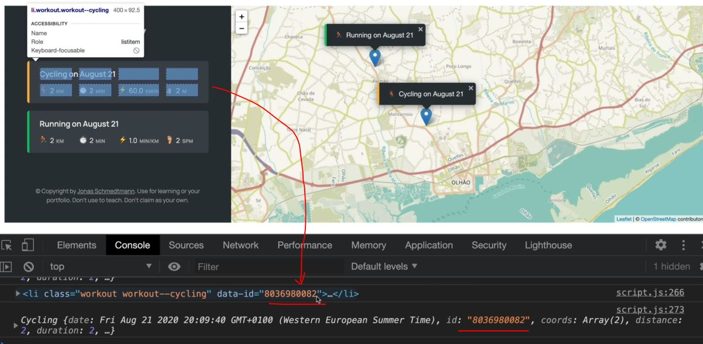

# Move to Marker On Click

- when we click on any of the workout list then map should move to that list & that popup will come in the center of the map

## Steps - moving the map based on clicked on that list

- now let's say we have the blank project like this
    
    - & right now there're no workouts to click
    - so here comes a question i.e where should we actually attach the event handler <br>
        right now we don't have the element on which we actually want to attach the event listener <br>
        because it hasn't created yet
    - so we need to use event delegation , so we'll add the event handler to the parent element i.e `workout` class in html 💡

- `STEP 1` : adding click event listener on containerWorkouts 
    ```js
    class Workout {
        date = new Date()
        id = (Date.now() + "").slice(-10) 

        constructor(coords , distance, duration) {
            this.coords = coords // [lat, lng]
            this.distance = distance // in km
            this.duration = duration // in min
        }

        // workout description
        _setDescription() {
            const months = ['January', 'February', 'March', 'April', 
                'May', 'June', 'July', 'August', 'September', 'October', 'November', 'December'];

            this.description = `${this.type[0].toUpperCase()}${this.type.slice(1)} on ${months[this.date.getMonth()]} ${this.date.getDate()}`
        }
    }

    class Running extends Workout {
        type = "running"

        constructor(coords, distance, duration, cadence) {
            super(coords, distance, duration)
            this.cadence = cadence
            this.calcPace()
            this._setDescription()
        }

        calcPace() {
            this.pace = this.duration / this.distance
            return this.pace
        }
    }

    class Cycling extends Workout {
        type = "cycling"

        constructor(coords, distance, duration, elevationGain) {
            super(coords, distance, duration)
            this.elevationGain = elevationGain
            this.calcSpeed()
            this._setDescription()
        }

        calcSpeed() {
            // km/h
            this.speed = this.distance / (this.duration / 60) 
            return this.speed
        }
    }

    // Application architecture
    const form = document.querySelector('.form');
    const containerWorkouts = document.querySelector('.workouts');
    const inputType = document.querySelector('.form__input--type');
    const inputDistance = document.querySelector('.form__input--distance');
    const inputDuration = document.querySelector('.form__input--duration');
    const inputCadence = document.querySelector('.form__input--cadence');
    const inputElevation = document.querySelector('.form__input--elevation');

    class App {
        #map ;
        #mapEvent ;
        #workouts = [] ;

        constructor() {
            this._getPosition() 
            form.addEventListener('submit', this._newWorkout.bind(this))
            inputType.addEventListener('change', this._toggleElevationField)
            containerWorkouts.addEventListener('click', this._moveToPopup) // added the event listener for moving popup
        }

        _getPosition() {
            if (navigator.geolocation) {
                navigator.geolocation.getCurrentPosition(this._loadMap.bind(this) , function() {
                        alert('Could not get your position')
                    }
                )
            };
        }

        _loadMap(position) {
            const { latitude } = position.coords
            const { longitude } = position.coords
            console.log(`https://www.google.com/maps/@${latitude},${longitude} `) 

            const coords = [latitude, longitude] 
            
            this.#map = L.map('map').setView(coords , 13);
            L.tileLayer(`https://{s}.tile.openstreetmap.fr/hot/{z}/{x}/{y}.png`, {
                attribution: '&copy; <a href="https://www.openstreetmap.org/copyright">OpenStreetMap</a> contributors'
            }).addTo(this.#map);

            // handling clicks on the map
            this.#map.on('click', this._showForm.bind(this)) 
        }

        _showForm(mapE) {
            this.#mapEvent = mapE 
            form.classList.remove('hidden')
            inputDistance.focus() 
        }

        _hideForm() {
            // 1 - Empty inputs
            inputDistance.value = inputDuration.value = inputCadence.value = inputElevation.value  = ''
            // 2 - form animation
            form.style.display = 'none'
            // 3 - add the hidden class
            form.classList.add('hidden')
            setTimeout(() => (form.style.display = "grid") , 1000)
        }

        _toggleElevationField() {
            inputElevation.closest('.form__row').classList.toggle('.form__row--hidden')
            inputCadence.closest('.form__row').classList.toggle('.form__row--hidden')
        }

        _newWorkout(e) { 
            const validInputs = (...inputs) => inputs.every(inp => Number.isFinite(inp))
            const allPositive = (...inputs) => inputs.every(inp => inp > 0)

            e.preventDefault()

            // STEP 1 : get the data from the form
            const type = inputType.value 
            const distance = +inputDistance.value  
            const duration = +inputDuration.value
            const { lat , lng } = this.#mapEvent.latlng
            const workout ;

            // STEP 3 : if workout is running , create running object
            if (type === 'running') {
                const cadence = +inputCadence.value 
                // STEP 2 : Check if data is valid (must contain only number & those numbers should be positive)
                if (!validInputs(distance, duration, cadence) || !all(Positive(distance, duration, cadence))) {  
                    return alert("Inputs have to be positive numbers!") 
                }

                workout = new Running([lat, lng], distance, duration, cadence)
            }

            // STEP 3.1 : if workout is cycling , create cycling object
            if (type === 'cycling') {
                const elevation = +inputElevation.value 
                // STEP 2 : Check if data is valid (must contain only number & those numbers should be positive)
                if (!validInputs(distance, duration, elevation) || !all(Positive(distance, duration))) {  
                    return alert("Inputs have to be positive numbers!") 
                }

                workout = new Cycling([lat, lng], distance, duration, elevation)
            }
            // STEP 4 : add new object to workout array
            this.#workout.push(workout) 
            console.log(workout) 

            // STEP 5 : render workout on map as marker
            this._renderWorkoutMarker(workout) 

            // STEP 6 : render workout on list
            this._renderWorkout(workout)

            // STEP 7 : hide the form + clear input fields
            this._hideForm()
        }

        _renderWorkoutMarker(workout) {
            L.marker(workout.coords).addTo(this.#map).bindPopup(L.pop({
                    maxWidth: 250, 
                    minWidth: 100, 
                    autoClose: false , 
                    closeOnClick: false, 
                    className: `${workout.type}-popup`, 
                })
            ).setPopupContent(`${workout.type === 'running' ? '🏃‍♂️' : '🚴‍♀️'} ${workout.description}`).openPopup();
        }

        _renderWorkout(workout) {
            let html = `
                <li class="workout workout--${workout.type}" data-id="${workout.id}">
                    <h2 class="workout__title">${workout._setDescription}</h2>
                    <div class="workout__details">
                      <span class="workout__icon">${workout.type === 'running' ? '🏃‍♂️' : '🚴‍♀️'}</span>
                      <span class="workout__value">${workout.distance}</span>
                      <span class="workout__unit">km</span>
                    </div>
                    <div class="workout__details">
                      <span class="workout__icon">⏱</span>
                      <span class="workout__value">${workout.duration}</span>
                      <span class="workout__unit">min</span>
                    </div>
            ` ;

            if (workout.type === 'running') {
                html += `
                    <div class="workout__details">
                        <span class="workout__icon">⚡️</span>
                        <span class="workout__value">${workout.pace.toFixed(1)}</span>
                        <span class="workout__unit">min/km</span>
                    </div>
                    <div class="workout__details">
                        <span class="workout__icon">🦶🏼</span>
                        <span class="workout__value">${workout.cadence}</span>
                        <span class="workout__unit">spm</span>
                    </div>
                </li>
                ` ;
            }

            if (workout.type === 'cycling') {
                html += `
                    <div class="workout__details">
                        <span class="workout__icon">⚡️</span>
                        <span class="workout__value">${workout.speed.toFixed(1)}</span>
                        <span class="workout__unit">min/km</span>
                    </div>
                    <div class="workout__details">
                        <span class="workout__icon">⛰</span>
                        <span class="workout__value">${workout.elevationGain}</span>
                        <span class="workout__unit">spm</span>
                    </div>
                </li>
                ` ;
            }

            form.insertAdjacentHTML('afterend', html)
        }

        _moveToPopup(e) {
            const workoutEl = e.target.closest('.workout')
            console.log(workoutEl)
        }
    }

    const app = new App()
    ```
    - output : console.log(workoutEl)
        - when we click on the map then fill the form with data & submit it 
        - then we'll get the list will be created on sidebar & the popup wil be created on that position of the map 
        - & when we click on that list of the workout then we'll get the `li` element of running 
        - but when we click on outside that list of workout then we'll get null
        - `why we need that ID ✅` : 
            - so we'll use that ID number to find the workout in the workouts array
            - because that ID build a bridge b/w the UI & the data that <br>
                we have in our application i.e data in the workout's array 
            - because if we didn't have that ID stored in the UI , then we wouldn't be able to know <br> 
                which is the objects in the workouts array that we need to scroll to ? 💡💡💡
            - so we need the ID & read it & then select the element out of the workouts array using that ID 💡💡💡

- `STEP 2` : getting the workout data
    ```js
    // before this code , put the code from STEP 1  

    // Application architecture
    const form = document.querySelector('.form');
    const containerWorkouts = document.querySelector('.workouts');
    const inputType = document.querySelector('.form__input--type');
    const inputDistance = document.querySelector('.form__input--distance');
    const inputDuration = document.querySelector('.form__input--duration');
    const inputCadence = document.querySelector('.form__input--cadence');
    const inputElevation = document.querySelector('.form__input--elevation');

    class App {
        #map ;
        #mapEvent ;
        #workouts = [] ;

        constructor() {
            this._getPosition() 
            form.addEventListener('submit', this._newWorkout.bind(this))
            inputType.addEventListener('change', this._toggleElevationField)
            containerWorkouts.addEventListener('click', this._moveToPopup) // added the event listener for moving popup
        }

        _getPosition() {
            if (navigator.geolocation) {
                navigator.geolocation.getCurrentPosition(this._loadMap.bind(this) , function() {
                        alert('Could not get your position')
                    }
                )
            };
        }

        _loadMap(position) {
            const { latitude } = position.coords
            const { longitude } = position.coords
            console.log(`https://www.google.com/maps/@${latitude},${longitude} `) 

            const coords = [latitude, longitude] 
            
            this.#map = L.map('map').setView(coords , 13);
            L.tileLayer(`https://{s}.tile.openstreetmap.fr/hot/{z}/{x}/{y}.png`, {
                attribution: '&copy; <a href="https://www.openstreetmap.org/copyright">OpenStreetMap</a> contributors'
            }).addTo(this.#map);

            // handling clicks on the map
            this.#map.on('click', this._showForm.bind(this)) 
        }

        _showForm(mapE) {
            this.#mapEvent = mapE 
            form.classList.remove('hidden')
            inputDistance.focus() 
        }

        _hideForm() {
            // 1 - Empty inputs
            inputDistance.value = inputDuration.value = inputCadence.value = inputElevation.value  = ''
            // 2 - form animation
            form.style.display = 'none'
            // 3 - add the hidden class
            form.classList.add('hidden')
            setTimeout(() => (form.style.display = "grid") , 1000)
        }

        _toggleElevationField() {
            inputElevation.closest('.form__row').classList.toggle('.form__row--hidden')
            inputCadence.closest('.form__row').classList.toggle('.form__row--hidden')
        }

        _newWorkout(e) { 
            const validInputs = (...inputs) => inputs.every(inp => Number.isFinite(inp))
            const allPositive = (...inputs) => inputs.every(inp => inp > 0)

            e.preventDefault()

            // STEP 1 : get the data from the form
            const type = inputType.value 
            const distance = +inputDistance.value  
            const duration = +inputDuration.value
            const { lat , lng } = this.#mapEvent.latlng
            const workout ;

            // STEP 3 : if workout is running , create running object
            if (type === 'running') {
                const cadence = +inputCadence.value 
                // STEP 2 : Check if data is valid (must contain only number & those numbers should be positive)
                if (!validInputs(distance, duration, cadence) || !all(Positive(distance, duration, cadence))) {  
                    return alert("Inputs have to be positive numbers!") 
                }

                workout = new Running([lat, lng], distance, duration, cadence)
            }

            // STEP 3.1 : if workout is cycling , create cycling object
            if (type === 'cycling') {
                const elevation = +inputElevation.value 
                // STEP 2 : Check if data is valid (must contain only number & those numbers should be positive)
                if (!validInputs(distance, duration, elevation) || !all(Positive(distance, duration))) {  
                    return alert("Inputs have to be positive numbers!") 
                }

                workout = new Cycling([lat, lng], distance, duration, elevation)
            }
            // STEP 4 : add new object to workout array
            this.#workout.push(workout) 
            console.log(workout) 

            // STEP 5 : render workout on map as marker
            this._renderWorkoutMarker(workout) 

            // STEP 6 : render workout on list
            this._renderWorkout(workout)

            // STEP 7 : hide the form + clear input fields
            this._hideForm()
        }

        _renderWorkoutMarker(workout) {
            L.marker(workout.coords).addTo(this.#map).bindPopup(L.pop({
                    maxWidth: 250, 
                    minWidth: 100, 
                    autoClose: false , 
                    closeOnClick: false, 
                    className: `${workout.type}-popup`, 
                })
            ).setPopupContent(`${workout.type === 'running' ? '🏃‍♂️' : '🚴‍♀️'} ${workout.description}`).openPopup();
        }

        _renderWorkout(workout) {
            let html = `
                <li class="workout workout--${workout.type}" data-id="${workout.id}">
                    <h2 class="workout__title">${workout._setDescription}</h2>
                    <div class="workout__details">
                      <span class="workout__icon">${workout.type === 'running' ? '🏃‍♂️' : '🚴‍♀️'}</span>
                      <span class="workout__value">${workout.distance}</span>
                      <span class="workout__unit">km</span>
                    </div>
                    <div class="workout__details">
                      <span class="workout__icon">⏱</span>
                      <span class="workout__value">${workout.duration}</span>
                      <span class="workout__unit">min</span>
                    </div>
            ` ;

            if (workout.type === 'running') {
                html += `
                    <div class="workout__details">
                        <span class="workout__icon">⚡️</span>
                        <span class="workout__value">${workout.pace.toFixed(1)}</span>
                        <span class="workout__unit">min/km</span>
                    </div>
                    <div class="workout__details">
                        <span class="workout__icon">🦶🏼</span>
                        <span class="workout__value">${workout.cadence}</span>
                        <span class="workout__unit">spm</span>
                    </div>
                </li>
                ` ;
            }

            if (workout.type === 'cycling') {
                html += `
                    <div class="workout__details">
                        <span class="workout__icon">⚡️</span>
                        <span class="workout__value">${workout.speed.toFixed(1)}</span>
                        <span class="workout__unit">min/km</span>
                    </div>
                    <div class="workout__details">
                        <span class="workout__icon">⛰</span>
                        <span class="workout__value">${workout.elevationGain}</span>
                        <span class="workout__unit">spm</span>
                    </div>
                </li>
                ` ;
            }

            form.insertAdjacentHTML('afterend', html)
        }

        _moveToPopup(e) {
            const workoutEl = e.target.closest('.workout')
            console.log(workoutEl)

            if (!workoutEl) return

            const workout = this.#workouts.find(work => work.id === workoutEl.dataset.id)
                // here we have two ID of that particular workout list 
                    // work.id - is of UI & workoutEl.dataset.id - which we have in DOM 💡💡💡
            console.log(workout)
        }
    }

    const app = new App()
    ```
    - checking output : console.log(workout)
        - after creating a new list of workout then after clicking on that list then we'll get error <br>
            which is related to same error i.e not using bind() method 
        - because here _moveToPopup() method is called by addEventListener() method <br>
            that's why `this` keyword inside _moveToPopup() method , is the containerWorkouts <br>
            so we need to make the `this` keyword correctly point the `App` class 💡💡💡
    - `STEP 2.1` : using bind() method to make the `this` keyword correctly point to the App class
        - instead of containerWorkouts 
        ```js
        // before this code , put the code from STEP 1  

        // Application architecture
        const form = document.querySelector('.form');
        const containerWorkouts = document.querySelector('.workouts');
        const inputType = document.querySelector('.form__input--type');
        const inputDistance = document.querySelector('.form__input--distance');
        const inputDuration = document.querySelector('.form__input--duration');
        const inputCadence = document.querySelector('.form__input--cadence');
        const inputElevation = document.querySelector('.form__input--elevation');

        class App {
            #map ;
            #mapEvent ;
            #workouts = [] ;

            constructor() {
                this._getPosition() 
                form.addEventListener('submit', this._newWorkout.bind(this))
                inputType.addEventListener('change', this._toggleElevationField)
                containerWorkouts.addEventListener('click', this._moveToPopup.bind(this)) // added the event listener for moving popup
            }

            _getPosition() {
                if (navigator.geolocation) {
                    navigator.geolocation.getCurrentPosition(this._loadMap.bind(this) , function() {
                            alert('Could not get your position')
                        }
                    )
                };
            }

            _loadMap(position) {
                const { latitude } = position.coords
                const { longitude } = position.coords
                console.log(`https://www.google.com/maps/@${latitude},${longitude} `) 

                const coords = [latitude, longitude] 
                
                this.#map = L.map('map').setView(coords , 13);
                L.tileLayer(`https://{s}.tile.openstreetmap.fr/hot/{z}/{x}/{y}.png`, {
                    attribution: '&copy; <a href="https://www.openstreetmap.org/copyright">OpenStreetMap</a> contributors'
                }).addTo(this.#map);

                // handling clicks on the map
                this.#map.on('click', this._showForm.bind(this)) 
            }

            _showForm(mapE) {
                this.#mapEvent = mapE 
                form.classList.remove('hidden')
                inputDistance.focus() 
            }

            _hideForm() {
                // 1 - Empty inputs
                inputDistance.value = inputDuration.value = inputCadence.value = inputElevation.value  = ''
                // 2 - form animation
                form.style.display = 'none'
                // 3 - add the hidden class
                form.classList.add('hidden')
                setTimeout(() => (form.style.display = "grid") , 1000)
            }

            _toggleElevationField() {
                inputElevation.closest('.form__row').classList.toggle('.form__row--hidden')
                inputCadence.closest('.form__row').classList.toggle('.form__row--hidden')
            }

            _newWorkout(e) { 
                const validInputs = (...inputs) => inputs.every(inp => Number.isFinite(inp))
                const allPositive = (...inputs) => inputs.every(inp => inp > 0)

                e.preventDefault()

                // STEP 1 : get the data from the form
                const type = inputType.value 
                const distance = +inputDistance.value  
                const duration = +inputDuration.value
                const { lat , lng } = this.#mapEvent.latlng
                const workout ;

                // STEP 3 : if workout is running , create running object
                if (type === 'running') {
                    const cadence = +inputCadence.value 
                    // STEP 2 : Check if data is valid (must contain only number & those numbers should be positive)
                    if (!validInputs(distance, duration, cadence) || !all(Positive(distance, duration, cadence))) {  
                        return alert("Inputs have to be positive numbers!") 
                    }

                    workout = new Running([lat, lng], distance, duration, cadence)
                }

                // STEP 3.1 : if workout is cycling , create cycling object
                if (type === 'cycling') {
                    const elevation = +inputElevation.value 
                    // STEP 2 : Check if data is valid (must contain only number & those numbers should be positive)
                    if (!validInputs(distance, duration, elevation) || !all(Positive(distance, duration))) {  
                        return alert("Inputs have to be positive numbers!") 
                    }

                    workout = new Cycling([lat, lng], distance, duration, elevation)
                }
                // STEP 4 : add new object to workout array
                this.#workout.push(workout) 
                console.log(workout) 

                // STEP 5 : render workout on map as marker
                this._renderWorkoutMarker(workout) 

                // STEP 6 : render workout on list
                this._renderWorkout(workout)

                // STEP 7 : hide the form + clear input fields
                this._hideForm()
            }

            _renderWorkoutMarker(workout) {
                L.marker(workout.coords).addTo(this.#map).bindPopup(L.pop({
                        maxWidth: 250, 
                        minWidth: 100, 
                        autoClose: false , 
                        closeOnClick: false, 
                        className: `${workout.type}-popup`, 
                    })
                ).setPopupContent(`${workout.type === 'running' ? '🏃‍♂️' : '🚴‍♀️'} ${workout.description}`).openPopup();
            }

            _renderWorkout(workout) {
                let html = `
                    <li class="workout workout--${workout.type}" data-id="${workout.id}">
                        <h2 class="workout__title">${workout._setDescription}</h2>
                        <div class="workout__details">
                          <span class="workout__icon">${workout.type === 'running' ? '🏃‍♂️' : '🚴‍♀️'}</span>
                          <span class="workout__value">${workout.distance}</span>
                          <span class="workout__unit">km</span>
                        </div>
                        <div class="workout__details">
                          <span class="workout__icon">⏱</span>
                          <span class="workout__value">${workout.duration}</span>
                          <span class="workout__unit">min</span>
                        </div>
                ` ;

                if (workout.type === 'running') {
                    html += `
                        <div class="workout__details">
                            <span class="workout__icon">⚡️</span>
                            <span class="workout__value">${workout.pace.toFixed(1)}</span>
                            <span class="workout__unit">min/km</span>
                        </div>
                        <div class="workout__details">
                            <span class="workout__icon">🦶🏼</span>
                            <span class="workout__value">${workout.cadence}</span>
                            <span class="workout__unit">spm</span>
                        </div>
                    </li>
                    ` ;
                }

                if (workout.type === 'cycling') {
                    html += `
                        <div class="workout__details">
                            <span class="workout__icon">⚡️</span>
                            <span class="workout__value">${workout.speed.toFixed(1)}</span>
                            <span class="workout__unit">min/km</span>
                        </div>
                        <div class="workout__details">
                            <span class="workout__icon">⛰</span>
                            <span class="workout__value">${workout.elevationGain}</span>
                            <span class="workout__unit">spm</span>
                        </div>
                    </li>
                    ` ;
                }

                form.insertAdjacentHTML('afterend', html)
            }

            _moveToPopup(e) {
                const workoutEl = e.target.closest('.workout')
                console.log(workoutEl)

                if (!workoutEl) return

                const workout = this.#workouts.find(work => work.id === workoutEl.dataset.id)
                console.log(workout)
            }
        }

        const app = new App()
        ```
        - output : console.log(workout)
            - after creating the list of the workout , then when we click on that workout list then we'll get <br>
                that same list with same ID like this <br>
                
            - adding another list then we'll get the same ID of that workout list <br>
                which is on the UI & inside the DOM like this 
                

- `STEP 3` : now take the coords from that workout list then move the move to that position
    ```js
    // before this code , put the code from STEP 1  

    // Application architecture
    const form = document.querySelector('.form');
    const containerWorkouts = document.querySelector('.workouts');
    const inputType = document.querySelector('.form__input--type');
    const inputDistance = document.querySelector('.form__input--distance');
    const inputDuration = document.querySelector('.form__input--duration');
    const inputCadence = document.querySelector('.form__input--cadence');
    const inputElevation = document.querySelector('.form__input--elevation');

    class App {
        #map ;
        #mapZoomLevel = 13 ;
        #mapEvent ;
        #workouts = [] ;

        constructor() {
            this._getPosition() 
            form.addEventListener('submit', this._newWorkout.bind(this))
            inputType.addEventListener('change', this._toggleElevationField)
            containerWorkouts.addEventListener('click', this._moveToPopup.bind(this)) // added the event listener for moving popup
        }

        _getPosition() {
            if (navigator.geolocation) {
                navigator.geolocation.getCurrentPosition(this._loadMap.bind(this) , function() {
                        alert('Could not get your position')
                    }
                )
            };
        }

        _loadMap(position) {
            const { latitude } = position.coords
            const { longitude } = position.coords
            console.log(`https://www.google.com/maps/@${latitude},${longitude} `) 

            const coords = [latitude, longitude] 
            
            this.#map = L.map('map').setView(coords , this.#mapZoomLevel);
            L.tileLayer(`https://{s}.tile.openstreetmap.fr/hot/{z}/{x}/{y}.png`, {
                attribution: '&copy; <a href="https://www.openstreetmap.org/copyright">OpenStreetMap</a> contributors'
            }).addTo(this.#map);

            // handling clicks on the map
            this.#map.on('click', this._showForm.bind(this)) 
        }

        _showForm(mapE) {
            this.#mapEvent = mapE 
            form.classList.remove('hidden')
            inputDistance.focus() 
        }

        _hideForm() {
            // 1 - Empty inputs
            inputDistance.value = inputDuration.value = inputCadence.value = inputElevation.value  = ''
            // 2 - form animation
            form.style.display = 'none'
            // 3 - add the hidden class
            form.classList.add('hidden')
            setTimeout(() => (form.style.display = "grid") , 1000)
        }

        _toggleElevationField() {
            inputElevation.closest('.form__row').classList.toggle('.form__row--hidden')
            inputCadence.closest('.form__row').classList.toggle('.form__row--hidden')
        }

        _newWorkout(e) { 
            const validInputs = (...inputs) => inputs.every(inp => Number.isFinite(inp))
            const allPositive = (...inputs) => inputs.every(inp => inp > 0)

            e.preventDefault()

            // STEP 1 : get the data from the form
            const type = inputType.value 
            const distance = +inputDistance.value  
            const duration = +inputDuration.value
            const { lat , lng } = this.#mapEvent.latlng
            const workout ;

            // STEP 3 : if workout is running , create running object
            if (type === 'running') {
                const cadence = +inputCadence.value 
                // STEP 2 : Check if data is valid (must contain only number & those numbers should be positive)
                if (!validInputs(distance, duration, cadence) || !all(Positive(distance, duration, cadence))) {  
                    return alert("Inputs have to be positive numbers!") 
                }

                workout = new Running([lat, lng], distance, duration, cadence)
            }

            // STEP 3.1 : if workout is cycling , create cycling object
            if (type === 'cycling') {
                const elevation = +inputElevation.value 
                // STEP 2 : Check if data is valid (must contain only number & those numbers should be positive)
                if (!validInputs(distance, duration, elevation) || !all(Positive(distance, duration))) {  
                    return alert("Inputs have to be positive numbers!") 
                }

                workout = new Cycling([lat, lng], distance, duration, elevation)
            }
            // STEP 4 : add new object to workout array
            this.#workout.push(workout) 
            console.log(workout) 

            // STEP 5 : render workout on map as marker
            this._renderWorkoutMarker(workout) 

            // STEP 6 : render workout on list
            this._renderWorkout(workout)

            // STEP 7 : hide the form + clear input fields
            this._hideForm()
        }

        _renderWorkoutMarker(workout) {
            L.marker(workout.coords).addTo(this.#map).bindPopup(L.pop({
                    maxWidth: 250, 
                    minWidth: 100, 
                    autoClose: false , 
                    closeOnClick: false, 
                    className: `${workout.type}-popup`, 
                })
            ).setPopupContent(`${workout.type === 'running' ? '🏃‍♂️' : '🚴‍♀️'} ${workout.description}`).openPopup();
        }

        _renderWorkout(workout) {
            let html = `
                <li class="workout workout--${workout.type}" data-id="${workout.id}">
                    <h2 class="workout__title">${workout._setDescription}</h2>
                    <div class="workout__details">
                      <span class="workout__icon">${workout.type === 'running' ? '🏃‍♂️' : '🚴‍♀️'}</span>
                      <span class="workout__value">${workout.distance}</span>
                      <span class="workout__unit">km</span>
                    </div>
                    <div class="workout__details">
                      <span class="workout__icon">⏱</span>
                      <span class="workout__value">${workout.duration}</span>
                      <span class="workout__unit">min</span>
                    </div>
            ` ;

            if (workout.type === 'running') {
                html += `
                    <div class="workout__details">
                        <span class="workout__icon">⚡️</span>
                        <span class="workout__value">${workout.pace.toFixed(1)}</span>
                        <span class="workout__unit">min/km</span>
                    </div>
                    <div class="workout__details">
                        <span class="workout__icon">🦶🏼</span>
                        <span class="workout__value">${workout.cadence}</span>
                        <span class="workout__unit">spm</span>
                    </div>
                </li>
                ` ;
            }

            if (workout.type === 'cycling') {
                html += `
                    <div class="workout__details">
                        <span class="workout__icon">⚡️</span>
                        <span class="workout__value">${workout.speed.toFixed(1)}</span>
                        <span class="workout__unit">min/km</span>
                    </div>
                    <div class="workout__details">
                        <span class="workout__icon">⛰</span>
                        <span class="workout__value">${workout.elevationGain}</span>
                        <span class="workout__unit">spm</span>
                    </div>
                </li>
                ` ;
            }

            form.insertAdjacentHTML('afterend', html)
        }

        _moveToPopup(e) {
            const workoutEl = e.target.closest('.workout')
            console.log(workoutEl)

            if (!workoutEl) return

            const workout = this.#workouts.find(work => work.id === workoutEl.dataset.id)
            console.log(workout)

            // we're using the method of leaflet library to get the coords
            this.#map.setView(workout.coords, this.#mapZoomLevel, {
                animate: true , // check the DOCUMENTATION of leaflet for these
                pan: {
                    duration: 1,
                }
            }) 
                // setView() method takes 
                    // 1st argument as coords 
                    // 2nd argument as zoom level - but we'll not use the 13 as zoom level again , 
                        // so we'll create a variable for it
                    // 3rd argument i.e object for options
        }
    }

    const app = new App()
    ```
    - output : when we ultimately created the list of workouts
        - then click on any of the workout list then the map will move that popup on the center inside the map

- `STEP 4` : implementing a small thing i.e count the number of clicks that happen on each of the workouts
    - we're doing this because we didn't call any method of a class , so we want to complete the concept of OOP
    ```js
    class Workout {
        date = new Date()
        id = (Date.now() + "").slice(-10) 
        clicks = 0

        constructor(coords , distance, duration) {
            this.coords = coords // [lat, lng]
            this.distance = distance // in km
            this.duration = duration // in min
        }

        // workout description
        _setDescription() {
            const months = ['January', 'February', 'March', 'April', 
                'May', 'June', 'July', 'August', 'September', 'October', 'November', 'December'];

            this.description = `${this.type[0].toUpperCase()}${this.type.slice(1)} on ${months[this.date.getMonth()]} ${this.date.getDate()}`
        }

        click() {
            this.clicks++ // every object will get access of this method 
        }
    }

    class Running extends Workout {
        type = "running"

        constructor(coords, distance, duration, cadence) {
            super(coords, distance, duration)
            this.cadence = cadence
            this.calcPace()
            this._setDescription()
        }

        calcPace() {
            this.pace = this.duration / this.distance
            return this.pace
        }
    }

    class Cycling extends Workout {
        type = "cycling"

        constructor(coords, distance, duration, elevationGain) {
            super(coords, distance, duration)
            this.elevationGain = elevationGain
            this.calcSpeed()
            this._setDescription()
        }

        calcSpeed() {
            // km/h
            this.speed = this.distance / (this.duration / 60) 
            return this.speed
        }
    }

    // Application architecture
    const form = document.querySelector('.form');
    const containerWorkouts = document.querySelector('.workouts');
    const inputType = document.querySelector('.form__input--type');
    const inputDistance = document.querySelector('.form__input--distance');
    const inputDuration = document.querySelector('.form__input--duration');
    const inputCadence = document.querySelector('.form__input--cadence');
    const inputElevation = document.querySelector('.form__input--elevation');

    class App {
        #map ;
        #mapZoomLevel = 13 ;
        #mapEvent ;
        #workouts = [] ;

        constructor() {
            this._getPosition() 
            form.addEventListener('submit', this._newWorkout.bind(this))
            inputType.addEventListener('change', this._toggleElevationField)
            containerWorkouts.addEventListener('click', this._moveToPopup.bind(this)) // added the event listener for moving popup
        }

        _getPosition() {
            if (navigator.geolocation) {
                navigator.geolocation.getCurrentPosition(this._loadMap.bind(this) , function() {
                        alert('Could not get your position')
                    }
                )
            };
        }

        _loadMap(position) {
            const { latitude } = position.coords
            const { longitude } = position.coords
            console.log(`https://www.google.com/maps/@${latitude},${longitude} `) 

            const coords = [latitude, longitude] 
            
            this.#map = L.map('map').setView(coords , this.#mapZoomLevel);
            L.tileLayer(`https://{s}.tile.openstreetmap.fr/hot/{z}/{x}/{y}.png`, {
                attribution: '&copy; <a href="https://www.openstreetmap.org/copyright">OpenStreetMap</a> contributors'
            }).addTo(this.#map);

            // handling clicks on the map
            this.#map.on('click', this._showForm.bind(this)) 
        }

        _showForm(mapE) {
            this.#mapEvent = mapE 
            form.classList.remove('hidden')
            inputDistance.focus() 
        }

        _hideForm() {
            // 1 - Empty inputs
            inputDistance.value = inputDuration.value = inputCadence.value = inputElevation.value  = ''
            // 2 - form animation
            form.style.display = 'none'
            // 3 - add the hidden class
            form.classList.add('hidden')
            setTimeout(() => (form.style.display = "grid") , 1000)
        }

        _toggleElevationField() {
            inputElevation.closest('.form__row').classList.toggle('.form__row--hidden')
            inputCadence.closest('.form__row').classList.toggle('.form__row--hidden')
        }

        _newWorkout(e) { 
            const validInputs = (...inputs) => inputs.every(inp => Number.isFinite(inp))
            const allPositive = (...inputs) => inputs.every(inp => inp > 0)

            e.preventDefault()

            // STEP 1 : get the data from the form
            const type = inputType.value 
            const distance = +inputDistance.value  
            const duration = +inputDuration.value
            const { lat , lng } = this.#mapEvent.latlng
            const workout ;

            // STEP 3 : if workout is running , create running object
            if (type === 'running') {
                const cadence = +inputCadence.value 
                // STEP 2 : Check if data is valid (must contain only number & those numbers should be positive)
                if (!validInputs(distance, duration, cadence) || !all(Positive(distance, duration, cadence))) {  
                    return alert("Inputs have to be positive numbers!") 
                }

                workout = new Running([lat, lng], distance, duration, cadence)
            }

            // STEP 3.1 : if workout is cycling , create cycling object
            if (type === 'cycling') {
                const elevation = +inputElevation.value 
                // STEP 2 : Check if data is valid (must contain only number & those numbers should be positive)
                if (!validInputs(distance, duration, elevation) || !all(Positive(distance, duration))) {  
                    return alert("Inputs have to be positive numbers!") 
                }

                workout = new Cycling([lat, lng], distance, duration, elevation)
            }
            // STEP 4 : add new object to workout array
            this.#workout.push(workout) 
            console.log(workout) 

            // STEP 5 : render workout on map as marker
            this._renderWorkoutMarker(workout) 

            // STEP 6 : render workout on list
            this._renderWorkout(workout)

            // STEP 7 : hide the form + clear input fields
            this._hideForm()
        }

        _renderWorkoutMarker(workout) {
            L.marker(workout.coords).addTo(this.#map).bindPopup(L.pop({
                    maxWidth: 250, 
                    minWidth: 100, 
                    autoClose: false , 
                    closeOnClick: false, 
                    className: `${workout.type}-popup`, 
                })
            ).setPopupContent(`${workout.type === 'running' ? '🏃‍♂️' : '🚴‍♀️'} ${workout.description}`).openPopup();
        }

        _renderWorkout(workout) {
            let html = `
                <li class="workout workout--${workout.type}" data-id="${workout.id}">
                    <h2 class="workout__title">${workout._setDescription}</h2>
                    <div class="workout__details">
                      <span class="workout__icon">${workout.type === 'running' ? '🏃‍♂️' : '🚴‍♀️'}</span>
                      <span class="workout__value">${workout.distance}</span>
                      <span class="workout__unit">km</span>
                    </div>
                    <div class="workout__details">
                      <span class="workout__icon">⏱</span>
                      <span class="workout__value">${workout.duration}</span>
                      <span class="workout__unit">min</span>
                    </div>
            ` ;

            if (workout.type === 'running') {
                html += `
                    <div class="workout__details">
                        <span class="workout__icon">⚡️</span>
                        <span class="workout__value">${workout.pace.toFixed(1)}</span>
                        <span class="workout__unit">min/km</span>
                    </div>
                    <div class="workout__details">
                        <span class="workout__icon">🦶🏼</span>
                        <span class="workout__value">${workout.cadence}</span>
                        <span class="workout__unit">spm</span>
                    </div>
                </li>
                ` ;
            }

            if (workout.type === 'cycling') {
                html += `
                    <div class="workout__details">
                        <span class="workout__icon">⚡️</span>
                        <span class="workout__value">${workout.speed.toFixed(1)}</span>
                        <span class="workout__unit">min/km</span>
                    </div>
                    <div class="workout__details">
                        <span class="workout__icon">⛰</span>
                        <span class="workout__value">${workout.elevationGain}</span>
                        <span class="workout__unit">spm</span>
                    </div>
                </li>
                ` ;
            }

            form.insertAdjacentHTML('afterend', html)
        }

        _moveToPopup(e) {
            const workoutEl = e.target.closest('.workout')
            console.log(workoutEl)

            if (!workoutEl) return

            const workout = this.#workouts.find(work => work.id === workoutEl.dataset.id)
            console.log(workout)

            this.#map.setView(workout.coords, this.#mapZoomLevel, {
                animate: true , 
                pan: {
                    duration: 1,
                }
            }) 

            // using the public interface for tracking the number of clicks were clicked on that workout list
            workout.click()
        }
    }

    const app = new App()
    ```
    - output : when we'll get the number of clicks when we click on that workout list 

- now when we reload the page then everything is gone , so we need to persist the data even after reloading the page
