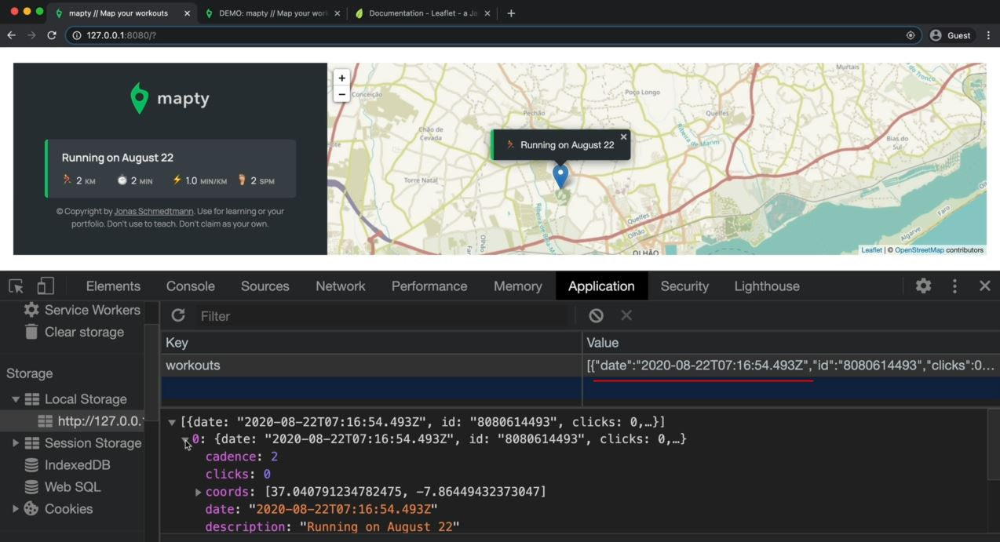
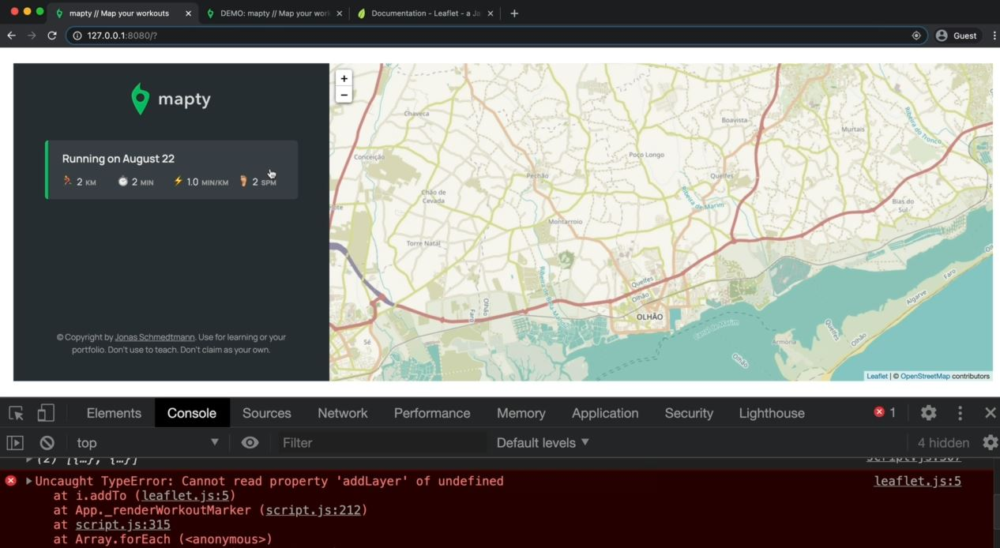

# Working with localStorage

- let's use the local storage API in order to make the workout data persist across multiple page reloads
- `local storage` : is a place in the browser where we can store data that will stay there even after we close the page
    - means the data is linked to the URL on which we're using the application 💡💡💡
- inside the flow chart , whenever a new workout is added then all the workouts will be added to local storage
    - so whenever there is a new workout then we'll take the entire workouts array & store it in local storage
    - & then whenever the page loads i.e `page loads` box then we'll load all the workouts from the local storage <br>
        & render them on the map & also on the list . so just like we do it when a user submits a new workout
    - so when you reload the page, then it'll appear as if all the workouts you had previously are still in the same place

- so things will go inside the local storage when the user submits new workout 💡💡💡

## Steps - implementing the local storage browser API to persist the workout data

- `STEP 1` : setting local storage for all workouts
    ```js
    class Workout {
        date = new Date()
        id = (Date.now() + "").slice(-10) 
        clicks = 0

        constructor(coords , distance, duration) {
            this.coords = coords // [lat, lng]
            this.distance = distance // in km
            this.duration = duration // in min
        }

        // workout description
        _setDescription() {
            const months = ['January', 'February', 'March', 'April', 
                'May', 'June', 'July', 'August', 'September', 'October', 'November', 'December'];

            this.description = `${this.type[0].toUpperCase()}${this.type.slice(1)} on ${months[this.date.getMonth()]} ${this.date.getDate()}`
        }

        click() {
            this.clicks++ // every object will get access of this method 
        }
    }

    class Running extends Workout {
        type = "running"

        constructor(coords, distance, duration, cadence) {
            super(coords, distance, duration)
            this.cadence = cadence
            this.calcPace()
            this._setDescription()
        }

        calcPace() {
            this.pace = this.duration / this.distance
            return this.pace
        }
    }

    class Cycling extends Workout {
        type = "cycling"

        constructor(coords, distance, duration, elevationGain) {
            super(coords, distance, duration)
            this.elevationGain = elevationGain
            this.calcSpeed()
            this._setDescription()
        }

        calcSpeed() {
            // km/h
            this.speed = this.distance / (this.duration / 60) 
            return this.speed
        }
    }

    // Application architecture
    const form = document.querySelector('.form');
    const containerWorkouts = document.querySelector('.workouts');
    const inputType = document.querySelector('.form__input--type');
    const inputDistance = document.querySelector('.form__input--distance');
    const inputDuration = document.querySelector('.form__input--duration');
    const inputCadence = document.querySelector('.form__input--cadence');
    const inputElevation = document.querySelector('.form__input--elevation');

    class App {
        #map ;
        #mapZoomLevel = 13 ;
        #mapEvent ;
        #workouts = [] ;

        constructor() {
            this._getPosition() 
            form.addEventListener('submit', this._newWorkout.bind(this))
            inputType.addEventListener('change', this._toggleElevationField)
            containerWorkouts.addEventListener('click', this._moveToPopup.bind(this)) // added the event listener for moving popup
        }

        _getPosition() {
            if (navigator.geolocation) {
                navigator.geolocation.getCurrentPosition(this._loadMap.bind(this) , function() {
                        alert('Could not get your position')
                    }
                )
            };
        }

        _loadMap(position) {
            const { latitude } = position.coords
            const { longitude } = position.coords
            console.log(`https://www.google.com/maps/@${latitude},${longitude} `) 

            const coords = [latitude, longitude] 
            
            this.#map = L.map('map').setView(coords , this.#mapZoomLevel);
            L.tileLayer(`https://{s}.tile.openstreetmap.fr/hot/{z}/{x}/{y}.png`, {
                attribution: '&copy; <a href="https://www.openstreetmap.org/copyright">OpenStreetMap</a> contributors'
            }).addTo(this.#map);

            // handling clicks on the map
            this.#map.on('click', this._showForm.bind(this)) 
        }

        _showForm(mapE) {
            this.#mapEvent = mapE 
            form.classList.remove('hidden')
            inputDistance.focus() 
        }

        _hideForm() {
            // 1 - Empty inputs
            inputDistance.value = inputDuration.value = inputCadence.value = inputElevation.value  = ''
            // 2 - form animation
            form.style.display = 'none'
            // 3 - add the hidden class
            form.classList.add('hidden')
            setTimeout(() => (form.style.display = "grid") , 1000)
        }

        _toggleElevationField() {
            inputElevation.closest('.form__row').classList.toggle('.form__row--hidden')
            inputCadence.closest('.form__row').classList.toggle('.form__row--hidden')
        }

        _newWorkout(e) { 
            const validInputs = (...inputs) => inputs.every(inp => Number.isFinite(inp))
            const allPositive = (...inputs) => inputs.every(inp => inp > 0)

            e.preventDefault()

            // STEP 1 : get the data from the form
            const type = inputType.value 
            const distance = +inputDistance.value  
            const duration = +inputDuration.value
            const { lat , lng } = this.#mapEvent.latlng
            const workout ;

            // STEP 3 : if workout is running , create running object
            if (type === 'running') {
                const cadence = +inputCadence.value 
                // STEP 2 : Check if data is valid (must contain only number & those numbers should be positive)
                if (!validInputs(distance, duration, cadence) || !all(Positive(distance, duration, cadence))) {  
                    return alert("Inputs have to be positive numbers!") 
                }

                workout = new Running([lat, lng], distance, duration, cadence)
            }

            // STEP 3.1 : if workout is cycling , create cycling object
            if (type === 'cycling') {
                const elevation = +inputElevation.value 
                // STEP 2 : Check if data is valid (must contain only number & those numbers should be positive)
                if (!validInputs(distance, duration, elevation) || !all(Positive(distance, duration))) {  
                    return alert("Inputs have to be positive numbers!") 
                }

                workout = new Cycling([lat, lng], distance, duration, elevation)
            }
            // STEP 4 : add new object to workout array
            this.#workout.push(workout) 
            console.log(workout) 

            // STEP 5 : render workout on map as marker
            this._renderWorkoutMarker(workout) 

            // STEP 6 : render workout on list
            this._renderWorkout(workout)

            // STEP 7 : hide the form + clear input fields
            this._hideForm()

            // STEP 8 : Set local storage to all workouts
            this._setLocalStorage()
        }

        _renderWorkoutMarker(workout) {
            L.marker(workout.coords).addTo(this.#map).bindPopup(L.pop({
                    maxWidth: 250, 
                    minWidth: 100, 
                    autoClose: false , 
                    closeOnClick: false, 
                    className: `${workout.type}-popup`, 
                })
            ).setPopupContent(`${workout.type === 'running' ? '🏃‍♂️' : '🚴‍♀️'} ${workout.description}`).openPopup();
        }

        _renderWorkout(workout) {
            let html = `
                <li class="workout workout--${workout.type}" data-id="${workout.id}">
                    <h2 class="workout__title">${workout._setDescription}</h2>
                    <div class="workout__details">
                      <span class="workout__icon">${workout.type === 'running' ? '🏃‍♂️' : '🚴‍♀️'}</span>
                      <span class="workout__value">${workout.distance}</span>
                      <span class="workout__unit">km</span>
                    </div>
                    <div class="workout__details">
                      <span class="workout__icon">⏱</span>
                      <span class="workout__value">${workout.duration}</span>
                      <span class="workout__unit">min</span>
                    </div>
            ` ;

            if (workout.type === 'running') {
                html += `
                    <div class="workout__details">
                        <span class="workout__icon">⚡️</span>
                        <span class="workout__value">${workout.pace.toFixed(1)}</span>
                        <span class="workout__unit">min/km</span>
                    </div>
                    <div class="workout__details">
                        <span class="workout__icon">🦶🏼</span>
                        <span class="workout__value">${workout.cadence}</span>
                        <span class="workout__unit">spm</span>
                    </div>
                </li>
                ` ;
            }

            if (workout.type === 'cycling') {
                html += `
                    <div class="workout__details">
                        <span class="workout__icon">⚡️</span>
                        <span class="workout__value">${workout.speed.toFixed(1)}</span>
                        <span class="workout__unit">min/km</span>
                    </div>
                    <div class="workout__details">
                        <span class="workout__icon">⛰</span>
                        <span class="workout__value">${workout.elevationGain}</span>
                        <span class="workout__unit">spm</span>
                    </div>
                </li>
                ` ;
            }

            form.insertAdjacentHTML('afterend', html)
        }

        _moveToPopup(e) {
            const workoutEl = e.target.closest('.workout')
            console.log(workoutEl)

            if (!workoutEl) return

            const workout = this.#workouts.find(work => work.id === workoutEl.dataset.id)
            console.log(workout)

            this.#map.setView(workout.coords, this.#mapZoomLevel, {
                animate: true , 
                pan: {
                    duration: 1,
                }
            }) 

            workout.click()
        }

        _setLocalStorage() {
                // To convert any object into string then use JSON.stringify() method 💡💡💡
            localStorage.setItem('workouts', JSON.stringify(this.#workouts))
                // localStorage is a small API , so used it for storing small amount of data
                    // because localStorage is blocking which means shouldn't use localStorage 
                    // to store large amounts of data because that'll surely slow down you application 💡💡💡
        }
    }

    const app = new App()
    ```
    - checking output : when we add the list of workout 
        - then that list of workout will be added on UI as well as inside the local storage also like this
            
        - that value is actually stored in string form , not in object form <br>
            JS somehow converted that value into object but actually it's stored as a string 💡💡💡 
        - & if we add another list of workout then that's also added inside the local storage so local storage will get updated
        - now we want to persist the data when we reload the page <br>
            because when we reload the page then all the list of workouts will gone from UI <br>
            but inside the local storage , all the workouts list will be there 💡💡💡

- `STEP 2` : getting the data from the local storage to persist the data on UI 
    - now to do that , we need to do inside the constructor() function of App class <br>
        because this is where we have all the code i.e executed when the application loads 💡💡💡
    ```js
    // before this below code , put the code from STEP 1 

    // Application architecture
    const form = document.querySelector('.form');
    const containerWorkouts = document.querySelector('.workouts');
    const inputType = document.querySelector('.form__input--type');
    const inputDistance = document.querySelector('.form__input--distance');
    const inputDuration = document.querySelector('.form__input--duration');
    const inputCadence = document.querySelector('.form__input--cadence');
    const inputElevation = document.querySelector('.form__input--elevation');

    class App {
        #map ;
        #mapZoomLevel = 13 ;
        #mapEvent ;
        #workouts = [] ;

        constructor() {
            // get the user's positions
            this._getPosition() 

            // get data from local storage
            this._getLocalStorage()

            // Attach event handlers

            form.addEventListener('submit', this._newWorkout.bind(this))
            inputType.addEventListener('change', this._toggleElevationField)
            containerWorkouts.addEventListener('click', this._moveToPopup.bind(this)) // added the event listener for moving popup
        }

        _getPosition() {
            if (navigator.geolocation) {
                navigator.geolocation.getCurrentPosition(this._loadMap.bind(this) , function() {
                        alert('Could not get your position')
                    }
                )
            };
        }

        _loadMap(position) {
            const { latitude } = position.coords
            const { longitude } = position.coords
            console.log(`https://www.google.com/maps/@${latitude},${longitude} `) 

            const coords = [latitude, longitude] 
            
            this.#map = L.map('map').setView(coords , this.#mapZoomLevel);
            L.tileLayer(`https://{s}.tile.openstreetmap.fr/hot/{z}/{x}/{y}.png`, {
                attribution: '&copy; <a href="https://www.openstreetmap.org/copyright">OpenStreetMap</a> contributors'
            }).addTo(this.#map);

            // handling clicks on the map
            this.#map.on('click', this._showForm.bind(this)) 
        }

        _showForm(mapE) {
            this.#mapEvent = mapE 
            form.classList.remove('hidden')
            inputDistance.focus() 
        }

        _hideForm() {
            // 1 - Empty inputs
            inputDistance.value = inputDuration.value = inputCadence.value = inputElevation.value  = ''
            // 2 - form animation
            form.style.display = 'none'
            // 3 - add the hidden class
            form.classList.add('hidden')
            setTimeout(() => (form.style.display = "grid") , 1000)
        }

        _toggleElevationField() {
            inputElevation.closest('.form__row').classList.toggle('.form__row--hidden')
            inputCadence.closest('.form__row').classList.toggle('.form__row--hidden')
        }

        _newWorkout(e) { 
            const validInputs = (...inputs) => inputs.every(inp => Number.isFinite(inp))
            const allPositive = (...inputs) => inputs.every(inp => inp > 0)

            e.preventDefault()

            // STEP 1 : get the data from the form
            const type = inputType.value 
            const distance = +inputDistance.value  
            const duration = +inputDuration.value
            const { lat , lng } = this.#mapEvent.latlng
            const workout ;

            // STEP 3 : if workout is running , create running object
            if (type === 'running') {
                const cadence = +inputCadence.value 
                // STEP 2 : Check if data is valid (must contain only number & those numbers should be positive)
                if (!validInputs(distance, duration, cadence) || !all(Positive(distance, duration, cadence))) {  
                    return alert("Inputs have to be positive numbers!") 
                }

                workout = new Running([lat, lng], distance, duration, cadence)
            }

            // STEP 3.1 : if workout is cycling , create cycling object
            if (type === 'cycling') {
                const elevation = +inputElevation.value 
                // STEP 2 : Check if data is valid (must contain only number & those numbers should be positive)
                if (!validInputs(distance, duration, elevation) || !all(Positive(distance, duration))) {  
                    return alert("Inputs have to be positive numbers!") 
                }

                workout = new Cycling([lat, lng], distance, duration, elevation)
            }
            // STEP 4 : add new object to workout array
            this.#workout.push(workout) 
            console.log(workout) 

            // STEP 5 : render workout on map as marker
            this._renderWorkoutMarker(workout) 

            // STEP 6 : render workout on list
            this._renderWorkout(workout)

            // STEP 7 : hide the form + clear input fields
            this._hideForm()

            // STEP 8 : Set local storage to all workouts
            this._setLocalStorage()
        }

        _renderWorkoutMarker(workout) {
            L.marker(workout.coords).addTo(this.#map).bindPopup(L.pop({
                    maxWidth: 250, 
                    minWidth: 100, 
                    autoClose: false , 
                    closeOnClick: false, 
                    className: `${workout.type}-popup`, 
                })
            ).setPopupContent(`${workout.type === 'running' ? '🏃‍♂️' : '🚴‍♀️'} ${workout.description}`).openPopup();
        }

        _renderWorkout(workout) {
            let html = `
                <li class="workout workout--${workout.type}" data-id="${workout.id}">
                    <h2 class="workout__title">${workout._setDescription}</h2>
                    <div class="workout__details">
                      <span class="workout__icon">${workout.type === 'running' ? '🏃‍♂️' : '🚴‍♀️'}</span>
                      <span class="workout__value">${workout.distance}</span>
                      <span class="workout__unit">km</span>
                    </div>
                    <div class="workout__details">
                      <span class="workout__icon">⏱</span>
                      <span class="workout__value">${workout.duration}</span>
                      <span class="workout__unit">min</span>
                    </div>
            ` ;

            if (workout.type === 'running') {
                html += `
                    <div class="workout__details">
                        <span class="workout__icon">⚡️</span>
                        <span class="workout__value">${workout.pace.toFixed(1)}</span>
                        <span class="workout__unit">min/km</span>
                    </div>
                    <div class="workout__details">
                        <span class="workout__icon">🦶🏼</span>
                        <span class="workout__value">${workout.cadence}</span>
                        <span class="workout__unit">spm</span>
                    </div>
                </li>
                ` ;
            }

            if (workout.type === 'cycling') {
                html += `
                    <div class="workout__details">
                        <span class="workout__icon">⚡️</span>
                        <span class="workout__value">${workout.speed.toFixed(1)}</span>
                        <span class="workout__unit">min/km</span>
                    </div>
                    <div class="workout__details">
                        <span class="workout__icon">⛰</span>
                        <span class="workout__value">${workout.elevationGain}</span>
                        <span class="workout__unit">spm</span>
                    </div>
                </li>
                ` ;
            }

            form.insertAdjacentHTML('afterend', html)
        }

        _moveToPopup(e) {
            const workoutEl = e.target.closest('.workout')
            console.log(workoutEl)

            if (!workoutEl) return

            const workout = this.#workouts.find(work => work.id === workoutEl.dataset.id)
            console.log(workout)

            this.#map.setView(workout.coords, this.#mapZoomLevel, {
                animate: true , 
                pan: {
                    duration: 1,
                }
            }) 

            workout.click()
        }

        _setLocalStorage() {
            localStorage.setItem('workouts', JSON.stringify(this.#workouts))
        }

        _getLocalStorage() {
            const data = localStorage.getItem('workouts')
            console.log(data)
        }
    }

    const app = new App()
    ```
    - checking output : console.log(data)
        - when we reload the page then we'll get all the data (from the local storage) in the form string type
    - `STEP 2.1` : converting that data of local storage from string type into object 
        ```js
        // before this below code , put the code from STEP 1 

        // Application architecture
        const form = document.querySelector('.form');
        const containerWorkouts = document.querySelector('.workouts');
        const inputType = document.querySelector('.form__input--type');
        const inputDistance = document.querySelector('.form__input--distance');
        const inputDuration = document.querySelector('.form__input--duration');
        const inputCadence = document.querySelector('.form__input--cadence');
        const inputElevation = document.querySelector('.form__input--elevation');

        class App {
            #map ;
            #mapZoomLevel = 13 ;
            #mapEvent ;
            #workouts = [] ;

            constructor() {
                // get the user's positions
                this._getPosition() 

                // get data from local storage
                this._getLocalStorage()

                // Attach event handlers

                form.addEventListener('submit', this._newWorkout.bind(this))
                inputType.addEventListener('change', this._toggleElevationField)
                containerWorkouts.addEventListener('click', this._moveToPopup.bind(this)) // added the event listener for moving popup
            }

            _getPosition() {
                if (navigator.geolocation) {
                    navigator.geolocation.getCurrentPosition(this._loadMap.bind(this) , function() {
                            alert('Could not get your position')
                        }
                    )
                };
            }

            _loadMap(position) {
                const { latitude } = position.coords
                const { longitude } = position.coords
                console.log(`https://www.google.com/maps/@${latitude},${longitude} `) 

                const coords = [latitude, longitude] 
                
                this.#map = L.map('map').setView(coords , this.#mapZoomLevel);
                L.tileLayer(`https://{s}.tile.openstreetmap.fr/hot/{z}/{x}/{y}.png`, {
                    attribution: '&copy; <a href="https://www.openstreetmap.org/copyright">OpenStreetMap</a> contributors'
                }).addTo(this.#map);

                // handling clicks on the map
                this.#map.on('click', this._showForm.bind(this)) 
            }

            _showForm(mapE) {
                this.#mapEvent = mapE 
                form.classList.remove('hidden')
                inputDistance.focus() 
            }

            _hideForm() {
                // 1 - Empty inputs
                inputDistance.value = inputDuration.value = inputCadence.value = inputElevation.value  = ''
                // 2 - form animation
                form.style.display = 'none'
                // 3 - add the hidden class
                form.classList.add('hidden')
                setTimeout(() => (form.style.display = "grid") , 1000)
            }

            _toggleElevationField() {
                inputElevation.closest('.form__row').classList.toggle('.form__row--hidden')
                inputCadence.closest('.form__row').classList.toggle('.form__row--hidden')
            }

            _newWorkout(e) { 
                const validInputs = (...inputs) => inputs.every(inp => Number.isFinite(inp))
                const allPositive = (...inputs) => inputs.every(inp => inp > 0)

                e.preventDefault()

                // STEP 1 : get the data from the form
                const type = inputType.value 
                const distance = +inputDistance.value  
                const duration = +inputDuration.value
                const { lat , lng } = this.#mapEvent.latlng
                const workout ;

                // STEP 3 : if workout is running , create running object
                if (type === 'running') {
                    const cadence = +inputCadence.value 
                    // STEP 2 : Check if data is valid (must contain only number & those numbers should be positive)
                    if (!validInputs(distance, duration, cadence) || !all(Positive(distance, duration, cadence))) {  
                        return alert("Inputs have to be positive numbers!") 
                    }

                    workout = new Running([lat, lng], distance, duration, cadence)
                }

                // STEP 3.1 : if workout is cycling , create cycling object
                if (type === 'cycling') {
                    const elevation = +inputElevation.value 
                    // STEP 2 : Check if data is valid (must contain only number & those numbers should be positive)
                    if (!validInputs(distance, duration, elevation) || !all(Positive(distance, duration))) {  
                        return alert("Inputs have to be positive numbers!") 
                    }

                    workout = new Cycling([lat, lng], distance, duration, elevation)
                }
                // STEP 4 : add new object to workout array
                this.#workout.push(workout) 
                console.log(workout) 

                // STEP 5 : render workout on map as marker
                this._renderWorkoutMarker(workout) 

                // STEP 6 : render workout on list
                this._renderWorkout(workout)

                // STEP 7 : hide the form + clear input fields
                this._hideForm()

                // STEP 8 : Set local storage to all workouts
                this._setLocalStorage()
            }

            _renderWorkoutMarker(workout) {
                L.marker(workout.coords).addTo(this.#map).bindPopup(L.pop({
                        maxWidth: 250, 
                        minWidth: 100, 
                        autoClose: false , 
                        closeOnClick: false, 
                        className: `${workout.type}-popup`, 
                    })
                ).setPopupContent(`${workout.type === 'running' ? '🏃‍♂️' : '🚴‍♀️'} ${workout.description}`).openPopup();
            }

            _renderWorkout(workout) {
                let html = `
                    <li class="workout workout--${workout.type}" data-id="${workout.id}">
                        <h2 class="workout__title">${workout._setDescription}</h2>
                        <div class="workout__details">
                          <span class="workout__icon">${workout.type === 'running' ? '🏃‍♂️' : '🚴‍♀️'}</span>
                          <span class="workout__value">${workout.distance}</span>
                          <span class="workout__unit">km</span>
                        </div>
                        <div class="workout__details">
                          <span class="workout__icon">⏱</span>
                          <span class="workout__value">${workout.duration}</span>
                          <span class="workout__unit">min</span>
                        </div>
                ` ;

                if (workout.type === 'running') {
                    html += `
                        <div class="workout__details">
                            <span class="workout__icon">⚡️</span>
                            <span class="workout__value">${workout.pace.toFixed(1)}</span>
                            <span class="workout__unit">min/km</span>
                        </div>
                        <div class="workout__details">
                            <span class="workout__icon">🦶🏼</span>
                            <span class="workout__value">${workout.cadence}</span>
                            <span class="workout__unit">spm</span>
                        </div>
                    </li>
                    ` ;
                }

                if (workout.type === 'cycling') {
                    html += `
                        <div class="workout__details">
                            <span class="workout__icon">⚡️</span>
                            <span class="workout__value">${workout.speed.toFixed(1)}</span>
                            <span class="workout__unit">min/km</span>
                        </div>
                        <div class="workout__details">
                            <span class="workout__icon">⛰</span>
                            <span class="workout__value">${workout.elevationGain}</span>
                            <span class="workout__unit">spm</span>
                        </div>
                    </li>
                    ` ;
                }

                form.insertAdjacentHTML('afterend', html)
            }

            _moveToPopup(e) {
                const workoutEl = e.target.closest('.workout')
                console.log(workoutEl)

                if (!workoutEl) return

                const workout = this.#workouts.find(work => work.id === workoutEl.dataset.id)
                console.log(workout)

                this.#map.setView(workout.coords, this.#mapZoomLevel, {
                    animate: true , 
                    pan: {
                        duration: 1,
                    }
                }) 

                workout.click()
            }

            _setLocalStorage() {
                    // To convert any object into string then use JSON.stringify() method 💡💡💡
                localStorage.setItem('workouts', JSON.stringify(this.#workouts))
                    // localStorage is a small API , so used it for storing small amount of data
                        // because localStorage is blocking which means shouldn't use localStorage 
                        // to store large amounts of data because that'll surely slow down you application 💡💡💡
            }

            _getLocalStorage() {
                // JSON.parse() method used to convert the data from string type into object 
                const data = JSON.parse(localStorage.getItem('workouts'))
                console.log(data)
            }
        }

        const app = new App()
        ```
    - `STEP 2.2` : checking if there is some data
        - so if there's nothing local storage , then `data` variable will be undefined <br>
            means in that situation , we don't want to do anything
        ```js
        // before this below code , put the code from STEP 1 

        // Application architecture
        const form = document.querySelector('.form');
        const containerWorkouts = document.querySelector('.workouts');
        const inputType = document.querySelector('.form__input--type');
        const inputDistance = document.querySelector('.form__input--distance');
        const inputDuration = document.querySelector('.form__input--duration');
        const inputCadence = document.querySelector('.form__input--cadence');
        const inputElevation = document.querySelector('.form__input--elevation');

        class App {
            #map ;
            #mapZoomLevel = 13 ;
            #mapEvent ;
            #workouts = [] ;

            constructor() {
                // get the user's positions
                this._getPosition() 

                // get data from local storage
                this._getLocalStorage()

                // Attach event handlers

                form.addEventListener('submit', this._newWorkout.bind(this))
                inputType.addEventListener('change', this._toggleElevationField)
                containerWorkouts.addEventListener('click', this._moveToPopup.bind(this)) // added the event listener for moving popup
            }

            _getPosition() {
                if (navigator.geolocation) {
                    navigator.geolocation.getCurrentPosition(this._loadMap.bind(this) , function() {
                            alert('Could not get your position')
                        }
                    )
                };
            }

            _loadMap(position) {
                const { latitude } = position.coords
                const { longitude } = position.coords
                console.log(`https://www.google.com/maps/@${latitude},${longitude} `) 

                const coords = [latitude, longitude] 
                
                this.#map = L.map('map').setView(coords , this.#mapZoomLevel);
                L.tileLayer(`https://{s}.tile.openstreetmap.fr/hot/{z}/{x}/{y}.png`, {
                    attribution: '&copy; <a href="https://www.openstreetmap.org/copyright">OpenStreetMap</a> contributors'
                }).addTo(this.#map);

                // handling clicks on the map
                this.#map.on('click', this._showForm.bind(this)) 
            }

            _showForm(mapE) {
                this.#mapEvent = mapE 
                form.classList.remove('hidden')
                inputDistance.focus() 
            }

            _hideForm() {
                // 1 - Empty inputs
                inputDistance.value = inputDuration.value = inputCadence.value = inputElevation.value  = ''
                // 2 - form animation
                form.style.display = 'none'
                // 3 - add the hidden class
                form.classList.add('hidden')
                setTimeout(() => (form.style.display = "grid") , 1000)
            }

            _toggleElevationField() {
                inputElevation.closest('.form__row').classList.toggle('.form__row--hidden')
                inputCadence.closest('.form__row').classList.toggle('.form__row--hidden')
            }

            _newWorkout(e) { 
                const validInputs = (...inputs) => inputs.every(inp => Number.isFinite(inp))
                const allPositive = (...inputs) => inputs.every(inp => inp > 0)

                e.preventDefault()

                // STEP 1 : get the data from the form
                const type = inputType.value 
                const distance = +inputDistance.value  
                const duration = +inputDuration.value
                const { lat , lng } = this.#mapEvent.latlng
                const workout ;

                // STEP 3 : if workout is running , create running object
                if (type === 'running') {
                    const cadence = +inputCadence.value 
                    // STEP 2 : Check if data is valid (must contain only number & those numbers should be positive)
                    if (!validInputs(distance, duration, cadence) || !all(Positive(distance, duration, cadence))) {  
                        return alert("Inputs have to be positive numbers!") 
                    }

                    workout = new Running([lat, lng], distance, duration, cadence)
                }

                // STEP 3.1 : if workout is cycling , create cycling object
                if (type === 'cycling') {
                    const elevation = +inputElevation.value 
                    // STEP 2 : Check if data is valid (must contain only number & those numbers should be positive)
                    if (!validInputs(distance, duration, elevation) || !all(Positive(distance, duration))) {  
                        return alert("Inputs have to be positive numbers!") 
                    }

                    workout = new Cycling([lat, lng], distance, duration, elevation)
                }
                // STEP 4 : add new object to workout array
                this.#workout.push(workout) 
                console.log(workout) 

                // STEP 5 : render workout on map as marker
                this._renderWorkoutMarker(workout) 

                // STEP 6 : render workout on list
                this._renderWorkout(workout)

                // STEP 7 : hide the form + clear input fields
                this._hideForm()

                // STEP 8 : Set local storage to all workouts
                this._setLocalStorage()
            }

            _renderWorkoutMarker(workout) {
                L.marker(workout.coords).addTo(this.#map).bindPopup(L.pop({
                        maxWidth: 250, 
                        minWidth: 100, 
                        autoClose: false , 
                        closeOnClick: false, 
                        className: `${workout.type}-popup`, 
                    })
                ).setPopupContent(`${workout.type === 'running' ? '🏃‍♂️' : '🚴‍♀️'} ${workout.description}`).openPopup();
            }

            _renderWorkout(workout) {
                let html = `
                    <li class="workout workout--${workout.type}" data-id="${workout.id}">
                        <h2 class="workout__title">${workout._setDescription}</h2>
                        <div class="workout__details">
                          <span class="workout__icon">${workout.type === 'running' ? '🏃‍♂️' : '🚴‍♀️'}</span>
                          <span class="workout__value">${workout.distance}</span>
                          <span class="workout__unit">km</span>
                        </div>
                        <div class="workout__details">
                          <span class="workout__icon">⏱</span>
                          <span class="workout__value">${workout.duration}</span>
                          <span class="workout__unit">min</span>
                        </div>
                ` ;

                if (workout.type === 'running') {
                    html += `
                        <div class="workout__details">
                            <span class="workout__icon">⚡️</span>
                            <span class="workout__value">${workout.pace.toFixed(1)}</span>
                            <span class="workout__unit">min/km</span>
                        </div>
                        <div class="workout__details">
                            <span class="workout__icon">🦶🏼</span>
                            <span class="workout__value">${workout.cadence}</span>
                            <span class="workout__unit">spm</span>
                        </div>
                    </li>
                    ` ;
                }

                if (workout.type === 'cycling') {
                    html += `
                        <div class="workout__details">
                            <span class="workout__icon">⚡️</span>
                            <span class="workout__value">${workout.speed.toFixed(1)}</span>
                            <span class="workout__unit">min/km</span>
                        </div>
                        <div class="workout__details">
                            <span class="workout__icon">⛰</span>
                            <span class="workout__value">${workout.elevationGain}</span>
                            <span class="workout__unit">spm</span>
                        </div>
                    </li>
                    ` ;
                }

                form.insertAdjacentHTML('afterend', html)
            }

            _moveToPopup(e) {
                const workoutEl = e.target.closest('.workout')
                console.log(workoutEl)

                if (!workoutEl) return

                const workout = this.#workouts.find(work => work.id === workoutEl.dataset.id)
                console.log(workout)

                this.#map.setView(workout.coords, this.#mapZoomLevel, {
                    animate: true , 
                    pan: {
                        duration: 1,
                    }
                }) 

                workout.click()
            }

            _setLocalStorage() {
                localStorage.setItem('workouts', JSON.stringify(this.#workouts))
            }

            _getLocalStorage() {
                const data = JSON.parse(localStorage.getItem('workouts'))
                console.log(data)

                if (!data) return // using guard clause approach

                this.#workouts = data ; // Note : _getLocalStorage() method will be executed at the very beginning 
                    // so at that point , the workouts array is always be empty
                    // but if we already had some data in the local storage 
                        // then we'll simply set that workouts array to the data that we had before 💡💡💡
                        // means we're restoring the data across multiple reloads of the page

                this.#workouts.forEach(work => {
                    // so creating helper functions is really great & helpful instead of repeating the same code 💡💡💡
                        // here _renderWorkout() will take care of rendering a workout in the sidebar
                    this._renderWorkout(work)
                })
            }
        }

        const app = new App()
        ```
        - checking output : so we'll get all the list of workouts in the sidebar even after reloading the page
            - but we'll not getting those popup on the map , so let's persist the popup on the map also

- `STEP 3` : persisting all the popups on their position on the map 
    ```js
    // before this below code , put the code from STEP 1 

    // Application architecture
    const form = document.querySelector('.form');
    const containerWorkouts = document.querySelector('.workouts');
    const inputType = document.querySelector('.form__input--type');
    const inputDistance = document.querySelector('.form__input--distance');
    const inputDuration = document.querySelector('.form__input--duration');
    const inputCadence = document.querySelector('.form__input--cadence');
    const inputElevation = document.querySelector('.form__input--elevation');

    class App {
        #map ;
        #mapZoomLevel = 13 ;
        #mapEvent ;
        #workouts = [] ;

        constructor() {
            // get the user's positions
            this._getPosition() 

            // get data from local storage
            this._getLocalStorage()

            // Attach event handlers

            form.addEventListener('submit', this._newWorkout.bind(this))
            inputType.addEventListener('change', this._toggleElevationField)
            containerWorkouts.addEventListener('click', this._moveToPopup.bind(this)) // added the event listener for moving popup
        }

        _getPosition() {
            if (navigator.geolocation) {
                navigator.geolocation.getCurrentPosition(this._loadMap.bind(this) , function() {
                        alert('Could not get your position')
                    }
                )
            };
        }

        _loadMap(position) {
            const { latitude } = position.coords
            const { longitude } = position.coords
            console.log(`https://www.google.com/maps/@${latitude},${longitude} `) 

            const coords = [latitude, longitude] 
            
            this.#map = L.map('map').setView(coords , this.#mapZoomLevel);
            L.tileLayer(`https://{s}.tile.openstreetmap.fr/hot/{z}/{x}/{y}.png`, {
                attribution: '&copy; <a href="https://www.openstreetmap.org/copyright">OpenStreetMap</a> contributors'
            }).addTo(this.#map);

            // handling clicks on the map
            this.#map.on('click', this._showForm.bind(this)) 
        }

        _showForm(mapE) {
            this.#mapEvent = mapE 
            form.classList.remove('hidden')
            inputDistance.focus() 
        }

        _hideForm() {
            // 1 - Empty inputs
            inputDistance.value = inputDuration.value = inputCadence.value = inputElevation.value  = ''
            // 2 - form animation
            form.style.display = 'none'
            // 3 - add the hidden class
            form.classList.add('hidden')
            setTimeout(() => (form.style.display = "grid") , 1000)
        }

        _toggleElevationField() {
            inputElevation.closest('.form__row').classList.toggle('.form__row--hidden')
            inputCadence.closest('.form__row').classList.toggle('.form__row--hidden')
        }

        _newWorkout(e) { 
            const validInputs = (...inputs) => inputs.every(inp => Number.isFinite(inp))
            const allPositive = (...inputs) => inputs.every(inp => inp > 0)

            e.preventDefault()

            // STEP 1 : get the data from the form
            const type = inputType.value 
            const distance = +inputDistance.value  
            const duration = +inputDuration.value
            const { lat , lng } = this.#mapEvent.latlng
            const workout ;

            // STEP 3 : if workout is running , create running object
            if (type === 'running') {
                const cadence = +inputCadence.value 
                // STEP 2 : Check if data is valid (must contain only number & those numbers should be positive)
                if (!validInputs(distance, duration, cadence) || !all(Positive(distance, duration, cadence))) {  
                    return alert("Inputs have to be positive numbers!") 
                }

                workout = new Running([lat, lng], distance, duration, cadence)
            }

            // STEP 3.1 : if workout is cycling , create cycling object
            if (type === 'cycling') {
                const elevation = +inputElevation.value 
                // STEP 2 : Check if data is valid (must contain only number & those numbers should be positive)
                if (!validInputs(distance, duration, elevation) || !all(Positive(distance, duration))) {  
                    return alert("Inputs have to be positive numbers!") 
                }

                workout = new Cycling([lat, lng], distance, duration, elevation)
            }
            // STEP 4 : add new object to workout array
            this.#workout.push(workout) 
            console.log(workout) 

            // STEP 5 : render workout on map as marker
            this._renderWorkoutMarker(workout) 

            // STEP 6 : render workout on list
            this._renderWorkout(workout)

            // STEP 7 : hide the form + clear input fields
            this._hideForm()

            // STEP 8 : Set local storage to all workouts
            this._setLocalStorage()
        }

        _renderWorkoutMarker(workout) {
            L.marker(workout.coords).addTo(this.#map).bindPopup(L.pop({
                    maxWidth: 250, 
                    minWidth: 100, 
                    autoClose: false , 
                    closeOnClick: false, 
                    className: `${workout.type}-popup`, 
                })
            ).setPopupContent(`${workout.type === 'running' ? '🏃‍♂️' : '🚴‍♀️'} ${workout.description}`).openPopup();
        }

        _renderWorkout(workout) {
            let html = `
                <li class="workout workout--${workout.type}" data-id="${workout.id}">
                    <h2 class="workout__title">${workout._setDescription}</h2>
                    <div class="workout__details">
                      <span class="workout__icon">${workout.type === 'running' ? '🏃‍♂️' : '🚴‍♀️'}</span>
                      <span class="workout__value">${workout.distance}</span>
                      <span class="workout__unit">km</span>
                    </div>
                    <div class="workout__details">
                      <span class="workout__icon">⏱</span>
                      <span class="workout__value">${workout.duration}</span>
                      <span class="workout__unit">min</span>
                    </div>
            ` ;

            if (workout.type === 'running') {
                html += `
                    <div class="workout__details">
                        <span class="workout__icon">⚡️</span>
                        <span class="workout__value">${workout.pace.toFixed(1)}</span>
                        <span class="workout__unit">min/km</span>
                    </div>
                    <div class="workout__details">
                        <span class="workout__icon">🦶🏼</span>
                        <span class="workout__value">${workout.cadence}</span>
                        <span class="workout__unit">spm</span>
                    </div>
                </li>
                ` ;
            }

            if (workout.type === 'cycling') {
                html += `
                    <div class="workout__details">
                        <span class="workout__icon">⚡️</span>
                        <span class="workout__value">${workout.speed.toFixed(1)}</span>
                        <span class="workout__unit">min/km</span>
                    </div>
                    <div class="workout__details">
                        <span class="workout__icon">⛰</span>
                        <span class="workout__value">${workout.elevationGain}</span>
                        <span class="workout__unit">spm</span>
                    </div>
                </li>
                ` ;
            }

            form.insertAdjacentHTML('afterend', html)
        }

        _moveToPopup(e) {
            const workoutEl = e.target.closest('.workout')
            console.log(workoutEl)

            if (!workoutEl) return

            const workout = this.#workouts.find(work => work.id === workoutEl.dataset.id)
            console.log(workout)

            this.#map.setView(workout.coords, this.#mapZoomLevel, {
                animate: true , 
                pan: {
                    duration: 1,
                }
            }) 

            workout.click()
        }

        _setLocalStorage() {
            localStorage.setItem('workouts', JSON.stringify(this.#workouts))
        }

        _getLocalStorage() {
            const data = JSON.parse(localStorage.getItem('workouts'))
            console.log(data)

            if (!data) return 

            this.#workouts = data ; 

            this.#workouts.forEach(work => {
                this._renderWorkout(work)
                this._renderWorkoutMarker(work)
            })
        }
    }

    const app = new App()
    ```
    - output : we'll get an error like this <br>
        
        - so we got the error when we try to add that first workout also to the map
        - so that _getLocalStorage() method is executed right at the beginning <br>
            so right after the page loaded , so we're trying to add that marker i.e this._renderWorkoutMarker(work) <br>
            to the map at the beginning 
        - However , at this point , the map has actually not yet been loaded. means we're trying to add a marker , <br>
            i.e .addTo(this.#map) inside the `_renderWorkoutMarker()` to the map which isn't yet defined at that point <br>
            so this is a first hint/glimpse of the nature of async JS 💡💡💡
        - so right at the beginning , the map is not created when the application is first loaded <br>
            so map itself will takes some time
        - so we'll render only all the workout markers inside the _loadMap() 💡💡💡
    - `STEP 3.1` : rendering all the workout markers inside the _loadMap() method
        ```js
        // before this below code , put the code from STEP 1 

        // Application architecture
        const form = document.querySelector('.form');
        const containerWorkouts = document.querySelector('.workouts');
        const inputType = document.querySelector('.form__input--type');
        const inputDistance = document.querySelector('.form__input--distance');
        const inputDuration = document.querySelector('.form__input--duration');
        const inputCadence = document.querySelector('.form__input--cadence');
        const inputElevation = document.querySelector('.form__input--elevation');

        class App {
            #map ;
            #mapZoomLevel = 13 ;
            #mapEvent ;
            #workouts = [] ;

            constructor() {
                // get the user's positions
                this._getPosition() 

                // get data from local storage
                this._getLocalStorage()

                // Attach event handlers

                form.addEventListener('submit', this._newWorkout.bind(this))
                inputType.addEventListener('change', this._toggleElevationField)
                containerWorkouts.addEventListener('click', this._moveToPopup.bind(this)) // added the event listener for moving popup
            }

            _getPosition() {
                if (navigator.geolocation) {
                    navigator.geolocation.getCurrentPosition(this._loadMap.bind(this) , function() {
                            alert('Could not get your position')
                        }
                    )
                };
            }

            _loadMap(position) {
                const { latitude } = position.coords
                const { longitude } = position.coords
                console.log(`https://www.google.com/maps/@${latitude},${longitude} `) 

                const coords = [latitude, longitude] 
                
                this.#map = L.map('map').setView(coords , this.#mapZoomLevel);
                L.tileLayer(`https://{s}.tile.openstreetmap.fr/hot/{z}/{x}/{y}.png`, {
                    attribution: '&copy; <a href="https://www.openstreetmap.org/copyright">OpenStreetMap</a> contributors'
                }).addTo(this.#map);

                // handling clicks on the map
                this.#map.on('click', this._showForm.bind(this)) 

                // rendering the markers/popups when the map gets loaded completely 
                this.#workouts.forEach(work => {
                    this._renderWorkoutMarker(work)
                })
            }

            _showForm(mapE) {
                this.#mapEvent = mapE 
                form.classList.remove('hidden')
                inputDistance.focus() 
            }

            _hideForm() {
                // 1 - Empty inputs
                inputDistance.value = inputDuration.value = inputCadence.value = inputElevation.value  = ''
                // 2 - form animation
                form.style.display = 'none'
                // 3 - add the hidden class
                form.classList.add('hidden')
                setTimeout(() => (form.style.display = "grid") , 1000)
            }

            _toggleElevationField() {
                inputElevation.closest('.form__row').classList.toggle('.form__row--hidden')
                inputCadence.closest('.form__row').classList.toggle('.form__row--hidden')
            }

            _newWorkout(e) { 
                const validInputs = (...inputs) => inputs.every(inp => Number.isFinite(inp))
                const allPositive = (...inputs) => inputs.every(inp => inp > 0)

                e.preventDefault()

                // STEP 1 : get the data from the form
                const type = inputType.value 
                const distance = +inputDistance.value  
                const duration = +inputDuration.value
                const { lat , lng } = this.#mapEvent.latlng
                const workout ;

                // STEP 3 : if workout is running , create running object
                if (type === 'running') {
                    const cadence = +inputCadence.value 
                    // STEP 2 : Check if data is valid (must contain only number & those numbers should be positive)
                    if (!validInputs(distance, duration, cadence) || !all(Positive(distance, duration, cadence))) {  
                        return alert("Inputs have to be positive numbers!") 
                    }

                    workout = new Running([lat, lng], distance, duration, cadence)
                }

                // STEP 3.1 : if workout is cycling , create cycling object
                if (type === 'cycling') {
                    const elevation = +inputElevation.value 
                    // STEP 2 : Check if data is valid (must contain only number & those numbers should be positive)
                    if (!validInputs(distance, duration, elevation) || !all(Positive(distance, duration))) {  
                        return alert("Inputs have to be positive numbers!") 
                    }

                    workout = new Cycling([lat, lng], distance, duration, elevation)
                }
                // STEP 4 : add new object to workout array
                this.#workout.push(workout) 
                console.log(workout) 

                // STEP 5 : render workout on map as marker
                this._renderWorkoutMarker(workout) 

                // STEP 6 : render workout on list
                this._renderWorkout(workout)

                // STEP 7 : hide the form + clear input fields
                this._hideForm()

                // STEP 8 : Set local storage to all workouts
                this._setLocalStorage()
            }

            _renderWorkoutMarker(workout) {
                L.marker(workout.coords).addTo(this.#map).bindPopup(L.pop({
                        maxWidth: 250, 
                        minWidth: 100, 
                        autoClose: false , 
                        closeOnClick: false, 
                        className: `${workout.type}-popup`, 
                    })
                ).setPopupContent(`${workout.type === 'running' ? '🏃‍♂️' : '🚴‍♀️'} ${workout.description}`).openPopup();
            }

            _renderWorkout(workout) {
                let html = `
                    <li class="workout workout--${workout.type}" data-id="${workout.id}">
                        <h2 class="workout__title">${workout._setDescription}</h2>
                        <div class="workout__details">
                          <span class="workout__icon">${workout.type === 'running' ? '🏃‍♂️' : '🚴‍♀️'}</span>
                          <span class="workout__value">${workout.distance}</span>
                          <span class="workout__unit">km</span>
                        </div>
                        <div class="workout__details">
                          <span class="workout__icon">⏱</span>
                          <span class="workout__value">${workout.duration}</span>
                          <span class="workout__unit">min</span>
                        </div>
                ` ;

                if (workout.type === 'running') {
                    html += `
                        <div class="workout__details">
                            <span class="workout__icon">⚡️</span>
                            <span class="workout__value">${workout.pace.toFixed(1)}</span>
                            <span class="workout__unit">min/km</span>
                        </div>
                        <div class="workout__details">
                            <span class="workout__icon">🦶🏼</span>
                            <span class="workout__value">${workout.cadence}</span>
                            <span class="workout__unit">spm</span>
                        </div>
                    </li>
                    ` ;
                }

                if (workout.type === 'cycling') {
                    html += `
                        <div class="workout__details">
                            <span class="workout__icon">⚡️</span>
                            <span class="workout__value">${workout.speed.toFixed(1)}</span>
                            <span class="workout__unit">min/km</span>
                        </div>
                        <div class="workout__details">
                            <span class="workout__icon">⛰</span>
                            <span class="workout__value">${workout.elevationGain}</span>
                            <span class="workout__unit">spm</span>
                        </div>
                    </li>
                    ` ;
                }

                form.insertAdjacentHTML('afterend', html)
            }

            _moveToPopup(e) {
                const workoutEl = e.target.closest('.workout')
                console.log(workoutEl)

                if (!workoutEl) return

                const workout = this.#workouts.find(work => work.id === workoutEl.dataset.id)
                console.log(workout)

                this.#map.setView(workout.coords, this.#mapZoomLevel, {
                    animate: true , 
                    pan: {
                        duration: 1,
                    }
                }) 

                workout.click()
            }

            _setLocalStorage() {
                localStorage.setItem('workouts', JSON.stringify(this.#workouts))
            }

            _getLocalStorage() {
                const data = JSON.parse(localStorage.getItem('workouts'))
                console.log(data)

                if (!data) return 

                this.#workouts = data ; 

                this.#workouts.forEach(work => {
                    this._renderWorkout(work)
                    // here at this line of code , we only want to render the workout inside the sidebar list
                })
            }
        }

        const app = new App()
        ```
        - output : now we'll get the markers/popup based on all the list workouts we have on the sidebar
            - & even all the workouts list & all the markers will be persisted even after reloading the page
        - `Note - problem with local storage & object oriented programming 🔥` :
            - when we click on any of the list of workout then we'll get the error i.e workout.click is not a function
            - because when we see the object which we get from the local storage <br>
                so we check the prototype of any object (which we get from the local storage) <br>
                then we can see that inside the prototype chain , it's no longer an object of the type of running <br>
                & also not of the type of workout , so the entire prototype chain that we had before is gone 
            - but if we see the prototype of the actual `Running` & `Cycling` object , then we have all the stuff <br> 
                like calcPace() , & inside the prototype of prototype , we can see click() function , etc <br>
                means prototype chain is maintained 💡💡💡
            - so the problem is , when we're dealing with localStorage when we converted our objects to a string <br>
                & then back from the string to objects then we lost the prototype chain 💡💡💡
            - so those objects which we get from the localStorage , are now just regular objects <br> 
                so they're now no longer objects that were created by the `Running` or by the `Cycling` class <br> 
                that's why that object will not be able to inherit any of their methods 💡💡💡
            - that's why we got error for workout.click() because the object (of localStorage) is no longer <br>
                has it in it's prototype , so this is the big problem when you're working with local storage & OOP 
            - to fix this problem , we can restore the objects again 💡💡💡

- `STEP 4` : fixing the problem b/w local storage & OOP
    - inside _getLocalStorage() method , we could now loop over that `data` variable <br>
        & then restore the objects by creating a new object using the class based on the data <br>
        i.e coming inside that method from local storage
    - but we'll not do that , so the simple solution i.e disable the functionality of counting the clicks <br>
        so that's why reason we put the `clicks` code i.e objects which is coming from the local storage <br>
        will not inherit all the methods because prototype chain will not be break & <br>
        new `__proto__` will be added inside that object (which we get from the local storage) 🔥🔥🔥
    - `STEP 4.1` : removing the code of `clicks` to fix the problem 
        ```js
        // before this below code , put the code from STEP 1 

        // Application architecture
        const form = document.querySelector('.form');
        const containerWorkouts = document.querySelector('.workouts');
        const inputType = document.querySelector('.form__input--type');
        const inputDistance = document.querySelector('.form__input--distance');
        const inputDuration = document.querySelector('.form__input--duration');
        const inputCadence = document.querySelector('.form__input--cadence');
        const inputElevation = document.querySelector('.form__input--elevation');

        class App {
            #map ;
            #mapZoomLevel = 13 ;
            #mapEvent ;
            #workouts = [] ;

            constructor() {
                // get the user's positions
                this._getPosition() 

                // get data from local storage
                this._getLocalStorage()

                // Attach event handlers

                form.addEventListener('submit', this._newWorkout.bind(this))
                inputType.addEventListener('change', this._toggleElevationField)
                containerWorkouts.addEventListener('click', this._moveToPopup.bind(this)) // added the event listener for moving popup
            }

            _getPosition() {
                if (navigator.geolocation) {
                    navigator.geolocation.getCurrentPosition(this._loadMap.bind(this) , function() {
                            alert('Could not get your position')
                        }
                    )
                };
            }

            _loadMap(position) {
                const { latitude } = position.coords
                const { longitude } = position.coords
                console.log(`https://www.google.com/maps/@${latitude},${longitude} `) 

                const coords = [latitude, longitude] 
                
                this.#map = L.map('map').setView(coords , this.#mapZoomLevel);
                L.tileLayer(`https://{s}.tile.openstreetmap.fr/hot/{z}/{x}/{y}.png`, {
                    attribution: '&copy; <a href="https://www.openstreetmap.org/copyright">OpenStreetMap</a> contributors'
                }).addTo(this.#map);

                // handling clicks on the map
                this.#map.on('click', this._showForm.bind(this)) 

                // rendering the markers/popups when the map gets loaded completely 
                this.#workouts.forEach(work => {
                    this._renderWorkoutMarker(work)
                })
            }

            _showForm(mapE) {
                this.#mapEvent = mapE 
                form.classList.remove('hidden')
                inputDistance.focus() 
            }

            _hideForm() {
                // 1 - Empty inputs
                inputDistance.value = inputDuration.value = inputCadence.value = inputElevation.value  = ''
                // 2 - form animation
                form.style.display = 'none'
                // 3 - add the hidden class
                form.classList.add('hidden')
                setTimeout(() => (form.style.display = "grid") , 1000)
            }

            _toggleElevationField() {
                inputElevation.closest('.form__row').classList.toggle('.form__row--hidden')
                inputCadence.closest('.form__row').classList.toggle('.form__row--hidden')
            }

            _newWorkout(e) { 
                const validInputs = (...inputs) => inputs.every(inp => Number.isFinite(inp))
                const allPositive = (...inputs) => inputs.every(inp => inp > 0)

                e.preventDefault()

                // STEP 1 : get the data from the form
                const type = inputType.value 
                const distance = +inputDistance.value  
                const duration = +inputDuration.value
                const { lat , lng } = this.#mapEvent.latlng
                const workout ;

                // STEP 3 : if workout is running , create running object
                if (type === 'running') {
                    const cadence = +inputCadence.value 
                    // STEP 2 : Check if data is valid (must contain only number & those numbers should be positive)
                    if (!validInputs(distance, duration, cadence) || !all(Positive(distance, duration, cadence))) {  
                        return alert("Inputs have to be positive numbers!") 
                    }

                    workout = new Running([lat, lng], distance, duration, cadence)
                }

                // STEP 3.1 : if workout is cycling , create cycling object
                if (type === 'cycling') {
                    const elevation = +inputElevation.value 
                    // STEP 2 : Check if data is valid (must contain only number & those numbers should be positive)
                    if (!validInputs(distance, duration, elevation) || !all(Positive(distance, duration))) {  
                        return alert("Inputs have to be positive numbers!") 
                    }

                    workout = new Cycling([lat, lng], distance, duration, elevation)
                }
                // STEP 4 : add new object to workout array
                this.#workout.push(workout) 

                // STEP 5 : render workout on map as marker
                this._renderWorkoutMarker(workout) 

                // STEP 6 : render workout on list
                this._renderWorkout(workout)

                // STEP 7 : hide the form + clear input fields
                this._hideForm()

                // STEP 8 : Set local storage to all workouts
                this._setLocalStorage()
            }

            _renderWorkoutMarker(workout) {
                L.marker(workout.coords).addTo(this.#map).bindPopup(L.pop({
                        maxWidth: 250, 
                        minWidth: 100, 
                        autoClose: false , 
                        closeOnClick: false, 
                        className: `${workout.type}-popup`, 
                    })
                ).setPopupContent(`${workout.type === 'running' ? '🏃‍♂️' : '🚴‍♀️'} ${workout.description}`).openPopup();
            }

            _renderWorkout(workout) {
                let html = `
                    <li class="workout workout--${workout.type}" data-id="${workout.id}">
                        <h2 class="workout__title">${workout._setDescription}</h2>
                        <div class="workout__details">
                          <span class="workout__icon">${workout.type === 'running' ? '🏃‍♂️' : '🚴‍♀️'}</span>
                          <span class="workout__value">${workout.distance}</span>
                          <span class="workout__unit">km</span>
                        </div>
                        <div class="workout__details">
                          <span class="workout__icon">⏱</span>
                          <span class="workout__value">${workout.duration}</span>
                          <span class="workout__unit">min</span>
                        </div>
                ` ;

                if (workout.type === 'running') {
                    html += `
                        <div class="workout__details">
                            <span class="workout__icon">⚡️</span>
                            <span class="workout__value">${workout.pace.toFixed(1)}</span>
                            <span class="workout__unit">min/km</span>
                        </div>
                        <div class="workout__details">
                            <span class="workout__icon">🦶🏼</span>
                            <span class="workout__value">${workout.cadence}</span>
                            <span class="workout__unit">spm</span>
                        </div>
                    </li>
                    ` ;
                }

                if (workout.type === 'cycling') {
                    html += `
                        <div class="workout__details">
                            <span class="workout__icon">⚡️</span>
                            <span class="workout__value">${workout.speed.toFixed(1)}</span>
                            <span class="workout__unit">min/km</span>
                        </div>
                        <div class="workout__details">
                            <span class="workout__icon">⛰</span>
                            <span class="workout__value">${workout.elevationGain}</span>
                            <span class="workout__unit">spm</span>
                        </div>
                    </li>
                    ` ;
                }

                form.insertAdjacentHTML('afterend', html)
            }

            _moveToPopup(e) {
                const workoutEl = e.target.closest('.workout')

                if (!workoutEl) return

                const workout = this.#workouts.find(work => work.id === workoutEl.dataset.id)

                this.#map.setView(workout.coords, this.#mapZoomLevel, {
                    animate: true , 
                    pan: {
                        duration: 1,
                    }
                }) 

                // workout.click()
            }

            _setLocalStorage() {
                localStorage.setItem('workouts', JSON.stringify(this.#workouts))
            }

            _getLocalStorage() {
                const data = JSON.parse(localStorage.getItem('workouts'))

                if (!data) return 

                this.#workouts = data ; 

                this.#workouts.forEach(work => {
                    this._renderWorkout(work)
                    // here at this line of code , we only want to render the workout inside the sidebar list
                })
            }
        }

        const app = new App()
        ``` 
        - `best practices ✅` : when you completed the project & it's working fine 
            - then remove all the console.log() which you used for testing 💡💡💡

- `STEP 5` : implementing quick & easy way to delete all of those list of workouts 
    - & the markers from the map at once at-least from the local storage 
    ```js
    // before this below code , put the code from STEP 1 

    // Application architecture
    const form = document.querySelector('.form');
    const containerWorkouts = document.querySelector('.workouts');
    const inputType = document.querySelector('.form__input--type');
    const inputDistance = document.querySelector('.form__input--distance');
    const inputDuration = document.querySelector('.form__input--duration');
    const inputCadence = document.querySelector('.form__input--cadence');
    const inputElevation = document.querySelector('.form__input--elevation');

    class App {
        #map ;
        #mapZoomLevel = 13 ;
        #mapEvent ;
        #workouts = [] ;

        constructor() {
            // get the user's positions
            this._getPosition() 

            // get data from local storage
            this._getLocalStorage()

            // Attach event handlers

            form.addEventListener('submit', this._newWorkout.bind(this))
            inputType.addEventListener('change', this._toggleElevationField)
            containerWorkouts.addEventListener('click', this._moveToPopup.bind(this)) // added the event listener for moving popup
        }

        _getPosition() {
            if (navigator.geolocation) {
                navigator.geolocation.getCurrentPosition(this._loadMap.bind(this) , function() {
                        alert('Could not get your position')
                    }
                )
            };
        }

        _loadMap(position) {
            const { latitude } = position.coords
            const { longitude } = position.coords
            console.log(`https://www.google.com/maps/@${latitude},${longitude} `) 

            const coords = [latitude, longitude] 
            
            this.#map = L.map('map').setView(coords , this.#mapZoomLevel);
            L.tileLayer(`https://{s}.tile.openstreetmap.fr/hot/{z}/{x}/{y}.png`, {
                attribution: '&copy; <a href="https://www.openstreetmap.org/copyright">OpenStreetMap</a> contributors'
            }).addTo(this.#map);

            // handling clicks on the map
            this.#map.on('click', this._showForm.bind(this)) 

            // rendering the markers/popups when the map gets loaded completely 
            this.#workouts.forEach(work => {
                this._renderWorkoutMarker(work)
            })
        }

        _showForm(mapE) {
            this.#mapEvent = mapE 
            form.classList.remove('hidden')
            inputDistance.focus() 
        }

        _hideForm() {
            // 1 - Empty inputs
            inputDistance.value = inputDuration.value = inputCadence.value = inputElevation.value  = ''
            // 2 - form animation
            form.style.display = 'none'
            // 3 - add the hidden class
            form.classList.add('hidden')
            setTimeout(() => (form.style.display = "grid") , 1000)
        }

        _toggleElevationField() {
            inputElevation.closest('.form__row').classList.toggle('.form__row--hidden')
            inputCadence.closest('.form__row').classList.toggle('.form__row--hidden')
        }

        _newWorkout(e) { 
            const validInputs = (...inputs) => inputs.every(inp => Number.isFinite(inp))
            const allPositive = (...inputs) => inputs.every(inp => inp > 0)

            e.preventDefault()

            // STEP 1 : get the data from the form
            const type = inputType.value 
            const distance = +inputDistance.value  
            const duration = +inputDuration.value
            const { lat , lng } = this.#mapEvent.latlng
            const workout ;

            // STEP 3 : if workout is running , create running object
            if (type === 'running') {
                const cadence = +inputCadence.value 
                // STEP 2 : Check if data is valid (must contain only number & those numbers should be positive)
                if (!validInputs(distance, duration, cadence) || !all(Positive(distance, duration, cadence))) {  
                    return alert("Inputs have to be positive numbers!") 
                }

                workout = new Running([lat, lng], distance, duration, cadence)
            }

            // STEP 3.1 : if workout is cycling , create cycling object
            if (type === 'cycling') {
                const elevation = +inputElevation.value 
                // STEP 2 : Check if data is valid (must contain only number & those numbers should be positive)
                if (!validInputs(distance, duration, elevation) || !all(Positive(distance, duration))) {  
                    return alert("Inputs have to be positive numbers!") 
                }

                workout = new Cycling([lat, lng], distance, duration, elevation)
            }
            // STEP 4 : add new object to workout array
            this.#workout.push(workout) 

            // STEP 5 : render workout on map as marker
            this._renderWorkoutMarker(workout) 

            // STEP 6 : render workout on list
            this._renderWorkout(workout)

            // STEP 7 : hide the form + clear input fields
            this._hideForm()

            // STEP 8 : Set local storage to all workouts
            this._setLocalStorage()
        }

        _renderWorkoutMarker(workout) {
            L.marker(workout.coords).addTo(this.#map).bindPopup(L.pop({
                    maxWidth: 250, 
                    minWidth: 100, 
                    autoClose: false , 
                    closeOnClick: false, 
                    className: `${workout.type}-popup`, 
                })
            ).setPopupContent(`${workout.type === 'running' ? '🏃‍♂️' : '🚴‍♀️'} ${workout.description}`).openPopup();
        }

        _renderWorkout(workout) {
            let html = `
                <li class="workout workout--${workout.type}" data-id="${workout.id}">
                    <h2 class="workout__title">${workout._setDescription}</h2>
                    <div class="workout__details">
                      <span class="workout__icon">${workout.type === 'running' ? '🏃‍♂️' : '🚴‍♀️'}</span>
                      <span class="workout__value">${workout.distance}</span>
                      <span class="workout__unit">km</span>
                    </div>
                    <div class="workout__details">
                      <span class="workout__icon">⏱</span>
                      <span class="workout__value">${workout.duration}</span>
                      <span class="workout__unit">min</span>
                    </div>
            ` ;

            if (workout.type === 'running') {
                html += `
                    <div class="workout__details">
                        <span class="workout__icon">⚡️</span>
                        <span class="workout__value">${workout.pace.toFixed(1)}</span>
                        <span class="workout__unit">min/km</span>
                    </div>
                    <div class="workout__details">
                        <span class="workout__icon">🦶🏼</span>
                        <span class="workout__value">${workout.cadence}</span>
                        <span class="workout__unit">spm</span>
                    </div>
                </li>
                ` ;
            }

            if (workout.type === 'cycling') {
                html += `
                    <div class="workout__details">
                        <span class="workout__icon">⚡️</span>
                        <span class="workout__value">${workout.speed.toFixed(1)}</span>
                        <span class="workout__unit">min/km</span>
                    </div>
                    <div class="workout__details">
                        <span class="workout__icon">⛰</span>
                        <span class="workout__value">${workout.elevationGain}</span>
                        <span class="workout__unit">spm</span>
                    </div>
                </li>
                ` ;
            }

            form.insertAdjacentHTML('afterend', html)
        }

        _moveToPopup(e) {
            const workoutEl = e.target.closest('.workout')

            if (!workoutEl) return

            const workout = this.#workouts.find(work => work.id === workoutEl.dataset.id)

            this.#map.setView(workout.coords, this.#mapZoomLevel, {
                animate: true , 
                pan: {
                    duration: 1,
                }
            }) 

            // workout.click()
        }

        _setLocalStorage() {
            localStorage.setItem('workouts', JSON.stringify(this.#workouts))
        }

        _getLocalStorage() {
            const data = JSON.parse(localStorage.getItem('workouts'))

            if (!data) return 

            this.#workouts = data ; 

            this.#workouts.forEach(work => {
                this._renderWorkout(work)
                // here at this line of code , we only want to render the workout inside the sidebar list
            })
        }

        reset() {
            // 1 - remove the data from the local storage
            localStorage.removeItem('workouts')
            // 2 - now we want to remove from the UI when we reload the page manually
            location.reload() 
                // here location -> is a big object which contain a lot of properties & methods in the browser
                // & reload() is one of the method
        }
    }

    const app = new App()
    ```
    - checking output : inside the console tab 
        - when we do app.reset() then all the workouts list & the markers will be removed

- so we implemented all the stuff according to the flow chart
