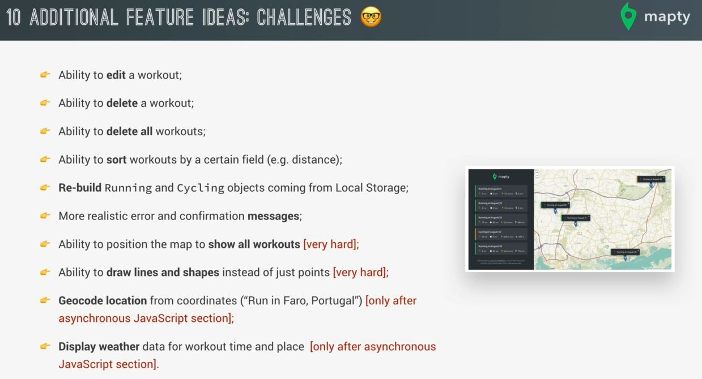

# Final Considerations

- here we'll see suggestions for how to improve this application even more 

## additional features ideas for Mapty 

- first couple of features we can do i.e 
    - `1` : ability to edit any workout
    - `2` : or to delete a workout
    - `3` : or also to delete all the workouts right from the user interface.
    - so this we can do in most web apps

- `4` : ability to sort workouts by a certain field 
    - Eg : by distance or by duration
- `5` : Re-build the `Running` & `Cycling` objects that're coming from local storage
    - so basically you could fix that problem that we run into by the end of the last lecture  
        where the objects coming from local storage were now regular objects & no longer `Running` & `Cycling` objects
    - so we can do this challenge & fix that error
- `6` : create more realistic error messages & confirmation messages
    - because we just used the simple alert() window to display an error message when the input data was invalid
    - so that one is not the real one
    - & we can fade that error message after some time 

- till here these are easy ones , now let's see the hard challenges

- `7` : ability to position the map to show all workouts 
    - so implement a button which shows all the workouts on the map at once
    - so for this we can do google or look at into leaflet library

- `8` : ability to draw lines & shapes instead of just points on the map
    - instead of just simply having a point for each workout
    - so when we got to run , then it's more like a line or a circular shape

- these two last challenges is related to async which we can implement after the async module

- `9` : we could geocode location from the coordinates
    - means we could use a third party API to plug in the coordinates & that would then give you back the real location
    - Eg : you could then call the run like "Run in faro , Portugal" because the third party web API  
        would give you that location data . So a description of the location , not just the raw coordinates

- `10` : & then besides that , you could also use a third party API 
    - to display the weather for the work out time & place

