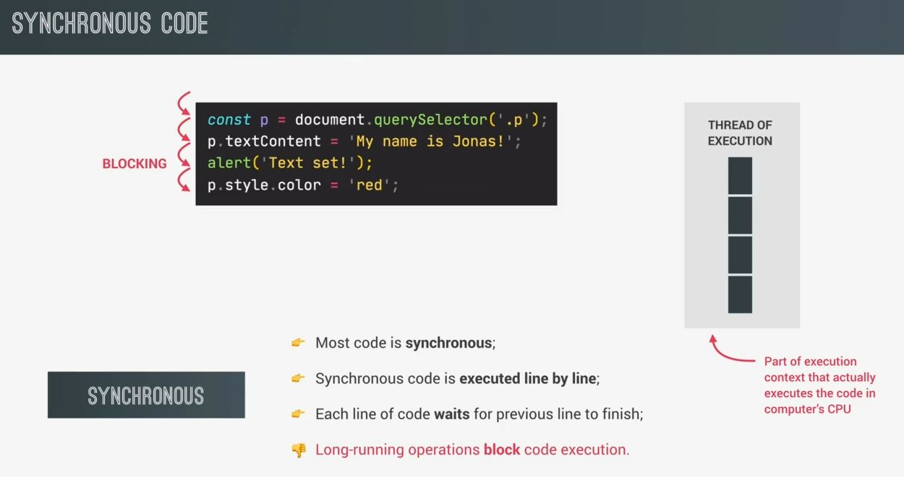
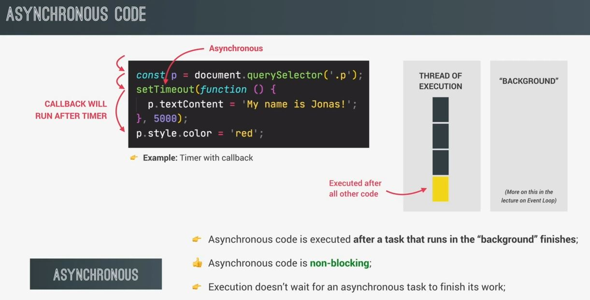
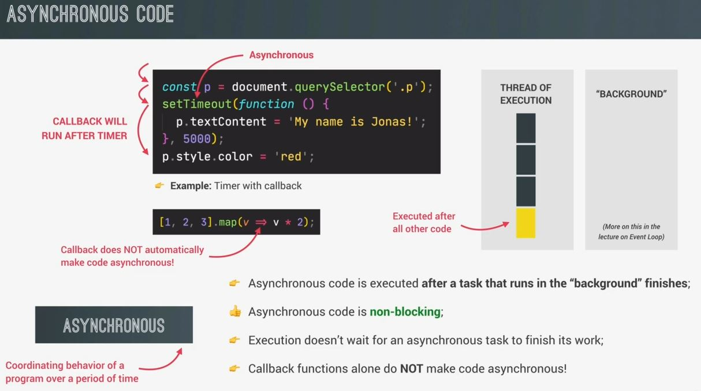
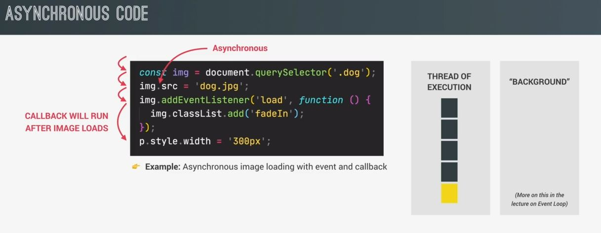
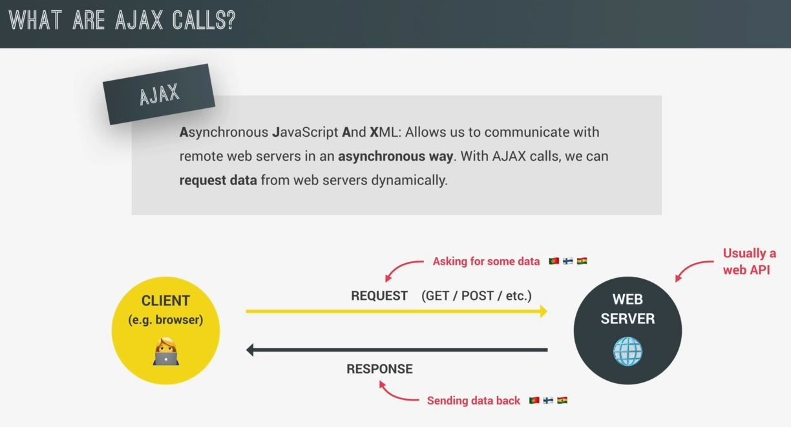
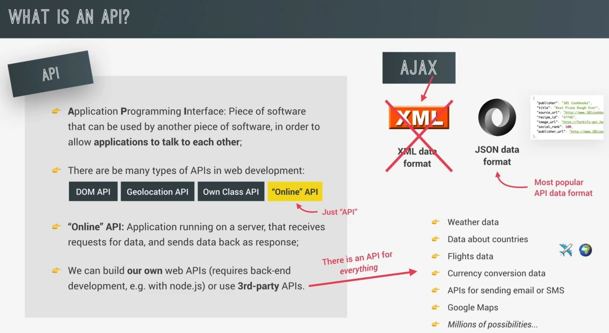

# Asynchronous JavaScript, AJAX and APIs

- what is Asynchronous JavaScript & we'll see the most popular use cases of async JS i.e AJAX calls to APIs

## synchronous VS Asynchronous JS

- `synchronous code` : 
    - so synchronous code is the opposite of Asynchronous. so most of the code that we wrote till yet are synchronous code
    - synchronous code means that the code is executed line by line , <br>
        in the exact order of execution that we defined in our code 💡💡💡
    - Eg : synchronous code
        ```js
        const p = document.querySelector('.p')
        p.textContent = "My name is Jonas!"
        alert('Text set!')
        p.style.color = "red"
        ```
        - so these lines of code will be executed line by line in the thread of execution <br>
            & execution thread is a part of the execution context 💡💡💡
        - so the next line will be executed all in sequence , so each line of code always waits <br>
            for the previous line to finish execution now this can create problems when one line of code takes a long time to run 
        - Eg : after this line `p.textContent = "My name is Jonas!"` , we have an alert() statement <br>
            which creates this alert() window , so we already know that alert() window will block the code execution further <br>
            so nothing will happen on the page until we click that `OK` button & only then the code can continue executing <br>
            so the alert() statement is a perfect example of a long running operation which blocks execution of the code 💡💡💡
        - so only when we click on the `OK` button of alert() then the window disappears & the next line can run 💡💡💡
        - so this the problem with synchronous code i.e blocking nature of the code in the middle <br>
            the line of code which takes time & going for further execution gets stopped 💡💡💡
    
        
- `why Asynchronous code needs to handle ✅` : 
    - now , most of the time synchronous code is fine & makes perfect sense. But imagine that execution would have to wait
    - Eg : for a 5 seconds timer to finish , so this would be terrible <br>
        because meanwhile nothing on the page would work during these 5 seconds <br>
        so that's where Asynchronous code comes to play 💡💡💡

- `Asynchronous code` : 
    - Eg : Asynchronous code
        ```js   
        const p = document.querySelector('.p')
        setTimeout(() => {
            p.textContent = "My name is Jonas!"            
        } , 500)
        p.style.color = "red"
        ```
        - this code contains 5 second timer
        - so first line is executed in synchronous way & then move to second line in a synchronous way
        - but here encountered the `setTimeout` function which will basically start a timer in an asynchronous way <br>
            so this means that the timer will run in the background without preventing/blocking the main code from executing <br>
            we also register a callback function which will not be executed now , but only after the timer has finished running <br>
            now the callback function of setTimeout() is Asynchronous JS because it's only going to be executed after a task <br>
            i.e running in the background finishes execution i.e the timer 💡💡💡
        - so that callback function is registered in the memory & then we immediately move on to the next line. so <br>
            the main code is not being blocked & execution doesn't wait for the Asynchronous timer to finish it's work 💡💡💡
        - `the big difference b/w synchronous & asynchronous code ✅` : 
            - so previously , we had to wait for the user to click on the alert window to continue execution <br>
                that's because alert is blocking synchronous code
            - but now with that timer , the callback is actually asynchronous , so it's only going to be executed <br>
                after the timer has finished , so that's why asynchronous is a non-blocking <br>
                because in the meantime , the rest of the code can keep running normally 💡💡💡
        - Now , when the timer finally finishes after 5 seconds , then the callback function will finally be executed as well <br>
            inside the tread of execution of execution context like this 
            
            - so we can see that callback i.e yellow box runs after all the other code <br>
                even though in the code base , there's no other lines at the end 💡💡💡
            - so basically behind the scene , the action was deferred into the future <br>
                in order to make the code non-blocking 💡💡💡
    - summary : async programming is all about coordinating the behavior of our program over a certain period of time <br>
        & this is essential to understand . So Asynchronous literally means not occurring at the same time
    - `Imp Note 🔥` : we need a callback function to implement that async behavior
        - however , that doesn't mean that callback functions automatically make code async & it's not like that 
        - Eg : map() array method also accepts a callback function as well but that doesn't make the code async <br>
            so only certain functions such as setTimeout() work in an async way
        - so we just have to know which ones do & which ones don't 💡💡💡
        - so understand is that callback function alone don't make the code async 💡💡💡
        

## Example - Asynchronous code 

- Eg : async code of loading the image 
    ```js
    const img = document.querySelector('.dog')
    img.src = 'dog.jpg'
    img.addEventListener('load', function() {
        img.classList.add('fadeIn')
    })
    p.style.width = '300px'
    ```
    - so first two lines run in a synchronous way line by line
    - now in second line , we set the source attribute of the image & this operation is actually asynchronous <br>
        so setting the source attribute of any image is essentially loading an image in the background <br>
        while the rest of the code can keep running & this makes sense because <br>
        imagine that image is a huge image & we don't want our entire code to wait for the image to load <br>
        & that's why setting the source attribute link is a asynchronous way
    - now once the image has finished loading then a load event will be automatically released by JS <br>
        & so we can then listen for that event in order to do something on it 
    - so once the image has been loaded then the callback function will be executed <br>
        so the callback function will not be executed immediately because of async code <br>
        & async code is non-blocking . so Execution of code will go to the next line immediately & that will be executed
    - & then once the image is completely loaded then callback function will be executed & image will be displayed like this 
        
        
- `Imp Note 🔥` : event listeners alone don't make code asynchronous just like callback function alone can't do 💡💡💡   
    - Eg : an event listener is listening for a click on a button is not doing any work in the background <br>
        so that event listener is simply waiting for a click to happen but it's not doing anything <br>
        so there's is no async behavior involved at all
    - Eg : that load event listener is loading the image as async way in the background <br>
        but we're just listening for the load events to happen
    - so async behavior of a task like running a timer or loading an image 
    - Eg : of async JS like geolocation API or Ajax calls

## what are Ajax calls

- `Ajax` : 
    - means asynchronous javascript & XML 
    - it allows us to communicate with remote web servers in an async way
    - in real wold work , we make Ajax calls in our code in order to request some data from a web server dynamically <br>
        so without reloading the page , we can use the data in our application dynamically 
    - Eg : we're going to make Ajax calls to request data about countries <br>
        & then we can use that data about countries to build a small application like shows us information about the country <br>
        that we're currently in 

- `how AJax calls work ✅` : 
    - let's say we have our JS application running in the `browser` which is also called the `client` <br>
        & we want the application to get some data from a web server & let's say the data about countries 
    - so with Ajax , we can do an HTTP request to that server (which has the data that we want) <br>
        & then the server will sent back a response with containing that data (which we requested) <br>
        & this back & forth b/w client & server all happens asynchronously in the background <br>
        & there can be different types of requests like GET request to receive data or POST requests to send data to a server 
    - Now , when we were asking a server to send us some data , then that server usually contains a web API <br>
        & that API is the one that has the data that we were asking 💡💡💡
    - so API is pretty important thing 
    


## what is an API ? 🔥

- `API` : means application programming interface
    - in general terms , an API is a piece of software that can be used by another piece of software <br>
        in order to allow applications to talk to each other & exchange information <br>
        & it's not only for webdev or JS but for programming in general 💡💡💡
    - in JS , there are many types of web based APIs like DOM API , geolocation API , etc . Also we can always <br>
        implement a small & simple API in a class where we make some methods available as a public interface 💡💡💡 <br>
        so Objects made from a class , can be seen as self-contained encapsulated pieces of software <br>
        that other pieces of software can interact with but these different APIs are offline API which we can use
    - but there're are online APIs which is important type of API when we use Ajax <br>
        so online APIs is an application running on a web server which receives requests for data <br>
        then retrieves that data from some database & then sends that data back to the client 💡💡💡
    - so in practice , when we're building applications then we simple call these online APIs <br>
        & many people say "online APIs" as web APIs or API
    - now we can build our one APIs but that requires backend dev (i.e development with servers & databases) <br>
        so we'll use third party APIs

- Eg : of API
    - let's say you're building a traveling application & you have a database with different destinations <br>
        & tours that you're offering. So on your own server, you could build your own API that can receive requests <br>
        from your frontend application in JS & send back the results
    - `why we need 3rd party APIs` : 
        - so that would be your own API hosted on your own server. But that alone would probably not be enough <b>
            to build a complete application. So you could also use some 3rd party APIs. <br>
        - so that's why we need 3rd party APIs 💡💡💡
    
- `API data formats ✅` : 
    - so Ajax use XML data format but no API uses XML data anymore 
    - so most APIs now use JSON data format which is easy to send & receive the data & easy to understand also



## Extra notes - about API

- https://twitter.com/DataScienceDojo/status/1565051795373805569
