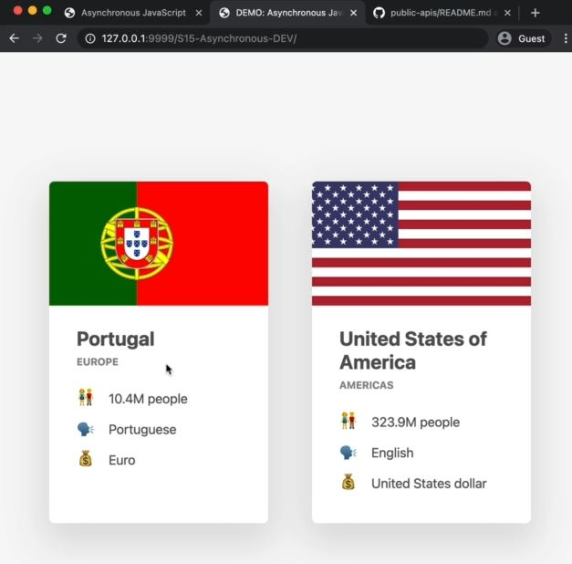

# Our First AJAX Call_ XMLHttpRequest

- here we're gonna build a UI component like this 
    
    - which contains data about a certain country 
    - & that data we'll bring from a third party online API including image also

## starter code 

index.html
```html
<!DOCTYPE html>
<html lang="en">
  <head>
    <meta charset="UTF-8" />
    <meta name="viewport" content="width=device-width, initial-scale=1.0" />
    <meta http-equiv="X-UA-Compatible" content="ie=edge" />
    <link rel="stylesheet" href="style.css" />
    <script defer src="script.js"></script>
    <title>Asynchronous JavaScript</title>
  </head>
  <body>
    <main class="container">
      <div class="countries">
        <!--
        <article class="country">
          
          <div class="country__data">
            <h3 class="country__name">COUNTRY</h3>
            <h4 class="country__region">REGION</h4>
            <p class="country__row"><span>👫</span>POP people</p>
            <p class="country__row"><span>🗣️</span>LANG</p>
            <p class="country__row"><span>💰</span>CUR</p>
          </div>
        </article>
        -->
      </div>
      <!-- <button class="btn-country">Where am I?</button> -->
      <div class="images"></div>
    </main>
  </body>
</html>
```

style.css
```css
* {
  margin: 0;
  padding: 0;
  box-sizing: inherit;
}

html {
  font-size: 62.5%;
  box-sizing: border-box;
}

body {
  font-family: system-ui;
  color: #555;
  background-color: #f7f7f7;
  min-height: 100vh;

  display: flex;
  align-items: center;
  justify-content: center;
}

.container {
  display: flex;
  flex-flow: column;
  align-items: center;
}

.countries {
  /* margin-bottom: 8rem; */
  display: flex;

  font-size: 2rem;
  opacity: 0;
  transition: opacity 1s;
}

.country {
  background-color: #fff;
  box-shadow: 0 2rem 5rem 1rem rgba(0, 0, 0, 0.1);
  font-size: 1.8rem;
  width: 30rem;
  border-radius: 0.7rem;
  margin: 0 3rem;
  /* overflow: hidden; */
}

.neighbour::before {
  content: 'Neighbour country';
  width: 100%;
  position: absolute;
  top: -4rem;

  text-align: center;
  font-size: 1.8rem;
  font-weight: 600;
  text-transform: uppercase;
  color: #888;
}

.neighbour {
  transform: scale(0.8) translateY(1rem);
  margin-left: 0;
}

.country__img {
  width: 30rem;
  height: 17rem;
  object-fit: cover;
  background-color: #eee;
  border-top-left-radius: 0.7rem;
  border-top-right-radius: 0.7rem;
}

.country__data {
  padding: 2.5rem 3.75rem 3rem 3.75rem;
}

.country__name {
  font-size: 2.7rem;
  margin-bottom: 0.7rem;
}

.country__region {
  font-size: 1.4rem;
  margin-bottom: 2.5rem;
  text-transform: uppercase;
  color: #888;
}

.country__row:not(:last-child) {
  margin-bottom: 1rem;
}

.country__row span {
  display: inline-block;
  margin-right: 2rem;
  font-size: 2.4rem;
}

.btn-country {
  border: none;
  font-size: 2rem;
  padding: 2rem 5rem;
  border-radius: 0.7rem;
  color: white;
  background-color: orangered;
  cursor: pointer;
}

.images {
  display: flex;
}

.images img {
  display: block;
  width: 80rem;
  margin: 4rem;
}

.images img.parallel {
  width: 40rem;
  margin: 2rem;
  border: 3rem solid white;
  box-shadow: 0 2rem 5rem 1rem rgba(0, 0, 0, 0.1);
}
```

script.js 
```js
const btn = document.querySelector('.btn-country');
const countriesContainer = document.querySelector('.countries');
```

## Steps - doing API call to build the Country info UI

- `about CORS ✅` : means any API that you use should always have CORS set to Yes or maybe to unknown
    - so CORS stands - Cross Origin Resource Sharing
    - & without CORS , we can't access a third party API from our own code 💡💡💡

- go to public apis github repo & search `REST Countries` & then click on the link <br>
    & then we came into `restcountries.eu` website , so inside of it , we'll see stuff i.e 
    - `1` : API endpoints : is just a another name for the URl that we need 💡💡💡
    - `2` : now we want to request for particular country , so we'll use this URL - https://restcountries.com/v3.1/name/{name}

- `STEP 1` : doing GET request
    ```js
    const request = new XMLHttpRequest() 
    request.open('GET', "https://restcountries.com/v3.1/name/portugal")
    ```

- `STEP 2` : sending the request
    ```js
    const request = new XMLHttpRequest() 
    request.open('GET', "https://restcountries.com/v3.1/name/portugal")
    request.send()
    ```
    - now to store the result , we can't like this const `data = request.send()`
    - because the result is not there yet , so the Ajax call is begin done in the background <br>
        while the rest of the code keeps running , so the Ajax call is the async code & non-blocking behavior 💡💡💡
    - so instead of that , we need to register a callback on the request object for the load event <br>
        so that we can get/handle the data via async way instead of using synchronous way & blocking the code <br>
        because we don't know how much time that data will take to come 💡💡💡
    
- `STEP 3` : registering/creating a callback on the request object for the load event  
    ```js
    const request = new XMLHttpRequest() 
    request.open('GET', "https://restcountries.com/v3.1/name/portugal")
    request.send()
    console.log(request.responseText) // checking output : we'll not get any output 
        // because there's no data came yet

    // basically we're getting the output by handling in the async way
    request.addEventListener('load', function() {
        console.log(this.responseText) // output : JSON object data
            // because we're handling & getting the data in async way 💡💡💡
    })
    ```
    - output : we'll get the data of portugal country in the form of string which is in JSON format
        - so we need to convert that JSON object into Javascript object in order to do work on that data 💡💡💡
    - `STEP 3.1` : converting that JSON object into JS object
        ```js
        const request = new XMLHttpRequest() 
        request.open('GET', "https://restcountries.com/v3.1/name/portugal")
        request.send()

        // basically we're getting the output by handling in the async way
        request.addEventListener('load', function() {
            const data = JSON.parse(this.responseText)
            console.log(data) // output : we'll get the JS object i.e an array of object 
                // so we can do destructure that an array of object instead of doing tradition way like this 
                    // const data = JSON.parse(this.responseText)[0] 💡💡💡
        })
        ```
    - `STEP 3.2` : doing array destructure that data
        ```js
        const request = new XMLHttpRequest() 
        request.open('GET', "https://restcountries.com/v3.1/name/portugal")
        request.send()

        request.addEventListener('load', function() {
            const [data] = JSON.parse(this.responseText)
            console.log(data) // output : now we'll get the JS object in proper manner
        })
        ```

- `STEP 4` : building an UI component
    - copy the html commented code 
    ```js
    const request = new XMLHttpRequest() 
    request.open('GET', "https://restcountries.com/v3.1/name/portugal")
    request.send()

    request.addEventListener('load', function() {
        const [data] = JSON.parse(this.responseText)
        console.log(data) 

        const html = `        
            <article class="country">
                
                <div class="country__data">
                  <h3 class="country__name">COUNTRY</h3>
                  <h4 class="country__region">REGION</h4>
                  <p class="country__row"><span>👫</span>POP people</p>
                  <p class="country__row"><span>🗣️</span>LANG</p>
                  <p class="country__row"><span>💰</span>CUR</p>
                </div>
            </article>
            ` ;
    })
    ```
    - now we need to replace that hard coded data 
    - `STEP 4.1` : replacing the hard coded data from html code 
        ```js
        const request = new XMLHttpRequest() 
        request.open('GET', "https://restcountries.com/v3.1/name/portugal")
        request.send()

        request.addEventListener('load', function() {
            const [data] = JSON.parse(this.responseText)
            console.log(data) 

            const html = `        
                <article class="country">
                    
                    <div class="country__data">
                      <h3 class="country__name">${data.name}</h3>
                      <h4 class="country__region">${data.region}</h4>
                      <p class="country__row"><span>👫</span>${(+data.population / 1000000).toFixed(1)} people</p>
                      <p class="country__row"><span>🗣️</span>${data.languages[0].name}</p>
                      <p class="country__row"><span>💰</span>${data.languages[0].currencies}</p>
                    </div>
                </article>
                ` ;
            
            // here we don't want to show that entire number of population that's why we did the calculation
        })
        ```
        - now we need to insert/append/add this html code inside the DOM or index.html file 
    - `STEP 4.2` : inserting this html code
        ```js
        const request = new XMLHttpRequest() 
        request.open('GET', "https://restcountries.com/v3.1/name/portugal")
        request.send()

        request.addEventListener('load', function() {
            const [data] = JSON.parse(this.responseText)
            console.log(data) 

            const html = `        
                <article class="country">
                    
                    <div class="country__data">
                      <h3 class="country__name">${data.name}</h3>
                      <h4 class="country__region">${data.region}</h4>
                      <p class="country__row"><span>👫</span>${(+data.population / 1000000).toFixed(1)} people</p>
                      <p class="country__row"><span>🗣️</span>${data.languages[0].name}</p>
                      <p class="country__row"><span>💰</span>${data.languages[0].currencies}</p>
                    </div>
                </article>
                ` ;
            
            countriesContainer.insertAdjacentHTML('beforend', html)

            // & inside the style.css file , we set the opacity : 0 inside .countries {} selector
                // so we need to set the opacity as 1 , so that we can see the animation or transition  
            countriesContainer.style.opacity = 1
        })
        ```
    - now let's create multiple countries

- `STEP 5` : creating multiple countries by creating a function ✅
    ```js
    const btn = document.querySelector('.btn-country');
    const countriesContainer = document.querySelector('.countries');

    const getCountryData = function(country) {
        const request = new XMLHttpRequest() 
        request.open('GET', `https://restcountries.com/v3.1/name/${country}`)
        request.send()

        request.addEventListener('load', function() {
            const [data] = JSON.parse(this.responseText)
            console.log(data) 

            const html = `        
                <article class="country">
                    
                    <div class="country__data">
                      <h3 class="country__name">${data.name}</h3>
                      <h4 class="country__region">${data.region}</h4>
                      <p class="country__row"><span>👫</span>${(+data.population / 1000000).toFixed(1)} people</p>
                      <p class="country__row"><span>🗣️</span>${data.languages[0].name}</p>
                      <p class="country__row"><span>💰</span>${data.languages[0].currencies}</p>
                    </div>
                </article>
                ` ;
            
            countriesContainer.insertAdjacentHTML('beforend', html)

            countriesContainer.style.opacity = 1
        })
    }

    getCountryData('portugal')
    getCountryData('usa')
    ```
    - output : we'll get the two countries card component with their own information

- IMP NOTE 🔥 : by calling the getCountryData() function two times
    - we're basically have two AJAX calls happening at the same time , so in parallel
    - & if we reload the page again & again then might be , USA will come as first card component 💡💡💡
        - because that the data arrives at a slightly different time , each time that we're loading the page
        - & this really shows non-blocking behavior in action 💡💡💡  
    - So as we call getCountryData('portugal') for portugal as first , then the request will be send 
        - & JS moves to the next line of code immediately 
        - & this getCountryData('usa') will fire another AJAX calls immediately <br>
            way before the data of portugal has actually arrived
        - so we'll have two AJAX call happening at the same time
        - so whatever one arrives first , that will fire the 'load' event first <br>
            that's why first one is to AJAX call for the USA
        - & only after that the data for portugal arrives & that callback function is called the portugal data
        - that's why we're getting the countries in random order 💡💡💡 
    - now , if we actually wanted these requests to be made in a specific like predefined order
        - then we need to chain the requests which means to make the second request
        - only after the first request has finished , so for this we use promises 💡💡💡
