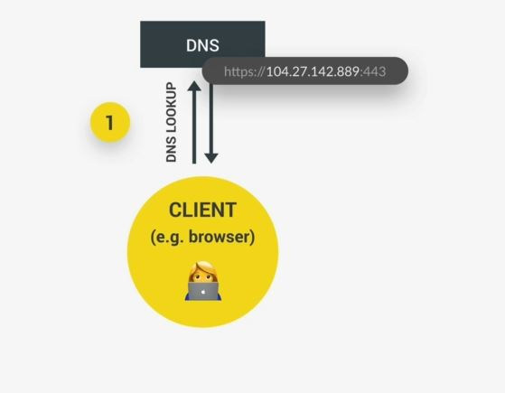
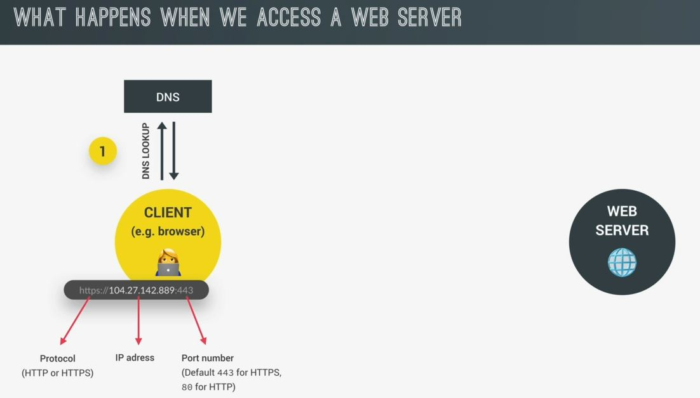

# [OPTIONAL] How the Web Works : Requests and Responses

- understanding how requests & responses work on the web & how the web actually works behind the scenes

## Explanation

- so this is the diagram when we first talked about AJAX calls 
    
- so whenever we try to access a Web server , the browser (which is the client) sends a request to the server  
    & the server will then send back a response & that response contains the data or the web page that we requested   
    & this is the process works the exact same way no matter if we're accessing an entire web page  
    or just some data from a web API & this whole process is called the Request-response model  
    or the Client-Server architecture 💡💡💡

- `going Deep explanation ✅` : taking eg of the country that which we accessed
    
    - Now , every URL gets an `HTTP/HTTPS` which is for the protocol that will be used on this connection  
        then we have the `domain name` i.e `restcountries.eu` & after the slash we have `rest/v2`   
        which is a `resource` that we want to access
    
    - `STEP 1` : 
        - now that domain name , `restcountries.eu` is actually not the real address of the server that we're trying to access  
            it's just a nice name which is easy for us to memorize & understand 
        - but we need a way of kind-of converting the domain name to the real address of the server  
            & that happens through a i.e called `DNS` (domain name server) & domain name servers are a special kind-of server  
            basically like the phone books of the internet
        - so the first step that happens when we access any web server i.e the browser makes a request to a DNS  
            & then this special server will match the web address of the URL to the server's real IP address  
            & this all happens through your ISP (internet service provider)
        - so we need to know that the domain is not the real address & that a DNS will convert  
            the domain to the real IP address 💡💡💡 like this  
            
        - & then after the real IP address has been send back to the browser like this 
            
            - & we can finally call it , so this is the real address looks like 
            - so the URL will get from the server to client like in this form only  
                & it still has the protocol , but then comes the IP address & also the port that we access on the server  
            - & that port number is just to identify a specific service that's running on a server  
                so we can say that port number is a sub address 💡💡💡
            - & that port number has nothing to do with the /rest/V2 resource that we want to access  
                so the /rest/V2 resource that will be sent over in the HTTP request which we'll see in later stage

    - `STEP 2` : 
        - now once we have the real IP address , a TCP socket connection is established b/w the browser & the server  
            & so they're now finally connected like this
            
        - & that connection is kept alive for the entire time that it takes to transfer all files of the website or all data 
        - `what are TCP & IP` :
            - well TCP is the transmission control protocol & IP is internet protocol  
                & together they're communication protocols that define exactly how data travels across the web
            - they're internet fundamental control system , because they're the ones who set the rules  
                about how data moves on the internet 💡💡💡

    - `STEP 3` : 
        - finally make our request & the request that we make is an HTTP request means Hypertext Transfer Protocol like this 
            
        - so after TCP/IP , HTTP is another communication protocol & communication protocol means is a system of rules  
            that allows two or more parties to communicate
        - now in the case of HTTP , it's just a protocol that allows clients & web servers to communicate  
            & that works by sending requests & response messages from client to server & again back  
            Now a request message will look something like this 
            
            - The beginning of the message is the most important part called the `start line`   
                - `start line` : contains the HTTP method which is used in the request ,  
                    then the request target & the HTTP version 💡💡💡
                - there're many HTTP methods , but these are most important one i.e 
                    - `GET` : for requesting/getting the data
                    - `POST` : for sending data
                    - `PUT & PATCH` : to modify the data
                - so an HTTP request to server is not only for getting data, but we can also send data  
                    now about the request target , this is where we told the the server that we want to access  
                    the rest/V2/alpha resource & now it's simply sent as the target in the HTTP request  
                    & then the server can figure out what to do with it 
                - now , if the target was empty means if it was just a slash then we would be accessing  
                    the website's route which is just `restcountries.eu` 💡💡💡
            - Now the nest part of the request are the `HTTP request headers` 
                - it's just some information that we sent about the request itself
                - There are tons of standard different headers like what browser is used to make the request at what time ,  
                    the user's language & etc
            - Now finally , in the case , we're sending data to the server. there will also be a `request body` 
                - it will contain the data that we're sending 
                - Eg : coming from an HTML form , so i.e the HTTP request 
                - & it's not us developers who manually write these HTTP requests but it's helpful to understand  
                    about what is HTTP request & also a response
        
        - `difference HTTP vs HTTPS` : 
            - HTTPS is encrypted using TLS or SSL which are also some protocols  
                but HTTP is not encrypted in terms of requesting & getting response 💡💡💡
            - but request & responses will come same with HTTPS

    - `STEP 4` : 
        - so our request is formed & now it hits the server which will then be working on it until it has our data  
            or web page ready to send back
        - & once it's ready , it'll send it back using an `HTTP response` like this 
            
        - & HTTP response message actually looks quite similar to the request  
            which also includes same stuff i.e a start line , headers & a body like this 
            
            - but in this case , the start line has the version or a status code & a message  
                so these status code are used to let the client know whether the request has been successful or failed  
                Eg : 200 status code means OK status , 404 status code means page not found 
            - then the `response headers` are information about the response itself  
                & there're inbuild response headers & we can also make our own custom response headers
            - last part is body , which is present in most responses & this BODY usually contains the JSON data  
                coming back from an API or the HTML of the web page that we requested 💡💡💡 
        
 
- here we just did the one request to that URL & one response got back  
    However in behind the scene , it's a web page that we're accessing then there will be many more requests & responses  
    thats because when we do the first request , all we get back is just the initial html file like this 
    
    - & that HTML file will then get scanned by the browser for all the assets that it needs  
        in order to build the entire web page like JS , css files , image files or other assets  
        & then for each different file , there will be a new HTTP request made to the server 
    - so basically this entire back & forth b/w client & server happens for every single file  
        which is included in the web page . However , there can be multiple requests & responses happening at the same time  
        but the amount is still limited because otherwise the connection would start to slow down 💡💡💡 
    - so when all the files have finally arrived then the web page can be rendered in the browser  
        according to the HTML , CSS , JS specifications

- `about TCP/IP` : now for the final piece of the puzzle, 
    - let's see TCP/IP & how this request & responses data is actually sent across the web
    - TCP/IP are the communication protocols that define how data travels across the web
    - `first part` : 
        - the job of TCP is to break the requests & responses down  
            into thousands of small chunks i.e `packets` before they're sent
        - once the small packets arrive at their final destination , TCP will reassemble all the packets  
            into the original request or response & this is necessary so that each packet can take a different route  
            through the internet because this way the message arrives at the destination as quick as possible 💡💡💡  
        - but if we sent the entire data simple as a big chunk then sending message can't be possible to send at the  
            destination which means let's say trying to go through dense traffic with like the biggest bus which is not good
    - `second part` :
        - the job of the IP protocol is to send & route those packets through the internet
        - so it ensure that they arrive at the destination using IP addresses on each packet 💡💡💡
            

