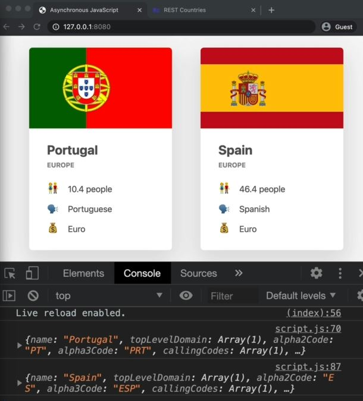
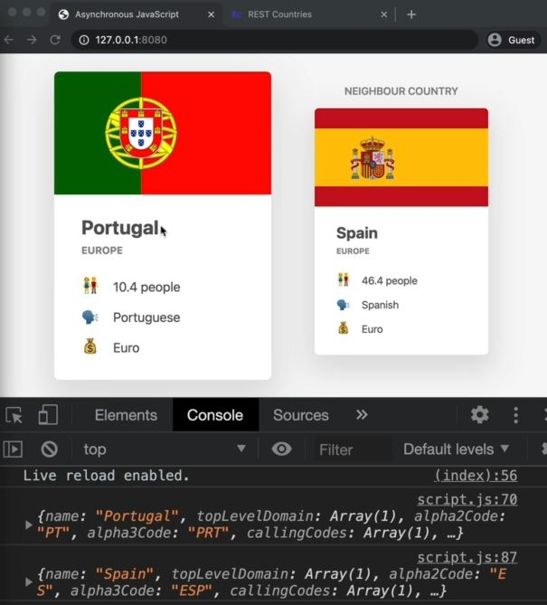

# Welcome to Callback Hell

- previously , we did a simple AJAX call to fetch the data from a country's API & we created a function <br>
    & when we call that function multiple times then multiple AJAX calls were made at the same time <br>
    so they were basically running in parallel & we couldn't control the order that which one finished first 💡💡💡
- However , in this lecture let's create a order/sequence of AJAX calls <br>
    so second one will be executed only when the first one has finished 

- what we'll do to make a order/sequence of AJAX calls :  
    - so we have a `borders` property inside the object data which contain `ESP` means spain <br>
        so spain is a border country of portugal 
    - so after the first AJAX call is completed then we'll get that border & based on the value of that border <br>
        we'll render the neighboring country besides the original country
    - so second AJAX call really depends on the first one because the data about neighboring countries <br>
        is a result of the first call so without the first call , we wouldn't even know which data to fetch in the second call
    - so we're implementing a sequence/order of AJAX call

## Steps - implementing a sequence of AJAX calls

- `STEP 1` : refactoring the code
    ```js
    const btn = document.querySelector('.btn-country');
    const countriesContainer = document.querySelector('.countries');

    const renderCountry = function(data) {
        const html = `        
            <article class="country">
                
                <div class="country__data">
                  <h3 class="country__name">${data.name}</h3>
                  <h4 class="country__region">${data.region}</h4>
                  <p class="country__row"><span>👫</span>${(+data.population / 1000000).toFixed(1)} people</p>
                  <p class="country__row"><span>🗣️</span>${data.languages[0].name}</p>
                  <p class="country__row"><span>💰</span>${data.languages[0].currencies}</p>
                </div>
            </article>
            ` ;
        
        countriesContainer.insertAdjacentHTML('beforend', html)
        countriesContainer.style.opacity = 1        
    }

    const getCountryAndNeighbour = function(country) {
        const request = new XMLHttpRequest() 
        request.open('GET', `https://restcountries.com/v3.1/name/${country}`)
        request.send()

        request.addEventListener('load', function() {
            const [data] = JSON.parse(this.responseText)
            console.log(data) 

            renderCountry(data)
        })
    }

    getCountryAndNeighbour('portugal')
    ```

- `STEP 2` : getting neighbour country
    ```js
    // before this code , put the code from STEP 1
    const getCountryAndNeighbour = function(country) {

        // AJAX call country 1
        const request = new XMLHttpRequest() 
        request.open('GET', `https://restcountries.com/v3.1/name/${country}`)
        request.send()

        request.addEventListener('load', function() {
            const [data] = JSON.parse(this.responseText)
            console.log(data) 

            // renderCountry(data)
            renderCountry(data)

            // get neighbour country (2)
            const [neighbour] = data.borders // doing array destructuring 

            // there're are some countries which doesn't have any neighbours like islands
                // so in this case , we simply exit
            if (!neighbour) return

            // if neighbour exists then do second AJAX call
            // AJAX call country 2
            const request = new XMLHttpRequest() 
                // here we're not using country name because ESP -> is a country code not a name the country 💡💡💡
                    // that's why we changed the URL of this second AJAX call
            request.open('GET', `https://restcountries.com/v3.1/alpha/${neighbour}`)
            request.send()
        })
    }

    getCountryAndNeighbour('portugal')
    ```

- `STEP 3` : listening load event on that new request
    ```js
    // before this code , put the code from STEP 1
    const getCountryAndNeighbour = function(country) {

        // AJAX call country 1
        const request = new XMLHttpRequest() 
        request.open('GET', `https://restcountries.com/v3.1/name/${country}`)
        request.send()

        request.addEventListener('load', function() {
            const [data] = JSON.parse(this.responseText)
            console.log(data) 

            // renderCountry(data)
            renderCountry(data)

            // get neighbour country (2)
            const [neighbour] = data.borders // doing array destructuring 

            // there're are some countries which doesn't have any neighbours like islands
                // so in this case , we simply exit
            if (!neighbour) return

            // AJAX call country 2
            const request2 = new XMLHttpRequest() 
            request2.open('GET', `https://restcountries.com/v3.1/alpha/${neighbour}`)
            request2.send()

            request2.addEventListener('load', function() { 
                // Note : here we're using an event listener inside the event listener because 
                    // it's making sense , but don't use event listener inside an event listener
                    // if situation doesn't allow & it's affect the performance issue 💡💡💡
                // here we're making a the second AJAX call really dependent on the first one
                    // that's why we define the event listener inside the first event listener 💡💡💡
                console.log(this.responseText) // output : we'll get the data of spain country 
                    // no matter what , if we reload the page again & again then spain country object 
                    // will be printed after the portugal
            })
        })
    }

    getCountryAndNeighbour('portugal')
    ```

- `STEP 4` : writing code inside the second event listener
    ```js
    // before this code , put the code from STEP 1
    const getCountryAndNeighbour = function(country) {

        // AJAX call country 1
        const request = new XMLHttpRequest() 
        request.open('GET', `https://restcountries.com/v3.1/name/${country}`)
        request.send()

        request.addEventListener('load', function() {
            const [data] = JSON.parse(this.responseText)
            console.log(data) 

            // renderCountry(data)
            renderCountry(data)

            // get neighbour country (2)
            const [neighbour] = data.borders // doing array destructuring 

            // there're are some countries which doesn't have any neighbours like islands
                // so in this case , we simply exit
            if (!neighbour) return

            // AJAX call country 2
            const request2 = new XMLHttpRequest() 
            request2.open('GET', `https://restcountries.com/v3.1/alpha/${neighbour}`)
            request2.send()

            request2.addEventListener('load', function() { 
                const data2 = JSON.parse(this.responseText)
                console.log(data2)
                // Country Code is always unique 

                renderCountry(data2)
            })
        })
    }

    getCountryAndNeighbour('portugal')
    ```
    - output : we'll get th spain country after the portugal country
        - no matter how many times we reload the page like this <br>
        

- `STEP 5` : doing changes to on neighbour country to know it's a neighbour
    ```js
    const btn = document.querySelector('.btn-country');
    const countriesContainer = document.querySelector('.countries');

    const renderCountry = function(data, className = '') {
        const html = `        
            <article class="country ${className}">
                
                <div class="country__data">
                  <h3 class="country__name">${data.name}</h3>
                  <h4 class="country__region">${data.region}</h4>
                  <p class="country__row"><span>👫</span>${(+data.population / 1000000).toFixed(1)} people</p>
                  <p class="country__row"><span>🗣️</span>${data.languages[0].name}</p>
                  <p class="country__row"><span>💰</span>${data.languages[0].currencies}</p>
                </div>
            </article>
            ` ;
        
        countriesContainer.insertAdjacentHTML('beforend', html)
        countriesContainer.style.opacity = 1        
    }

    const getCountryAndNeighbour = function(country) {

        // AJAX call country 1
        const request = new XMLHttpRequest() 
        request.open('GET', `https://restcountries.com/v3.1/name/${country}`)
        request.send()

        request.addEventListener('load', function() {
            const [data] = JSON.parse(this.responseText)
            console.log(data) 

            // renderCountry(data)
            renderCountry(data)

            // get neighbour country (2)
            const [neighbour] = data.borders // doing array destructuring 

            // there're are some countries which doesn't have any neighbours like islands
                // so in this case , we simply exit
            if (!neighbour) return

            // AJAX call country 2
            const request2 = new XMLHttpRequest() 
            request2.open('GET', `https://restcountries.com/v3.1/alpha/${neighbour}`)
            request2.send()

            request2.addEventListener('load', function() { 
                const data2 = JSON.parse(this.responseText)
                console.log(data2)

                renderCountry(data2, 'neighbour')
            })
        })
    }

    getCountryAndNeighbour('portugal')
    ```
    - output : we'll get the 'neighbour country' label on it like this 
        
    - `STEP 5.1` : if we pass usa
        ```js
        getCountryAndNeighbour('usa') // output : we'll get the usa country & it's neighbour country
            // & second AJAX call will not be executed if first one doesn't
                // so second AJAX call is dependent on the first one 
        ```

## Example - callback hell 

- `Imp Note ✅` : we an event listener inside an event listener 
    - which means we have a callback function inside an callback function which is nested callbacks 💡💡💡
    - but what if we want to do more requests in sequence like the neighbour of the neighbour <br>
        of neighbour like 10 times 
    - so in that case we'll end up with callback inside of callbacks inside of callbacks like 10 times <br>
        & this kind of structure & this kind-of behavior , we have a special name i.e callback hell 💡💡💡
    - `callback hell` : means we have a lot of nested callbacks in order to execute async tasks in sequence 💡💡💡
        - & this happens for all async tasks which are handled by callbacks , not just by AJAX calls

- Eg : of callback hell
    ```js
    setTimeout(() => {
        console.log('1 second passed')
        // here we started a new timer after the first timer has finished
        setTimeout(() => {
            console.log('2 seconds passed')
            setTimeout(() => {
                console.log('3 seconds passed')
                setTimeout(() => {
                    console.log('4 seconds passed')
                }, 1000)            
            }, 1000)            
        }, 1000)
    }, 1000)

    // output : 1 second passed
        //      2 second passed
        //      3 second passed
        //      4 second passed
    ```
    - this is callback hell & it's pretty easy to identify by this triangular shape

- `problem with callback hell ✅` :
    - it make code look very messy
    - it makes our code harder to maintain, very difficult to understand
    - & due to this , we'll endup of having more bugs
    - `RULE ✅` : the code which is hard to understand is basically bad code & difficult to add new features

- `solution for callback hell ✅` : ES6 features i.e promises
    - promises is a alternative solution to escape & not using callback hell 
